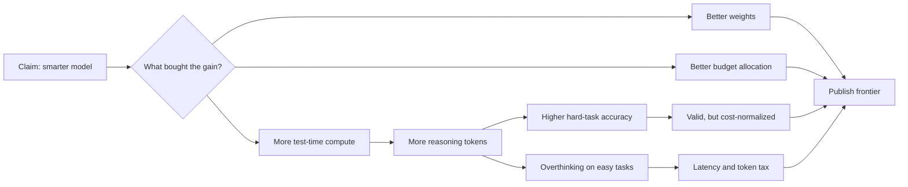

I want the token bill next to any chart calling Fable more intelligent.

The uncomfortable part of current reasoning-model marketing is that a public score can hide two very different improvements. One is a better model. The other is a model spending more inference-time compute: more hidden reasoning, more retries, longer traces, more latency, more dollars. Both can produce better answers. Only one deserves to be sold as raw intelligence without a footnote.

That distinction matters because test-time compute is no longer a side trick. It is a whole research area.

This is the scientific version of my complaint: Fable may be more capable at Anthropic's chosen operating point, but the public claim is incomplete unless it reports the inference budget that bought the capability.

## The friendly reading

Giving a model more compute at inference time can improve reasoning, and that is the strongest version of Anthropic's case.

[The Art of Scaling Test-Time Compute for Large Language Models](https://arxiv.org/abs/2512.02008), a study across eight open-source LLMs and more than thirty billion generated tokens, lands on a narrower result than "more tokens good": the best strategy depends on model type, problem difficulty, and compute budget. No single test-time strategy universally dominates.

That is already enough to change how a model card should read. If Fable gets its jump by using a more aggressive reasoning policy, that is a valid engineering achievement. But it is a compute-allocation achievement. It should be measured as one.

The same point shows up in [Can 1B LLM Surpass 405B LLM?](https://arxiv.org/abs/2502.06703), which argues that compute-optimal test-time scaling can let much smaller models beat much larger ones on some math benchmarks. The lesson is awkward for vendor marketing: benchmark wins can come from the inference procedure, not only from a more intelligent base model.

In other words, a model endpoint is a bundle:

| Layer | What the user sees | What the benchmark may hide |
|---|---|---|
| Base model | The answer | Parameter count, training mix, RL policy |
| Inference policy | The answer quality | Number of samples, verifier passes, hidden reasoning budget |
| Serving stack | The latency | batching, routing, speculative decoding, hardware |
| Product defaults | The bill | token caps, retry policy, tool-call policy |

Calling the whole bundle "more intelligent" is convenient but not precise.

## The token tax

The term I would use for Fable-style claims is the token tax: the extra reasoning budget paid to move an answer from acceptable to impressive.

That tax is sometimes worth paying. [Economic Evaluation of LLMs](https://arxiv.org/abs/2507.03834) makes the case cleanly: if a wrong answer is expensive, the most powerful model can be the economically correct choice even when its per-call cost is higher. For a legal review, a production migration, or an autonomous agent editing a repository, paying more for fewer mistakes may be rational.

But that does not make the tax disappear. It means the tax has to be priced against the cost of an error.

The failure mode is using the expensive setting everywhere and calling the resulting average "intelligence." [Plan and Budget](https://arxiv.org/abs/2505.16122) names the pattern directly: reasoning models often overthink, generating verbose or tangential traces even for simple queries. The paper's proposed fix is not "never think." It is adaptive budgeting: decompose the problem, estimate complexity, and allocate tokens where uncertainty is high.

That is the standard Fable should be held to. Not "can it produce the best answer if allowed to spend?" But "does it know when not to spend?"

## More thinking can hurt

The easiest way to overstate a reasoning model is to draw only the high-budget point on the curve.

[When More Thinking Hurts](https://arxiv.org/abs/2604.10739), the paper I would put in the center of the critique, reports diminishing returns at higher reasoning budgets, and identifies cases where extended reasoning is associated with abandoning previously correct answers.

That result should make everyone cautious about the phrase "more intelligent." Longer reasoning is not a monotone good. On some tasks it helps. On some tasks it wastes compute. On some tasks it gives the model enough rope to talk itself out of the right answer.

[The Price of a Second Thought](https://arxiv.org/abs/2505.22017) frames the same issue as reasoning efficiency. Thinking models can waste computation on easy problems while adding value on harder ones. That sounds obvious until you look at how leaderboards are usually consumed: a single score, detached from how much compute was spent to get it.

If Fable wins hard reasoning tasks by spending more on hard reasoning tasks, good. That is the right use of test-time compute. If it spends the same swollen budget on trivial tasks, the product is not smarter in the way users care about. It is expensive by default. That default only becomes defensible if a benchmark separates Fable's accuracy gain from the tokens, latency, and dollars spent to buy it.

## The benchmark I want

[OckBench](https://arxiv.org/abs/2511.05722) says the quiet part clearly: current benchmarks over-emphasize accuracy and output quality while neglecting token efficiency. It reports that models with similar accuracy can differ heavily in token length. That is not a cosmetic metric. It changes latency, serving cost, energy, and whether an agentic workflow fits inside a real budget.

So I do not want a single Fable win-rate chart. I want a frontier.

| Question | Why it matters |
|---|---|
| Accuracy at fixed output-token ceilings | Separates better reasoning from longer reasoning |
| Accuracy at fixed dollar budget | Tells operators what they can actually buy |
| Accuracy at fixed latency budget | Matters for interactive products |
| Easy/hard task split | Reveals overthinking on easy tasks |
| Token distribution, not just average | Shows tail behavior and runaway traces |
| Prior Claude vs Fable at same budget | Tests whether the endpoint moved the frontier |
| Fable vs cheaper non-Anthropic endpoints at same budget | Tests whether the premium is economically justified |

The key phrase is "moved the frontier." If Fable gets higher accuracy at the same cost and latency, Anthropic has a strong claim. If it gets higher accuracy by moving to a much more expensive point on the same curve, the claim is weaker. It may still be a useful product. It is not the same scientific statement.

## The line I would draw

Here is the charitable, technical version:

> Fable may be a better endpoint, but Anthropic has not shown whether it is a more efficient reasoner. Without token-normalized and cost-normalized results, the claim "more intelligent" mixes model capability with test-time compute policy.

That is not anti-Anthropic. It is anti-unpriced-intelligence.

The field already has the vocabulary: test-time scaling, overthinking, reasoning efficiency, compute-accuracy Pareto frontiers, economic evaluation. Vendors should use it. If a model is better because it thinks longer, say that. If it is better because it spends tokens more selectively, show the easy/hard split. If it is better at the same budget, publish the frontier and take the win.

Until then, my working assumption is simple: every "smarter" reasoning model comes with a hidden invoice. I want the invoice printed next to the benchmark.
