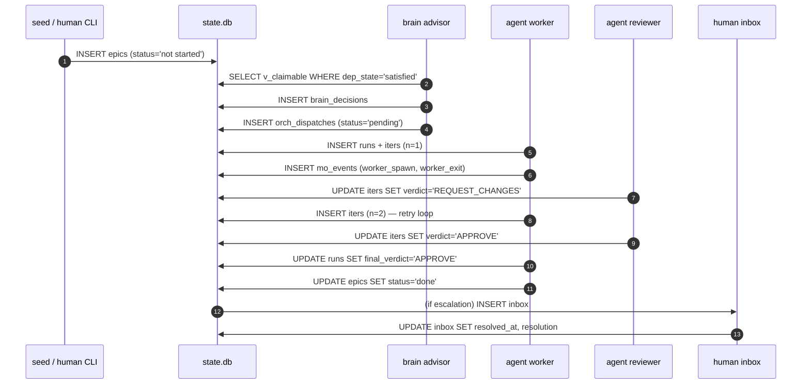

# mini-ork database

SQLite state store for the mini-ork orchestrator. Applied via `db/init.sh` (idempotent, lex-order migrations).

## Quick start

```bash
# default: creates .mini-ork/state.db in current dir
./db/init.sh

# custom path
MINI_ORK_DB=/path/to/state.db ./db/init.sh
```

## Table overview

| Table | Purpose |
|---|---|
| `schema_migrations` | Applied migration tracking — idempotency guard |
| `epics` | Units of work dispatched to worker agents |
| `deps` | Epic dependency graph (epic must wait for depends_on to be 'done') |
| `runs` | Individual agent execution runs (one or more per epic) |
| `iters` | Iteration records within a run (worker + reviewer round-trips) |
| `inbox` | Human-escalation queue for blocked or stuck epics |
| `locks` | Distributed mutex tokens (merge lock, gauntlet lock, etc.) |
| `agent_profile` | Per-agent performance summary (approval rate, avg cost) |
| `brain_decisions` | Log of brain advisor routing decisions |
| `subagent_runs` | Child agents spawned by a parent session |
| `epic_agent_assignments` | Current agent assignment per epic |
| `epic_agent_assignment_history` | Audit trail of assignment changes |
| `mini_orch_sessions` | LLM call cache per stage (saves cost on identical inputs) |
| `orch_dispatches` | Mini-orch dispatch records (parent → children fanout) |
| `mo_events` | Append-only event log for all orchestrator lifecycle events |
| `mo_events_archive` | Cold archive of evicted mo_events rows |
| `agent_messages` | Agent-to-agent pub/sub messages (ask/tell/reply) |
| `agent_session_locks` | Per-session mediator locks for agent comms |
| `agent_scope_claims` | File-pattern scope claims for concurrent session safety |
| `llm_calls` | Per-call LLM telemetry (tokens, cost, latency, traceparent) |
| `mo_inbox_gates` | Human-approval gates at mini-orch phase boundaries |
| `tickets` | Bug/gap tickets produced by hunters and detective |
| `ticket_attempts` | Per-attempt records for ticket fix runs |
| `detective_classifications` | Root-cause classifications of failing epics |
| `detective_blocker_files` | Files implicated in a detective classification |
| `defect_attributions` | Append-only log of (found→blamed) run pairs with decaying penalty used by the lane router |
| `missed_by_gauntlet` | Bugs that reached prod despite passing gauntlet |
| `gauntlet_failures` | Per-fingerprint gauntlet failure history |
| `lessons_bank` | LLM-inferred failure→recovery rules |
| `mo_failure_fingerprints` | Dedup index mapping failure signatures to lessons |
| `expected_features` | Registry of features that should exist (with testids + states) |
| `expected_features_proposed` | Staging area for new feature proposals (visual + brief) |
| `feature_consensus_log` | Record of visual vs brief consensus decisions |
| `proposed_epics` | PM-proposed epics pending human review |
| `personas` | User personas used in journey mapping |
| `jtbds` | Jobs-to-be-Done statements per persona |
| `journeys` | User journey scenarios linking JTBDs to steps |
| `journey_steps` | Individual steps in a journey (route + action + expected state) |
| `arch_specs` | Hoare-triple architecture specifications (P → Q + verifier) |
| `module_plans` | Refactor candidate plans per arch spec (cohesion/churn/balanced) |
| `atom_prs` | Atomic pull-request specs derived from module plans |
| `adrs` | Architecture Decision Records (accepted/deprecated/superseded) |
| `node_annotations` | DSAP annotations on code symbols (pre/post state, callers) |
| `communities` | Louvain co-mutation clusters of annotated nodes |
| `validations` | Route-level validation results per community |
| `fixes` | Patch attempts against validation failures |
| `cascade_invalidations` | Communities invalidated by a fix touching shared nodes |
| `inspector_runs` | Dual-inspector (opus + codex) consensus run records |
| `reflection_log` | Queue of drift-check tasks for cached annotations/specs/ADRs |
| `decision_basins` | Attractor basins clustering related architectural decisions |
| `decision_basin_membership` | Membership join table: basin → item |
| `emergent_patterns` | Cross-feature patterns that may warrant a meta-ADR |

## Lifecycle sequence



Each table is named in the step where it is first written.
