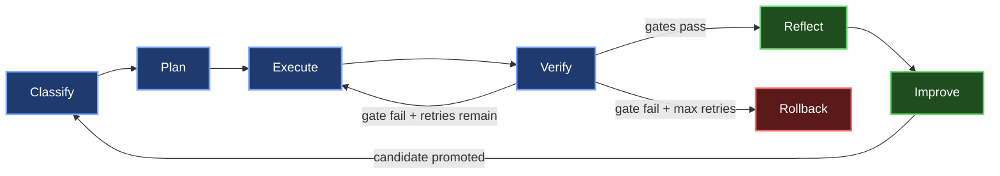
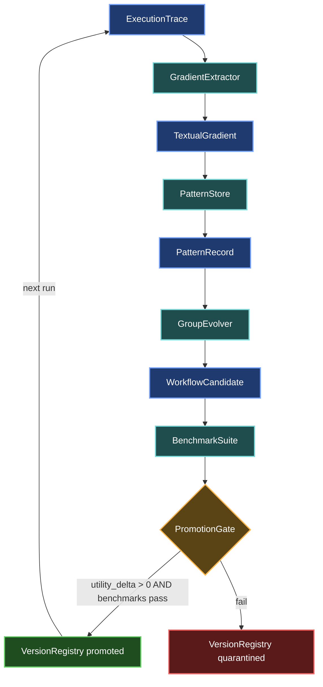

# mini-ork Architecture

mini-ork implements a universal task loop as a framework. Workflow shapes — the pipeline opinions — live in `recipes/` and are user-land. The framework ships only the loop, primitives, and interfaces.

---

## Universal Task Loop



Every task — code fix, research synthesis, blog post, ops runbook — runs through these 6 stages. The recipe (`workflow.yaml`) defines the node graph inside `Execute`. Everything else is framework.

---

## 8 Node-Type Interfaces

Nodes are the roles that agents play inside the `Execute` stage. Each role maps to an interface contract (input shape, output shape, verifier contract) defined in `schemas/workflow.schema.json`.

| Node type | Responsibility | Typical model lane |
|---|---|---|
| `planner` | Decompose task into subtasks; emit objective, assumptions, artifact contract, verifier contract. A plan is not complete until it names how success is checked. | `architect` (opus-class) |
| `researcher` | Gather relevant source material, prior runs, known failure modes. Output is a bounded context pack — not raw dumps. | `worker` (sonnet-class) |
| `implementer` | Produce the artifact (patch, doc, config, report). Reads planner output + researcher context. | `worker` (sonnet-class) |
| `reviewer` | Challenge the artifact against requirements. Write structured feedback. Cannot approve its own work. | `architect` (opus-class) or `long-context` (kimi-class) |
| `verifier` | Run deterministic probes (typecheck, tests, schema diff, health probe, coverage). Binary pass/fail. | `cheapfast` (glm-class) |
| `reflector` | Extract textual gradients from this execution trace. Link failures to workflow steps. Suggest improvements. | `worker` (sonnet-class) |
| `publisher` | Commit, merge, push, or otherwise finalize the artifact. Runs only after all gates pass. | `cheapfast` (glm-class) |
| `rollback` | Revert artifact to last known-good state. Preserve worktree for post-mortem inspection. Never destroy. | `cheapfast` (glm-class) |

---

## 6 Edge-Type Semantics

Edges in `workflow.yaml` carry typed semantics. The executor enforces them.

| Edge type | Meaning | Example |
|---|---|---|
| `depends_on` | Target node cannot start until source completes and its output is available | `implementer depends_on researcher` |
| `supplies_context_to` | Source output is injected into target's context pack, even if not a hard dependency | `planner supplies_context_to verifier` |
| `verifies` | Source verifier node gates target node's continuation | `verifier verifies implementer` |
| `blocks` | Source failure prevents target from running entirely | `scope_gate blocks implementer` |
| `retries` | On failure, target re-runs source with correction context appended | `verifier retries implementer` |
| `escalates_to` | On failure beyond max retries, route to human gate or escalation inbox | `verifier escalates_to human_gate` |

---

## 6 Gate Types

Gates are the checkpoints inside `Verify`. They fire in order; first failure aborts (unless the gate config specifies `continue_on_fail`).

| Gate type | Triggered by | Blocks unless |
|---|---|---|
| `deterministic_verifier` | Script exit code + artifact shape check | Script exits 0 AND artifact matches contract |
| `reviewer_gate` | LLM reviewer JSON output | `approved: true` in structured response |
| `human_gate` | Configured on high-risk rungs (6–7 of autonomy ladder) | Human writes APPROVE to inbox file |
| `budget_gate` | Cumulative cost tracker | `model_costs` total < configured `budget_usd` |
| `scope_gate` | File-path ownership registry | No two nodes claim the same file path |
| `deployment_gate` | Deployment-specific checks (schema diff, rollback proof, health probe) | All deployment probes pass |

Gates are registered at boot via `lib/gate_registry.sh:gate_register`. Custom gates are supported — see [docs/EXTENSION.md](docs/EXTENSION.md).

---

## 8 Memory Namespaces

Memory is scoped. Agents receive only the namespaces relevant to their role, assembled by `lib/context_assembler.sh` to a bounded token budget.

| Namespace | Table(s) | What it holds |
|---|---|---|
| `task_memory` | `task_contexts` | Kickoff, objective, decomposition, artifact contract for this run |
| `workflow_memory` | `workflow_versions`, `workflow_candidates` | Versioned workflow graphs; candidate proposals |
| `agent_performance_memory` | `agent_versions`, `agent_run_stats` | Per-agent model, prompt hash, success rate, cost profile |
| `failure_memory` | `failure_records` | Structured failure events with workflow node + cause |
| `recovery_memory` | `recovery_records` | What worked after which failure — retry strategies |
| `user_preference_memory` | `user_preferences` | Style, verbosity, review depth, risk tolerance |
| `artifact_memory` | `artifact_records` | Produced artifacts with content hash, verifier result, run linkage |
| `benchmark_memory` | `benchmark_tasks`, `benchmark_results` | Known eval tasks + per-version results |

All writes carry provenance: `run_id`, `task_id`, `agent_version_id`, `ts`. A lesson without evidence is a guess.

---

## Task-Class Registry

Task classes are YAML definitions under `${MINI_ORK_HOME}/config/task_classes/`. Each file names a class, its artifact type, required verifiers, and gate policy.

```yaml
# ${MINI_ORK_HOME}/config/task_classes/code_fix.yaml
task_class: code_fix
artifact_type: patch
risk_class: medium
required_verifiers:
  - typecheck
  - targeted_test
  - reviewer_gate
failure_policy: request_changes_or_escalate
rollback_policy: git_branch_quarantine
human_review_level: none   # none | optional | required
```

Validated against `schemas/task_class.schema.json`. Built-in classes: `code_fix`, `research_synthesis`, `blog_post`, `ui_audit`, `db_migration`, `ops_runbook`.

---

## Workflow Registry

Workflows are versioned DAGs per recipe. Each recipe ships a `workflow.yaml` that declares nodes, edges, and verifier bindings.

```yaml
# recipes/code-fix/workflow.yaml
version: "1.0"
task_class: code_fix
nodes:
  - id: plan
    type: planner
    model_lane: architect
  - id: impl
    type: implementer
    model_lane: worker
    depends_on: [plan]
  - id: verify
    type: verifier
    scripts: [typecheck.sh, targeted_test.sh]
    verifies: impl
  - id: review
    type: reviewer
    model_lane: architect
    depends_on: [verify]
  - id: publish
    type: publisher
    depends_on: [review]
```

Validated against `schemas/workflow.schema.json`.

---

## State.db Schema Overview

12 migrations, ~45 tables. Full DDL in [docs/SCHEMA.md](docs/SCHEMA.md).

| Migration | Tables added | Purpose |
|---|---|---|
| `001_core.sql` | `runs`, `tasks`, `events`, `model_costs` | Core run lifecycle |
| `002_epics.sql` | `epics`, `epic_claims`, `epic_reviews`, `iters` | Epic/lane tracking (bdd-first-delivery recipe) |
| `003_bdd.sql` | `bdd_runs`, `bdd_steps`, `scope_claims`, `merge_log`, `escalations`, `prompt_cache`, `corrections` | BDD pipeline (bdd-first-delivery recipe) |
| `004_memory.sql` | `task_contexts`, `workflow_versions`, `workflow_candidates`, `agent_versions`, `agent_run_stats`, `failure_records`, `recovery_records`, `user_preferences`, `artifact_records` | 8 memory namespaces |
| `005_benchmarks.sql` | `benchmark_tasks`, `benchmark_results` | Benchmark memory namespace |
| `006_evolution.sql` | `textual_gradients`, `pattern_records`, `workflow_candidates`, `evolution_runs` | Reflection + evolution pipeline |
| `007_safety.sql` | `audit_log`, `quarantine_registry`, `version_registry` | Governance layer |

---

## Lifecycle Sequence

```mermaid
sequenceDiagram
  autonumber
  participant U as User
  participant CLI as mini-ork
  participant CL as classify
  participant PL as plan
  participant EX as execute (nodes)
  participant VR as verify (gates)
  participant RF as reflect
  participant IM as improve
  participant DB as state.db

  rect rgb(31, 58, 110)
    U->>CLI: mini-ork run code-fix kickoff.md
    CLI->>CL: classify kickoff
    CL->>DB: INSERT task (class, risk, contracts)
  end

  rect rgb(31, 58, 110)
    CL->>PL: plan task
    PL->>DB: INSERT task_context (objective, decomp, artifact_contract)
  end

  rect rgb(31, 77, 31)
    loop for each workflow node (DAG order)
      PL->>EX: dispatch node
      EX->>DB: INSERT trace event (node_id, prompt_hash, cost)
      EX->>DB: write artifact_record
    end
  end

  rect rgb(31, 77, 31)
    EX->>VR: fire gates in sequence
    VR->>DB: INSERT gate_result
  end

  alt all gates pass
    rect rgb(31, 77, 31)
      VR->>EX: publisher node runs
      EX-->>U: artifact committed
    end
  else gate fail, retries remain
    rect rgb(90, 66, 22)
      VR->>EX: retries edge — re-run implementer with correction context
    end
  else gate fail, max retries
    rect rgb(90, 26, 26)
      VR->>EX: escalates_to — rollback node OR human_gate
      EX->>DB: UPDATE task SET status=escalated
      EX-->>U: write INBOX/<task-id>.md
    end
  end

  rect rgb(31, 77, 31)
    EX->>RF: reflect (background)
    RF->>DB: INSERT textual_gradients, pattern_records
  end

  rect rgb(31, 58, 110)
    RF->>IM: improve
    IM->>DB: INSERT workflow_candidates
    IM->>IM: benchmark_suite runs candidates
    IM->>DB: promotion_gate decision → version_registry
    IM->>DB: INSERT audit_log (promote/quarantine)
  end
```



---

## Failure Recovery

**Retry via `retries` edge** (automatic, within a run):
- Triggered when a verifier gate fires `FAIL` and `iter < max_iters`.
- `lib/context_assembler.sh` packs correction context (verifier output + reviewer feedback) into the implementer's next prompt.
- `lib/healer.sh` re-invokes the implementer node with the augmented context.

**Rollback via `rollback` node** (on max-retry exhaustion):
- `lib/branch-quarantine.sh` preserves the worktree — never destroys it.
- Full iter trace + gradient log readable in `state.db`.
- Human-readable escalation written to `${MINI_ORK_INBOX}/<task-id>-<ts>.md`.

**Escalation to `human_gate`** (on deployment-gate or high-rung autonomy triggers):
- Human writes `APPROVE` or `REJECT` to the inbox file.
- Loop polls for the signal; timeout config in `config/safety.yaml`.

---

## Self-Evolution Flow



Self-evolution is evidence-gated: a candidate must beat the current version on the benchmark suite before promotion. Quarantined versions cannot be re-promoted without `version_clear_quarantine`. Every promote/quarantine/rollback writes to `audit_log` (append-only, enforced by sqlite trigger). See [docs/SAFETY.md](docs/SAFETY.md).
