# mini-ork Architecture

## Component Map

```
bin/mini-ork
    │  entry point — parses subcommand, delegates to orchestrator or deliver
    ▼
orchestrator.sh
    │  run lifecycle manager — seeds epics, spawns lanes, waits for verdicts
    │
    ├─── lib/dispatch.sh
    │        claim epic (sqlite atomic update), fork lane subprocess
    │
    ├─── lib/memory.sh
    │        sqlite WAL helpers: read_epic / write_verdict / append_event
    │
    ├─── lib/llm-dispatch.sh
    │        model selection by epic complexity tag → claude CLI args
    │
    ├─── lib/contract.sh
    │        extract kickoff constraints (must/must-not lists) for reviewer
    │
    ├─── lib/scope-overlap.sh
    │        detect two epics touching the same file; emit warning / block claim
    │
    └─── lib/finalize.sh
             post-all-lanes: write run verdict, cleanup worktrees, emit summary

deliver.sh
    │  single-epic lifecycle — called once per lane subprocess
    │
    ├─── lib/spec-author.sh
    │        LLM-backed BDD Gherkin spec generation from diff + kickoff
    │
    ├─── lib/spec-reviewer.sh
    │        adversarial diff review; writes structured feedback rows
    │
    ├─── lib/bdd-runner.sh
    │        execute Gherkin scenarios; emit PASS / FAIL per step
    │
    ├─── lib/self-correction.sh
    │        structured feedback loop; prepares re-prompt from reviewer output
    │
    ├─── lib/healer.sh
    │        self-heal iter: re-invoke worker with correction context
    │
    ├─── lib/cache.sh
    │        content-hash keyed prompt/response cache (sqlite-backed)
    │
    ├─── lib/rebase-guard.sh
    │        detect merge conflicts before auto-merge; emit BLOCKED if any
    │
    └─── lib/auto-merge.sh
             rebase branch onto main, git merge --no-ff, write audit row
```

## Data Model (14 tables)

| Table | Purpose |
|---|---|
| `runs` | One row per `mini-ork deliver` invocation (UUID, kickoff path, status, timestamps) |
| `epics` | Work units seeded from kickoff; one per worktree lane (id, run_id, status, complexity, verdict) |
| `epic_claims` | Atomic claim log: which process claimed which epic at what time (prevents double-claim) |
| `epic_reviews` | Adversarial reviewer output per epic per iter (structured JSON feedback) |
| `bdd_runs` | One row per BDD spec execution (epic_id, iter, scenario count, pass/fail counts) |
| `bdd_steps` | Individual Gherkin step results (bdd_run_id, step_text, status, stderr) |
| `events` | Append-only event log for all state transitions (run_id, epic_id, event_type, payload, ts) |
| `model_costs` | Per-call cost tracking (run_id, epic_id, model, role, input_tokens, output_tokens, cost_usd) |
| `iters` | Iter records per epic: which worker call, which model, elapsed seconds, verdict |
| `scope_claims` | File-path → epic_id ownership registry; blocks overlapping claims |
| `prompt_cache` | Content-hash → response cache (avoids re-querying identical prompts) |
| `corrections` | Self-correction round-trips: reviewer feedback → healer re-prompt pairs |
| `merge_log` | Auto-merge results: branch, base SHA, merge SHA, conflict count, outcome |
| `escalations` | Epics that exceeded max_iters without PASS; written to INBOX/ |

Full DDL in `docs/SCHEMA.md`.

## Lifecycle Sequence

```mermaid
sequenceDiagram
  autonumber
  participant U as User
  participant CLI as bin/mini-ork
  participant O as orchestrator.sh
  participant D as lib/dispatch.sh
  participant W as deliver.sh (worker lane)
  participant R as lib/spec-reviewer.sh
  participant B as lib/bdd-runner.sh
  participant H as lib/healer.sh
  participant M as lib/auto-merge.sh
  participant DB as state.db

  rect rgb(31, 60, 100)
    U->>CLI: mini-ork deliver kickoff.md
    CLI->>O: parse + validate kickoff
    O->>DB: INSERT run (status=seeding)
    O->>DB: INSERT N epics (status=pending)
  end

  rect rgb(31, 77, 31)
    loop for each epic (parallel lanes)
      O->>D: dispatch lane
      D->>DB: UPDATE epic SET status=claimed (atomic)
      D->>W: fork subprocess
    end
  end

  rect rgb(31, 60, 100)
    W->>W: run worker (claude --print)
    W->>DB: write diff + iter row
    W->>R: invoke spec-reviewer
    R->>DB: INSERT epic_review
    W->>B: invoke bdd-runner
    B->>DB: INSERT bdd_run + bdd_steps
  end

  alt BDD FAIL and iters < max_iters
    rect rgb(80, 40, 10)
      B-->>H: trigger self-heal
      H->>W: re-invoke worker with correction
    end
  else BDD FAIL and iters >= max_iters
    rect rgb(90, 20, 20)
      W->>DB: UPDATE epic SET verdict=ESCALATED
      W-->>U: write .mini-ork/INBOX/<epic-id>.md
    end
  else BDD PASS
    rect rgb(31, 77, 31)
      W->>DB: UPDATE epic SET verdict=PASS
    end
  end

  rect rgb(31, 77, 31)
    O->>O: wait for all lanes
    O->>M: invoke auto-merge (all PASS epics)
    M->>M: rebase-guard check
    M->>DB: INSERT merge_log
    M-->>U: merged SHA + run summary
  end
```



## Failure Recovery

**Self-heal** (automatic, within a run):
- Triggered when `bdd-runner` emits `FAIL` and `iters < max_iters`.
- `lib/self-correction.sh` builds a structured re-prompt from reviewer feedback + failed BDD step output.
- `lib/healer.sh` re-invokes the worker subprocess with the correction context appended.
- Each heal attempt consumes one iter slot.

**Debugger-on-failure**:
- When an epic exhausts `max_iters` without PASS, `finalize.sh` preserves the worktree at `.mini-ork/runs/<run-id>/worktrees/<epic-id>/` (not deleted).
- Full iter trace readable via `mini-ork inspect <epic-id>`.

**Escalation to INBOX**:
- `escalations` row written to state.db.
- Human-readable markdown written to `.mini-ork/INBOX/<epic-id>-<ts>.md` with: failed BDD steps, reviewer feedback, iter count, cost so far.
- `mini-ork deliver` exits 1. Remaining PASS epics are still merged.

## Model Routing

| Role | Default model | Override env var | Rationale |
|---|---|---|---|
| decomposer | `claude-opus-4` | `MINI_ORK_DECOMPOSER_MODEL` | High reasoning needed to parse kickoff constraints into coherent epics |
| worker | `claude-sonnet-4-5` | `MINI_ORK_WORKER_MODEL` | Best cost/quality tradeoff for implementation |
| reviewer | `claude-opus-4` | `MINI_ORK_REVIEWER_MODEL` | Adversarial lens needs depth; Kimi-k2 acceptable for long diffs |
| spec-author | `claude-sonnet-4-5` | `MINI_ORK_SPEC_AUTHOR_MODEL` | BDD generation is structured; Sonnet sufficient |
| healer | `claude-sonnet-4-5` | `MINI_ORK_HEALER_MODEL` | Same as worker; healer retries the same task with more context |
| hunter (optional) | `glm-4` | `MINI_ORK_HUNTER_MODEL` | Cheap, fast grep-style analysis for bug/perf scanning |

Model routing logic lives in `lib/llm-dispatch.sh`. Per-epic overrides are supported via `agents.yaml`:

```yaml
epics:
  - name: performance-hot-path
    model: deepseek-v3   # override for budget-sensitive boilerplate epic
```

## Project-Agnostic Configuration

mini-ork has no built-in knowledge of any codebase. All domain specificity comes from:

**`kickoff.md`** — the user-authored spec. mini-ork reads it but does not interpret it beyond extracting epic boundaries.

**`.mini-ork/agents.yaml`** — per-repo agent config:

```yaml
max_iters: 3
max_lanes: 4
worker_model: claude-sonnet-4-5
reviewer_model: claude-opus-4
bdd_runner: bash   # or: pytest, bun, node
hooks:
  pre_worker: .mini-ork/hooks/pre-worker.sh
  post_review: .mini-ork/hooks/post-review.sh
  on_escalate: .mini-ork/hooks/on-escalate.sh
```

**Hook scripts** (`.mini-ork/hooks/`) — executed at lifecycle events. Receive epic context via environment variables (`MINI_ORK_EPIC_ID`, `MINI_ORK_RUN_ID`, `MINI_ORK_VERDICT`, etc.). Exit non-zero to abort the step.

**Provider env files** (`.mini-ork/config.env`) — API keys and endpoint overrides. Sourced by `lib/llm-dispatch.sh`, never committed (gitignored via `.mini-ork/secrets/`).

**Environment variable precedence:** shell env > `.mini-ork/config.env` > `agents.yaml` defaults > built-in defaults.

All state is local to `.mini-ork/` inside the repo. No remote service, no account, no telemetry.
