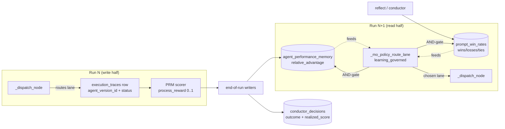
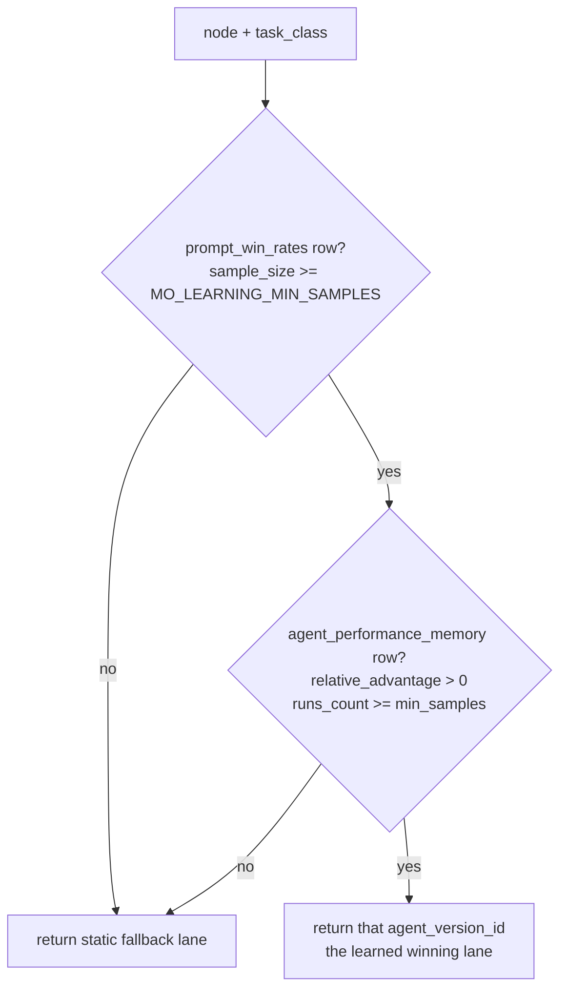

# Learning Loop Lifecycle

How mini-ork records what happened on a run and uses it to route the **next**
run better — the full write → store → read cycle, the five learning signals,
and how to prove the loop is closed.

> **Status (2026-06-23):** Closed and **default-ON** for real runs. Verified by
> `scripts/learning-loop-closure-gate.sh` (14/14) and
> `scripts/smoke-learning-loops.sh` (10/10).

---

## 1. The one-paragraph version

Every node mini-ork dispatches writes an `execution_traces` row stamped with the
**lane it actually ran on** (`agent_version_id`) and a heuristic quality score
(`process_reward`). At end-of-run, two writers turn those traces into *policy*:
**GRPO** computes each lane's relative advantage per task class, and the
**conductor writeback** marks each topology decision success/failure. On the
*next* run, the dispatcher's routing seam (`learning_governed`, default-ON) reads
those tables and, when there is enough evidence, swaps a node onto the lane the
data says wins. When evidence is thin, it silently falls back to the recipe's
configured lane — so learning is a strict improvement, never a regression.



The critical join: the lane GRPO scores (`agent_version_id`) is the **same**
lane the router chose. Before this was stamped, GRPO keyed on a column the
router never wrote, so the loop was physically open even though every function
existed.

---

## 2. The five learning signals

| Signal | Table | Writer | When | What it captures |
|---|---|---|---|---|
| **PRM** (Process Reward) | `execution_traces.process_reward` | `lib/process_reward.sh::prm_score_trace` | inline, per node | heuristic 0–1 quality of one node's work |
| **GRPO** (Group Relative Policy Opt.) | `agent_performance_memory.relative_advantage` | `mo_learning_write_grpo_advantages` (`bin/mini-ork-execute:252`) | end-of-run | which lane beats its peers on a task class |
| **RHO** (prompt win rates) | `prompt_win_rates` | `mini_ork/ported/rho_aggregator.py::aggregate_win_rates` (native and called by the Python reflect entrypoint) | reflect / conductor | which prompt version wins per task class |
| **Conductor writeback** | `conductor_decisions.outcome` / `realized_score` | `mo_learning_update_conductor_outcomes` (`bin/mini-ork-execute:218`) | end-of-run | did the chosen topology/recipe pay off |
| **Grounded rejections** | `grounded_rejections` | _table ready; prod writer = open task #9_ | review/oracle gates | refuted claims + evidence (anti-reward) |

A sixth, longer-horizon loop — **self-improve / gradient** (`gradient_records`,
4597 live rows) — is produced by `lib/reflection_pipeline.sh`,
`lib/gradient_extractor.sh`, and `lib/cross_epic_gradient.sh`. It proposes
prompt/role/recipe *changes* rather than per-run lane routing, and is documented
separately in `docs/RECURSIVE-SELF-IMPROVE.md`.

---

## 3. Write half — how a trace becomes a learning signal

### 3.1 Lane routing + stamping (`_dispatch_node`, `bin/mini-ork-execute:1335`)

```bash
local dispatch_lane="${node_model_lane:-$node_type}"          # recipe default
dispatch_lane="$(_mo_policy_route_lane "$node_type" "$dispatch_lane")"  # may override
```

`dispatch_lane` (the lane that *actually* runs) is then passed as the 11th
positional arg to the trace-payload writer in `_trace_write_node_rich`
(`:1079`) and persisted as `agent_version_id` (`:1037`, `:1069`). **This is the
join key** between the write half and the read half.

### 3.2 PRM scoring (`lib/process_reward.sh`)

Immediately after the trace lands, `_trace_write_node_rich` calls
`prm_score_trace` (gated on `MO_PRM_SCORE`, **default 1**, `:1103`). The
heuristic, additive, capped at 1.0:

| Signal | Points |
|---|---|
| `status = success` | +0.40 |
| `tool_calls` non-empty (agent did work) | +0.20 |
| `files_written` or `files_read` non-empty | +0.10 |
| `reviewer_verdict` ∈ {APPROVE, pass, success, ok} | +0.15 |
| `duration_ms` ∈ [1000, 600000] (not too fast/slow) | +0.10 |
| `cost_usd > 0` (real LLM call, not a stub) | +0.05 |

> This is a v1 heuristic. The full PRM literature uses a *learned* reward model;
> the heuristic covers the obvious cases (no files touched, no tool calls,
> vacuous status) and is the score GRPO consumes.

### 3.3 End-of-run writeback (`bin/mini-ork-execute:2376`)

```bash
if [ "${MO_LEARNING_WRITEBACK:-1}" = "1" ]; then   # default ON
  mo_learning_update_conductor_outcomes >/dev/null
  mo_learning_write_grpo_advantages   >/dev/null
fi
```

**GRPO** (`:252`) groups every stamped trace by `(node_type, task_class)`,
computes the group mean/std of the reward, then for each `agent_version_id`
writes the mean z-score advantage:

```
relative_advantage = mean over the lane's traces of  (reward - group_mean) / group_std
```

A lane that consistently scores above its task-class peers gets
`relative_advantage > 0`; that is the exact predicate the router gates on.
Rows upsert on `(agent_version_id, task_class)`.

**Conductor writeback** (`:218`) resolves every `conductor_decisions` row whose
`outcome` is still `pending` and whose epic has reached `done` / `escalated`:
`done → success / realized_score=1.0`, else `failure / 0.0`.

---

## 4. Read half — how the next run uses the signal

### 4.1 The routing seam (`_mo_policy_route_lane`, `bin/mini-ork-execute:1183`)

```bash
local policy="${MO_ROUTING_POLICY:-learning_governed}"   # default ON
```

Policies: `workflow_default` (use recipe lane verbatim), `frontier_only`,
`cheap_only`, `static_hybrid` (cheap implementer / frontier reviewer),
`trace_governed` (escalate after a prefix failure), and **`learning_governed`**
(the default).

### 4.2 `learning_governed` (`_mo_learning_governed_lane`, `:157`)

It first computes a **static-hybrid baseline**, then tries to improve it from the
data with a **strict AND-gate**:



Both conditions must hold:
1. a `prompt_win_rates` row exists for this `task_class` with
   `sample_size >= MO_LEARNING_MIN_SAMPLES` (default **3**), **and**
2. an `agent_performance_memory` row with `relative_advantage > 0` and
   `runs_count >= min_samples`.

If either misses — a **cold or vacuous** learning store — it returns the static
fallback. This is what makes default-ON safe: with no data, `learning_governed`
behaves exactly like the recipe's configured lane. Learning can only *add* a
routing override once it has earned the evidence; it can never subtract.

---

## 5. Defaults: why "always" is true now

The loop benefits **every** real run with no opt-in, because three gates default
ON in `bin/mini-ork-execute`:

| Env var | Default | Effect | Opt-out |
|---|---|---|---|
| `MO_PRM_SCORE` | `1` | score every trace | `MO_PRM_SCORE=0` |
| `MO_ROUTING_POLICY` | `learning_governed` | read learnings to route | `MO_ROUTING_POLICY=workflow_default` |
| `MO_LEARNING_WRITEBACK` | `1` | GRPO + conductor writeback | `MO_LEARNING_WRITEBACK=0` |
| `MO_LEARNING_MIN_SAMPLES` | `3` | evidence floor before override | raise/lower as needed |

---

## 6. Validation

Two repeatable checks, both read-only and run on a temp/live DB without
dispatching:

```bash
# Source defaults + live schema/data are all green (14 assertions)
bash scripts/learning-loop-closure-gate.sh
# → "LEARNING LOOP: CLOSED — default-ON for real runs"

# End-to-end machinery on a throwaway DB copy (10 assertions): PRM seeds,
# GRPO swaps cheap_lens→frontier_lens, conductor writeback marks success,
# grounded_rejections records a refuted draft
bash scripts/smoke-learning-loops.sh
# → "SUMMARY 10 passed, 0 failed"
```

The closure gate proves **two** evidence classes — neither alone is sufficient:

- `[CODE]` — grep the source to prove the policy/PRM/writeback fire by default
  (machinery is *on*, not opt-in).
- `[LIVE]` — query `state.db` to prove the schema + data exist to record and
  read learnings (the DB can actually *store* a result).

A loop is "closed always" only when both are green: otherwise you have machinery
that could learn but is switched off, or switched on against a DB that cannot
store the outcome.

---

## 7. Live state & known horizons (2026-06-23)

| Table | Rows | Note |
|---|---:|---|
| `execution_traces` | 1295 | all carry `process_reward` (backfilled) |
| `prompt_win_rates` | 64 | RHO populated |
| `agent_performance_memory` | 1 | GRPO; **grows going forward** |
| `conductor_decisions` | 9 | all `pending` (epic not yet `done`) |
| `gradient_records` | 4597 | self-improve loop, very active |
| `grounded_rejections` | 0 | table ready; prod writer is open work |

Two honest caveats:

1. **Stamping benefits future runs only.** Historical traces predate
   `agent_version_id` stamping and have no recoverable lane, so they cannot be
   re-attributed. GRPO's `agent_performance_memory` therefore populates as new
   real runs land — that is why it currently holds a single row.
2. **Grounded rejections** has a live table and passes the smoke proof, but the
   production writer that emits rows from the review/oracle gates is still open
   (tracked as the "wire grounded rejection into 5 oracle gates" task). Until
   then it is an anti-reward channel that is wired but not yet fed by real runs.

---

## 8. File map

| Concern | Location |
|---|---|
| Routing seam + policies | `bin/mini-ork-execute:1183` (`_mo_policy_route_lane`) |
| Learning-governed gate | `bin/mini-ork-execute:157` (`_mo_learning_governed_lane`) |
| Lane stamping onto trace | `bin/mini-ork-execute:1335`, `:1079`, `:1037` |
| PRM scorer | `lib/process_reward.sh` |
| GRPO writer | `bin/mini-ork-execute:252` (`mo_learning_write_grpo_advantages`) |
| Conductor writeback | `bin/mini-ork-execute:218` (`mo_learning_update_conductor_outcomes`) |
| RHO aggregator | `mini_ork/ported/rho_aggregator.py` (native, used by the Python-sole reflect entrypoint) |
| End-of-run writeback callsite | `bin/mini-ork-execute:2376` |
| Closure proof gate | `scripts/learning-loop-closure-gate.sh` |
| Machinery smoke harness | `scripts/smoke-learning-loops.sh` |
| Schema | `db/migrations/0039_learning_column_repairs.sql`, `0040_grounded_rejections.sql` |
| Self-improve / gradient loop | `docs/RECURSIVE-SELF-IMPROVE.md` |
