# The Observability UI — a reading guide

The mini-ork web UI ("ORK·COMMAND") is a **read-only** forensics surface over
the same `state.db` + run artifacts the CLI writes. Nothing in the UI mutates
pipeline state except two explicitly-labeled run controls (Stop / Kill). It is
a local tool: the server binds `127.0.0.1:7090` only.

```bash
pip install fastapi uvicorn pyyaml   # one-time backend deps
mini-ork serve                       # http://127.0.0.1:7090
```

The SPA bundle is served from `mini_ork/web/static/` (built with
`pnpm --dir ui build`); for development, `pnpm --dir ui dev` runs Vite on
:5173 proxying API calls to :7090.

| Route | Page | What it answers |
|---|---|---|
| `/` | Fleet | "What is running, what failed, what did today cost?" |
| `/runs/:id` | Run forensics | "What happened inside this run, and why?" |
| `/runs/:id/agents/:node` | Agent detail | "What did this one agent see, say, and produce?" |
| `/runs/:id/inputs/:key` | Input viewer | "Exactly what kickoff/plan/profile went in?" |
| `/trajectory` | Trajectory | "Is the system getting cheaper and faster over time?" |
| `/trajectory/self-improve/:id` | Self-improve iteration | "What did one self-improvement iteration do?" |
| `/fingerprint` | Detection fingerprint | "Is my review panel actually heterogeneous?" |

---

## Global chrome (every page)

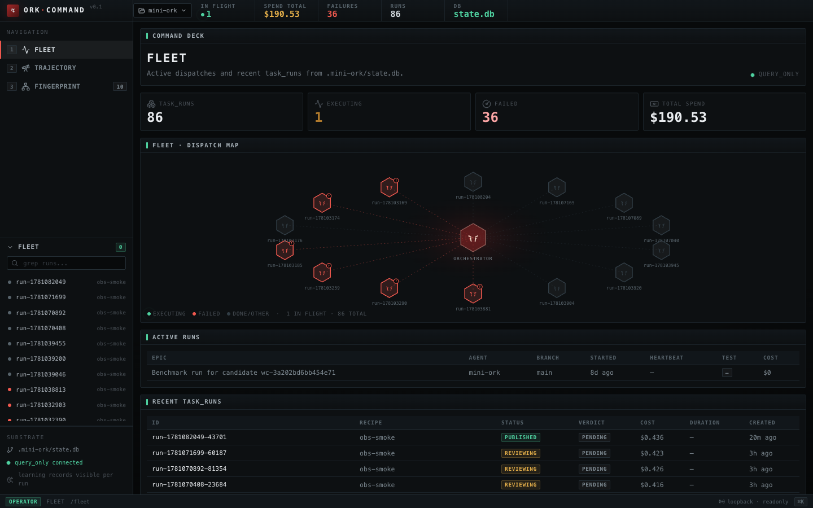

- **Top bar** — project switcher, then live fleet vitals: in-flight count,
  total spend, failure count, run count, and the backing DB (`state.db`).
  These come from `/api/v1/task-runs/summary` and refresh continuously.
  Selecting either a project folder or its `.mini-ork` directory mounts the
  same home; the resolver never descends into `.mini-ork/.mini-ork`. Each
  project's tables come only from its selected `state.db`—runs are not
  aggregated across project databases.
- **Left nav** — Fleet / Trajectory / Fingerprint (with keyboard ordinals
  1/2/3). Below it, a **fleet sidebar**: a greppable list of recent runs
  (colored dot = status) so you can jump between runs from anywhere.
- **Substrate footer** — which DB file is mounted and the connection mode.
  `query_only connected` means the UI holds a read-only handle: browsing can
  never corrupt a live run's WAL.

### Status and verdict pills

The same color language is used on every page (`ui/src/lib/format.ts`):

| Color | Statuses | Verdicts |
|---|---|---|
| Green (`ok`) | `published`, `success`, `converged` | `APPROVE`, `pass` |
| Amber (`warn`) | `executing`, `verifying`, `reviewing`, `planned`, `pending`, `running`, `partial` | **`vacuous`** |
| Red (`err`) | `failed`, `rolled_back`, `aborted`, `timed_out`, `CRASH` | `REQUEST_CHANGES`, `ESCALATE`, `fail` |
| Gray (`muted`) | unknown / not yet set | `pending` (null) |

> **Why `vacuous` is amber, not green:** a run where *zero verifiers
> executed* exited cleanly but proved nothing. The verify stage refuses to
> launder "nothing was checked" into success — the UI renders it as
> needs-attention, never as a pass.

### Family colors

Every agent node is attributed to a **model family**, each with a fixed
color used in DAGs, rosters, and the fingerprint page: opus/sonnet =
purples, glm = rose, kimi = cyan, codex = green, deepseek = blue,
minimax = amber, gemini = emerald. When you see one color dominating a
panel that should be diverse, that *is* the finding (see
[Fingerprint](#fingerprint--detection-fingerprint)).

---

## Fleet (`/`)

The command deck. Four sections, top to bottom:

1. **Stat cards** — total `task_runs`, currently executing (amber when >0),
   failed (red when >0), and cumulative spend from the `llm_calls` ledger.
2. **Dispatch map** — up to 14 recent runs drawn as hexagons around the
   central orchestrator. Use the `1h` / `1d` / `7d` / `all` window control to
   restrict the map by run creation time without hiding rows from the evidence
   table below. Green pulse = executing now; red + `!` = failed; gray =
   finished. Solid spokes are active dispatches, dashed are settled. Compact
   labels preserve both ends of long run IDs; hover a node for the full ID.
   Every hexagon is a link to that run's forensics page.
3. **Active runs table** — heartbeat-tracked in-flight dispatches (epic,
   agent, branch, started, last heartbeat, test status, cost). Refreshes
   every 5 s. A stale heartbeat here is your first hint a dispatcher hung.
4. **Recent task_runs table** — last 100 rows of `task_runs`: ID (link),
   recipe, status pill, verdict pill, cost, duration, age. Refreshes every
   10 s.

**How to read it:** scan stat cards for red, then the dispatch map for
pulsing nodes, then use the recent table to drill into anything amber or
red. Cost on this page is *ledger* cost (billed envelopes), not estimates.

---

## Run forensics (`/runs/:id`)

The deep-dive page for one `task_run`. The URL's `?tab=` parameter is the
source of truth, so every view is shareable/bookmarkable.

**Header (all tabs):** recipe name + status/verdict pills, node-state
counters (startup / running / succeeded / failed / queued), and created /
ended / cost / LLM-call metrics. The right of the breadcrumb hosts the
**run controls**:

- **Stop** (amber) — *soft* stop: `POST /api/v1/task-runs/:id/stop` writes a
  flag; the current node finishes, no new dispatches start. Available while
  the run status is still steerable (classified → reviewing).
- **Kill** (red skull, double-confirm) — *hard* kill:
  `POST /api/v1/task-runs/:id/kill` sends SIGTERM, waits 2 s, then SIGKILL
  to the dispatcher process tree. The response reports exactly which pids
  were signaled and which survived (e.g. permission denied).

A terminal run shows "terminal status — no controls available" instead.

The page subscribes to a server-sent event stream
(`/api/v1/stream?task_run=:id`), so panels update live while a run executes
— no manual refresh.

### Tab: Overview

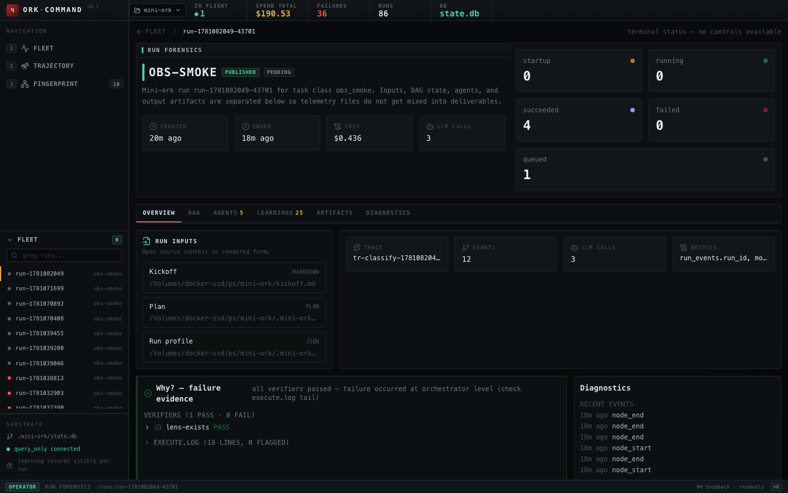

- **Needs-answers panel** (only when the planner profile gate found
  ambiguous inputs) — lists the planner's open questions with its confidence
  score; you can type answers and save them
  (`POST /api/v1/task-runs/:id/answers`), and the panel tells you the CLI
  command to resume with.
- **Run inputs** — the exact files the run started from, ranked: kickoff →
  plan → run_profile → profile-answers. Click any to view the full content.
  This is the "what did it know going in" audit surface.
- **Correlation strip** — trace_id, event count, LLM-call count, and which
  *bridge methods* linked telemetry to this run (`trace_id`, `run_id`, or
  time-window). If you see only `time-window`, attribution is approximate.
- **Why? — failure evidence** — the most important card on a red run. It
  aggregates verifier results (pass/fail, each with its evidence file and
  log), failure lines extracted from `execute.log`, and — for self-improve
  runs — the final loop verdict. Every claim links to the evidence file
  that backs it.
- **Diagnostics card** — last 6 `run_events` and the LLM ledger subtotal
  for this run.

### Tab: DAG

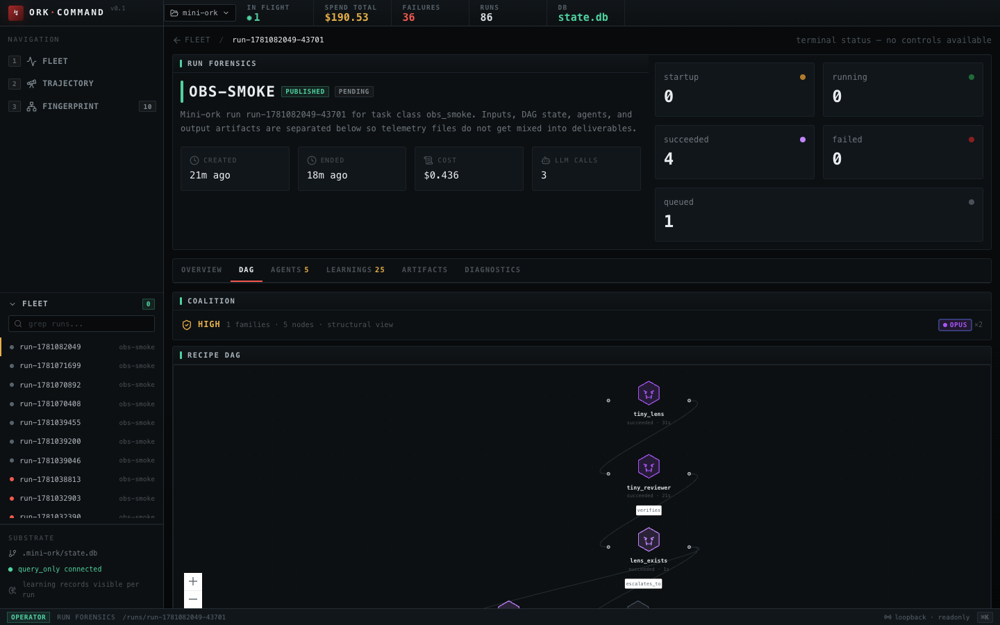

- **Coalition panel** (top) — the per-run heterogeneity audit: verdict
  (`heterogeneous` green / `low`·`medium` amber / `high` red), node and
  family counts, and a family-breakdown pill row. In the screenshot above,
  an `obs-smoke` run is flagged **HIGH — 1 family, 5 nodes**: that's correct
  and intentional for the cheap smoke recipe, but on a review recipe the
  same flag means your "panel" can swing a verdict as one bloc — reassign
  lanes.
- **Recipe DAG** — the workflow graph as executed. Hexagon color = model
  family; status dot: amber = startup, green pulse = running, purple =
  done, red = failed, faded gray = never dispatched. Edge labels show the
  edge type (`verifies`, `escalates_to`, …) except the default
  `depends_on`. **Click any node** to open that agent's detail page.

### Tab: Agents

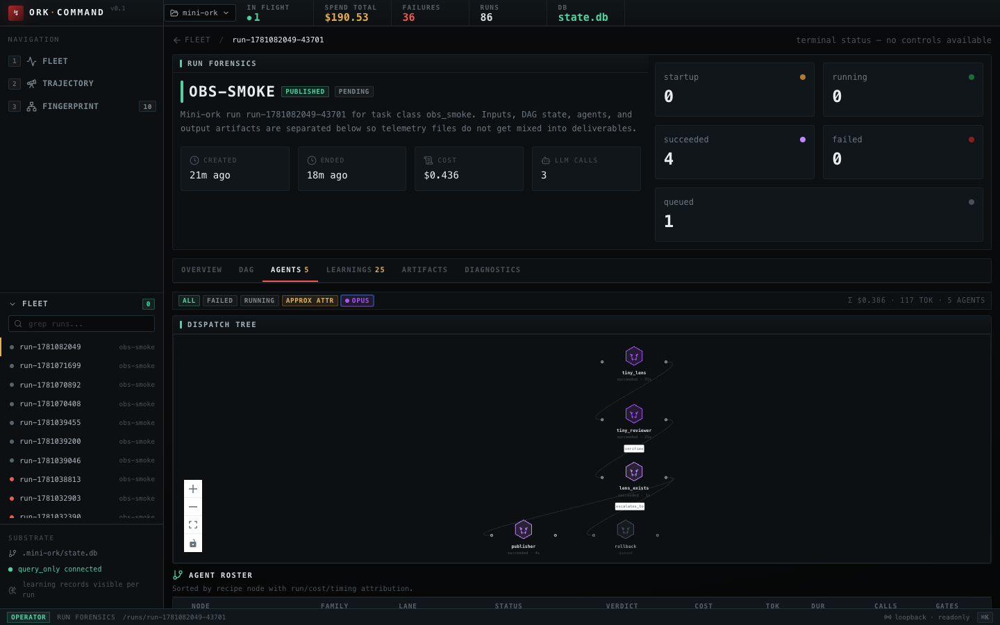

- **Filter pills** — all / failed / running, plus one pill per family.
- A compact copy of the dispatch tree, then the **agent roster**: one row
  per node with family, lane, status, verdict, cost, tokens, duration,
  LLM-call count, and gates. The left edge color-codes outcome (family
  color when succeeded, red/green/amber for failed/running/startup).
- The footer totals cost, tokens, and agent count for the run.

This is the "where did the money go *inside* the run" view — sort the
mental ledger by the cost column before blaming a model family.

### Tab: Learnings

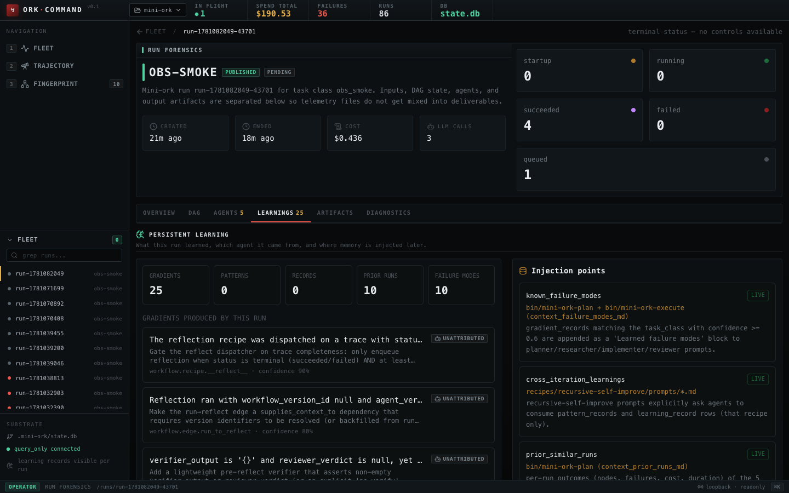

Renders what the experience-memory machinery did for *this* run, in two
columns:

- **Produced by the run** — extracted gradients (signal → suggested change,
  with confidence % and which agent produced it), evidenced pattern
  records, and self-improve learning records.
- **Available to the run** (sidebar) — the memory that was *injected*:
  each injection point with a `live` / `not-wired` badge plus where and how
  it enters the prompts; the prior similar runs the planner saw; the known
  failure modes matched to this task class.

**How to read it:** "produced" is the run paying experience forward;
"available" is the dividend from past runs. A mature task class shows both
sides populated. `not-wired` badges are honest signals that an injection
point exists but wasn't active for this run.

### Tab: Artifacts

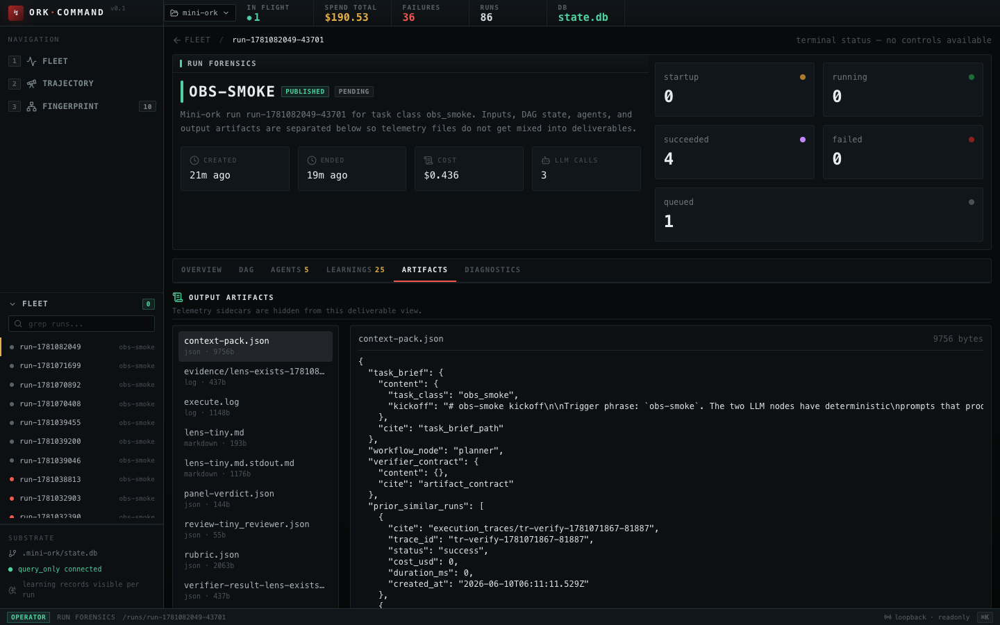

The deliverables, with telemetry deliberately hidden: sidecar files
(`*.transcript`, `*.stream.jsonl`, `run_profile*`, `plan.json`, …) are
filtered out so this view contains only what the run *produced*. File list
on the left (kind + size); content pane renders markdown as prose and JSON
pretty-printed.

### Tab: Diagnostics

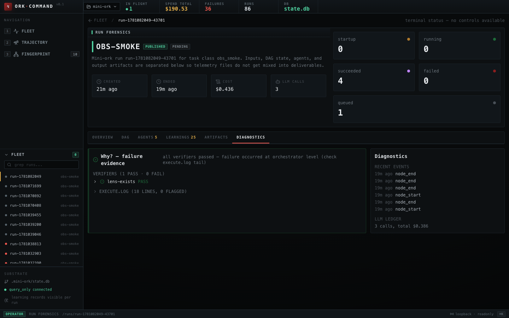

The Overview's "Why?" evidence card and event/ledger card combined into one
grid — the tab to keep open while babysitting a flaky run.

---

## Agent detail (`/runs/:id/agents/:node`)

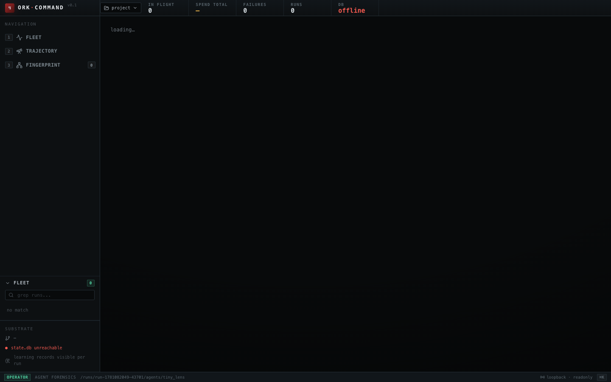

One node's complete story, top to bottom:

1. **Header** — node type, family, status, verdict, dispatch mode; lane,
   duration, start/end, gates, and the verifier ref if this node is gated.
2. **Input context** — left: the agent's identity (lane, family, prompt
   ref, verifier ref) and the run inputs it could see; right: the **node
   prompt**, expandable to the full rendered markdown that was actually
   dispatched. No guessing what the agent was told — it's right there.
3. **Agent learning** — what this agent created (gradients / patterns /
   records) vs. what was injected into it (matched failure modes), plus
   the injection-point wiring details.
4. **Agent transcript** — turn-by-turn: agent text (markdown), tool calls
   with their input JSON, and the *matched LLM-call telemetry* per turn
   (provider, model, input/output/cache tokens, cost, duration). A
   truncation badge appears when the transcript was size-limited, and a
   fallback badge when only text output was captured. If no transcript is
   available the panel says why (rich tracing requires `MO_TRACE_RICH=1`).
   Ledger calls that couldn't be matched to a turn appear under
   **orphan LLM calls** instead of being silently dropped.
5. **Child dispatches** — if this agent spawned recursive child runs
   (`mini-ork spawn`), each child links to its own forensics page with
   depth, recipe, and status.
6. **Output artifacts** — the files this agent was expected to write,
   rendered inline; an explicit empty state if a file never appeared.

---

## Input viewer (`/runs/:id/inputs/:key`)

Full-page render of a single run input. Plans get a structured view —
objective, assumptions, risk notes, numbered decomposition steps with
dependencies, expected outputs, and verifier checks — instead of raw JSON.
Kickoffs render as markdown; everything else pretty-prints.

---

## Trajectory (`/trajectory`)

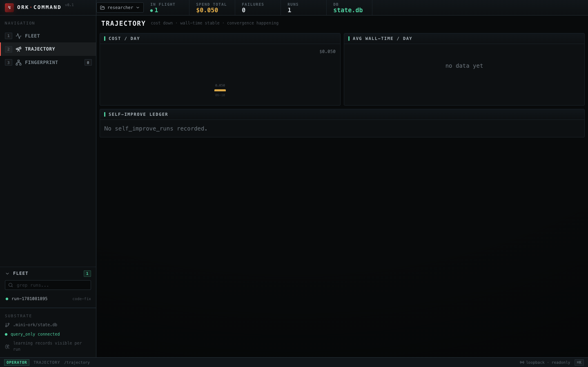

The cross-run convergence view — "is the loop actually improving?"

- **Cost/day** and **avg wall-time/day** bar charts (last 7 days, totals on
  top). Cost trending down while wall-time holds is the shape you want.
- **Self-improve ledger** — every iteration of the recursive
  self-improvement loop: iter number, outcome pill (`success`, `partial`,
  `rejected`, `failed`, `converged`, `timed_out`, `aborted`), linked
  task_run, cost, wall time, age. Each row opens the iteration detail page.

### Self-improve iteration detail (`/trajectory/self-improve/:id`)

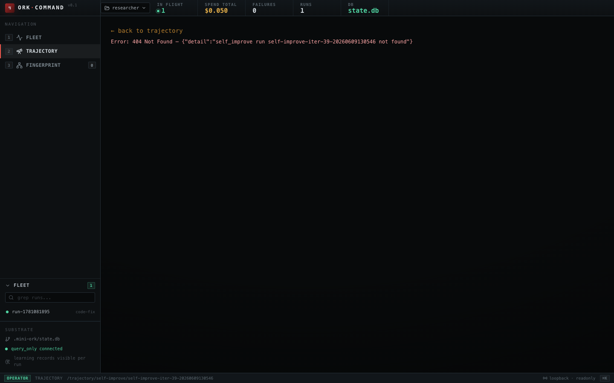

One loop iteration's audit record:

- **Timeline** — started / finished / wall time, plus the soft (3 h) and
  hard deadlines with remaining time (green) or overage (red). `timed_out`
  outcomes become unambiguous here.
- **Worktree** — the isolated branch and worktree path the iteration ran
  in, with parent/child iteration lineage links. The loop never edits your
  checkout directly; this card shows where it *did* work.
- **Linked task_run** — jump to the full run forensics for the iteration's
  inner pipeline.
- **Notes** — structured key/value + commit-sha markers parsed from the
  loop's notes (raw text expandable below).
- **Descendant iterations** — children spawned from this iteration.

Prev/next navigation at the top steps through iterations in order.

---

## Fingerprint (`/fingerprint`)

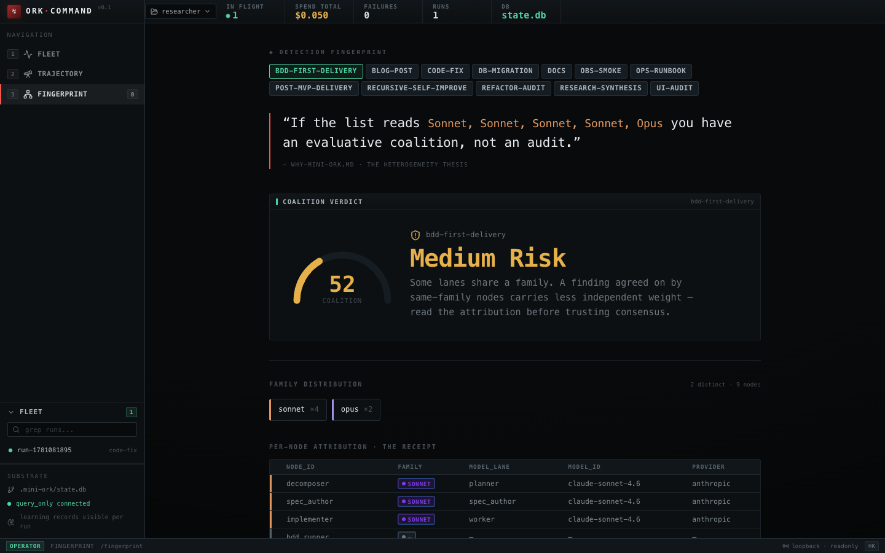

The page that operationalizes the README's detection-fingerprint test:
*"list the model families behind every lens — if it reads Sonnet, Sonnet,
Sonnet, Sonnet, Opus, you have an evaluative coalition, not an audit."*

- **Recipe picker** — the audit is per recipe; pick the one you're about
  to trust.
- **Coalition verdict gauge** — a 0–100 heterogeneity score:
  `heterogeneous` (≥4 distinct families, green, ~95) → `low` → `medium` →
  `high` (single-family quorum, red, ~22). The copy under the verdict tells
  you how much independent weight to give the panel's consensus. The
  screenshot shows `bdd-first-delivery` scoring **52 / Medium Risk** —
  sonnet holds 4 of 9 lanes, so agreement among those nodes is one
  disposition sampled four times.
- **Family distribution** — distinct-family count and per-family node
  pills.
- **Per-node attribution ("the receipt")** — node → family → lane →
  resolved model id → provider. This is the table to paste into a review
  thread when someone asks "who exactly judged this?"
- **What to do** (only on `high`) — concrete remediation: reassign at least
  one reviewer lane to a different family in `config/agents.yaml`.
- **Learning signals** — global gradient and self-improve counts with the
  latest high-confidence gradients, connecting panel quality to what the
  system is currently learning.

---

## Where the data comes from

| Surface | Backing store |
|---|---|
| Stat cards, run tables | `task_runs` (SQLite) |
| Cost figures everywhere | `llm_calls` ledger (billed result envelopes) |
| DAG + agent roster | recipe `workflow.yaml` + `execution_traces` + `run_events` |
| Transcripts | per-node `.transcript` / `.stream.jsonl` sidecars under `.mini-ork/runs/` |
| Learnings | `gradient_records`, `pattern_records`, `learning_record` |
| Trajectory | `task_runs` aggregates + `self_improve_runs` |
| Fingerprint | recipe lane → family resolution (`config/agents.yaml` + provider registry) |

Everything you see in the UI is reproducible with `sqlite3 .mini-ork/state.db`
queries and files on disk — the UI adds navigation and correlation, not
private state.
