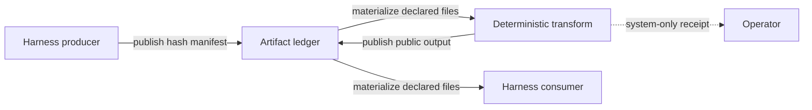

# Artifact Graph Contracts

MiniOrk workflows can declare artifact ports so an agent receives a named,
verified input rather than discovering files by convention. The executor still
uses the configured harness (Claude Code, Codex, Gemini, or another provider)
for agent work; MiniOrk owns the handoff contract around that harness.

## Contract

Each workflow node may declare:

- `outputs`: named files it must publish after successful execution.
- `inputs`: named artifacts it requires before it can execute.
- an edge with both `from_output` and `to_input`: the only valid producer to
  consumer handoff.

The compiler validates duplicate ports, required inputs, visibility, output-path
ownership, and DAG readiness. At runtime, an edge is also a completion gate:
independent ready nodes may run in parallel, but a consumer starts only after
every parent succeeds and publishes its declared outputs. A failed parent blocks
its descendants, including publishers. Recipes without these fields stay on the
legacy node-order path, so the migration can be incremental.



## Run Layout

For a run directory `<run>`, MiniOrk writes:

```text
<run>/
  workspace/
    manifests/<node>.outputs.json
    manifests/<node>.inputs.json
    inputs/<consumer>/<input-port>/...
    system/<transform>/...                 # system-only receipts
    scratch/<transform>-<seed>/...          # transform working files
```

Output manifests record the declared relative path, byte size, SHA-256, kind,
and visibility. Before materializing an input, the ledger verifies that the
source file still matches its published hash. A producer that does not write a
declared output fails with `artifact_contract`.

An output path belongs to exactly one workflow node. The runtime reserves
`workspace/manifests/**` and `workspace/inputs/**` for the ledger, so recipes
cannot overwrite its integrity metadata. `workspace/system/**` remains valid
for declared `system_only` receipts.

## Visibility

`consumer` is the default visibility and can be bound to a declared consumer
input. `system_only` may be consumed only by a deterministic `transform` node.
It is useful for receipts such as a panel label map: operators can inspect it,
but an LLM synthesizer cannot receive it through the artifact graph.

The ledger is an application-level capability boundary, not OS isolation. A
local harness with unrestricted filesystem access could ignore its prompt and
read other run files. Use the configured bubblewrap runtime or an equivalent
per-node mount policy when strict filesystem isolation is required.

## Transforms

Transforms are registered Python functions, not LLM nodes. They receive only
compiler-prepared inputs and must publish their declared outputs. This is the
shared wiring point for anonymization, redaction, normalization, extraction,
or packaging.

`panel.anonymize@v1` is the first example:

1. Accepts many `reports` artifacts named `lens-*.md`.
2. Uses a deterministic seed derived from the run ID and input hashes.
3. Scrubs known source markers, shuffles the reports, and emits a `Response A`
   through `Response N` markdown bundle.
4. Writes the label map as a `system_only` artifact.

## Recipe Migration

1. Add an `outputs` declaration to each current producer (researcher,
   implementer, reviewer, verifier, publisher, or transform). Keep its existing
   output path initially. Planner, reflector, and rollback nodes cannot declare
   outputs until they gain a publication handler.
2. Add `inputs` to a consumer and connect them with ported edges.
3. Move filename-specific prompt instructions to the artifact input manifest.
4. Insert a `transform` node whenever the handoff must redact, aggregate, or
   otherwise change visibility.
5. Add a focused test for topology, missing/tampered artifacts, and the
   consumer prompt boundary.

`recipes/refactor-audit/workflow.yaml` is the reference migration. It binds
five lens reports to `anonymize_panel.reports` and binds only
`panel_responses` to `synthesizer.panel_reports`.
