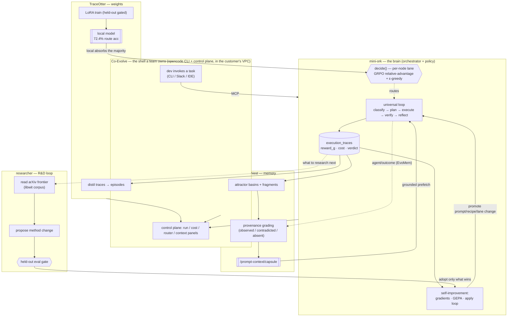

# The Co-Evolve Ecosystem — Architecture

*How five systems compose into one co-evolving AI-development layer: **Co-Evolve** (the shell), **mini-ork** (the brain), **ContextNest** (the memory), **TraceOtter** (the weights), and **researcher** (the R&D loop that mines new techniques). Compiled 2026-07-11. Grounds on the per-system detail in [`techniques-compendium.md`](techniques-compendium.md); this doc is the layer *above* — how the pieces fit and how the whole thing gets better over time.*

---

## 1. The thesis

Most AI-dev tooling is static after deployment: a harness calls a frontier model, and every run starts from zero. Co-Evolve is the opposite bet — **one system a team owns that gets structurally better the more it's used**, along two independent axes:

- **Usage flywheel** — every task run produces traces; those traces improve routing (which model), weights (a local model), and memory (grounded context). The next run is cheaper and better.
- **Research flywheel** — the system reads the AI-research frontier (arXiv), proposes improvements to *its own method*, proves each on held-out data, and adopts only what wins.

The first flywheel compounds on *your* work. The second compounds on *the entire literature*. Neither requires a human in the loop, and every change is gated + auditable.

---

## 2. The five components

| Component | Role | Repo | One-line |
|---|---|---|---|
| **Co-Evolve** | The shell / product | `ps/coevolve` (Go) | The CLI + control plane a team runs; opencode-style front-end that spawns mini-ork over MCP and renders the whole loop. |
| **mini-ork** | The brain / orchestrator | `ps/mini-ork` (bash+Python) | Task OS: classify→plan→execute→verify→reflect→improve→eval→promote, heterogeneous model lanes, GRPO routing, GEPA, the gradient + **apply loop**. |
| **ContextNest** | The memory substrate | `ps/ContextNest` (Rust) | Turns session transcripts into an attractor-basin memory field; grades every claim against real tool events; serves grounded context back. |
| **TraceOtter** | The weight arm | `ps/TraceOtter` (Python) | Distils execution traces into an SFT dataset and LoRA-trains a small local model; held-out-gated; JitRL continual design. |
| **researcher** | The R&D loop | `ps/researcher` + arxiv-libwit corpus | Reads the arXiv frontier, proposes new techniques / self-improvements, and pushes them through the same held-out gate before adoption. |

The rule of composition: **mechanics are per-system; decisions are shared.** mini-ork is the single place that decides (route, apply, promote); the others are specialized organs (memory, weights, research) it reads from and writes to.

---

## 3. Master architecture

---

## 4. How one request flows end-to-end

1. **Invoke.** A developer fires a task through **Co-Evolve** (CLI/Slack/IDE). Co-Evolve spawns **mini-ork** over MCP inside the team's own environment — no code leaves the VPC.
2. **Prefetch memory.** Before planning, mini-ork pulls a kind-ordered **capsule** from **ContextNest** (risks → decisions → failures → … → artifacts), so the run starts grounded instead of rediscovering context.
3. **Route.** For each node, `decide()` picks a model lane by learned **GRPO relative advantage** — sending the majority to the cheap **TraceOtter local model** and reserving frontier compute for the hard minority.
4. **Execute + verify.** Workers run; verifier gates enforce real evidence (no "vacuous" passes). Every step lands in `execution_traces` with cost, verdict, and a scale-free `reward_g`.
5. **Reflect + learn.** A rubric grades the run; the reflection pipeline mines **gradients** (idempotent, deduped by semantic signature); GEPA proposes prompt rewrites scored by a real **online evaluator**.
6. **Apply (the loop that just closed).** `bin/mini-ork-apply` turns the highest-confidence gradient/GEPA suggestion into a `workflow_candidate`, scores it on held-out data, passes it through a **non-regression gate**, and either promotes it (rewrites the prompt + records a version) or quarantines it. Suggest-safe by default (`MO_APPLY_ENABLED`).
7. **Feed back.** mini-ork tells ContextNest which memories it consumed and how the run turned out (`/agent/outcome`, EvoMem) — reweighting the memory field. TraceOtter distils the new traces into the next LoRA cycle.

Net: the run got cheaper (local routing), the memory got grounded (provenance-graded), and the system got a little better (an applied improvement) — all from one task.

---

## 5. Flywheel 1 — Usage (compounds on *your* work)

Three sub-loops turning on the same `execution_traces` stream:

- **Routing (mini-ork):** GRPO relative-advantage per `(objective_domain, task_class, node_type, code_region)` group, recency-weighted, shrinkage-damped. `preferred_lane` shifts toward whichever lane beats its peers → cheaper routing over time.
- **Weights (TraceOtter):** traces → action-grounded route labels + MemP skills → redact/quality-gate → single-epoch LoRA on Qwen3-4B → **gate on held-out route accuracy, not train loss** (72.4% vs 0% base). JitRL will make this continual (frozen model + additive logit memory, ~30× cheaper, no forgetting).
- **Memory (ContextNest):** transcripts → attractor basins + fragments; every self-reported claim **graded against real tool receipts** (a "tests passed" claim that a Bash receipt contradicts is down-weighted). Retrieval score = `cosine · decay · kind · density · trust`; EvoMem outcome feedback nudges what surfaced.

The **apply loop** is what makes these *act*: without it, all three merely *diagnose*. With it, a learned improvement becomes an applied prompt/recipe/lane change through a non-regression gate.

## 6. Flywheel 2 — Research (compounds on *the literature*)

This is the **researcher** organ — the second, rarer flywheel:

1. **Read the frontier.** The researcher queries the arxiv-libwit corpus (~147K papers) for techniques relevant to the system's own weak spots (surfaced by the trace scorecard: which recipe/node underperforms).
2. **Propose a method change.** A concrete, scoped self-improvement — a new routing rule, a workflow mutation, a dedup strategy, a reward shape — grounded in a specific paper.
3. **Gate it.** The *same* held-out eval gate the apply loop uses. A proposed change is adopted only if it beats the current method on held-out data — **every change traceable to the paper it came from.**
4. **Adopt.** Winners flow into mini-ork's self-improvement machinery (as a candidate → promote), exactly like a usage-derived gradient.

The two flywheels share one gate and one apply path — the research loop is "just another source of candidates," which is why the whole thing stays auditable and non-regressive. *(Build order: the eval gate is the prerequisite for both — see the arxiv-driven-R&D-loop and eval-in-run-flow research docs.)*

---

## 7. The contracts between organs

- **mini-ork ⇄ ContextNest:** prefetch (`cn_retrieve`, `/prompt-context/capsule`) in; `/agent/outcome` (consumed-atoms + result) out. Side-effect-light — outcome feedback only reweights metadata retrieval already reads.
- **mini-ork ⇄ TraceOtter:** `execution_traces` are the shared substrate; TraceOtter reads them, trains, and publishes a local model the router dispatches to.
- **mini-ork ⇄ researcher:** the trace scorecard says *what to research*; the researcher returns *candidate method changes* that re-enter the promote pipeline.
- **Co-Evolve ⇄ everything:** MCP to mini-ork; read-only panels over all three organs' state (run/cost/router/context/memory). The one process a customer runs.

All decisions route through mini-ork's `decide()`/apply/promote — so the policy is **shared once** across consumers (eng-team, book-gen, …) via `objective_domain` partitioning, while each organ's mechanics stay native.

---

## 8. Deployment & sovereignty

The whole ecosystem runs **inside the customer's environment/VPC**: traces, memory, and the tuned local model never leave. Frontier calls (the hard minority) route through the customer's *own* provider account — no third-party proxy. This is the moat that is also a compliance unlock: the per-customer trace corpus + tuned weights make leaving costly (revert to day-1 frontier pricing on months of retraining), and air-gapped operation satisfies the regulated-DACH mandate. (Positioning detail: `internal-docs/strategy/`.)

---

## 9. Honest state (what's real vs in-flight)

- **Real + shipped:** mini-ork loop + GRPO routing; ContextNest basins + provenance grading + EvoMem feedback; TraceOtter distil→LoRA at 72.4% held-out; the **learn→apply loop (merged 2026-07-11)** so GEPA/gradients now actually change prompts; Co-Evolve control-plane wiring.
- **Designed, not yet wired:** TraceOtter JitRL continual learning; the researcher R&D flywheel is ~70% existing mini-ork parts but its held-out eval gate for method-changes must be built first; ContextNest's elegant "neural-field/resonance" canon layer is largely dormant (basins are live, the deeper field theory is scaffolding).
- **Modeled, not proven on a customer:** the 84% token-cost reduction and quality-parity numbers are internal modeling / held-out, not yet validated on an external workload.

The line to hold: this is an *outer system* — general, memory-backed, multi-lane, self-improving, deployable — whose *inner* self-improvement loop just became real. The compounding curve is the gating artifact; everything above exists to make that curve go up on both usage and research.

---

# Appendix A — Technique deep dives (worked examples)

*Each deep dive has three parts: **the product story** (what it buys the customer — say this to a VC), **the mechanism** (the real code, `file:line`), and **a worked example** (real numbers walked through). These are the load-bearing techniques; if a technical partner asks "but how does it actually work," this is the answer.*

---

## A1 — How routing picks a model lane (cost-aware contextual bandit)

> **Naming note (accuracy):** the code and older docs call this "GRPO," but it is a **cost-aware contextual bandit**, not the GRPO algorithm. GRPO samples G responses from *one trainable policy* and does a gradient weight update; routing here picks *one lane* per task among *heterogeneous closed-API models* (no shared weights, no gradients) and updates a table. It borrows exactly one idea from GRPO — the group-relative baseline — and, since PR #163, supplements it with a persistent single-sample baseline so it no longer even needs a group. See `internal-docs/research/2026-07-11-cost-efficient-grpo-learning.md`.

### The product story
Every coding task runs through several steps (plan, implement, review, verify). For each step, the system decides **which model to use** — a cheap local model, a mid-tier one (Kimi/MiniMax), or a frontier one (Opus/Codex). Instead of a human hard-coding "use GPT for review," the system **learns, from your own runs, which model is actually best at each kind of step on your codebase** — and it keeps adapting as models and prices change. The result: work steadily shifts to whichever model wins on *your* work, cutting cost while holding quality, with nobody tuning anything.

The subtle-but-crucial part (and the part a technical VC will appreciate): it **compares models head-to-head on the same task**, not on their raw scores. A model that only ever gets handed easy tasks would look great on absolute score; grading it *relative to the other models on the identical task* cancels out task difficulty, so a model is only credited when it genuinely beats its peers. That's the "GRPO" (Group-Relative) idea, borrowed from RL post-training and applied to model routing.

### The mechanism
Entry path: `mini_ork/cli/execute.py` (`_mo_policy_route_lane`, policy `MO_ROUTING_POLICY=learning_governed`) → `_mo_learning_governed_lane` (`:347`) → `decide()` (`lib/decision_service.sh:80`) → `lane_router_preferred_lane` → `mini_ork/lane_router.py::preferred_lane` (`:286`). The learning itself is `recompute_advantages` (`lane_router.py:31`), run during reflect.

The computation (`lane_router.py:117-283`), per the reward signal `reward_g` (a scale-free, direction-normalized run quality in `[−1,+1]`):
1. **Group** every past trace by `(objective_domain, task_class, node_type, code_region)` — traces that competed on the *same kind of work* (`:132`). Groups of 2+ get a within-group relative advantage; **single-lane runs are no longer skipped** — since PR #163 they update a persistent per-slice baseline (`lane_slice_baseline`, SPO-style) and score `advantage = reward − running_slice_mean`, so the router learns from ordinary 1× runs, not only from panel/bake-off slices (gated by `MO_ROUTER_SINGLE_SAMPLE`, default on).
2. **Weighted group mean** `wmean` with a **14-day recency half-life** so stale evidence fades (`:127-129, 147`).
3. **Per-lane advantage** = `lane_mean − wmean` (`:164`) — the lane's average minus the group's average. Positive = beats its peers on this slice.
4. **Cost tie-break**: when quality is flat (all scores equal), add a small bonus to the *cheaper* lane (`0.1 − 0.2·normalized_cost`, `:150-155`).
5. **Shrinkage** `n/(n+5)` damps low-sample lanes so a lane doesn't win on one lucky run (`:166`).
6. **EMA blend** with the prior value (`α=0.30`, `:217-226`) so the policy moves smoothly, not jerkily.
7. **Decayed defect penalty**: a lane that caused a bug in a code region gets a time-decaying penalty *for that region* (`:185-215`).
8. Results are written to three tables at increasing specificity: `lane_region_advantage`, `lane_domain_advantage`, `agent_performance_memory`.

At routing time, `preferred_lane` (`:286`) selects a lane that has enough samples (`MO_LEARNING_MIN_SAMPLES=3`), cascading **region → domain → global** (`:295-330`) — most specific track record first, then falls back. Since PR #163, selection is **UCB** (`z_score_advantage + C·√(2·lnN/n)`, `MO_ROUTER_UCB_C` default 0.5) rather than raw argmax, so an under-sampled promising lane can be tried over a marginally-better well-sampled one (`MO_ROUTER_UCB_C=0` restores the legacy argmax). Cold-start safe: if nothing clears the floor, it returns empty and `decide()` uses the configured default lane (never invents one). Exploration also lives in `decide()`: an **ε-draw** (10%) that, when the bandit is on, reroutes to the **least-sampled** eligible lane (highest uncertainty) instead of uniform-random. Every routing decision can log its propensity (`route_source/route_explore/route_score`), and `scripts/router_replay_eval.py` replays the logs to check the new selector beats the legacy rule (measured +0.09 win-rate on the current corpus).

This is a **contextual bandit**, not GRPO or off-policy RL: there is no importance-sampling correction, because off-policy estimators (IPS/DR) are unreliable under near-deterministic logging (2509.00648). The UCB exploration is what gradually buys the counterfactual coverage instead.

### Worked example
Task: `code_fix`, step: `implementer`, domain: `code-delivery`. Over the last 14 days three lanes ran this step across many task instances. On each instance the lanes are graded *relative to each other*; here is one representative instance's rubric-normalized `reward_g` plus the 14-day aggregate:

| Lane | avg reward_g (its runs) | group mean (all lanes) | advantage = lane − group | samples | after shrinkage ×n/(n+5) |
|---|---:|---:|---:|---:|---:|
| **minimax** | 0.667 | 0.50 | **+0.167** | 12 | +0.167 × 12/17 = **+0.118** |
| **codex** | 0.625 | 0.50 | +0.125 | 7 | +0.125 × 7/12 = +0.073 |
| **kimi** | 0.125 | 0.50 | −0.375 | 6 | −0.375 × 6/11 = −0.205 |

After the EMA blend with last cycle's values, `agent_performance_memory` holds roughly: minimax **+0.11**, codex +0.07, kimi −0.20. Next time an `implementer` node fires on a `code_fix` task, `preferred_lane` runs `SELECT … ORDER BY relative_advantage DESC` with `runs_count ≥ 3` → **minimax wins**, and the node dispatches to minimax. If minimax and codex had *tied* on quality, the cost tie-break would send it to whichever is cheaper. If minimax had recently caused a bug in `src/auth/`, the region penalty would down-weight it *for that module only*, and codex might win there while minimax still wins elsewhere.

**Why the VC cares:** this is the mechanism behind "cost falls while quality holds, and it compounds." Nobody wrote a routing table; the system derived it from the customer's own traces, and it self-corrects weekly. That per-customer routing policy *is* the moat — a competitor can copy the idea but not the months of your traces it was trained on.

---

## A2 — How gradients turn failures into fixes

### The product story
The system watches its own agents work and, when something goes wrong, **writes down the fix in plain English** — e.g. "the reviewer is approving code without reading the files; make it cite evidence before giving a verdict." It generates thousands of these observations, **dedupes them into a handful of real lessons**, and (via the apply loop, A4) tests and applies the good ones — so the system's own prompts get better over time **without a human editing them**. To a customer: "it debugs and improves itself, and every improvement is traceable to the runs that motivated it."

### The mechanism
A "gradient" is a **textual improvement signal** (TextGrad-style), stored in `gradient_records`: `{target, signal, suggested_change, confidence, evidence(trace_id)}`. The Python reflection pipeline (`mini_ork/cli/reflect.py` + `mini_ork/learning/reflection_pipeline.py`) does: **extract** (an LLM reads low-reward traces and proposes 0–5 gradients each) → **dedup** → **cluster** → hand off to the apply loop.

Three properties that make it production-safe (shipped 2026-07-11):
- **Idempotent extraction:** a per-trace watermark in `mini_ork/learning/gradient_extractor.py` skips any trace already mined and excludes framework-internal `__reflect__` traces — so re-running reflect over an overlapping window doesn't re-generate the same gradient. (Before this fix: 9,777 gradients from only 1,603 traces — a 6× duplicate pile.)
- **Semantic-signature dedup** (`mini_ork/learning/reflection_pipeline.py`): near-identical gradients that differ only in trace-specific noise (durations like "2.7min", costs like "$1.62", trace-ids) are normalized to a **semantic signature** and collapsed. This is why 172 differently-worded "reviewer must cite evidence" observations become **one** lesson.
- **Confidence + evidence:** each gradient carries a 0–1 confidence and the trace-ids that produced it, so the apply loop can rank and audit.

### Worked example
Real gradients pulled from a live DB, all targeting `agent.reviewer.prompt`:

| signal (what the system observed) | suggested_change (the fix, in plain English) | confidence |
|---|---|---:|
| "Reviewer issued ESCALATE after 2.7min/$1.62 with files_read=[]" | "Require the reviewer prompt to emit a structured evidence block (files_inspected[], diff_hunks) before any verdict." | 0.95 |
| "Reviewer returned needs_revision with zero files_read and zero tool_calls" | "Reviewer prompt must mandate explicit file inspection before a verdict." | 0.92 |
| "Reviewer returned a pass verdict despite reading no files" | "Require the reviewer to cite concrete evidence from the changed files/diff/tests." | 0.92 |

There were ~57 more phrased differently. The dominant, high-confidence theme is a single real bug — **agents giving verdicts without reading the code** ("theater"). Semantic dedup collapses all ~60 into one lesson: *"reviewer must cite evidence before verdict."* That one deduped, high-confidence gradient is what flows into the apply loop (A4), gets tested on held-out reviews, and — if it doesn't regress — rewrites the reviewer prompt to require an evidence block.

**Why the VC cares:** this is a self-debugging system with an audit trail. It found, in its own logs, the exact failure mode ("reviewers not reading the code") that a human would take weeks to notice, and it fixes it under a gate. The diagnosis quality is high; the apply loop (A4) is what turns diagnosis into a shipped improvement.

---

## A3 — How GEPA improves a prompt (reflective evolution)

### The product story
Beyond one-line fixes, the system can **rewrite an entire prompt** for a role (say, the planner) by looking at where it failed and proposing a better version — then keeping the new prompt **only if it measurably beats the old one** on held-out tasks. It's cheaper than RL fine-tuning (a handful of evaluations, not thousands of rollouts) and every accepted change is proven, not hoped.

### The mechanism
`mini_ork/optimize/gepa.py` (Genetic-Pareto reflective optimizer). Loop: keep the best prompt on a Pareto front → draw a minibatch → build a "reflective dataset" from the failures → an LLM (real lane via `MO_OPTIMIZER_MODEL`, default minimax) proposes a rewrite of one component → **strict-improvement gate on the minibatch**: keep only if `sum(new) > sum(parent)` (`:204`) → then a full eval. The fatal historical bug (fixed 2026-07-11): the evaluator could only score prompts by hash-lookup of past runs, so a *new* prompt always tied its parent and was always rejected. The fix is a real **online evaluator** `held_out_score()` that actually runs and scores the candidate — so the gate is winnable.

### Worked example
Seed reviewer prompt scores **0.61** on held-out reviews. GEPA reads the failures (the "no evidence" theme), proposes: *"…before any verdict, list the files you inspected and quote the diff hunk that supports your finding; if you inspected nothing, return REQUEST_CHANGES."* On the minibatch the new prompt scores **5.9 vs 4.5** for the parent → accepted → full eval **0.74 > 0.61** → it goes on the Pareto front. A later over-strict mutation scores **5.8 vs 6.0** → rejected, no full eval spent (that's the ~35× rollout saving vs evaluating every idea fully).

---

## A4 — How the apply loop ships a change (the loop that closes the system)

### The product story
This is what makes all of the above *real* instead of a pile of suggestions: the system takes its best learned improvement, **tests it on held-out work, checks it doesn't make anything worse, and only then applies it** — rewriting the actual prompt and recording a reversible version. It's off by default (suggest-only) so nothing changes a customer's system without the gate passing. To a VC: "it doesn't just learn — it safely ships its own improvements, with a non-regression guarantee and a rollback."

### The mechanism
`bin/mini-ork-apply` + `lib/apply.sh` (migration `0048_apply_attempts`): **pick** the highest-confidence candidate (from `pattern_records` / `emergent_patterns` / `gradient_records`, matched by task_class/role) → **materialize** a `workflow_candidates` row → **score** it (online eval `held_out_score`, or a mock in tests) → **non-regression gate** (`apply_evaluate_gate`: promote only if `utility_after ≥ utility_before`; else quarantine) → **promote** = rewrite the prompt file + write a `version_registry` row (reversible), or **quarantine** with an audited reason. Guards: `MO_APPLY_ENABLED` (master switch, default OFF), `MO_APPLY_DRY_RUN` (write nothing), `MO_APPLY_NONREGRESSION_DELTA` (how much regression, if any, is tolerable).

### Worked example
The deduped gradient from A2 ("reviewer must cite evidence") is picked. A candidate reviewer prompt is materialized. The online evaluator scores it **0.74** vs the current prompt's **0.50** baseline → `utility_delta = +0.24 ≥ 0` → **promoted**: the reviewer prompt file is rewritten to require an evidence block and a `version_registry` row is recorded. If the same evaluator had instead scored the candidate **0.35** (a regression), the gate returns **quarantined** with the rationale "non-regression failed (0.35 < 0.50)", the prompt is left untouched, and the attempt is logged for audit. Net: a failure the system observed in its own logs became a proven, reversible prompt improvement — automatically, under a gate.

**The whole chain, in one line for the pitch:** *a run fails → the system writes down why (gradient) → dedupes thousands of these into one real lesson → GEPA/apply proposes a fix → it's proven on held-out work under a non-regression gate → the prompt is rewritten and versioned → the next run is better.* That is the compounding curve, mechanized.
