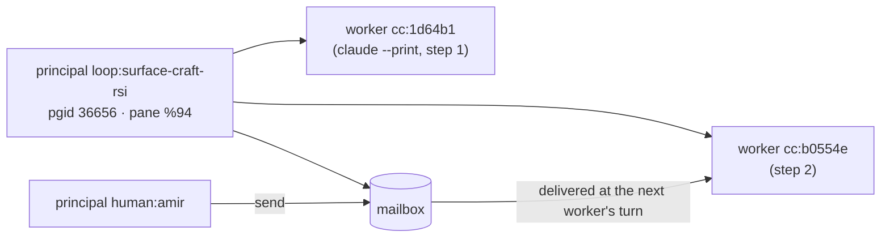

# Concord — cross-agent coordination protocol

Concord lets independent agents notice that they overlap — the same files, shared
settings, the same work — and get them arranged on **every turn**, not just at
start-up. It works with any harness: Claude Code, codex, opencode, mini-ork node
workers, or a shell loop that spawns short-lived workers.

The authority is **ContextNest** (`/api/v1/coord/*`, default
`http://127.0.0.1:28080`). mini-ork ships the client (`mini-ork concord …`).

This document pins the **P0 wire contract**: identity (principals and worker
bindings) and principal-addressed messaging. Later phases (intents, footprints,
change feed, conflicts) extend it; they do not change P0.

## Why principals

A *session* is the wrong unit of identity. Loop workers are short-lived
`claude --print` processes whose session ids change every step, and an
interactive session gets a new id after a restart. Messages and claims
addressed to a session are lost when it exits.

A **principal** is the stable "who": a loop, a mini-ork run, an operator's
session lineage, a human. Workers bind to a principal, and they inherit it
through the `CONCORD_PRINCIPAL` environment variable, which every child
process gets for free.



## Principal ids

`<kind>:<name>`. The kind is one of `loop`, `run`, `session`, `human`, `agent`.
The name matches `[A-Za-z0-9._@/-]{1,128}`. Full regex:

```text
^(loop|run|session|human|agent):[A-Za-z0-9._@/-]{1,128}$
```

## Endpoints (ContextNest, prefix `/api/v1/coord`)

| Method + path | Body | Success | Errors |
|---|---|---|---|
| `PUT /principals/{principal_id}` — upsert **and** heartbeat | `PrincipalUpsert` | `200 {"principal": Principal, "unacked_messages": int}` | `400` bad id |
| `GET /principals?status=active\|all` (default `active` = live + idle) | — | `200 {"count": int, "principals": [Principal]}`, newest `last_seen` first | — |
| `GET /principals/{principal_id}` | — | `200 Principal` | `404` |
| `DELETE /principals/{principal_id}` — mark ended (mailbox and bindings are kept) | — | `200 Principal` (status `ended`) | `404` |
| `PUT /bindings/{worker_id}` — bind a worker (session id, pid tag, …) to a principal; rebinding replaces | `{"principal_id": str, "pid": int?}` | `200 Binding` | `404` unknown principal |
| `GET /bindings/{worker_id}` | — | `200 Binding` | `404` |
| `POST /principals/{principal_id}/messages` | `{"from": str, "body": str}` (body 1–8192 bytes) | `201 Message` | `404` unknown principal, `400` empty or oversized body |
| `GET /principals/{principal_id}/messages?unacked=true` | — | `200 {"messages": [Message]}`, oldest first | `404` |
| `POST /principals/{principal_id}/messages/{msg_id}/ack` — idempotent | `{"by": str}` | `200 Message` | `404` |

Ids in paths are URL-encoded (`loop%3Asurface-craft-rsi`).

### Shapes

```jsonc
// PrincipalUpsert — every field optional; absent fields keep their stored value
{ "harness": "shell|claude-code|codex|opencode|mini-ork|other",
  "host": "mac-mini", "cwd": "/abs/path", "worktree": "/abs/path" ,
  "pgid": 36656, "pids": [36656, 61062], "tmux_pane": "%94",
  "kill_recipe": ["kill -TERM -36656"], "priority": 0,
  "labels": {"parent": "loop:outer"} }

// Principal — server-computed fields marked *
{ "principal_id": "loop:surface-craft-rsi", "kind": "loop",   // kind* from the id prefix
  "harness": "shell", "host": "mac-mini", "cwd": "…", "worktree": null,
  "pgid": 36656, "pids": [36656, 61062], "tmux_pane": "%94",
  "kill_recipe": ["kill -TERM -36656"], "priority": 0, "labels": {},
  "started_at": "RFC3339",   // * first upsert, or the upsert that re-opens an ended principal
  "last_seen":  "RFC3339",   // * every upsert
  "ended_at":   null,        // * set by DELETE, cleared by a later upsert
  "status": "live|idle|stale|ended" }  // * computed on read (below)

// Binding
{ "worker_id": "cc:4cbe6fa5-…", "principal_id": "loop:…", "pid": 11408, "bound_at": "RFC3339" }

// Message
{ "msg_id": "M-42", "principal_id": "loop:…", "from": "human:amir", "body": "…",
  "created_at": "RFC3339", "delivered_at": null, "delivered_to": null,
  "acked_at": null, "acked_by": null }
```

### Status

Evaluated at read time, in order:

1. `ended` if `ended_at` is set.
2. `live` if `now − last_seen ≤ TTL`. TTL comes from `CONTEXTNEST_COORD_PRINCIPAL_TTL_SECS`, default 90.
3. `idle` if past the TTL, but the principal's `host` is the server's host and any of
   its `pids` is still alive (`kill(pid, 0)` succeeds or returns `EPERM`).
4. `stale` otherwise.

Liveness comes from **activity**. A client heartbeats by re-sending the upsert,
so a server restart heals within one heartbeat interval.

### Persistence

Principals, bindings and messages persist in SQLite at `CONTEXTNEST_COORD_DB`
(default: `coord.db` next to the WAL file). Leases stay ephemeral, as they are
today.

## Client — `mini-ork concord`

| Command | Behaviour |
|---|---|
| `concord run --name N [--kind loop] [--heartbeat-secs 30] -- CMD…` | Starts `CMD` in a new process group with `CONCORD_PRINCIPAL=<kind>:N` in its env. Registers the principal (harness `shell`, host, cwd, git worktree, pgid, live pids, `$TMUX_PANE`, kill recipe `kill -TERM -<pgid>`). Heartbeats every interval, forwards SIGINT/SIGTERM to the group, ends the principal on exit, and exits with `CMD`'s code. **Fail-open:** if ContextNest is unreachable it warns once on stderr, runs `CMD` anyway, and keeps retrying registration on each heartbeat. |
| `concord ps [--all] [--json]` | Table of PRINCIPAL, STATUS, AGE, LAST SEEN, PGID, PIDS, PANE, CWD, UNACKED. |
| `concord stop P [--signal TERM\|KILL] [--yes]` | Kills P's process group (`os.killpg`). Refuses if the pgid is missing or ≤ 1, is the caller's own pgid, or the principal's host is not this host. Without a tty it requires `--yes`. Ends the principal afterwards. |
| `concord send P MESSAGE… [--from F]` | `from` defaults to `$CONCORD_PRINCIPAL`, else `human:$USER`. |
| `concord inbox [--principal P] [--format text\|json\|prompt] [--ack]` | P defaults to `$CONCORD_PRINCIPAL`. `prompt` renders a compact block a loop can prepend to its next worker prompt. `--ack` acks what was shown. |
| `concord ack P MSG_ID` | |

Exit codes: `0` ok, `2` usage, `3` ContextNest unavailable (except `run`, which
fails open), `4` refused (for example, `stop` safety checks).

Base URL: `CN_BASE_URL` (default `http://127.0.0.1:28080`), the same variable
`mini_ork/cn_client.py` already uses.

## P0b — the per-turn hook (shipped)

ContextNest's ingest hooks run their curl in the background, so their responses
never reach Claude. Concord adds a **synchronous** hook on SessionStart and
UserPromptSubmit: `POST /api/v1/coord/turn`, with a 2 s client timeout and
`|| true`. It always returns 200.

| Step | What happens |
|---|---|
| Resolve | Use `X-Concord-Principal` (`$CONCORD_PRINCIPAL`). Otherwise use the **lineage** `session:p<pane>@<repo>`, where `%94` becomes `p94` and `<repo>` is the basename of the nearest `.git` ancestor; then `session:tty-<tty>@<repo>`; then `session:<session_id>`. |
| Bind | Upsert and heartbeat the principal, then bind `worker_id = session_id` to it. |
| Deliver | Claim the principal's undelivered messages **at most once** (per-row compare-and-swap) and return them as `hookSpecificOutput.additionalContext`. Acks stay explicit. |

The lease plane's pretool gate uses the bound principal as the lease
`agent_id`, so a restarted worker in the same lineage still owns its leases.

Every `mini-ork run` registers itself as `run:<run_id>` and exports
`CONCORD_PRINCIPAL`, so the node workers it spawns are attributed to the run. An
outer principal, such as a loop wrapped by `concord run`, becomes `labels.parent`.

## P1 — the pre-action stale-premise check

Evidence first. The P0.5 replay (`scripts/concord_replay.py`) ran over 14 days of
transcripts: 60.7k file events and 1,157 candidate overlaps. Three raters
(κ ≥ 0.93) labelled a 40-incident sample:

| Signal | Precision |
|---|---|
| Raw rules (concurrent write, stale read, logical overlap) | 30% |
| The same, after same-principal and Edit-protected-index filters | 43% |
| **An agent is about to edit a file that another principal changed since this agent last read it** | **100% (7/7)** |

So P1 interrupts **only** on that last signal, at the moment of action. This
follows CoAgent (arXiv:2606.15376): notify, don't lock or abort; the agent judges
whether the change breaks its plan. Everything weaker goes to a batched digest.

| Endpoint | Hook | Behaviour |
|---|---|---|
| `POST /api/v1/coord/footprints` | PostToolUse (async) on Read/Edit/Write/MultiEdit/NotebookEdit | Records `(principal, worker, op, path, mtime_ns, size, seq)`; the server stats the file |
| `POST /api/v1/coord/precheck` | PreToolUse (sync) on Edit/Write/MultiEdit/NotebookEdit | Warns if a write to the path exists from a principal outside P's lineage after P's latest footprint on it. It is advisory **context only** and never sets `permissionDecision`. In Claude Code, `"allow"` would skip the user's permission prompt, so it must never be returned |

**P1b — disk truth.** Some writers leave no footprint: shell redirects, `sed -i`,
scripts, editors, formatters, `git checkout`, humans. When P1 finds no recorded
foreign writer, the precheck compares the newest footprint on the path (its
`mtime_ns`/`size`) with the file on disk. If they differ, it adds one paragraph:
"changed on disk after the last change any agent recorded … Re-read it before
editing" ("was deleted on disk" when the file is gone). A 2 s grace window
absorbs the lag of the caller's own async footprint. Configuration:
`CONTEXTNEST_CONCORD_DISK_CHECK=0` turns the check off;
`CONTEXTNEST_CONCORD_DISK_GRACE_MS` sets the grace window. The metric is
`coord_precheck_unrecorded_total`.

**How this layers with Claude Code's own guard.** Claude Code validates an Edit
against its own read state *before* PreToolUse hooks run. If `old_string` no longer
matches, or the file is "modified since read", the Edit is refused, and Concord
never sees that attempt. If `old_string` still matches, the stale Edit **applies**,
with only a note after the fact. That is the case Concord's precheck flags, and it
names the writer. Harnesses without a read-state guard (codex, opencode, mini-ork
lanes, scripts) depend on Concord's precheck alone. They call the same HTTP
contract.


## P2 — hot set, claimed scope, admission, digest (shipped)

P2 adds control where the evidence says it pays. Each check ships **advisory-first**,
because deterministic gates measurably cost task completion and tokens
(arXiv:2602.11416). The stricter modes are operator switches. No Concord hook ever
answers `permissionDecision: "allow"`.

| Piece | Where | What it does | Modes |
|---|---|---|---|
| **Hot-set claims** | ContextNest precheck + footprints | A write to shared live config (`.mini-ork/config/**`, `secrets*.sh`, `providers.yaml`, `agents.yaml`, `.claude/settings*.json`, `.env*`, `db/migrations/**`) claims it for the writer for 600 s, renewed by its lineage. Another principal about to edit it gets a 🔒 notice | `CONTEXTNEST_CONCORD_HOT_MODE` = `warn` (default) \| `ask` \| `deny` |
| **`--owns` enforcement** | ContextNest precheck | `make worktree` registers `agent:wt-<slug>` with its claimed paths. An edit inside a worktree but outside its claim gets a ✋ notice and is recorded | `CONTEXTNEST_CONCORD_OWNS_MODE` = `audit` (default) \| `ask` \| `deny` |
| **Per-turn digest** | ContextNest turn hook (UserPromptSubmit) | Lists, at most once each and capped at 5 lines, files other agents changed since your last turn that you had touched. It never interrupts | `CONTEXTNEST_CONCORD_DIGEST=0` silences it |
| **Epic admission** | mini-ork scheduler pre-dispatch hook | `mini-ork concord admit` defers (exit 75) an epic whose kickoff's **Files in scope** overlap an epic already in progress. It is read-only and fails open | opt in: `MO_SCHED_PRE_DISPATCH_HOOK="mini-ork concord admit"` |

When modes compose, the strictest wins (deny > ask > notice). Operator views:
`mini-ork concord ps` (who is running), `concord claims` (who holds hot files), and
`concord violations` (out-of-scope edits).

## P3 — topic overlap (shipped, off by default)

File checks miss two agents **working on the same thing** before their files
collide. That was the original incident: two RSI loops improving the same surface.

- On each UserPromptSubmit, ContextNest embeds the prompt as the principal's
  current **intent**. This runs off the hook's critical path.
- The caller's stored intent is compared with other live intents. Live means: not
  ended, not in the caller's lineage, and updated within
  `CONTEXTNEST_CONCORD_TOPIC_WINDOW_SECS`.
- With `CONTEXTNEST_CONCORD_TOPIC=1` and cosine ≥ `…_TOPIC_THRESHOLD` (0.85), the
  next turn gets one line, at most once per pair per `…_TOPIC_DEDUP_SECS`:
  `[concord] ↔ <other> may be working on the same thing: "…" (similarity 0.87)`.

Semantic intent matching is low-precision in the literature: 27.9% in
arXiv:2604.16339. So notices are opt-in. Calibrate first: `GET
/api/v1/coord/topic-pairs?min=0.5` lists live pairs and their similarity whether
notices are on or off. `GET /api/v1/coord/intents` shows the captured text. Both
return raw prompt text (up to 500 chars); keep the substrate on localhost or the
tailnet.

## P4 — alone versus combined at merge (shipped)

When the green gate fails after `make worktree-merge` rebased onto a moved
`origin/main`, the merge reruns the same test command on the branch's pre-rebase
commit, in a throwaway worktree. The verdict is one of:
- `SEMANTIC CONFLICT: the branch passes alone … fails combined with N upstream
  commit(s)` (it names them);
- `the branch also fails alone`.

`MO_MERGE_DIFFERENTIAL=0` skips the rerun.

## Live smoke

`scripts/concord_live_smoke.py --cn-bin <contextnest>` drives an isolated
substrate (its own port, data dir and throwaway HOME) with real `claude -p`
sessions, the `mini-ork concord` CLI, worktrees and runs. Every scenario asserts on
server state: principals, deliveries, footprints, claims, violations, metrics, and
file contents. `--only 2,2b` reruns a subset. Run it after changing a Concord
endpoint or the installed hooks.

| Scenario | Proves |
|---|---|
| S0 | `ingest claude-code --install-hooks --project-path` writes the turn, precheck and footprint hooks to the project only |
| S1 | A message sent to `loop:<name>` reaches the **next** short-lived worker the loop spawns (the handover incident) |
| S2a/S2b | Stale premise: Claude Code (the precheck flags the stale Edit, or Claude refuses it) and a guard-less harness over HTTP (warns, names the writer, clears after re-read) |
| S2c/S2d | A writer Concord never sees (a shell append), over HTTP and live: P1b flags it |
| S3 | The per-turn digest lists a file another agent changed |
| S4 | Hot-file claim plus warn |
| S5, S6 | `--owns` audit; after a restart, claims persist and deny mode blocks a hot edit and an out-of-scope write, but allows an in-scope new file |
| S7, S8 | A `mini-ork run` registers `run:<id>` for its children; `concord admit` defers an overlapping epic |
| S9 | Hook round trip p95 < 50 ms |
| S11 | Topic overlap: two loops with the same task are told about each other, and an unrelated loop is not |
| S10 | With the substrate down, the wrapper and Claude sessions fail open |

Last full run: **18/18** against ContextNest `1c09ee3` (2026-10-03). Hook round
trip p95 was 5 ms. With the production embedder (Qwen3-Embedding-0.6B), S11
scored the same-task loops 0.997 and the unrelated loop 0.71 against both. The
default local embedder scores *any* two English prompts 0.73–0.97, so topic
notices must never be turned on without a real embedder. One open P3 weakness:
an intent is the principal's **latest** prompt (≥ 20 chars). That works for loop
workers, whose prompt is the task, but in an interactive session a status
question replaces the work topic.

The smoke surfaced three Claude Code behaviours a harness must design around:
- Edit validation precedes PreToolUse.
- `--permission-mode acceptEdits` lets a model fall back to shell writes, which leave no footprint (P1b exists because of this).
- Models put long `sleep`s in the background, so ordering uses file barriers instead of timing.

## Roadmap

| Phase | Adds |
|---|---|
| P0.5 | ✅ Offline replay + labelled precision (see above) |
| P1 | ✅ Footprints + pre-action stale-premise check; ✅ P1b disk truth for writers Concord never sees |
| P2 | ✅ Hot-set claims, `--owns` enforcement, per-turn digest, epic admission (see above). Still open: publish-gate validation of the `main` ref |
| P3 | ✅ Topic overlap through live intents (opt-in, calibrate first). Still open: ack, escalate and freeze arbitration; attributing Bash writes to a principal |
| P4 | ✅ Alone-versus-combined test validation at merge |

Design rationale and literature: see the Concord design note (2026-10-02 coordination
technique review, 1000 papers, three independent reviewers).
