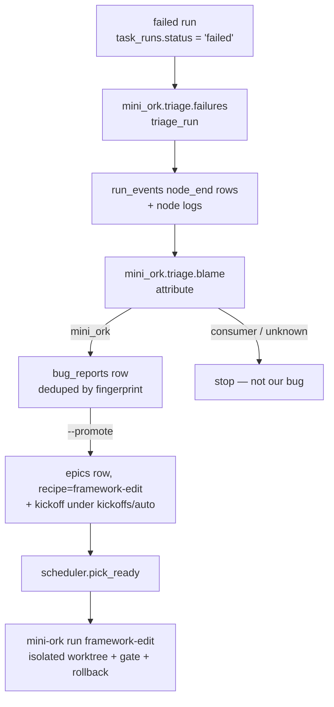

# Failure triage — a failed run becomes a queued self-edit fix

Every run that fails is classified: **is this mini-ork's own bug, or the
consumer's?** When it is mini-ork's, the failure is filed as a bug report and —
opt-in — promoted to a `framework-edit` epic that the scheduler fixes in an
isolated worktree. The point is to replace "a run broke, go read its logs by
hand" with a queued, kickoff-driven fix.

## Why it exists

Diagnosing a failed run by hand is a recurring token sink, and it recurs every
time a run breaks. The failure already carries its own evidence — the node that
died, its `finish_reason`, and its log — so the classification can be automated
and the fix handed to machinery that already exists.

## The pipeline



The bug → epic → scheduler → run pipeline already existed. What was missing was
a **producer**: nothing emitted a bug report when a run *itself* failed. Triage
is that producer.

## Blame rules

Attribution is fail-closed to `unknown`; the first matching rule wins.

| Signal | Verdict | Why |
|---|---|---|
| `finish_reason` in `verdict_fail` / `verdict_revise` | `consumer` | a legitimate "the artifact is wrong" verdict, not a bug |
| `error` **and** traceback frames inside `mini_ork/**` or a shipped `recipes/*/verifiers/*` | `mini_ork` | the crash is in our code |
| failing node path outside the mini-ork tree (run-local overlay, consumer recipe) | `consumer` | the caller's code |
| `timeout`, `cost_limit`, `interrupted`, provider/auth error (401, bad model) | `unknown` | infra, not a code bug |
| anything else | `unknown` | no evidence to blame anyone |

`finish_reason='error'` is a catch-all — it covers harness crashes *and* legit
capability failures — so it can never decide blame alone. The traceback frames
are the only reliable discriminator.

Framework frames are matched by **path shape**, not by the triager's checkout
root: runs execute from linked worktrees and vendored copies, so the failing
frame is almost never under the root of the process doing the triage.

## CLI

```bash
mini-ork triage --run <run_id> [--promote] [--dry-run] [--json]
mini-ork triage --latest
```

Exit codes mirror `certify`'s scriptable contract:

| Code | Meaning |
|---|---|
| 0 | blamed on mini-ork — a fix is warranted |
| 2 | usage error / no run given |
| 3 | consumer or unknown blame — no fix |

`--dry-run` prints the blame, the evidence rules, and the would-be kickoff, and
writes nothing. `--promote` files the bug report and queues the `framework-edit`
epic.

## Automatic triage on failure

Off by default (double opt-in). In the run's fail branch `execute` calls triage
only when:

- `MO_FAILURE_TRIAGE=1` — enable attribution + bug filing.
- `MO_FAILURE_TRIAGE_PROMOTE=1` — additionally promote to a schedulable epic.
  Separate flag on purpose: **emitting is safe, spending budget is not.**

Triage is best-effort — it can never raise into the run that just failed.

## Guards

- **Dedupe:** bug reports key on a `sha256` fingerprint of
  `recipe | node | finish_reason | first error line`, so the same failure
  recurring N times reuses one row instead of inflating `frequency`.
- **Kill switch:** drop a sentinel at `${MINI_ORK_HOME}/state/.triage-kill` to
  stop filing without editing env vars on every launcher (mirrors
  `.self-improve-kill`). Diagnosis still works — only the write is suppressed.
- **Budget / concurrency:** the fix epic is dispatched by the scheduler, which
  already honours the daily budget and `MO_SCHED_MAX_PARALLEL`.

## Files

| File | Role |
|---|---|
| `mini_ork/triage/blame.py` | pure attribution: `NodeFailure` → `(blame, evidence)` |
| `mini_ork/triage/failures.py` | I/O driver: read a failed run, attribute, file/promote |
| `mini_ork/cli/triage.py` | the `mini-ork triage` subcommand |
| `mini_ork/observability/bug_report.py` | `bug_report_promote(..., recipe=)` — recipe-aware kickoff |
| `mini_ork/cli/execute.py` | the `MO_FAILURE_TRIAGE` hook in the fail branch |
