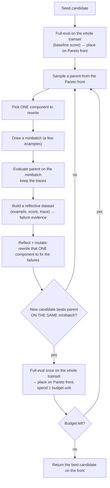
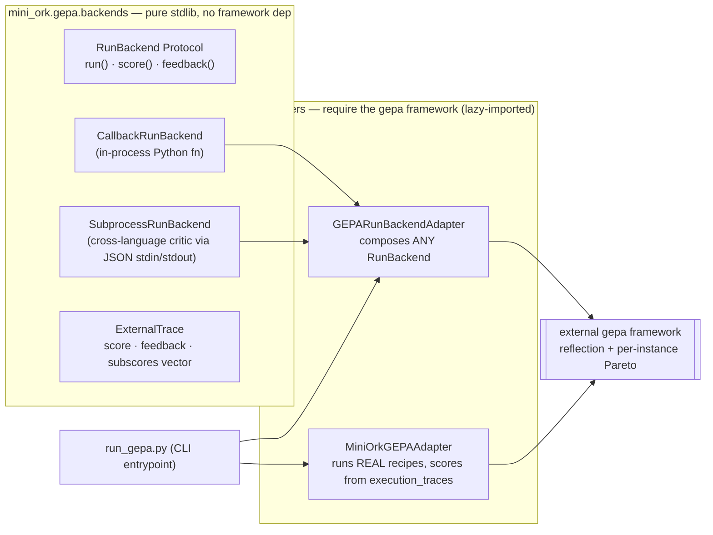

# GEPA in mini-ork — reflective prompt optimization, explained simply

*What GEPA does in mini-ork: the problem it solves, the steps of its loop, and how
it plugs into real run outcomes — with a full worked example. Live code:
`mini_ork/gepa/`. Paper: Agrawal et al., 2025, [arXiv:2507.19457](https://arxiv.org/abs/2507.19457).*

---

## What GEPA is, and what it fixes

**GEPA** stands for **Genetic-Pareto**. It is a **prompt** optimizer, not a model-weight
optimizer. Its job: rewrite the prompt of a role (say, a code-reviewer prompt) so the
output quality goes up.

The usual way to improve model behavior is reinforcement learning (RL / GRPO), which
needs **thousands of rollouts** and whose only signal is a bare scalar reward. GEPA's key
idea:

> Natural language is a far richer learning medium than a numeric reward. Instead of
> distilling a scalar gradient from thousands of rollouts, let a model **look at the
> failures, reason about them, and rewrite the prompt** — and keep only the change that
> actually did better.

The result: quality on par with or better than RL, at a small fraction of the rollouts.

---

## How GEPA works in general (independent of mini-ork)

GEPA optimizes "compound language programs" — systems built from several model calls with
several prompts. Three ideas, which its name comes from:

**1. Reflective — learn from language, not just a number.** RL distills a gradient from a
scalar reward. GEPA instead keeps the **whole textual execution trace** — the model's
reasoning, tool calls, error messages, evaluator feedback — and asks a model to read it,
diagnose **why** it failed, and fix the prompt. Language carries more signal than a lone
number.

**2. Genetic — a population, mutation, and merge.** GEPA maintains a *population* of prompt
variants. New variants come from two operators: **mutation** (a reflective rewrite of one
component) and **merge/crossover** (combining the complementary lessons of two variants
that each learned a different thing well).

**3. Pareto — keep diversity, not just "the best."** This is the key trick. If you keep
only the single best candidate, diversity dies and you get stuck in a local optimum. GEPA
instead keeps a **Pareto front**: variants that are each best on at least **one training
instance**. Each iteration's parent is sampled from that front, so diverse "specialist"
strategies stay alive and can be recombined later.

**Paper result:** quality on par with or better than RL (GRPO), but with up to **35× fewer
rollouts** — reflecting over a handful of runs is far cheaper than thousands of RL
rollouts. For multi-module programs, GEPA can even attribute *which module's prompt* to
fix (module-level credit assignment).

---

## Two core concepts

**1. Candidate.** A prompt, expressed as a dict of "components". For example:

```json
{
  "reviewer_system": "You are a code reviewer. Find the bugs.",
  "reviewer_rubric": "Correctness, readability, tests."
}
```

Each key is a component that can be rewritten independently.

**2. Pareto front.** The set of best-so-far candidates. Rather than "keep the single
highest average", the front keeps a candidate if it is best on *any* individual training
instance — that is what preserves diversity. mini-ork delegates the front to the external
`gepa` framework, which maintains it **per-instance** across the trainset.

---

## The GEPA loop, step by step



The critical steps:

- **One component per iteration** is deliberate — it makes the effect of each change
  legible ("which rewrite actually helped?").
- **The strict-improvement gate** is the heart of the savings: a mutated candidate is
  scored on the *same* minibatch as its parent, and only a candidate that **beats the
  parent on that minibatch** is promoted to a full evaluation. A rejected mutation never
  pays for a full eval.

### Why this is cheap

"Budget" caps the number of full evaluations (`--budget` = `max_metric_calls`). Only
**accepted** mutations pay for a full eval. With most mutations rejected at the minibatch
gate, you spend a handful of minibatch evals plus a few full evals — the "~35× fewer
rollouts" claim versus testing every mutation on the whole trainset.

---

## How GEPA plugs into mini-ork

mini-ork composes the external `gepa` framework through a small, dependency-light seam.
There is one engine (`mini_ork/gepa/`) with two ways in:



- **`backends.py`** is the bring-your-own-evaluator seam and is **pure stdlib** — it imports
  even without `pip install gepa`. A `RunBackend` has three jobs a caller can supply:
  `run(candidate, task) → ExternalTrace`, `score(trace) → float` (the 0..1 scalar GEPA
  optimizes), and `feedback(trace, score) → str` (the natural-language diagnosis GEPA
  reflects on). `CallbackRunBackend` wraps an in-process Python function;
  `SubprocessRunBackend` shells out to any command (any language) that reads
  `{"candidate", "task"}` JSON on stdin and prints `{"score", "feedback"}` as the last
  non-blank line of stdout.
- **Fail-loud contract (zero fallback):** a non-zero exit, unparseable stdout, a missing
  `score`, or a `score` outside `[0, 1]` raises `EvaluatorError`. A broken evaluator halts
  the run rather than silently scoring `0.0` and poisoning the Pareto front with a fake
  gradient.
- **`GEPARunBackendAdapter`** (in `generic_adapter.py`) composes *any* `RunBackend` into the
  framework's adapter interface and forwards the critic's own NL feedback verbatim into the
  reflection prompt — that unmodified diagnosis is the highest-signal input GEPA has.
- **`MiniOrkGEPAAdapter`** (in `miniork_adapter.py`) is the recipe specialization: it
  optimizes a recipe's node prompt files (`recipes/<recipe>/prompts/*.md`) and scores from
  **real downstream outcomes** in `execution_traces` (status + verifier + tests-passed,
  plus a `completion_honesty` signal so a run that claims done but fails is penalized). Each
  candidate is evaluated in a *copied* recipe dir, so the real recipe is never mutated
  during search.
- **`ExternalTrace.subscores`** is an optional per-objective vector (e.g. per-violation
  class) the evaluator may return. GEPA optimizes the scalar `score`, and the vector is
  preserved for richer multi-objective feedback.

### Running it

`run_gepa.py` is the CLI entrypoint, with two modes:

```bash
# RECIPE mode — optimize a recipe's node prompts, scored on real runs:
python -m mini_ork.gepa.run_gepa \
    --recipe code-fix --task-class code_fix \
    --trainset kickoffs/gepa/code-fix/*.md \
    --reflection-lm anthropic/opus \
    --budget 40 --out recipes/code-fix/prompts.gepa-proposed

# EXTERNAL mode — optimize ANY seed prompt against ANY external critic
# (no recipe, no state.db). The critic reads {candidate,task} JSON on stdin,
# prints {score, feedback} on stdout:
python -m mini_ork.gepa.run_gepa \
    --seed-file seed_prompt.json \
    --eval-cmd "node dist/eval-c4.js" \
    --trainset fixtures/*.json \
    --reflection-lm anthropic/opus \
    --budget 30 --out out/gepa-c4
```

Both modes execute **real work (real spend)**; `--budget` caps evaluations. Because GEPA is
sample-efficient (~35× fewer than RL), a budget of 20–50 is a sensible start. Install the
optimizer extra with `pip install "mini-ork[optimize]"` (its base install is
dependency-free — the framework's heavy deps sit behind its own extras).

---

## A full worked example

Suppose we want to improve the **code-reviewer** prompt for `task_class = code_fix`.

**Seed candidate:**
```json
{ "reviewer_system": "You are a code reviewer. Say whether the code is OK or not." }
```

**Step 0 — baseline.** Over 20 past `code_fix` runs, this prompt's mean reward = **0.61**.
It goes onto the front.

**Iteration 1:**
- Parent = the seed. Chosen component = `reviewer_system`.
- Minibatch = 8 runs. Parent's score on those 8 = **4.5** total.
- The **reflective dataset** from the traces says: "In 3 cases the reviewer approved the
  code but the tests actually failed; the reviewer never checked the tests." (This comes
  from `verifier_output`.)
- **Reflection** proposes:
```json
{ "reviewer_system": "You are a code reviewer. Before approving anything, verify the
  relevant tests ran and passed; if there is no evidence tests ran, reject and state which
  test is needed." }
```
- **Gate (same 8 examples):** the new candidate scores **5.9** > 4.5. ✅ Accepted.
- **Full eval:** over all 20 runs, mean = **0.74**. It takes a place on the front and
  displaces the old parent. One full eval spent.

**Iteration 2:**
- Parent = the new version (0.74). Component = `reviewer_system`.
- Feedback this time says the reviewer has become too strict and rejects correct code too.
- Reflection proposes a rewrite that "only rejects when there is evidence of a failure".
- **Gate:** new minibatch score = 5.8, but the parent was 6.0 → **worse**. ❌ Rejected. No
  full eval spent.

**Iterations 3 & 4:** similar; say one is accepted and reaches 0.77, one is rejected.

**Final output:** the best candidate at **0.77** (up from the 0.61 baseline) plus the list
of accepted mutations. Total cost: 4 minibatch evals + 2 full evals — not 4 full evals.

---

## Three-line summary

1. GEPA improves prompts by **looking at failures and rewriting reflectively**, not by
   thousands of RL rollouts.
2. The savings come from only paying for a full evaluation on mutations that **first beat
   the parent on a minibatch** (strict-improvement gate + Pareto front).
3. In mini-ork, one engine (`mini_ork/gepa/`) composes the external `gepa` framework: bring
   any critic via `backends.py`, or optimize a recipe's prompts on real runs via
   `MiniOrkGEPAAdapter` — the winning prompt is a proposal that a promotion gate decides
   whether to apply.

*For line-by-line detail, read `mini_ork/gepa/backends.py`, `generic_adapter.py`,
`miniork_adapter.py`, `run_gepa.py`, and section A9 of `techniques-compendium.md`.*
