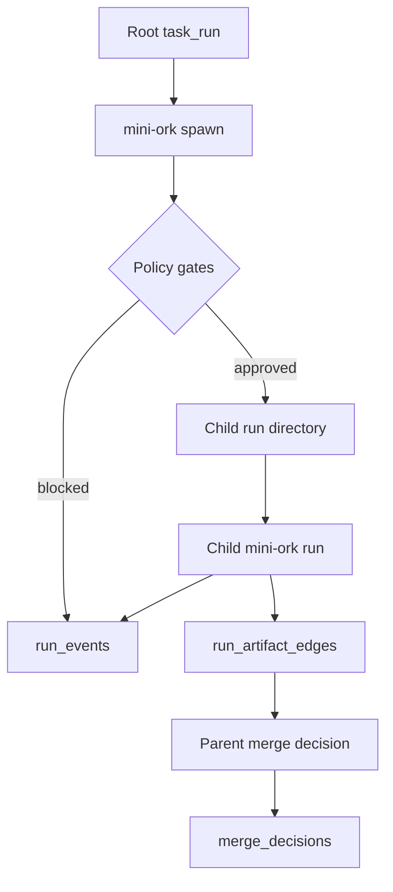

# Recursive Orchestration

Recursive orchestration lets one mini-ork run delegate bounded child mini-ork
runs while preserving parent ownership, auditability, and merge control.

## Control Plane



The parent run is always the authority boundary. A child can produce evidence,
plans, and artifacts, but the parent decides whether anything is merged or
published.

## Runtime Layout

```text
.mini-ork/runs/<parent-run>/
  children/<child-run>/
    kickoff.md
    worktree/
    artifacts/
```

The child executes from `worktree/`, but it shares the same `MINI_ORK_HOME` and
`state.db` so lineage and event records stay queryable from the root.

## Default Limits

| Policy | Env var | Default |
|---|---|---:|
| Max depth | `MINI_ORK_RECURSIVE_MAX_DEPTH` | 2 |
| Max children per parent | `MINI_ORK_RECURSIVE_MAX_CHILDREN` | 4 |
| Max descendants per root | `MINI_ORK_RECURSIVE_MAX_DESCENDANTS` | 16 |
| Max running children per parent | `MINI_ORK_RECURSIVE_MAX_PARALLEL` | 4 |
| Child can spawn descendants | `--allow-child-spawn` | false |

Authority level defaults to `0.3`: the child may draft work in an isolated
workspace. `1.0` is blocked by default because full autonomy needs an explicit
human approval gate.

## CLI

```bash
mini-ork spawn \
  --parent-run run-root-123 \
  --kickoff child.md \
  --recipe code-fix \
  --child-run run-child-001 \
  --allow-child-spawn
```

Use `--no-execute` to reserve lineage without running the child.

## Python

```python
from pathlib import Path
from mini_ork import MiniOrk, SpawnRequest

result = MiniOrk().spawn(
    SpawnRequest(
        parent_run_id="run-root-123",
        kickoff=Path("child.md"),
        recipe="code-fix",
        child_run_id="run-child-001",
        allow_child_spawn=True,
    )
)
```

## Validation

Replay the recursive proof without external provider calls:

```bash
bash tests/integration/test_bin_spawn.sh
bash tests/security/test_sec_recursive_spawn_limits.sh
bash tests/e2e/test_e2e_recursive_orchestration.sh
PYTHONPATH=. python3 tests/live/recursive_live_validation.py
```
