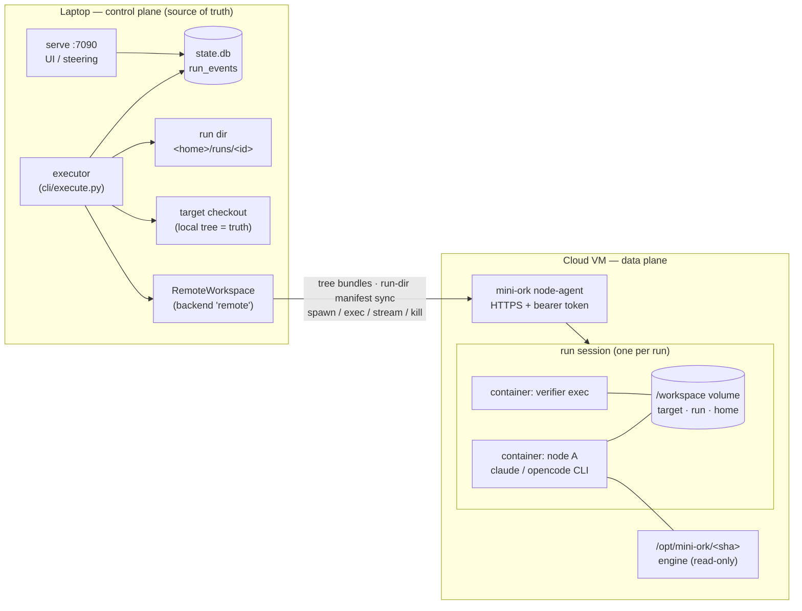

# Remote node execution — local control plane, cloud data plane

> Status: proposed (2026-10-01). A concrete profile of
> [`cloud-swarm.md`](cloud-swarm.md): it delivers the G5 "remote Workspace" knob
> without waiting on managed-sandbox credentials, by running a small
> `mini-ork node-agent` on any Linux VM you control. Epic set:
> [`kickoffs/remote-nodes-roadmap.md`](../../kickoffs/remote-nodes-roadmap.md).

## Goal

Run a mini-ork DAG's **nodes** on a remote machine while the **control plane**
(executor, `state.db`, run dir, UI, steering, publisher) keeps running on the
laptop. A node on the remote side sees the target code exactly as it would
locally, does its job, and its edits and artifacts land back in the local
checkout and run dir as if it had run locally.

**Test of done:** the same `mini-ork run code-fix <kickoff>` that works locally
completes with `--placement remote --env <profile>`, its diff appears in the
local checkout, its verifier ran on the remote host, and no host path appears in
any remote argv, env, or prompt.

## Topology



Traffic only goes **laptop → VM**. The laptop needs no inbound port, so it can
sit behind NAT or sleep. If it sleeps, the in-flight node keeps running and the
next node waits (D7).

## Decisions

**D1 — The local tree is the truth; the remote tree is a replica.** Around 20
host-side git operations run in the executor against the local target:
- the baseline (`execute.py:1482-1540`)
- the ground-truth harvest (`:1543`)
- the review diff (`:2012`)
- rollback (`execute_handlers.py:1077-1262`)
- the publisher commit (`publisher.py:124-130`)

Moving every one of those behind a remote exec would be a rewrite. Instead the
replica is synced at dispatch boundaries (§Sync protocol), and these operations
keep running unchanged on the local tree after each sync-down. Two side
benefits: push credentials never leave the laptop, and the semantics stay
identical to a local run.

**D2 — One remote session per run.** The run's volume is the pet; containers are
cattle. Today `core.py:270-274` calls `ws.up()`/`ws.down()` around every spawn,
which creates a fresh container per node, per retry and per fallback lane. A
run-scoped session is created on first use, reused by every node and retry, and
torn down at run end. It is also torn down on SIGTERM and by the TTL reaper.

**D3 — Transport: a self-hosted `mini-ork node-agent`.** It is a small FastAPI
service (FastAPI and uvicorn are already dependencies of `serve`) running on
the VM. It drives the *local-to-it* `DockerWorkspace`, so bind mounts are
correct by construction. Any VM works: Hetzner, a tailnet box, or Oracle's free
tier. Managed sandboxes (E2B, Modal, Daytona) are later backends behind the
same Workspace conformance suite (cloud-swarm P6). They are not prerequisites.

**D4 — Fixed in-sandbox roots, one translation seam.**

| Host root | In-sandbox path | Mode |
|---|---|---|
| target tree (pinned at run start, epic 01) | `/workspace/target` | rw |
| run dir `<home>/runs/<id>` | `/workspace/run` | rw |
| agent home (CLI config, transcripts) | `/workspace/home` | rw, per run |
| `MINI_ORK_HOME/config` subset | `/workspace/mo-home` | ro |
| engine (mini-ork source at the control plane's git sha) | `/opt/mini-ork` | ro |

Translation happens in exactly one place, `_spawn_in_workspace`
(`dispatch/core.py:243`), through a `PathMap`. It covers:
- cwd and argv
- env values
- prompt text and `--mcp-config` contents

It generalizes the recursive-spawn translator `_host_to_container`
(`cli/spawn.py:311`). Under `remote`, any absolute host path left after
translation is a **loud failure**, never a silent pass-through.

**D5 — What runs where** (under `--placement remote`):

| Work | Where | Why |
|---|---|---|
| classify, transform, eval nodes, gate *decisions* | local, in-process | no tree access |
| tool-less HTTP lanes (`openai-chat`, `uhp`) | local | no tree access, no benefit |
| every CLI spawn from `dispatch_model` (implementer, researcher, reviewer, lenses, planner on `anthropic-compat`/`anthropic` lanes) | remote | the CLI is agentic and reads/edits the tree |
| DAG verifier scripts, post-run `success_verifiers`, step_rules git | remote | need the toolchain and the tree |
| baseline, harvest, review-diff, rollback, publisher commit | local | D1 — run on the local tree after sync-down |
| state.db, run_events, UI, steering, cost accounting | local | control plane |

**D6 — Secrets are resolved locally and injected per process.** The control
plane resolves only the keys the selected lane needs and sends them in the
spawn request's env over the authenticated channel. The node-agent keeps them
in process memory only: never on disk, and redacted from its logs. Git and
GitHub credentials are never sent, because sync and push are local (D1).

**D7 — Disconnect-tolerant processes.** A remote process is detached. The
node-agent buffers its stdout and stderr to disk with byte offsets. The client
streams with offsets and re-attaches after a network drop, a laptop sleep or a
control-plane restart, using the `proc_id` persisted in `state.db`. Recovery
re-attaches to, or harvests, a remote process that is still running or already
finished, rather than re-dispatching it.

**D8 — Engine version pinning.** Transports (`codex_transport.py`,
`opencode_transport.py`, `openai_chat_transport.py`) and verifier scripts are
mini-ork code. The node-agent hosts engines keyed by git sha under
`/srv/mini-ork/engines/<sha>` and mounts the one matching the control plane at
`/opt/mini-ork`. A sha mismatch triggers an automatic engine upload: a git
bundle of the control plane's `MINI_ORK_ROOT` HEAD. It is never a silent skew.

## Sync protocol (target tree)

The protocol uses git snapshots, so git (not a model) computes every diff.

1. **Snapshot (either side).** Use a temporary index:
   `GIT_INDEX_FILE=<tmp> git add -A` respects `.gitignore`. Then apply the
   secret-pattern excludes (`.env*`, `*.pem`, `id_rsa*`, `*.tfvars`,
   `secrets.local.sh`), run `git write-tree`, and run
   `git commit-tree -p <HEAD>`. The result is a snapshot commit whose tree is
   the exact working tree, including untracked non-ignored files. It is stored
   at `refs/mo/sync/<run>/<side>/<seq>`.
2. **Initial upload**, using the same fallback ladder as `claude --cloud`
   bundles:
   1. full history (`git bundle create --all` plus the snapshot) if under
      `MO_REMOTE_BUNDLE_MAX_MB` (default 100)
   2. otherwise the current branch only
   3. otherwise a squashed orphan snapshot

   The remote checks out local `HEAD` detached and makes its worktree equal the
   snapshot tree. That way `git status` inside the agent shows the same
   uncommitted changes as locally.
3. **Sync-up** before a remote spawn or exec, only if the local snapshot tree
   differs from the last synced one. Send an incremental bundle
   `snap ^last_synced`.
4. **Sync-down** after a remote agent spawn, but never after a verifier exec.
   The remote takes a snapshot and the client fetches the incremental bundle.
   - **Precondition:** the current local snapshot tree equals the base the
     remote started from. If not, the node fails with
     `failure_class=sync_conflict`. The remote snapshot stays fetchable at
     `refs/mo/remote/<run>/<node>`, and the local tree is never clobbered.
   - **Apply:** `git diff --binary <base> <remote_snap> | git apply` onto the
     local worktree. HEAD and the index are not touched.
   - **Postcondition:** the local snapshot tree sha equals the remote snapshot
     tree sha.
5. **Remote HEAD moved** (the agent committed). The tree delta still arrives as
   uncommitted changes, so the publisher sees the same tree. The remote commits
   are fetched to `refs/mo/remote/<run>/head`, and a `remote.head_moved` event
   is emitted.

## Run-dir mirror

A manifest-diff mirror (relative path + sha256) between the local run dir and
`/workspace/run`. **Up** before a remote spawn or exec: all changed files
except executor-owned logs and streams. This is deliberately general, so recipe
prompts that read `${MINI_ORK_RUN_DIR}/lens-*.md` keep working. **Down** after
it: files created or changed remotely. The control plane wins on a both-sides
change, and that change is logged. A size cap applies, and anything over it is
skipped with an event. `state.db` is never mirrored.

## Node-agent API (v1 sketch)

```
GET    /v1/health                         → {version, engine_shas, docker, capacity}
PUT    /v1/engines/{sha}                  (git bundle body) → installs engine
POST   /v1/sessions                       {run_id, image, profile, resources} → {session_id}
DELETE /v1/sessions/{sid}                 (down; volume kept until TTL)
POST   /v1/sessions/{sid}/tree/bundle     (upload bundle + snapshot ref)
GET    /v1/sessions/{sid}/tree/snapshot   ?base=<sha> → incremental bundle + snap sha
POST   /v1/sessions/{sid}/files/manifest  → remote manifest; PUT/GET …/files (tar)
POST   /v1/sessions/{sid}/procs           {argv, env, cwd, stdin, timeout_s} → {proc_id}
GET    /v1/sessions/{sid}/procs/{pid}     → {state, rc, started_at, ended_at}
GET    /v1/sessions/{sid}/procs/{pid}/stream ?out=<off>&err=<off>   (chunked / SSE)
POST   /v1/sessions/{sid}/procs/{pid}/kill
POST   /v1/sessions/{sid}/exec            (sync convenience: argv, cwd, timeout → rc, output)
```

Auth is `Authorization: Bearer <token>` on every route. By default the
node-agent binds to a tailnet or loopback address. It refuses `0.0.0.0`
unless TLS is configured.

## Configuration

`config/nodes.yaml` (control plane; tokens via env, never inline):

```yaml
nodes:
  hetzner-1:
    url: https://hetzner-1.tailnet-xyz.ts.net:7091
    token_env: MO_NODE_TOKEN_HETZNER_1
    max_sessions: 4
```

`config/environments/<name>.yaml`:

```yaml
node: hetzner-1
image: mini-ork/agent-node:latest      # docker/agent-node/Dockerfile
setup: |                               # runs once; cached as an image layer by hash
  apt-get update && apt-get install -y nodejs npm
  pip install -e /workspace/target[test]
env: { PIP_DISABLE_PIP_VERSION_CHECK: "1" }
secrets: [ANTHROPIC_AUTH_TOKEN, CLAUDE_CODE_OAUTH_TOKEN]   # names, resolved locally per lane
network: full                          # full | allowlist
allow_domains: [api.anthropic.com, pypi.org, files.pythonhosted.org, github.com]
resources: { cpus: 2, memory: 4g }
```

Run selection: `mini-ork run <recipe> <kickoff> --placement remote --env <name>`
(or `MO_PLACEMENT=remote MO_NODE_ENV=<name>`). The default stays `local`, which
is byte-for-byte today's behaviour (A1 delivery-safety constraints).

## Failure modes

| Failure | Behaviour |
|---|---|
| node-agent unreachable at session up | run fails fast with `failure_class=remote_unavailable`; no silent local fallback |
| network drop mid-node | client retries stream with offsets; process keeps running remotely |
| control plane dies mid-node | `mini-ork recover <run>` re-attaches by persisted `proc_id`; harvests if finished |
| remote process killed / VM lost | node fails `failure_class=infra_interruption`; durable-DAG retry re-provisions |
| local checkout edited during remote node | `sync_conflict`; remote snapshot kept at `refs/mo/remote/<run>/<node>` |
| engine sha mismatch | auto engine upload; refuse if upload fails |
| `kill_run` from UI/CLI | kills every remote process of the run, then session down |

## Security posture (v1)

- Single-tenant: one operator, one token per node. Multi-tenant auth is out of
  scope, the same as cloud-swarm's non-goal.
- The node-agent is a remote-code-execution service by design. Bind it to a
  tailnet, require a token, and require TLS for a public address.
- Sandboxed processes get no state.db and no host home. `MO_REMOTE_NODE=1` is
  set. Recursive child spawn is disabled remotely
  (`MINI_ORK_ALLOW_CHILD_SPAWN=0`) until cloud-swarm S2 lands.
- Secrets live only in the env, per process (D6). Snapshots exclude
  secret-named files (§Sync protocol step 1).

## Test provider (prices checked 2026-10-01, excl. VAT)

| Option | Spec | Price | Fit |
|---|---|---|---|
| **Hetzner CX33** (recommended) | 4 vCPU, 8 GB, x86 | €8.49/mo, **€0.0136/h** | hourly billing → create per test session, destroy after; Docker works; **no nested virt** (microVM backend unavailable — node-agent uses Docker) |
| Hetzner CX23 | 2 vCPU, 4 GB | €5.49/mo, €0.0088/h | enough for one session at a time |
| Hetzner CAX11 (ARM) | 2 vCPU, 4 GB | €5.99/mo | arm64 image needed |
| Oracle Cloud Always Free | Ampere A1, 2 OCPU / 12 GB (halved Jun 2026) | $0 | free but capacity-limited signup; arm64 |
| E2B (managed, later) | per-second sandboxes | $0.000014/vCPU-s ≈ $0.05/vCPU-h; $100 one-time credit | Hobby caps sessions at **1 h** — too short for long nodes; needs its own backend |
| Modal (managed, later) | per-second sandboxes | $30/month free credit | good for a later managed backend |

Hetzner's CX/CAX prices rose about 30–40% on 2026-06-15. These are the
post-increase prices. Primary IPv4 is billed separately; an IPv6-only server
plus Tailscale avoids that charge. Per vCPU-hour, CX33 (≈ €0.0034) costs about
1/15 of E2B CPU alone.

## Non-goals (v1)

- Remote recursive spawn and detached child runs (cloud-swarm S2).
- Network-backed shared drive (S3). The run volume lives on one node-agent
  host per run.
- Multi-tenant auth, per-user quotas, cross-host fleet scheduling (S5).
- Mid-turn steering into a running remote agent. Steering is still read at node
  start from the local DB, which works unchanged.
