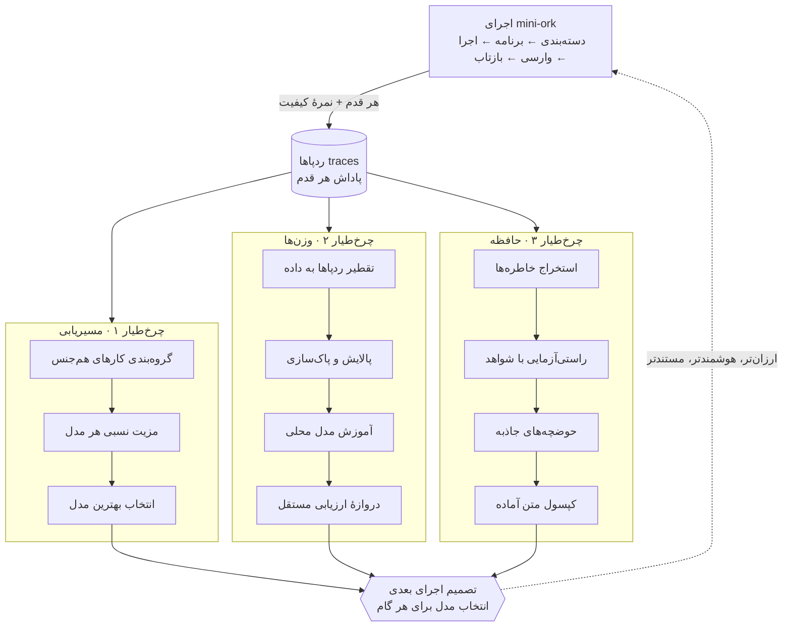

# راهنمای سیستم: mini-ork · TraceOtter · ContextNest

*یک توضیح روان و قابل‌فهم از کل سامانه و تکنیک‌هایی که در آن به‌کار رفته است. هدف این است که کسی که کد را نخوانده هم بتواند تصویر کامل و درست از «چطور این سیستم یاد می‌گیرد» به‌دست بیاورد. جزئیات دقیق‌تر و ارجاع خط‌به‌خط کد در نسخهٔ انگلیسی (`techniques-compendium.md`) آمده است.*

---

## تصویر کلی: سه سیستم، یک حلقه

کل سامانه از سه بخش تشکیل شده که روی یک جریان مشترک از «ردپاها» (traces) کار می‌کنند:

- **mini-ork** — مغز و ارکستریتور (هماهنگ‌کننده). کارها را دسته‌بندی می‌کند، برنامه می‌ریزد، اجرا می‌کند، وارسی می‌کند، و مهم‌تر از همه **یاد می‌گیرد که هر کار را به کدام مدل بسپارد**.
- **TraceOtter** — بازوی «آموزش وزن‌ها». از روی کارهایی که قبلاً انجام شده، یک مدل محلی کوچک را **آموزش** می‌دهد تا ارزان‌تر و اختصاصی‌تر شود.
- **ContextNest** — حافظهٔ بلندمدت. گفتگوها و اجراها را به «خاطره» تبدیل می‌کند، صحت هر ادعا را با شواهد واقعی می‌سنجد، و در اجرای بعدی این حافظه را در اختیار مغز می‌گذارد.

**حلقهٔ اصلی:** یک کار اجرا می‌شود ← ردپای هر قدم ثبت می‌شود ← ContextNest از آن حافظه می‌سازد و TraceOtter از آن مدل آموزش می‌دهد و mini-ork سیاست مسیریابی‌اش را به‌روز می‌کند ← همهٔ این‌ها به تصمیم بعدی برمی‌گردند. سه «چرخ‌طیار» (flywheel) که همه روی یک جریان داده می‌چرخند: **مسیریابی، وزن‌ها، حافظه**.

---

## بخش الف — mini-ork: هماهنگی و یادگیری مسیریابی

### حلقهٔ جهانی کار

هر کار از یک زنجیرهٔ ثابت عبور می‌کند: **دسته‌بندی ← برنامه‌ریزی ← اجرا ← وارسی ← بازتاب ← بهبود ← ارزیابی ← ترفیع**.

- **دسته‌بندی (classify):** با اسکن کلیدواژه/الگو تشخیص می‌دهد این کار از چه «نوعی» است (مثلاً رفع باگ، ویرایش سند، تحقیق).
- **برنامه (plan):** یک نقشه با «معیارهای موفقیت» می‌سازد که وارسی بعداً آن‌ها را چک می‌کند.
- **اجرا (execute):** گام‌ها را به مدل‌ها می‌سپارد و هر گام را به‌عنوان یک «ردپا» ثبت می‌کند.
- **وارسی (verify):** اسکریپت‌های سنجش را اجرا می‌کند. نکتهٔ مهم: اگر هیچ شاهدی تولید نشود، نتیجه «پوچ» (vacuous) علامت می‌خورد، نه «قبول» — یعنی سیستم به «تئاتر تست» باج نمی‌دهد.
- **بازتاب (reflect):** از ردپاها درس می‌گیرد و سیاست مسیریابی را بازمحاسبه می‌کند.
- **بهبود/ارزیابی/ترفیع:** حلقهٔ آفلاین تکامل؛ نسخه‌های بهتر پیشنهاد، سنجش و در صورت برتری «ترفیع» می‌شوند.

**نمرهٔ کیفیت درون هر اجرا:** بعد از اجرا، یک روبریک ۸ موردی به کار نمره می‌دهد و آن نمره روی همهٔ ردپاهای آن اجرا به‌عنوان «پاداش» ثبت می‌شود. یعنی سیستم به‌جای «قبول/رد» ساده، **کیفیت** را یاد می‌گیرد.

### خطوط مدل (lanes) و مسیریاب

هفت خانوادهٔ مدل در دسترس است (opus، sonnet، codex، deepseek، glm، kimi، minimax). هر «نقش» (برنامه‌ریز، پیاده‌ساز، داور، وارسی‌کننده…) به یک مدل نگاشت می‌شود. برای پنل‌های چندنظره از خانواده‌های متفاوت استفاده می‌شود تا نظرها هم‌بستگی کاذب پیدا نکنند.

### قلب یادگیری: مسیریابی به سبک GRPO

این مهم‌ترین تکنیک mini-ork است. ایده ساده اما قدرتمند است: **هر مدل را با هم‌گروهی‌هایش روی «همان کار» مقایسه کن، نه به‌طور مطلق.**

- **گروه** = مجموعهٔ ردپاهایی که روی کار یکسانی رقابت کرده‌اند؛ کلید گروه = (حوزهٔ هدف، نوع کار، نوع گام، ناحیهٔ کد).
- **مزیت نسبی** = نمرهٔ هر مدل منهای میانگین گروه. اگر مدلی از هم‌گروهی‌هایش بهتر عمل کند، «مزیت مثبت» می‌گیرد.
- چند تعدیل مهم روی این عدد اعمال می‌شود تا پایدار بماند:
  - **وزن تازگی:** داده‌های جدیدتر مهم‌ترند (نیمه‌عمر ۱۴ روز).
  - **انقباض (shrinkage):** گروه‌های کم‌نمونه کمتر اعتماد می‌گیرند (`n/(n+5)`).
  - **میانگین‌گیری نمایی (EMA):** سیاست جدید ترکیبی از دستهٔ تازه و سیاست قبلی است تا نوسان نکند.
  - **جریمهٔ نقص:** اگر مدلی در ناحیه‌ای باگ زده، امتیازش با گذشت زمان محو می‌شود اما موقتاً جریمه می‌گیرد.

سرانجام «مدلِ ترجیحی» برای هر کار انتخاب می‌شود و این انتخاب از **ناحیه ← حوزه ← کلی** آبشاری بالا می‌رود (اول خاص‌ترین سطح، بعد عمومی‌تر). نکته: هیچ softmax یا log-sigmoid در مسیر نیست؛ «انتخاب» صرفاً بیشینهٔ مزیت نسبی است.

### پاداش: سه لایه روی هم

۱. **پاداش نرمال‌شده (`reward_g`):** جهت‌دار و بی‌مقیاس؛ `(مقدار − لنگر)/|لنگر|`. اگر لنگر صفر باشد، «بدون سیگنال» علامت می‌خورد (نه صفر) — یعنی نبود مبنا با شکست اشتباه گرفته نمی‌شود.
۲. **شکل‌دهی مبتنی‌بر وارسی:** اول پاداش فرایندی، بعد لنگر وضعیت (۰٫۸۵ موفق / ۰٫۱۵ ناموفق)، بعد رأی داور به‌عنوان تفاوت جزئی (±۰٫۱). فاصلهٔ ۰٫۵ تضمین می‌کند یک داور مغرض نتواند نتیجهٔ معلومِ خوب/بد را برعکس کند.
۳. **مدل پاداش فرایندی (PRM):** جمع وزنی سیگنال‌ها (وضعیت ۰٫۴، ابزار ۰٫۲، فایل ۰٫۱، رأی ۰٫۱۵، زمان ۰٫۱، هزینه ۰٫۰۵). یک **سقف فعالیت (۰٫۱۵)** جلوی «شلوغ‌کاری بی‌حاصل» را می‌گیرد تا کار پرسروصدای شکست‌خورده از موفقیت ساده جلو نزند (محافظ گودهارت).

### `decide()` — مغز مشترک و بدون‌حالت

یک تابع تصمیم واحد که همهٔ مصرف‌کننده‌ها آن را صدا می‌زنند و هیچ حالتی نگه نمی‌دارد. خروجی‌اش می‌گوید: کدام مدل، آیا ائتلاف داورها متنوع است، برآورد پاداش چقدر است، و راهنمای بازگشت (recursion). یک نکتهٔ مهم: **اکتشاف ε-حریصانه** — با احتمال ۱۰٪ عمداً یک مدل دیگر امتحان می‌شود تا سیستم در یک انتخاب محلی گیر نکند؛ اما فقط وقتی که قبلاً یک مسیر «یادگرفته‌شده» وجود داشته باشد (در شروع سرد، ریسک نمی‌کند).

«پارتیشن‌بندی حوزهٔ هدف» یعنی یک سیاست مشترک می‌تواند به مصرف‌کننده‌های متفاوت (تیم مهندسی، تولید کتاب، تحقیق…) خدمت بدهد بدون اینکه معیارهایشان با هم قاطی شود.

### بازتاب: «گرادیان»‌های متنی

اینجا «گرادیان» یک عدد نیست، بلکه یک **سیگنال بهبودِ متنی** است (به سبک TextGrad): «این گام از این جهت ضعیف بود، این تغییر را بده». این گرادیان‌ها استخراج، حذف‌تکرار، و در صورت تکرار در چند نوع کار، به یک الگوی «بین‌کاری» ترفیع می‌شوند.

### دروازه‌ها (gates)

مجموعه‌ای از نگهبان‌ها که جلوی خودفریبی سیستم را می‌گیرند:
- **دروازهٔ ترفیع:** یک نسخه فقط وقتی ترفیع می‌گیرد که در سنجش، هم امتیاز کافی بگیرد و هم سودمندی‌اش منفی نباشد.
- **دروازهٔ ائتلاف:** اگر نظر داورها بیش از حد هم‌بسته باشد یا از یک خانواده باشند، پنل باطل می‌شود (تنوع اجباری).
- **راستی‌آزمای ارجاع:** هر ارجاع `فایل:خط` واقعاً باید وجود داشته باشد و در محدوده باشد — جلوی «استناد جعلی» را می‌گیرد.
- **قطع‌کن مدار (circuit breaker):** اگر خروجی تکراری شد، رأی گیر کرد، یا هزینه سوخت بدون نوشتن فایل، اجرا متوقف می‌شود.

---

## بخش ب — TraceOtter: تبدیل ردپا به مدل محلی

ایدهٔ اصلی: **از روی کارهایی که واقعاً انجام شده، به یک مدل کوچک محلی یاد بده چه‌کار کند** تا در آینده بخش زیادی از کارها را ارزان و محلی انجام دهیم.

### خط لولهٔ تقطیر

لاگ‌های خام گفتگو (Claude/Codex/mini-ork) خوانده می‌شوند ← هر جلسه به یک «اپیزود» ساختارمند تبدیل می‌شود ← «مهارت»‌های تکرارشونده استخراج می‌شوند ← دروازهٔ کیفیت فیلتر می‌کند ← یک مجموعه‌دادهٔ آموزشی خروجی می‌گیریم.

### برچسب «مسیر» (route) — هدف اصلی مدل

مدل باید یاد بگیرد که برای هر کار **چه نوع اقدامی** درست است؛ پنج برچسب: «سند/بازبینی»، «ویرایش مستقیم»، «worktree»، «ارکستراسیون»، «درخواست زمینهٔ بیشتر». نکتهٔ ظریف: برچسب درست از روی **کارهای واقعاً انجام‌شده** (دستورات شل و نوع گام‌ها) استخراج می‌شود، نه از روی کلمات ورودی — وگرنه سنجش دورانی و بی‌معنا می‌شد.

### مهارت‌ها — حافظهٔ رویه‌ای (الهام‌گرفته از MemP)

یک «مهارت» یک الگوی رویه‌ای تکرارشونده است (مثلاً «جست‌وجو سپس ویرایش» یا «تست بعد از پیاده‌سازی»). معیار اعتبار، **تعداد اپیزودهای متمایز** است که آن الگو در آن‌ها دیده شده، نه تعداد کل تکرار. هر مهارت یک شرطِ فعال‌شدن، یک رویه، یک قرارداد وارسی، منبع، و یک عدد اطمینان دارد.

### پاک‌سازی و کیفیت

- **حذف اسرار:** کلیدها، توکن‌ها و مسیرهای شخصی **در لحظهٔ پارس** پاک می‌شوند تا هرگز وارد دادهٔ آموزشی نشوند.
- **دروازهٔ کیفیت:** اپیزودهای خالی، پرنویز، شکست‌خورده، تکراری یا بیش‌ازحد بلند حذف می‌شوند.
- **پالایش شواهدمحور (A/B):** به‌جای حذف کورکورانه، با/بدون گروه مشکوک ارزیابی می‌شود و فقط وقتی حذف توصیه می‌شود که معیار روی دادهٔ کنارگذاشته بدتر نشود.

### آموزش LoRA و انضباط «تک‌دوره»

مدل پایه یک مدل کوچک (Qwen3-4B) است و با روش LoRA فقط بخشی از وزن‌ها تنظیم می‌شود. یک درس مهم اینجا هست: **آموزش چنددوره‌ای روی دادهٔ تقطیرشده باعث «فراموشی فاجعه‌بار» می‌شود** (افت توانایی، تکرار، حلقهٔ فکری). برای همین فقط **یک دوره** آموزش می‌دهیم؛ همین برای انتقال سبک و مهارت کافی است و توانایی پایه حفظ می‌شود.

### دروازهٔ واقعی: دقت مسیر روی دادهٔ کنارگذاشته

معیار قبول/رد **دقت مسیر روی دادهٔ دیده‌نشده** است، نه کاهش خطای آموزش. چون خطای آموزش می‌تواند پایین بیاید در حالی‌که رفتار مدل بدتر شود. در ارزیابی واقعی، هر نمونه دو بار اجرا می‌شود: یک‌بار با مدل پایه، یک‌بار با آداپتور — و می‌سنجیم که آیا مدلِ تنظیم‌شده واقعاً بهتر شده. عدد واقعی: مدل پایه ۰٪ (اصلاً قالب مسیر را تولید نمی‌کند) و مدل تنظیم‌شده حدود **۷۲٪** روی داده‌ای که در آموزش ندیده — همان «۷۲٫۴٪» که نقل می‌شود.

### طراحی یادگیری پیوسته (JitRL)

نقشهٔ آینده: به‌جای آموزش مکرر و گران، یک «حافظهٔ سه‌تایی» از (حالت، اقدام، پاداش) نگه داریم و با یک **به‌روزرسانی بستهٔ لاجیت** روی مدلِ **منجمد** رفتار را اصلاح کنیم — بدون تغییر وزن‌ها. حلقهٔ سریع هر جلسه (بدون گرادیان، لحظه‌ای)، حلقهٔ کند هفتگی (یک به‌روزرسانی وزن دروازه‌دار با بافر بازپخش تا فراموشی رخ ندهد). نتیجه: حدود ۳۰ برابر ارزان‌تر و بدون فراموشی.

---

## بخش ج — ContextNest: حافظه به‌شکل «میدان عصبی»

ContextNest گفتگوها را به یک **میدان از خاطره‌ها** تبدیل می‌کند که خاطره‌های مشابه دور هم جمع می‌شوند. (نکتهٔ مهندسی: خاطره‌ها در حافظهٔ درون‌برنامه‌ای + یک WAL نگه‌داری می‌شوند، نه در یک پایگاه‌دادهٔ SQL؛ و بردارها با مدل Qwen3 ساخته می‌شوند.)

### حوضچه‌ها (Basins) — چاله‌های جاذبه

یک «حوضچه» یک ناحیه در فضای بردارهاست با **مرکز، شعاع (بُرد جاذبه)، و عمق (شدت جاذبه)**. خاطره‌های شبیه‌به‌هم مثل توپ‌هایی که در یک گودال می‌غلتند، به یک حوضچه جذب می‌شوند. این یک مدل واقعی «چشم‌انداز انرژی» است، نه صرفاً خوشه‌بندی ساده:
- **نیروی جاذبه** بیرون از دو برابر شعاع صفر است و نزدیک مرکز قوی‌تر می‌شود.
- **شکل‌گیری:** هر خاطرهٔ تازه اگر به نزدیک‌ترین حوضچه به‌قدر کافی نزدیک باشد (فاصلهٔ ≤ ۰٫۴) به آن **می‌چسبد**، وگرنه یک حوضچهٔ **جدید** می‌سازد. (این دقیقاً باگی را حل کرد که قبلاً هر خاطره یک حوضچهٔ جدا می‌ساخت.)
- **تکامل و شکل‌دهی:** حوضچه‌ها با زمان جابه‌جا می‌شوند، رشد می‌کنند، عمقشان تغییر می‌کند، و «سلامت»شان (بر اساس انسجام، پوشش، فعالیت، پایداری) سنجیده می‌شود؛ حوضچه‌های ناسالم هرس می‌شوند و حوضچه‌های نزدیک با هم **ادغام** می‌شوند.

### تکه‌ها (Fragments) — کوانتوم حافظه

هر خاطره یک «تکه» است. یک نکتهٔ ظریف مهندسی: در تکهٔ کانونی، فیلد `content` در واقع **بردار جاسازی است، نه متن**؛ متن و فراداده در نقشه‌های جانبی نگه‌داری می‌شوند. هر تکه به یک حوضچه و به تکه‌های مرتبط دیگر (اتصال‌ها) وصل است.

### میدان: فراموشی، برجستگی، فعال‌سازی

آنچه در بازیابی واقعاً استفاده می‌شود یک زنجیرهٔ **تضعیف ضربی** است:
- **فراموشی (decay):** خاطره‌ها با زمان کم‌رنگ می‌شوند (نیمه‌عمر ۶۰ روز)، اما انواع بادوام (تصمیم، وارسی، ویژگی، درس) دو برابر کندتر و انواع فرّار (وضعیت، متن خوانده‌شده) دو برابر سریع‌تر.
- **تقویت با دسترسی:** هر بار که خاطره‌ای بازیابی می‌شود، «آخرین دسترسی»‌اش تازه می‌شود — یک حلقهٔ تقویت تازگی.
- **برجستگی از هم‌رخدادی:** خاطره‌هایی که با هم بازیابی می‌شوند، یک یال اتصال می‌گیرند (رزونانس واقعی میدان).

> نکتهٔ صادقانه: یک لایهٔ نظری زیبا از «میدان عصبی و رزونانس» در کد هست که **در مسیر واقعی درخواست‌ها فعال نیست**؛ منطق واقعی بازیابی به‌شکل درون‌خطی پیاده شده. حوضچه‌ها واقعی و فعال‌اند؛ آن نظریهٔ پیچیده‌تر فعلاً داربست است.

### استخراج‌گر و انواع خاطره

استخراج‌گر، هم متن گفتگو و هم بلوک‌های ساختارمند `<z-insight>` را که دستیار تولید می‌کند می‌خواند و آن‌ها را به انواع خاطرهٔ نوع‌دار تبدیل می‌کند؛ از جمله: عنوان جلسه، فاز هدف، دستاورد، درس، تصمیم، مانع، ویژگی تحویل‌شده، فایل‌های لمس‌شده، متن خوانده‌شده، وارسی، شکست، فرضیه، ریسک، و «نامزد حافظه». هر نوع یک «اهمیت» پایه دارد (مثلاً دستور راهنما ۰٫۹۵، وضعیت ۰٫۵).

### راستی‌آزمایی منبع — ضد خاطرهٔ توهمی

این یکی از مهم‌ترین و متمایزترین تکنیک‌هاست: هر ادعای خوداظهاری با **شواهد واقعی ابزار** سنجیده می‌شود.
- **وارسی:** ادعای «تست پاس شد» با خروجی واقعی دستور Bash مقایسه می‌شود و «رسید» شمارش (`N passed / M failed`) استخراج می‌گردد. اگر ادعا بگوید پاس ولی رسید شکست نشان دهد → برچسب **«رد شده» (contradicted)** و رسید بر متن غالب است.
- **ویژگی:** فایل‌های ادعاشدهٔ یک ویژگی با فایل‌هایی که واقعاً ویرایش شده مقایسه می‌شود؛ اگر هیچ‌کدام ویرایش نشده باشد → «غایب» (تحویل جعلی).

این برچسب‌ها بعداً در بازیابی به‌عنوان ضریب **اعتماد** ضرب می‌شوند (دیده‌شده ۱٫۰، مدعی ۰٫۴، رد‌شده ۰٫۲۵). یعنی خاطره‌های اثبات‌نشده خودبه‌خود کم‌وزن می‌شوند.

### فرمول امتیاز بازیابی

هر خاطره در پاسخ به یک پرس‌وجو این‌طور امتیاز می‌گیرد:

`شباهت نهایی = کسینوس × فراموشی × وزنِ‌نوع × چگالی‌محتوا × اعتماد`

سپس با «هم‌حوضچه‌ای‌ها» و «هم‌اتصال‌ها» گسترش می‌یابد (فعال‌سازی انتشاری) و در نهایت یک **کپسول متن** مرتب و آمادهٔ چسباندن در پرامپت اجرای بعدی ساخته می‌شود.

### حلقهٔ بازخورد به mini-ork

- **مغز ← حافظه:** برنامه‌ریز و کارگرها قبل از شروع، کپسول متن مرتبط را از ContextNest می‌گیرند.
- **حافظه ← مغز:** بعد از پایان کار، mini-ork می‌گوید کدام خاطره‌ها را مصرف کرد و نتیجه چه شد؛ ContextNest سیگنال اعتماد آن خاطره‌ها را کمی بالا/پایین می‌برد (سقف‌دار، تا یک کارگر پرنویز نتواند یک حوضچه را قفل کند).

---

## بخش د — سیستم چطور در کل یاد می‌گیرد

۱. **کار اجرا می‌شود:** mini-ork کار را دسته‌بندی می‌کند، برای هر گام مدل انتخاب می‌کند، و هر قدم را ثبت می‌کند.
۲. **پاداش ثبت می‌شود:** روبریک به اجرا نمره می‌دهد و PRM به هر گام؛ وارسی موفق/ناموفق/پوچ را ثبت می‌کند.
۳. **چرخ‌طیار ۱ (مسیریابی):** بازتاب، مزیت نسبی هر مدل را در گروه هم‌جنس بازمحاسبه می‌کند و انتخاب به سمت مدل برنده جابه‌جا می‌شود.
۴. **چرخ‌طیار ۲ (وزن‌ها):** TraceOtter همان ردپاها را به داده تبدیل و مدل محلی را آموزش می‌دهد و با دقت مسیرِ دیده‌نشده دروازه‌بندی می‌کند.
۵. **چرخ‌طیار ۳ (حافظه):** ContextNest خاطره می‌سازد، ادعاها را راستی‌آزمایی می‌کند، در حوضچه‌ها متراکم می‌کند و کپسول متن را به اجرای بعدی می‌دهد.
۶. **تکرار:** هر اجرا باعث می‌شود اجرای بعدی بهتر مسیریابی کند، ارزان‌تر تمام شود، و با حافظهٔ مستندتر شروع شود — همان «منحنی مرکب» (compounding).

---

## بخش ه — نکات صادقانه (اغراق نکنیم)

- **mini-ork:** بهینه‌ساز پرامپت (GEPA) فقط **پیشنهاد** می‌دهد و خودکار اعمال نمی‌شود؛ تنها راهبرد اکتشاف، ε-حریصانه است (نه Thompson/Beta/UCB).
- **TraceOtter:** بین کد فعلی و آرتیفکت‌های اجراشده «رانش» هست (مدل پایه در فایل‌های مختلف Qwen3-4B / Qwen2.5-Coder-1.5B / Qwen2.5-0.5B دیده می‌شود؛ فایل آموزش می‌گوید ۳ دوره ولی مربی محلی ۱ دوره اعمال می‌کند). عدد «۰٫۷ دلار در هر چرخه» **در کد وجود ندارد** و یک برآورد بیرونی است.
- **ContextNest:** لایهٔ زیبای «میدان عصبی/رزونانس» عمدتاً **در مسیر واقعی فعال نیست**؛ حافظه در حافظهٔ درون‌برنامه‌ای + WAL است نه SQL/Qdrant؛ بردارها Qwen3 (DeepInfra) هستند نه Gemini.
- **کلی:** اعداد اقتصادی چشمگیر (۸۴٪ صرفه‌جویی توکن، برابری کیفیت) مدل‌سازی/دیده‌نشده‌اند، نه اثبات‌شده روی یک مشتری واقعی.

---

*این نوشته برای فهمِ روان است. برای هر جزئیات دقیق و ارجاع خط‌به‌خط کد، به نسخهٔ انگلیسی `techniques-compendium.md` مراجعه کنید.*
