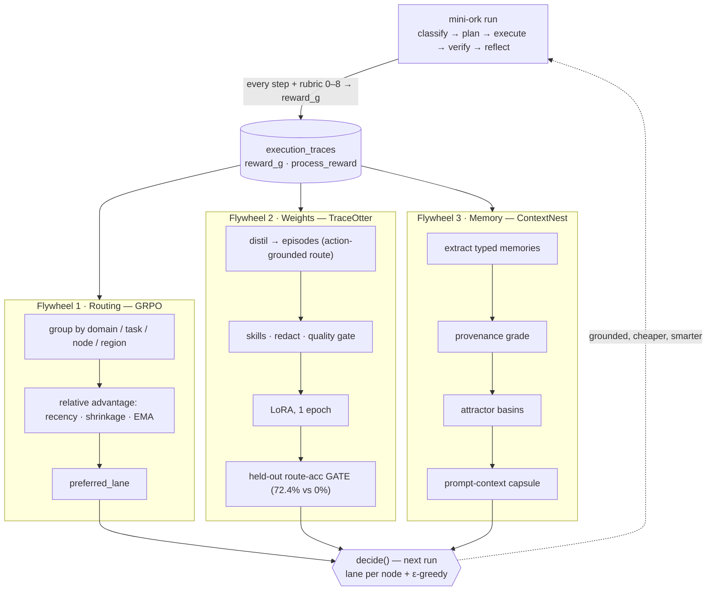

# Techniques Compendium — mini-ork · TraceOtter · ContextNest

*A single authoritative reference for every learning, orchestration, memory, and training technique across the three subsystems that make up the co-evolving dev substrate. Compiled 2026-07-09 from a line-by-line read of all three repos; claims are tagged `file:line` so they can be re-verified. Where the running artifacts disagree with the current source, both are noted — this doc does not paper over drift.*

**The three systems and how they connect**

- **mini-ork** — the orchestrator and the *policy brain*. Runs the task loop, routes each node to a model lane, records every step as a trace, and learns which lane wins per task via a GRPO-style relative-advantage update.
- **TraceOtter** — the *weight arm*. Distils mini-ork/Claude/Codex execution traces into an SFT dataset and LoRA-trains a small local model, gated on held-out route accuracy.
- **ContextNest** — the *memory substrate*. Turns session transcripts into a neural-field of attractor basins and fragments, grades every claim against real tool events, and feeds context back into mini-ork's planning while taking outcome feedback in return.

The loop: mini-ork runs → traces land → ContextNest extracts + grades memory and TraceOtter distils + trains → both feed back into mini-ork's next routing/planning decision. Three flywheels (usage routing, local weights, memory) turning on the same trace stream.

---

## Part A — mini-ork: orchestration + GRPO learning

### A1. The universal loop

Stages recognised by the dispatcher (`bin/mini-ork:15`): `classify → plan → execute → verify → reflect → improve → eval → promote`. The `run` path walks classify→plan→execute→(rubric)→verify→reflect inline (`bin/mini-ork:35`, `:455-525`); improve/eval/promote are the offline evolution sub-loop.

| Stage | Entry | Mechanism |
|---|---|---|
| classify | `bin/mini-ork-classify` | Rank-by-hit-count keyword/regex scan of `config/task_classes/*.yaml` + `recipes/*/task_class.yaml` (`:162-253`). Word-boundary literals; regex hit +2; class-alias +3. `--task-class` forces override. Kickoff DoS cap `MO_MAX_KICKOFF_BYTES=1048576`. Writes `task_runs` status `classified`. |
| plan | `bin/mini-ork-plan` | Emits `plan.json` with `artifact_contract.success_verifiers[]` + `verifier_contract.checks[]`. |
| execute | `mini_ork/cli/execute.py` | Dispatches workflow nodes; hosts the GRPO write-half (`mo_learning_write_grpo_advantages`, `:432+`) and the lane-routing switch (`_mo_policy_route_lane`, `:1971`). |
| verify | `bin/mini-ork-verify` | Runs `success_verifiers[]` then `gate_run_all` (`:305`). Empty-evidence exit-0 = `[fail] vacuous` (`:271-278`); zero verifiers run = verdict `vacuous`, not `pass` (`:317-323`). |
| reflect | `mini_ork/cli/reflect.py` | Delegates to `reflection_run`, then pattern_miner, cross_epic_gradient, bug_report_sweep, rho_aggregate, lane_router_recompute, optional GEPA. |
| improve | `bin/mini-ork-improve` | Reads per-task_class perf from `execution_traces`, calls `group_propose`, persists `workflow_candidates`. |
| eval | `bin/mini-ork-eval` | Benchmarks a candidate, computes `utility_delta` vs baseline, transitions candidate→shadow. |
| promote | `bin/mini-ork-promote` | `promotion_evaluate`; on pass registers a version + status `promoted`; on fail `quarantined` (permanent block). |

**Online reward inside `run`:** between execute and verify, an 8-item rubric pre-screen (`mo_rubric_run_score`) runs and `mo_grade_run_reward` stamps the 0–8 score as `reward_g` on every trace of the run (`bin/mini-ork:468-489`), so GRPO learns run *quality*, not just pass/fail. Auto-reflect fires after verify (`MO_AUTO_REFLECT=1`, batch 25).

### A2. Model lanes and the router

Seven model families via `lib/providers/cl_{opus,sonnet,codex,deepseek,glm,kimi,minimax}.sh`. Lane→role mapping in `config/agents.yaml`: `planner:sonnet, implementer:sonnet, reviewer:opus, verifier:sonnet, reflector:sonnet, decomposer:deepseek, brain:opus`. Heterogeneous-family lens lanes (`glm_lens, kimi_lens, codex_lens, opus_lens, minimax_lens`) each a distinct family to lower panel pairwise correlation (Rajan 2025). Budgets: per_epic $5, per_run $0.50, daily $50.

**Routing policy switch** `_mo_policy_route_lane` (`mini_ork/cli/execute.py`), env `MO_ROUTING_POLICY` default `learning_governed`. Policies: `workflow_default`, `frontier_only`, `cheap_only`, `static_hybrid`, `learning_governed`, `trace_governed` (escalate to frontier when `FAIL_COUNT>0`). Dry-run preserves recipe lanes.

`learning_governed` → `_mo_learning_governed_lane` (`:344-394`): resolves `task_class` + `objective_domain` (default `code-delivery`), delegates to `decide()`, reads `.route`. Epsilon exploration deliberately lives on the brain side, not here.

### A3. The GRPO relative-advantage router

`mini_ork/lane_router.py` (Python port of `lib/lane_router.sh`). The policy is *argmax relative advantage per group*:

- **Advantage**: `relative_advantage[i] = score[i] − mean(group)`, `score = reward_g` (NULL skipped) (`lane_router.py:97,164`). The bash write-half uses **z-score** `(score − mean)/std` instead (`mini_ork/cli/execute.py`).
- **Group key** = `(objective_domain, task_class, node_type, code_region)` (`:132`); groups of size <2 skipped.
- **Recency weight** `w = exp(−ln2·age_days/HALFLIFE)`, `MO_LEARNING_HALFLIFE_DAYS=14` (`:127-129`).
- **Weighted group mean** → per-lane `lane_adv = lane_mean − wmean + lane_bonus` (`:163-164`).
- **Shrinkage** `n/(n+K)`, `K=MO_LEARNING_SHRINKAGE_K=5` (`:166`).
- **EMA blend** `new = α·batch + (1−α)·prior`, `α=MO_LEARNING_DECAY_ALPHA=0.30` (`:217-232`).
- **Cost tie-break** on flat groups: bonus `0.1 − 0.2·(cost−lo)/(hi−lo)`, gated `MO_LEARNING_TIEBREAK=1` (`:150-155`).
- **Decayed defect penalty** on the region slice: `pen · 0.5^(age/hlf)` from `defect_attributions` (`:185-215`).

Persists to `agent_performance_memory` (global), `lane_domain_advantage`, `lane_region_advantage`. `preferred_lane()` reads the highest-advantage lane with sample floor `MO_LEARNING_MIN_SAMPLES=3`, cascading **region → domain → global** (`:286-330`). No log-sigmoid/softmax in the routing path — "margin" here means argmax-of-relative-advantage only.

**What a "group" is:** the set of traces competing on identical work `(objective_domain, task_class, node_type, code_region)`. A lane is rewarded for *beating its peers on the same task*, not for absolute score — the core GRPO idea.

### A4. Reward — three stacked signals

1. **`compute_reward_g`** (`mini_ork/trace_store.py:28-40`): `reward_g = sign·(value−anchor)/|anchor|`; `sign=+1` if higher-is-better else `−1`; **`anchor==0 → None`** (unanchored = no signal). Scale-free, direction-normalised gain the router reads.
2. **Verifiable-first shaping** (`mini_ork/cli/execute.py`): precedence `process_reward` → status anchor (0.85 success / 0.15 fail) → reviewer-verdict tie-break `±0.10`, zeroed on same-family lanes. The 0.5 anchor gap means an adversarial reviewer can't flip a known-good/bad trace.
3. **Process Reward Model (PRM)** (`lib/process_reward.sh` + `mini_ork/learning/process_reward.py:55-124`): additive weights `W_STATUS=0.40, W_TOOL=0.20, W_FILE=0.10, W_VERDICT=0.15, W_DURATION=0.10, W_COST=0.05`. **Goodhart guard** `ACTIVITY_CAP=0.15` clamps tool+file so noisy failed work can't outscore bare success. Bash/Python parity enforced to 1e-6 (`test_process_reward_parity.py`).

**`grade_run_reward`** (`trace_store.py:195-223`): rubric `score/8` normalised against neutral **anchor 0.5** → `reward_g=(val−0.5)/0.5 ∈ [−1,+1]`, `reward_source='rubric@v1'`.

### A5. decide() — the stateless shared-brain RLM

`lib/decision_service.sh` `decide <node_type> <task_class> <objective_domain> [segment]` (`:80`) → JSON `{route, coalition_ok, reward_estimate, recursion_hint, sample_size, segment, code_region}`. No per-request state, no side effects, no LLM dispatch. Composed reads:

- **route** — `lane_router_preferred_lane` (GRPO floor ≥3); cold-start falls back to the `agents.yaml` lane for the node_type — **never invents a lane**.
- **ε-greedy exploration** (`:108-178`): prob `MO_LEARNING_EPSILON=0.10` swap to a deterministic agents.yaml lane (`SEED` reproducible; else `SystemRandom`); fires only when a learned route already exists.
- **coalition_ok** — family-diversity check over the slice via `LANE_TO_FAMILY`; ok when sample<2 or every lens is a distinct family.
- **reward_estimate** — mean normalised `reward_g` over the slice, falling back to `process_reward`.
- **recursion_hint** — `max_depth=2, max_children=4, max_descendants=16, max_parallel=4`.

**objective_domain partitioning** is the outermost GRPO slice key (`code-delivery | review | research | ops | book-gen | …`). One shared learned policy serves heterogeneous consumers without cross-contaminating their metric shapes — the motivation stated in migration `0042`'s header.

### A6. trace_store — the ledger everything learns from

`execution_traces` (`db/migrations/0010`): `trace_id` PK, `run_id`, `task_class`, `prompt_version_hash`, `context_bundle_hash`, `tool_calls`/`files_read`/`files_written` (JSON), `reviewer_verdict`, `cost_usd`, `duration_ms`, `status` (incl. `vacuous`). Reward columns: `process_reward` (0031); the ten objective-aware columns from **0042** (`objective_domain, segment, reward_primary_metric, reward_direction, reward_value, reward_anchor, reward_g, reward_vector_json, reward_source, validity`); `code_region` (0044). Write path `trace_write` (`trace_store.py:67-137`) UPSERTs on `trace_id`, computes `reward_g` unless explicit, normalises legacy double-encoded `verifier_output`.

### A7. Reflection — "gradients" (TextGrad-style)

A **gradient** is a *textual* improvement signal: `{gradient_id, target, signal, suggested_change, evidence(trace_id), confidence, task_class}` in `gradient_records` (`mini_ork/learning/gradient_extractor.py`, migration 0038). `target` ∈ `workflow.node.<n> | agent.<role>.prompt | workflow.edge.<n> | verifier.<n> | workflow.recipe.<n>`.

`reflection_run` (`mini_ork/learning/reflection_pipeline.py`) runs 7 stages: **extract_gradients** (LLM 0–5 per trace, model `codex`, brace-balanced JSON recovery) → **deduplicate** (exact then `difflib` ≥0.55) → **link_failures** → **detect_stale** (`>14d`) → **summarize_patterns** (`pattern_records`) → **suggest_promotions** (`frequency ≥ 3`) → **persist** (idempotent upsert to `emergent_patterns`). **cross_epic_gradient** promotes a target recurring across ≥2 task_classes at conf ≥0.7 to `__cross_class__` with id `gr-cx-<sha256(target)[:12]>`.

### A8. Gates

| Gate | File | Enforces |
|---|---|---|
| gate_registry | `lib/gate_registry.sh` | 8 gate types; safety gates unremovable; `gate_run_all` from verify. |
| promotion_gate | `lib/promotion_gate.sh` | Reads `benchmark_results`+baseline → `promoted/rejected/quarantined(utility_delta≤0)/pending_human`. Synthesis-class conjunction gate needs **all 3**: panel ≥`MO_PROMOTE_SCORE_THRESHOLD=80`, CW-POR ≤0.3, ≥1 structural signal. Anti-Ouroboros (Zenil 2026). |
| coalition_gate | `lib/coalition_gate.sh` | Abort when pairwise ρ ≥ `MO_RHO_THRESHOLD=0.25` (Rajan 2025) or family_count < lens_count (Bertalanič 2026). |
| citation_verifier_mechanical | `lib/citation_verifier_mechanical.sh` | Resolves `path:line` citations vs `MINI_ORK_ROOT`; `CITATION_UNDERCOVERED` below `MO_CITATION_COVERAGE_FLOOR=0.8`. Anti-wireheading: proves the validator read the file. |
| adaptive_stability | `lib/adaptive_stability.sh` | Round-over-round verdict drift; HALT below `0.10`, never before 2 rounds, always by 5 (Hu 2025). |
| circuit_breaker | `lib/circuit_breaker.sh` | Behavioural liveness: artifact-hash invariant + verdict-stuck + cost-burn-no-write, 2-of-3 majority; CLOSED/OPEN/HALF_OPEN, cooldown 1800s. |

Also present: `krippendorff_alpha_gate`, `refute_or_promote_gate`, `honest_ci_gate`, `cw_por` (authority-capture). All fail-open `indeterminate`.

### A9. GEPA optimizer (prompt evolution)

`mini_ork/optimize/gepa.py` — reflective **prompt** optimiser (not weights). `optimize(seed, adapter, minibatch=8, budget=4)` maintains a `ParetoFront` over `(candidate, full_score)`; each iteration selects the best parent, `make_reflective_dataset` → `reflect_on_component` (LLM rewrites one component key), then a **strict-improvement minibatch gate** (`sum(new)>sum(parent)`) before paying a full eval — the "35× rollout savings." `miniork_adapter.py` sources offline `execution_traces` (`reward_value` signal), never fabricates (hash-miss → parent mean). **Wired suggest-only, only under `MO_OPTIMIZER=gepa`** — never auto-applies.

### A10. Scoring-math inventory

GRPO advantage (mean-sub / z-score) · shrinkage `n/(n+5)` · EMA α=0.30 · recency half-life 14d · decayed defect penalty · ε-greedy (the *only* bandit — **no Thompson/Beta/UCB implemented**) · Krippendorff's α `1−D_o/D_e` (escalate below 0.4) · pairwise ρ ceiling 0.25 · win-rate `wins/(wins+losses)` (`prompt_win_rates`) · topology selection `performance·√novelty` · UtilityScore `U = 0.45·success + 0.20·verifier + 0.15·quality − 0.10·cost − 0.05·latency − 0.05·risk`.

---

## Part B — TraceOtter: trajectory distillation → local model

### B1. The pipeline

`run_pipeline` (`traceotter/pipeline.py:51`): **ingest** (parse JSONL → typed `Episode`, write `episodes.jsonl` + `manifest.json`) → **consolidate_skills** → **run_quality** → **quality-gate join** (keep only `episodeId`s surviving `filtered_episodes.jsonl`, `:59-61`) → **export_llamafactory** → **report.json**. Discovery globs `**/*.jsonl`, `COMPLETION_REPORT.md`, `*summary*.json`, `*verdict*.json`. `distill` is a pure alias.

### B2. Data model & the (input, output) pair

Dataclasses (`models.py`): `Step` (index/actor/action_kind/summary/command/files/…), `Outcome` (status + **real measured** `input_tokens/output_tokens/cost_usd/tool_calls/tool_errors/files_written/files_read`), `Labels` (should_imitate/process_score/cost_efficiency_score/grounding_ratio), `Episode`, `Skill`.

Parsing (`adapters.py`): Claude uses Anthropic `tool_use` blocks as authoritative for step kind (killed "phantom edit" steps, `:420`); Codex correlates a verify `exec_command` `call_id` with its exit code. Honest outcome (`_finish_episode:467`): cost from `message.usage` priced at `_PRICE_PER_MTOK`; `tests_passed` parsed from real pytest/go/cargo signatures; `status` grounded (`failed`/`completed`/`partial`) NOT keyword-matched; `process_score = 0.5·(1−tool_error_rate) + 0.3·grounding_ratio + 0.2·(no unsafe failure)`.

**Training pair** (`exporters.py`): **input** = `repo/cwd/user_goal/task_type/candidate_skills/observed_steps` (first 20); **output** = `route: <label>\nprocedure:\n…\nverification:\n…\noutcome_status: …`; fixed instruction *"choose the route, key procedure, and verification plan."*

**The route label** — the model's primary decision target, 5 classes (`eval.py:14`): `docs_or_review, direct_edit, worktree, orchestration, ask_for_context`. Ground truth `_expected_route` derived from **executed actions** (shell commands + step kinds), not prompt keywords — the fix that made route accuracy a real (non-circular) task.

### B3. Skills — MemP-inspired procedural memory

`consolidate_skills(episodes, min_support=2)` (`skills.py:11`): **support = count of distinct episodes** (not raw occurrences); drops below min_support; `skill_id = "skill_"+sha256(title+source_ids)[:12]`. `_normalize` = whitespace-collapse dedup key. `_categorize`: `cmd:`→verification, transitions (`search-then-edit`…)→process_pattern, else general. `_confidence = 0.15 + min(0.4,0.1·support) + 0.2·process + 0.15·completion + 0.1·test − failure_penalty`, clamped [0.05,0.95]. `_status_for`: stable/supported/candidate. A skill is a support-counted, self-describing procedural pattern with trigger + procedure + verification contract + provenance + confidence.

### B4. Redaction & quality

**Redaction** (`redact.py`) applied *at parse time*: api_key/token/secret/bearer/`sk-`/`ghp_`/`hf_` patterns, keep key name replace value; second stricter `SECRET_RE` + `PRIVATE_PATH_RE` in quality (`/Users/`, `/home/`, `/Volumes/` redacted).

**Quality gates** (`quality.py:run_quality`): per-episode warnings (empty_goal/secret/noisy_only/failed_trace/missing_verification/overlong>32k/private_path/adp_schema/duplicate); `EXCLUDED_TYPES` dropped, private_path+missing_verification warn-only. **Curation A/B** (`curation.py`): evidence-based — recommends `exclude` only when dropping flagged episodes doesn't worsen and improves ≥1 of routeAccuracy/verificationCoverage/rubricScore; refuses to empty the eval set. **SFT export filter** `_should_export_for_sft`: drops failed/crash; a completed trace is positive only with verification and no `tests_passed is False`/failure_modes.

### B5. LoRA recipe & the single-epoch discipline

Current exporter (`exporters.py:183-202`): base `Qwen/Qwen3-4B-Instruct-2507`, template `qwen3_nothink`, LoRA `lora_target: all`, batch 2×grad-accum 8, lr 2e-4, cutoff 8192, bf16. LoRA rank/alpha live in the local trainer (`scripts/local_lora_train.py:107-112`): `r=8, alpha=16, dropout=0.05`, targets `q/k/v/o/gate/up/down_proj`.

**Single epoch** (`local_lora_train.py:77-81`): multi-epoch LoRA distillation on curated data causes catastrophic forgetting (regressions/repetition/thinking-loops); 1 epoch transfers style/skill with capability retention. Prompt tokens masked to −100 (response-only loss). *Note the emitted LF yaml still says 3 epochs — the single-epoch rule is enforced by the local trainer, not the LF config.*

### B6. Eval — held-out route accuracy is the gate

`run_eval(…, holdout_ratio)` (`eval.py:24`): **held-out temporal split** = last fraction by sorted `episode_id` (`:108-111`); "last 20%" = `0.2`. Metrics: routeAccuracy (predicted vs action-grounded `_expected_route`), verificationCoverage, failedTraceRejection, processScore, rubricScore, safetyWarnings. **Why gate on held-out eval not train loss:** the real go/no-go (`local_eval_route.py`) runs each held-out example twice — `disable_adapter()` (base) vs adapter — and checks the `route:` line vs gold; train loss can fall while behaviour regresses.

**Real checkpoint** (`saves/rp-researcher-eval/eval_report.json`): `n=150`, base `Qwen3-4B`, base route-acc **0.0** (base emits a valid route 0% of the time), tuned **0.72**, lift 0.72. Per-route: worktree 0.773, orchestration 0.732, docs_or_review 0.697, ask_for_context 0.656. This is the "72.4%" quoted in the roadmap.

### B7. RunPod autopilot & JitRL

**RunPod driver** (`scripts/runpod_autopilot.py`): creates an on-demand pod, SSHes with an ephemeral key, uploads trainer + data, trains, pulls the adapter tarball, and **always terminates in `finally`**. Weekly local path (`weekly-distill.sh`) is "local, private, free," cron `0 3 * * 0`, keeps 8 snapshots. *The "~$0.70/cycle" figure is not in the codebase — it's consistent with a single-epoch LoRA on a self-terminating spot 4090 but is an external claim, not asserted in code.*

**Continual JitRL** (design, `docs/roadmap/m9-continual-jit-learning.md`): keystone **JitRL (arXiv 2601.18510)** — memory bank of `<s,a,reward>`, estimate `Â(s,a)` from historical returns, apply a **closed-form additive logit update `z'(s,a)=z(s,a)+β·Â(s,a)`** to a *frozen* base (Thm 4.1/4.3), >30× cheaper, zero forgetting. Two-speed: **fast loop** every session (no gradient, logits nudged at inference), **slow loop** weekly/JIT (one gated GRPO/on-policy-distillation weight update with replay buffer, held-out-gated + best-so-far rollback). **SKILL-DISCO (2606.26669)** upgrades `skills.py` flat list → routine graph (nodes=skills, edges=transitions weighted by freq+success). Recommendation: ship routine-graph + JitRL memory on the *existing 72.4% checkpoint* with no new training run.

### B8. Real artifact numbers

`.mini-ork/traceotter/`: 1,082 files discovered → 1,082 episodes → **271 SFT examples** survive the export filter → **3 consolidated skills** (all conf 0.95, candidate): preserve dirty-tree/stage owned files (15 eps), run focused verification + record commands (50 eps — largest), use a task-specific worktree (19 eps).

---

## Part C — ContextNest: neural-field memory substrate

*Resolved repo: `/Volumes/docker-ssd/ps/ContextNest` → `/Volumes/docker-ssd/Migration/Development/ContextNest` (the Rust substrate, ~102k LoC). The `ps/ML/ContextNest` checkout is empty scaffolding.* Rust (axum). **No SQL DB and no Qdrant for memories** — in-memory sidecar maps behind `RwLock`, persisted by a JSON WAL. Embeddings are **not Gemini** — OpenAI-compatible (DeepInfra Qwen3 default) or local.

### C1. Basins — attractor basins (energy landscape)

A basin is a region of embedding space with a **center vector, radius (attraction range), depth (attraction strength)**, clustering similar fragments. `AttractorBasin` (`src/memory/attractors/attractor_basin.rs:29-57`): center/radius/depth/shape/dynamics/associated_fragments/health/stability_score/basin_type (`Primary|Secondary|Temporary|Meta|Hybrid`). Shapes: `Spherical|Ellipsoidal|Irregular|Adaptive`.

**Math:** attraction force = modified gravitational potential, zero outside `radius·2`, else `depth·(1−distance/(radius·2))²` toward center (`:269-298`); energy well `−depth·(1−(distance/radius)²).exp()`; convergence = gradient-descent at step 0.1 until within 0.01.

**Shaping / evolution** (`update_dynamics:323-350`): `BasinDynamics{velocity, expansion_rate, depth_change_rate, damping, resonance_frequency}` — each tick center moves by `velocity·dt`, radius grows, depth changes, velocity damps, `stability_score` = EMA of velocity + age factors. **Health** = `0.3·pattern_coherence + 0.2·fragment_coverage + 0.3·activity_level + 0.2·stability`; activity decays `exp(−idle_s/3600)`; <0.3 pruned.

**Formation** (`process_memories` Step 1, `memory_attractor_manager.rs:295-334`): each fragment finds its nearest basin; if euclidean ≤ **0.4** (`CONTEXTNEST_BASIN_ATTACH_THRESHOLD`, ≈ cosine 0.92 on normalised 768-d) it **attaches**, else it **seeds a new Secondary basin**. This fixed a real "one-basin-per-fragment" degeneracy (`avg_mass==1.0`). Merging: two basins merge when `distance < merged_radius·threshold`; merged center = depth-weighted average, depths sum.

### C2. Fragments — the memory quantum

Canonical `MemoryFragment` (`src/memory/attractors/mod.rs:92-110`): `id`, **`content: Vec<f32>` (the embedding, NOT text — a load-bearing naming quirk)**, `importance`, `created_at`, `last_accessed`, `attractor_basin_id`, `connections: HashSet`, `confidence`. Text + metadata live in side maps, never on the fragment. Five distinct fragment shapes exist across storage/resonance/gap-fill/reconstruction (`fragment_bridge.rs:1-25`). Each ingested `MemoryRecord` → fragment via `stable_fragment_id(session, text, metadata)`; at consolidation the text is embedded and run through `process_memories`.

### C3. The field — resonance / decay / activation

**Live field (what retrieval actually uses)** is a multiplicative attenuation pipeline (C7). Dynamics: **decay** `exp(−ln2/half_life · age_days)`, half-life 60d prefers `last_accessed`, and every retrieve **bumps `last_accessed`** on hits (a recency-reinforcement loop); **salience** via `connection_log` co-occurrence edges (top-2000 capped); **spreading activation** via basin/connection expansion.

**Canon "neural field" layer is mostly dormant.** `ResonanceActivator` (`resonance_activation.rs`) computes `combined = 0.5·cue + 0.3·context + 0.2·network` with real spreading activation — but grep shows it is **not called by the API/service layer**; `tools.rs` reimplements resonance inline. Treat `src/context/*` (field.rs, resonance_activation.rs, neural_field_enhanced.rs, attractor_dynamics.rs) as aspirational scaffolding, not the live path.

### C4. The extractor & every memory kind

`extract_memories(events, session_uuid, project_cwd)` (`src/ingest/claude_code/extractor.rs:231-631`) parses Claude Code JSONL + the `<z-insight>{json}</z-insight>` blocks assistants emit (malformed JSON silently skipped). Each `MemoryRecord = {kind, text, importance, session_id_cn, metadata}`. Every `MemoryKind` and its z-insight source:

| Kind | Source | Importance |
|---|---|---|
| session_title | first `ai-title` | 0.85 |
| initial_prompt_window | first 3 user turns | 0.45 (boilerplate → weight 0) |
| goal_phase | clustered `goal` stream | 0.85 |
| Accomplishment | `top_jobs[]` | 0.75 |
| Learning | `facts[]` | 0.80 |
| Todo | `tasks[]` (dedup→final status) | 0.65–0.80 |
| user_action | `requires_user_action[]` | 0.80 |
| Decision | `decision` (awaiting) | 0.85 |
| Blocker | `blockers[]` | 0.80 |
| State | `current_state` | 0.50 |
| current_task | `current_task` | 0.55 |
| Summary | `/clear` summaries | 0.95 |
| files_touched | Edit/Write/MultiEdit `file_path` | 0.85 |
| Feature | `delivered_features[]` | 0.90 |
| Domain | top-level `domain`+`progress`+`topics[]` | 0.85 |
| read_context | `read_context[]` | 0.65 |
| Verification | `verification[]` | 0.75 (failed 0.85) |
| evidence_ref | `evidence_refs[]` | 0.60 |
| decision_made | `decisions[]` | 0.90 |
| Failure | `failures[]` | 0.85 |
| prompt_directive | `prompt_directives[]` | 0.95 |
| Assumption | `assumptions[]` | 0.55 |
| Artifact | `artifacts[]` | 0.70 |
| memory_candidate | `memory_candidates[]` | 0.80 |
| risk_flag | `risk_flags[]` | 0.90 |

GoalPhase clustering is two-stage: token-overlap ≥0.50 (sync), embedding cosine ≥0.85 (async refine).

### C5. Storage

Sidecar "tables" in `ContextNestServices` (`src/services/mod.rs:69-202`): `fragment_texts` (source text), `fragment_metadata` (kind/ts/provenance/`_cn_content_density`/`_cn_confidence_signal`/`last_accessed`…), `session_index`, `connection_log` (co-occurrence edges), `embeddings_by_id`, `session_intent_embeddings`, `attractor_manager` (basins), `wal`, `consolidation_queue`. Write path (`sink.rs:314-367`) inserts text+metadata, enqueues consolidation, WAL-appends — **deliberately skips embedding + basin formation on the hot path**. Embeddings: Qwen3 via DeepInfra default; providers Ollama/HF/CustomHttp + local TF-IDF fallback. A **consolidation worker** (`consolidation.rs`) drains the queue off the hot path, embeds, runs `process_memories`, computes density, flips `_cn_consolidated` — without it the attractor pipeline is dormant.

### C6. Retrieval & prompt-context assembly

`POST /tools/retrieve` (`tools.rs:588-994`): resolve candidates → embed query → prefilter (metadata/exclude_kinds) → **hydrate + cosine score** → multiplicative re-weight (C7) → sort by similarity then importance → **basin-aware expansion** (top hit's basin members at `top_sim·0.7`) → **connection expansion** (1-hop graph neighbors at `top_sim·edge_weight·0.5`) → dedupe → top_k → bump `last_accessed` + update `connection_log`.

**Prompt-context (the brain surfacing)** — `prompt_context.rs`, deterministic no-LLM: `/atoms` (flat filtered trajectory kinds), `/clusters` (collapse by `(kind, normalized_text)`, optional semantic union-find ≥0.85, ranked by **cross-session reach**), `/capsule` (Markdown digest ordered risks→decisions→failures→…→artifacts, pasteable into another agent's prompt). Session queries: by-file, by-feature, by-intent (per-session intent embedding), top-feature, trajectory.

### C7. Scoring math

Per-hit `similarity = base_cosine · decay · kind_weight · density · trust`:
- **decay** `exp(−(ln2/60d)·age)` × kind durability (Durable ×2.0 for decision/verification/feature/learning; Volatile ×0.5 for state/read_context/files_touched).
- **kind_weight** UserContent 1.0 / SystemState 0.5 / Boilerplate 0.0.
- **density** normalised Shannon token entropy × alphabetic-word fraction (ID-strings ~0.2, prose ~0.7).
- **trust** (provenance) observed 1.0 / partial 0.7 / claimed 0.4 / absent 0.4 / contradicted 0.25.

Other constants: basin attach ≤0.4, goal clustering 0.50/0.85, connection creation cosine >0.7, semantic merge ≥0.85. Top-feature score `0.35·ln1p(freq)+0.40·file_overlap+0.15·recency+0.05·ln1p(defs)+0.05·has_refs`.

### C8. Provenance grading — anti-hallucinated-memory

The extractor grades self-reported claims against real tool events (Tool Receipts, arXiv 2603.10060). **Verification** (`extractor.rs:1140-1182`): pairs each `verification[]` claim to its Bash run, parses exact `N passed / M failed` receipts → tiers `observed` (receipt confirms) / `contradicted` (claim says pass, receipt shows failures — receipt overrides) / `partial` / `absent` (command cited, no receipt = fabricated) / `claimed` (no command). **Feature** grades `delivered_features[].files` vs real Edit/Write paths (`absent` = fabricated deliverable). **ReadContext** flags a cited repo path never read. These tiers become the `trust` multiplier at retrieve time.

### C9. Feedback loop into mini-ork (EvoMem)

Bidirectional (`docs/roadmap/epics/agent-context-pack.md`, complete 2026-06-17):
- **Brain → mini-ork:** planner/worker pull `cn_retrieve`, `cn_sessions_by_file`, and a UprPromptSubmit prefetch hook (`cn_retrieve + cn_inbox + cn_features_recent`); planner uses `/prompt-context/capsule` (kind-ordered, ~8KB cap); role-tailored ContextPacks map mini-ork's 8 node types to CN endpoints; prefetch markdown inlined atop worker prompts.
- **mini-ork → brain:** `POST /agent/outcome` (EvoMem, arXiv 2511.01912) — after a worker stops, mini-ork posts the CN atom ids it consumed + outcome. CN bumps `last_accessed`, nudges `_cn_confidence_signal` ±0.05 (capped ±0.05/call, ±1.0 cumulative so one noisy worker can't pin a basin), stores evidence. Deliberately side-effect-light: **no re-consolidation/re-embedding** — only metadata `retrieve` already reads.

---

## Part D — How the whole system learns (end to end)

1. **A run executes.** mini-ork classifies the task, `decide()` picks a lane per node (learned advantage + ε-exploration), workers run, every step is written to `execution_traces` with cost/duration/verdict.
2. **Reward is stamped.** An 8-item rubric grades the run → `reward_g` on every trace; PRM adds a dense per-node process score; verify writes success/failure/vacuous.
3. **The policy updates (flywheel 1 — routing).** Reflect recomputes GRPO relative advantage per `(objective_domain, task_class, node_type, code_region)` group with recency-weighting, shrinkage, and EMA; `preferred_lane` shifts toward whichever lane beats its peers. Gradients + patterns are mined for prompt/topology improvements; GEPA suggests prompt rewrites (held-out, suggest-only).
4. **The weights update (flywheel 2 — local model).** TraceOtter distils the same traces into an SFT dataset (action-grounded route labels, MemP skills, redacted, quality-gated), LoRA-trains a small local model, and gates on held-out route accuracy (72.4% vs 0% base) — not train loss. JitRL (design) will make this continual and cheap by nudging frozen-model logits from a `<s,a,reward>` memory bank.
5. **The memory updates (flywheel 3 — context).** ContextNest extracts typed memories from the transcript, grades every claim against real tool receipts (observed/contradicted/absent), consolidates them into attractor basins, and serves a kind-ordered capsule back into the next run's planning — then takes outcome feedback to reweight what it surfaced.
6. **Repeat.** Each run makes the next one route better, cost less (local absorption rises), and start with grounded memory — the compounding curve.

---

## Part E — Honest caveats (do not paper over these)

- **mini-ork:** GEPA is wired **suggest-only** under `MO_OPTIMIZER=gepa`; PRM same-family decontamination was removed pending a real `reviewer_model` column; there is **no Thompson/Beta/UCB** — ε-greedy is the only bandit.
- **TraceOtter:** real code-vs-artifact drift — base model appears as Qwen3-4B (current exporter+eval), Qwen2.5-Coder-1.5B (stale vendored yaml), and Qwen2.5-0.5B (local smoke default); the emitted LF yaml says 3 epochs while the local trainer enforces 1. The **"$0.70/cycle" figure is not in the codebase** — treat it as an external estimate.
- **ContextNest:** the elegant `src/context/*` neural-field/resonance layer is **largely NOT on the live request path** — retrieval scoring is reimplemented inline in `tools.rs`. Memories live in in-memory sidecars + WAL, not SQL/Qdrant. Embeddings are DeepInfra Qwen3 / local, **not Gemini**. The consolidation worker must run or the basin pipeline is dormant.
- **General:** the impressive economics (84% token savings, quality parity) are modeled/held-out, not yet proven on an external customer workload.

---

*Every mechanism above is grounded in the cited `file:line`. When in doubt, read the file — several "the recipe is X" statements differ between current source and vendored run artifacts, and those disagreements are called out inline rather than hidden.*
