# The verification stack

*Added 2026-10-05/06. Six techniques from the 2000-paper verification review
(`recipes/verification-technique-review/`, run `verify-review-20261005-122958`),
each built by a mini-ork `framework-edit` run with RSI on and proven by a real
mini-ork run. All are ON by default.*

## The rule everything here obeys

mini-ork's verdicts are **anchored on what the code actually did**, never on what
a model said about it. A model may *propose* a check or *veto* a result. It may
never approve one. Every verdict has three values:

| Verdict | Meaning |
|---|---|
| `PROVEN` | The evidence establishes it. |
| `REFUTED` | The evidence contradicts it, and the evidence is attached. |
| `UNVERIFIED` | The evidence could not be established. This is an **abstention, never a pass**. |

The features below close three holes that were measured in mini-ork itself:

1. **The loop certified non-regression, not correctness.** A live audit found 236 code-fix runs. Of the 61 that were
   published, **none** had a proven red→green, and 39 were published on a red post-patch suite.
2. **The oracle had a recall hole.** It could not judge about 16% of correct fixes (recall 21/25).
3. **Single tests can be gamed through coverage gaps.** A patch that special-cases the tested input passes the test.

## Where each piece lands

```mermaid
flowchart TB
  subgraph certify["mini-ork certify — the Assay oracle (mini_ork/certify/)"]
    P["PoC+ reproduction test"] --> D["delta gate red→green"] --> I["metamorphic invariants"]
    I --> R["① metamorphic RELATIONS<br/>relations.py — veto + rescue"]
    I --> X["② DIFFERENTIAL check<br/>differential.py — collateral-damage veto"]
  end
  subgraph codefix["mini-ork run code-fix — verifier + publish"]
    T["test verifier<br/>recipes/code-fix/verifiers/test.py"] --> A["③ SUITE ADEQUACY<br/>gates/suite_adequacy.py — mutation kill rate"]
    A --> L["④ LEVEL VECTOR<br/>verify/levels.py — 5 independent levels"]
    L --> PUB["publisher: commit only if every required level is PROVEN"]
  end
  subgraph gates["gate registry + promotion"]
    H["⑤ HACKABILITY audit<br/>gates/hackability.py · gate-fuzz --hackability"] --> PG["promotion gate refuses<br/>promotes resting on a hackable gate"]
  end
  subgraph behav["mini-ork verify — behavioral verifier"]
    E["⑥ declared EQUIVALENCE operator<br/>verify/equivalence.py"]
  end
```



## ① Metamorphic relations (G10-T01): `mini_ork/certify/relations.py`

**What it checks.** The model proposes up to *k* relations: a SOURCE input, a transform, a FOLLOWUP input
(`T(SOURCE)`), and a RELATION between the two outputs. For example: "reversing the list leaves the median unchanged".
Each relation runs as a real test that calls the code twice. A patch that special-cases the reported input fixes
SOURCE but not FOLLOWUP, so the relation breaks.

**How it decides.** Execution decides; the model only proposes.
- **Veto.** It runs only on a would-be PROVEN. A relation that held on the unpatched code and breaks on the patch
  turns PROVEN into REFUTED. The reason names the relation and the input pair.
- **Rescue.** It runs only where the oracle gave up because it could not build enough invariants. PROVEN ("relative
  to N relations") needs ≥2 held, ≥1 repaired (fails on base, holds on the patch) and zero violations.
- **Abstention.** A relation that cannot execute abstains and never counts as holding. Base runs only *attribute*
  a failure; they never admit a relation.

**Knobs.**
- `MO_ASSAY_RELATIONS` (ON): the master switch.
- `MO_ASSAY_RELATIONS_RESCUE` (ON): the rescue mode.
- `MO_ASSAY_RELATIONS_K` (3, clamped 1–5): relations per judgement.
- `MO_ASSAY_RELATIONS_VETO_MIN` (1): violations needed to veto.

**Evidence.** Each judgement prints one stderr line, `[assay-relations] {json}`, with mode, counts and per-relation
records. The verdict detail key is `relations`.

**Live result.** In rescue mode the cheat `if xs == [1,2,3,4]: return 2.5` was REFUTED by 2 violated relations: the
reversed list `[4,3,2,1]` and the duplicated `SOURCE + SOURCE`. The correct fix was PROVEN relative to 3 relations.
No correct fix was REFUTED in any run.

## ② Differential check (G10-T02): `mini_ork/certify/differential.py`

**What it checks.** The model proposes ONE shared input suite split into two groups:
- `bug_domain`: inputs where the fix *should* change behaviour;
- `preserve`: inputs where it must not.

The same harness runs on base and on the patch, and code compares canonical-JSON observations by sha256. A correct
fix diverges inside the bug's domain (the anchor) and agrees outside it.

**How it decides.**
- **Veto.** It runs only on a would-be PROVEN. ≥ `VETO_MIN` confirmed `preserve` divergences turn PROVEN into
  REFUTED, with the input and both observations attached. A divergence is confirmed by a re-run on each side.
- **Mislabels.** Requiring 2 divergences means one mislabelled `preserve` input can never sink a correct fix.
- **Abstention.** Crashed or unreadable inputs are excluded and never count as agreement. With no anchor, there is
  no veto.

**Knobs.**
- `MO_ASSAY_DIFFERENTIAL` (ON).
- `MO_ASSAY_DIFFERENTIAL_N` (6, clamped 2–8).
- `MO_ASSAY_DIFFERENTIAL_VETO_MIN` (2).

**Evidence.** A stderr line `[assay-differential] {json}`; the detail key is `differential`.

**Live result.** A fix that averages the two middle values *always* fixes `[1,2,3,4]` but breaks every odd-length
list. **Today's oracle PROVED it.** The differential term REFUTED it: `input=[1, 2, 3, 4, 5] base=3 head=2.5` (3 of 3
preserve inputs diverged). The correct fix stayed PROVEN.

## ③ Mutation-based suite adequacy (G03-T04): `mini_ork/gates/suite_adequacy.py`

**What it checks.** Whether the target repo's test suite is strong enough for its green to mean anything. It seeds
deterministic AST mutants into the files the candidate changed:
- comparison flip
- arithmetic swap
- boolean negation
- constant off-by-one
- `return None`
- condition → constant

Each mutant is applied to a temporary **copy** of the repo, and the suite is rerun. The score is
`killed / (killed + survived)`. There is no LLM, and the live tree is never touched.

**How it decides.** It runs inside the code-fix test verifier on every green suite.

| Verdict | When | Effect |
|---|---|---|
| `ADEQUATE` | score ≥ `MIN_SCORE` | The green stands. |
| `INADEQUATE` | score below `MIN_SCORE` | The green becomes UNVERIFIED (`pass:false`, exit 0, `adequacy_unverified`). A green from a suite that can't catch faults is not evidence. |
| `UNVERIFIED` | baseline red or timed out, canary not detected, or too few valid runs | Downgraded as above. The instrument applied but could not measure. |
| `NOT_APPLICABLE` | no Python source changed, or too few mutation sites | The green stands. The instrument does not apply. |

**Knobs.**
- `MO_SUITE_ADEQUACY` (ON).
- `MO_SUITE_ADEQUACY_MAX_MUTANTS` (12, range 1–50).
- `MO_SUITE_ADEQUACY_MIN_SCORE` (0.6).
- `MO_SUITE_ADEQUACY_TIMEOUT_S` (300, per run).

**Evidence.** In the run dir, `suite_adequacy.json` holds the full report, including the survivors as
`file:line operator original -> mutated`. The test verifier's JSON carries a `suite_adequacy` key.

**Live result** (real `mini-ork run code-fix`, same bug, two suites):
- **Strong suite:** 12/12 mutants killed (ADEQUATE), and the fix was published.
- **Weak suite:** 2/12 killed (INADEQUATE, 0.167), so the green was downgraded. The 10 named survivors were exactly
  the untested logic.

**Cost.** At most 2 + N extra suite runs per green verifier. That's cheap for scoped test commands. For a slow full
suite, scope the verification command or lower `MO_SUITE_ADEQUACY_MAX_MUTANTS`.

## ④ Non-nested level vector (G08-T05): `mini_ork/verify/levels.py`

**What it checks.** Correctness levels are **non-nested**: passing a shallow level does not imply a deeper one. Every
run verdict now carries five levels. Each is derived independently, and only from execution artifacts, never from
reviewer or LLM output:

| Level | Evidence | PROVEN when |
|---|---|---|
| `applies` | `implementer-summary.json` | Implemented, with a non-empty file list. |
| `executes` | `verifier_test.json` | The runner reached test outcomes. |
| `target` | `verifier_test.json` | The suite is green **and** the replay proves it exercises the change. |
| `preserve` | `verifier_test.json` | No regression, and the suite is not adequacy-unverified. |
| `contract` | `verifier_behavioral.json` | The behavioral verifier is PROVEN (`n/a` when absent). |

Missing evidence makes a level UNVERIFIED, never PROVEN.

**How it decides.** It acts at the publisher. `code_fix` requires applies, executes, target and preserve.
- **All required PROVEN:** publish.
- **Any REFUTED:** fail the run (rc 1, and rollback is the right compensation).
- **Anything else:** **withhold the commit without rolling back the fix** (rc 0, status `failed`).

Gating at the publisher, not at the verifier exit code, keeps an abstained fix in the tree for inspection.

**Knob.** `MO_LEVEL_VECTOR` (ON).

**Evidence.** `verdict.json` gains `levels`, `levels_reasons`, `levels_required`, `levels_ok` and
`levels_decision`. When the recipe owns `verdict.json`, these go to `run-verdict.json`. The execute log shows
`[ok|ABSTAIN|BLOCK] publisher: level …`.

**Live result** (real `code-fix` A/B on the exact leak path, where the verifier was green with no replay proof and the
reviewer **approved**):
- **Gate on:** `[ABSTAIN] … target=UNVERIFIED — publish withheld`, 0 commits, and the fix kept in the tree.
- **Gate off:** published.

## ⑤ Gate hackability audit (G09-T05): `mini_ork/gates/hackability.py`

**What it checks.** Whether a registered gate can be passed by inputs that carry no evidence. Five fixed "hollow"
operators run against each gate's real evaluator in a scratch DB:
- empty context
- dangling evidence
- empty document
- hollow object
- zero-leaf skeleton

An optional LLM proposer adds more candidates, but a proposal counts only if it is itself hollow, by a mechanical
check. **Hackability** is `passed_bad / valid_trials`. Crashed trials are excluded and counted.

**How it decides.** The record persists at `<db dir>/gate-hackability/<gate_id>.json`. `mini-ork promote` **refuses**
a would-be promote that rests on a gate with hackability above `MO_GATE_HACKABILITY_MAX`. Unmeasured or stale gates
never cause a rejection. (The RSI apply loop gates through its own evaluator and is unaffected.)

**Knobs.**
- `MO_GATE_HACKABILITY_N` (4, range 0–16): proposer documents per gate.
- `MO_GATE_HACKABILITY_BUDGET_USD` (0.50).
- `MO_GATE_HACKABILITY_MAX` (0.25).
- `MO_PROMOTION_GATE_HACKABILITY` (ON).

Run the audit with:

```bash
mini-ork gate-fuzz --hackability --gate <gate_id> [--proposer-lane glm] --json
```

**Live result.** The first audit found `oracle-coalition`, `oracle-liveness` and `oracle-stability` at **0.8**. An
unknown panel or run fell into each backend's fail-open default, and the evaluator mapped that default to "pass". A
fix made those evaluators defer on absent evidence (b53b6c0d), and the re-audit measured **0.0**.
`oracle-panel-health` stays at 0.2, under the threshold.

## ⑥ Declared equivalence operator (G10-T07): `mini_ork/verify/equivalence.py`

**What it checks.** Every comparison is relative to an operator, and a misfit operator rejects correct
implementations. The behavioral verifier's comparison is now an explicit declaration on the observable:

| Operator | Meaning |
|---|---|
| `exact` | The default, byte-identical to before. |
| `set` | Order-insensitive multiset. |
| `canonical` | Declared rules only: `ignore_keys`, `strip_whitespace`, `numeric`. |
| `tolerant` | `abs_tol` / `rel_tol` on numbers that are not bools. |

`register_operator()` is the extension seam. An unknown operator or invalid rules give **UNVERIFIED on every
surface**, never a silent `exact` and never a pass. Every verdict and check carries an `operator` stamp, and every
REFUTED names its operator and the first differing key path (e.g. `$.db_path`).

**Declare it** in the `observable:` block of the `MO_OBSERVABLE_SPEC` descriptor (`equivalence:` and
`expect_body:`), or with `MO_BEHAV_EQUIVALENCE` / `MO_BEHAV_EXPECT_BODY`.

**Live result** (against a live `mini-ork serve`): 4/4 correct-but-rejected surfaces became PROVEN under their fitted
operator, and 0/5 wrong expectations were approved under any operator.

## Fixes the live runs found

The real-run smokes caught defects that unit tests had hidden. All are fixed:

| Commit | Defect |
|---|---|
| d69cbafd | The hackability proposer dispatched from the mini-ork checkout, so the cwd guard refused every call. It now uses a scratch `MO_TARGET_CWD`. |
| f5aa21ed | `mini-ork verify` evidence logs were named per second, so two verifications in one second shared a file. Names are now unique. Diff paths now name the exact key. |
| fc9a210a | Recipe verifiers imported whichever `mini_ork` the interpreter found, so new verifier code silently abstained. The executor now puts its own engine first on the verifier's `PYTHONPATH`. |
| ad37d26f | `framework-edit`'s verifier nodes required the `verdict.json` they were about to write, which failed 6/6 builds before review. The pre-run guard now exempts verifier outputs, and the full guard re-runs after the verifier. |
| b53b6c0d | Certifying oracle gates read absent evidence as a pass (hackability 0.8). They now defer. |

## Turning a feature off

Set its master knob to `0`, for one run or in `config/secrets.local.sh`:

```bash
MO_ASSAY_RELATIONS=0 MO_ASSAY_DIFFERENTIAL=0 mini-ork certify ...      # oracle terms
MO_SUITE_ADEQUACY=0 MO_LEVEL_VECTOR=0 mini-ork run code-fix kickoff.md # code-fix gates
MO_PROMOTION_GATE_HACKABILITY=0 mini-ork promote --candidate <id>     # promotion consumer
```

With a knob at `0`, verdicts are byte-identical to the pre-feature behaviour.

## Operating notes

- **What changes when everything is on.**
  - `code-fix` publishes only when the target is proven: a green replay overlap plus an adequate suite, or one the
    audit doesn't apply to. Runs that used to publish on a green suite alone now end `failed`, with the fix kept in
    the tree.
  - For a repo whose test command the replay can't parse (non-pytest), `target` cannot be PROVEN, so `code-fix` will
    not publish there. That's the honest answer until a replay adapter exists for that runner.
- **Cost.**
  - Certify makes about 2 extra LLM calls per judgement and up to about 2k + 2N extra sandbox runs.
  - Code-fix adds up to 2 + `MAX_MUTANTS` suite runs per green verifier.
- **Reviewer interaction.** The glm reviewer already rejects runs whose verifier reported `pass:false`. The level gate
  matters most where the verifier is *green but unproven*, which the reviewer approves.

## Re-running the live checks

Each feature's real-run smoke recipe is in `kickoffs/auto/vt<N>-*.smoke.md`, next to the kickoff that built it:

| # | Feature | Kickoff |
|---|---|---|
| 1 | relations | `vt1-mr-relations` |
| 2 | hackability | `vt2-hackability-audit` |
| 3 | equivalence | `vt3-equivalence-operator` |
| 4 | differential | `vt4-differential-delta` |
| 5 | adequacy | `vt5-mutation-adequacy` |
| 6 | level vector | `vt6-level-vector` |

Point `MINI_ORK_HOME` at the live home (which holds the secrets), and launch from outside the checkout.
