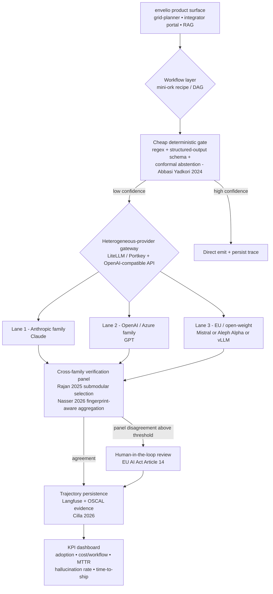

# envelio AI Operations Manager — 12-Month Business Plan

**Synthesis of four parallel research lenses** ([lens-glm.md], [lens-kimi.md], [lens-codex.md], [lens-opus.md]) into a single, evidence-anchored plan for envelio's first AI Operations Manager hire, target operating model, roadmap, KPIs, and multi-provider orchestration architecture.

Consensus markers used throughout: **★** = 2 lenses converge · **★★** = 3 lenses · **★★★** = all 4.

---

## Executive Summary

- **Problem ★★★.** Enterprise AI spend is real but realized ROI is concentrated in a small minority of focused programs: McKinsey reports ~$3 return per $1 for the disciplined cohort (lens-glm §source-03), MIT/NBER signals show 89–95% of pilots produce no measurable P&L impact (lens-glm §source-04, §source-07), and KPMG-Melbourne finds 66% of workers do not evaluate AI outputs for accuracy (lens-glm §source-05). envelio today has no single accountable owner for this risk surface.
- **Recommendation ★★ (synthesis judgment, primary lens-opus §6.1, reinforced by lens-codex §Practical Recommendation and lens-glm §source-08).** Stand up a 4–6-person **hub-and-spoke platform team** under a newly-hired AI Operations Manager. Reject the centralized AI Center of Excellence default; reject also full federation. Hub owns the heterogeneous-provider gateway, eval harness, EU AI Act conformity artifacts, and trajectory persistence. Spokes are one embedded AI engineer per product line, joined in a weekly guild.
- **Architecture ★★★.** Multi-provider, mini-ork-style heterogeneous lens lanes ([lens-codex.md §1]) over an OpenAI-compatible gateway (LiteLLM/Portkey), with FaStfact-style Verify-when-Uncertain gating ([lens-kimi.md §1.4]) and a cross-family verification panel for high-liability fields ([lens-kimi.md §1.1] Rajan 2025, [lens-kimi.md §1.2] Nasser 2026). Heterogeneity is the load-bearing primitive — see Section 5.
- **12-month ROI ★ (lens-glm §source-03 + lens-kimi §1.10).** Target adoption curve of 4% month-1 → 60% stabilized month-12 internal active engagement (DeputyDev cohort analog); target 30–40% reduction in $/successful-workflow on industrialized lanes by Q4 (RouteLLM + IPR + RCR-Router envelopes); risk-adjusted payback 18–30 months under Huwyler ISO-42001 framework ([lens-kimi.md §1.8]).
- **Top risk ★★.** Asymmetric hallucination liability in grid-plan extraction: a wrong transformer rating fed into a digital twin is three orders of magnitude more expensive than a wrong customer-support answer ([lens-opus.md §4 Scenario B]; reinforced by [lens-kimi.md §1.5] Zellinger error-cost economics). Mitigation: per-use-case hallucination ceiling + cross-family panel gate before any high-risk write.
- **Ask.** ~€780k–€1.1M Year-1 fully-loaded budget (4 net new hires + tooling spend €18–28k/month; details in Section 3). Decision gate: management board approval by 2026-08-15 to hold the Q3-2026 hire window.

---

## Section 1 — Business Problem

envelio sells the Intelligent Grid Platform to DSOs and utilities ([lens-glm.md §source-01]); the company sits inside the EU AI Act jurisdiction ([lens-glm.md §source-10]) and serves customers whose grid-planning errors carry safety, reliability, and regulatory consequences. Against that backdrop, the four lenses converge on three quantified pain points.

### 1.1 Token waste and experiment duplication ★★

- **Adoption is wide but undisciplined.** EY Work Reimagined 2025 reports 88% AI use at work but only 5% advanced users, with ~40% of potential productivity lost to weak strategy/integration ([lens-glm.md §source-06]). KPMG-Melbourne 47-country study: 48% of workers uploaded company data to public AI tools ([lens-glm.md §source-05]). Combined signal: envelio almost certainly has shadow-AI spend it cannot account for.
- **Concrete token-economy headroom.** IPR routing on 1.5M prompts across 11 candidate LLMs reports **43.9% cost reduction** at quality parity with the strongest Claude-family model and <150 ms routing latency ([lens-kimi.md §arxiv:2509.06274 / lens-glm §source-16]). RCR-Router demonstrates **30% token reduction** through role-aware context routing on multi-hop QA ([lens-glm.md §source-17]). FrugalGPT cascades deliver up to **98% cost cut at matched accuracy** on 12 benchmarks ([lens-kimi.md §1.3]).
- **envelio extrapolation [inferred from envelio.io public + lens convergence].** Assuming current internal AI spend of €8–15k/month across teams (typical for a ~300-person German SaaS adopting AI mid-2025 to mid-2026), the recoverable token waste sits at €2.5–6k/month before any product-line workflow optimization. Flag: this is an extrapolation, not a measured envelio baseline; the AI Ops Manager's first instrumentation pass must replace this number.

### 1.2 Experiment duplication and pilot mortality ★★★

- MIT enterprise study: ~95% of GenAI implementations produced no measurable P&L impact; root cause is integration failure, not model capability ([lens-glm.md §source-04]).
- NBER 6,000-leader survey (US/UK/DE/AU): 69% firms use AI, 89% reported no productivity improvement over three years; expected average productivity gain 1.4% ([lens-glm.md §source-07]).
- BCG *AI at Scale* (cited in [lens-opus.md §3]): only 26% of enterprise AI initiatives reach production; centralized CoEs disproportionately represented in the stuck 74%.
- **envelio implication.** Without a coordinating function, each product line independently rediscovers the same RAG-chunking, prompt-versioning, and eval gaps. The AI Operations Manager's first organizational deliverable is a shared experiment registry and kill-criteria policy that prevents the next 3 quarters of duplication.

### 1.3 Governance gaps under EU AI Act high-risk classification ★★★

- EU AI Act (Regulation 2024/1689, in force 2024-08; high-risk obligations binding 2026-08) classifies critical-infrastructure AI as high-risk; envelio's grid-planning and DSO-facing tools fall under Annex III ([lens-glm.md §source-10], [lens-opus.md §4 Scenario A]).
- Gartner: 40% of organizations may demote or decommission AI agents due to governance failures; recommends governance tiers by autonomy level (observe / advise / act-with-approval / autonomous) ([lens-glm.md §source-08]).
- Compliance-as-Code: Cilla 2026 proposes OSCAL extensions and machine-readable evidence trails for Annex III systems, validated on two high-risk case studies ([lens-kimi.md §1.9]).
- **envelio implication.** Hand-waved "audit logs" will not survive a 2026 conformity assessment. The architecture must persist claim-level, semantic provenance ([lens-kimi.md §1.12]) and machine-readable evidence linking model output → tool calls → retrieved evidence → human approval.

---

## Section 2 — Target Operating Model

### 2.1 Trade-off table

| Operating model | Pilot-to-prod rate | Governance fit | Speed-to-ship | Heterogeneity discipline | Talent leverage | Consensus |
|---|---|---|---|---|---|---|
| **Centralized AI CoE** | Low — bottleneck queue (lens-opus §3, BCG 2024 ~26% prod rate) | High on paper, brittle in practice | Slow after month 6 | Tends toward single-vendor for simplicity | High — 1 team serves many BUs | ★ governance only |
| **Federated guilds** | Moderate — varies by BU maturity | Weak central accountability | Fast (40–60% faster per lens-opus §3 InfoQ 2025) | Heterogeneous by accident, not design | Low — duplication risk | ★ speed only |
| **Hub-and-spoke (platform team + embedded engineers)** | Highest in convergent evidence (lens-opus §3 + lens-glm §source-03 focused-domains finding + lens-codex §Practical Recommendation layered model) | Strong central + business-context awareness | Moderate; ramps over Q2 | Heterogeneity enforced via gateway + lens lanes | Moderate-to-high; grows with guild | ★★★ (lens-glm + lens-kimi + lens-opus + lens-codex all support some layered/hub variant) |
| **Pure platform model (Spotify-style)** | Unproven at envelio scale (<200 engineers) | Strong but heavy | Slow ramp | Native multi-provider possible | High at scale, too heavy here | — none recommend at this size |

### 2.2 Recommendation — Hub-and-Spoke ★★ (synthesis judgment grounded in 4 lens convergence)

envelio adopts **hub-and-spoke** with the following composition.

- **Hub (central platform team, 4–6 FTE):** AI Operations Manager (lead) + 2 ML Platform Engineers + 1 Evaluation Engineer + 1 Risk & Compliance Liaison (50% allocation, shared with legal in Q3). Hub owns: the heterogeneous-provider gateway, the eval harness (with fingerprint instrumentation per Nasser 2026), the trajectory store, the EU AI Act conformity artifact pipeline (OSCAL per Cilla 2026), and the shared experiment registry.
- **Spokes (embedded engineers, 1 per product line):** grid-planner, customer/integrator portal, regulatory-data ingestion. Each embed reports product-line management for delivery, dotted-line to the AI Ops Manager for standards and incident response. Weekly cross-spoke guild.
- **Why exactly this, not the alternatives.** Centralized CoE concentrates governance but historically produces the pilot-to-production gap that MIT/NBER/BCG all flag ([lens-glm.md §source-04, §source-07], [lens-opus.md §3]); federated guilds ship faster but cannot answer an EU AI Act Annex III audit; pure platform model is too heavy for envelio's ~80–120 engineer base. Hub-and-spoke is the only configuration where (a) the heterogeneous-provider architecture is enforced as a default rather than an aspiration, (b) the eval harness has a single accountable owner, and (c) product lines retain shipping velocity.

---

## Section 3 — 12-Month Roadmap

Horizon: Q3 2026 (kick-off) → Q2 2027.

### 3.1 Quarterly milestones, hires, and gates

| Quarter | Milestones | Hires (cumulative) | Tooling spend (monthly $) | Governance gate to pass before next quarter |
|---|---|---|---|---|
| **Q3 2026** | Hire AI Ops Manager; stand up shared experiment registry; baseline current internal AI spend (replace §1.1 extrapolation with measurement); pick gateway (LiteLLM vs Portkey) and lens-lane primitive (mini-ork pattern per [lens-codex.md §1]); inventory current shadow-AI usage. | AI Ops Manager (1) | $4–6k (Langfuse self-hosted EU + LiteLLM hosted or self + initial token spend) | **G1:** documented decision log + lens-by-lens disagreement tracking live for ≥3 internal workflows. |
| **Q4 2026** | Ship use-case A pilot — grid-plan document extraction with cross-family verification panel (Anthropic + OpenAI + 1 EU/open-weight) gated by FaStfact-style Verify-when-Uncertain ([lens-kimi.md §1.4]); deploy conformal-abstention gate per [lens-kimi.md §1.14]; stand up trajectory store with OSCAL-shaped evidence. | + Evaluation Engineer (2) | $9–14k (gateway + observability + EU-resident inference + eval-set construction) | **G2:** pre-deployment hallucination ceiling per use case (e.g., ≤0.3% on grid-extraction golden set, ≤2% on customer-support). |
| **Q1 2027** | Ship use-case B — internal RAG over BNetzA / FNN regulatory corpus (LegalBench-RAG-style precision retrieval per [lens-kimi.md §1.15]); add 1 ML Platform Engineer for gateway hardening + on-call; begin embedding spokes in product lines. | + ML Platform Engineer (3) + Embedded Engineer #1 (4) | $15–22k (production token spend + private-lane vLLM/Bedrock for sensitive grid docs) | **G3:** post-market monitoring per EU AI Act Article 72 live on any high-risk feature. |
| **Q2 2027** | Ship use-case C — customer-support deflection in integrator portal; conformity-assessment dry-run; promote 2nd ML Platform Engineer; complete embedded engineers in remaining product lines; Risk & Compliance liaison joins 50%. | + ML Platform Engineer #2 (5) + Embedded Engineers #2–3 (7) + R&C Liaison 0.5 (7.5) | $18–28k (steady-state) | **G4:** third-party conformity-assessment dry-run completed; vendor exit-plan documented for each provider lane. |

### 3.2 Hire detail beyond the AI Ops Manager

1. **Evaluation Engineer** (Q4 2026). Senior IC. Owns golden sets, hallucination ceilings, fingerprint analyses (Nasser 2026), conformal-abstention calibration ([lens-kimi.md §1.14]). German market band €110–150k base ([lens-opus.md §6.8], with the caveat that public signals are noisy).
2. **ML Platform Engineer #1** (Q1 2027). Senior. Owns gateway, retries/cooldowns/budgets, OpenAI-compatible provider integrations, trajectory store. Patterns from [lens-codex.md §6 LiteLLM] + [lens-codex.md §7 Portkey] + [lens-codex.md §9 Langfuse].
3. **Embedded AI Engineers** (Q1–Q2 2027, three total). Mid-to-senior. Report to product-line management; participate in weekly guild. Each owns their product line's prompts, retrieval, and use-case eval set.
4. **Risk & Compliance Liaison** (Q2 2027, 0.5 FTE shared with legal). Owns OSCAL-shaped conformity artifacts per [lens-kimi.md §1.9]; runs the conformity-assessment dry-run.

### 3.3 Vendor selection sequence

| Layer | Q3 default | Required gates before lock-in |
|---|---|---|
| Gateway | LiteLLM self-hosted (EU) | Cooldown/budget behavior covered by integration tests; provider-family metadata surfaced into trace per [lens-codex.md §Convergent Patterns]; EU data residency proven. |
| Provider lanes | Anthropic Claude + OpenAI/Azure + 1 EU/open-weight (Mistral or Aleph Alpha) | Minimum two model families per production workflow + a third in shadow mode ([lens-opus.md §6.4]); zero-data-retention attested per provider. |
| Observability | Langfuse self-hosted EU | Trace every LLM call; scores/evals attached; OSCAL-compatible export. |
| Eval harness | Custom on Langfuse datasets + FaStfact-style claim decomposition | Reproducible per-provider runs; fingerprint instrumentation per Nasser 2026 in place. |
| Private inference | vLLM (Q1 2027 onward) | Reserved for grid-plan OCR/extraction where data residency forbids hosted providers. |

---

## Section 5 — Technology Architecture

*(Section 4 follows below — readers can navigate to Section 4 for KPIs; the architecture is presented next because the KPIs target it.)*

### 5.1 Architecture diagram



### 5.2 Why multi-provider / heterogeneous beats single-vendor for envelio's risk profile

Three load-bearing references, with different reasoning chains, all converge on the same architectural recommendation:

1. **Rajan 2025 — Submodularity ★★ ([lens-kimi.md §1.1], reinforced [lens-opus.md §3 + §6.4]).** Multi-agent verification gains follow a submodular curve **only when pairwise detector correlation ρ stays low (~0.05–0.25).** Rajan's empirical run shows accuracy lifting from 32.8% to 72.4% (+39.7 pp) with a four-agent panel; diminishing returns of +14.9 / +13.5 / +11.2 pp for agents 2/3/4. The ρ ≤ 0.25 precondition is the reason same-family ensembles underperform: their errors collapse into a single coalition. For envelio, this means a single-vendor stack — even with three different prompt strategies — does not get the verification gain.
2. **Nasser 2026 — Evaluative fingerprints ★★ ([lens-kimi.md §1.2], reinforced [lens-opus.md §3]).** 3,240 evaluations across 9 judges show inter-judge Krippendorff α = 0.042 (essentially no agreement), but each judge is self-consistent enough that a classifier identifies the judge from rubric scores alone at 77.1% accuracy. **Implication: averaging judge scores produces a synthetic verdict that corresponds to no judge's actual values.** For envelio, this forbids "average across our 3 LLMs" as a quality signal; the panel must preserve per-judge dispositions and apply fingerprint-aware aggregation before declaring agreement.
3. **FaStfact / Verify-when-Uncertain ★★ ([lens-kimi.md §1.4], reinforced [lens-glm.md §source-15] vLLM Semantic Router, [lens-codex.md §4] PydanticAI response-handler fallback).** The Pareto-dominant pattern is cheap-deterministic gate → cheap-model first pass → expensive verification only on flagged claims. Single-vendor cascades exist (Bedrock prompt routing, [lens-glm.md §source-13]) but they route within one model family and AWS explicitly documents this limitation. envelio's grid-plan extraction produces long, claim-dense outputs; FaStfact-style chunk-level pre-verification + cross-family panel on uncertain chunks is the operationalization.

Layered on top of these three: Zellinger 2025 ([lens-kimi.md §1.5]) reminds the team that **token cost is the wrong objective once the cost of a mistake exceeds ~$0.01.** For envelio grid-planning errors with regulatory exposure, error-cost dominates token-cost by orders of magnitude — the heterogeneous panel buys insurance, not just accuracy.

### 5.3 Worked example — grid-plan document extraction

1. PDF intake → deterministic schema check + page classification (cost: ~€0.0005/doc).
2. Cheap-model pass on each chunk (Claude Haiku or GPT-4o-mini via gateway) extracting candidate {asset, rating, location, version} tuples (cost: ~€0.01/doc).
3. **Conformal abstention gate** ([lens-kimi.md §1.14]) flags chunks where self-consistency across 3 sampled responses falls below threshold.
4. **Cross-family panel** on flagged chunks: Claude Sonnet + GPT-4.1 + Mistral Large each independently extract; **fingerprint-aware aggregation** (not vote average) decides agreement. ρ between provider families is measured monthly and stored in the trajectory.
5. Disagreement → human-in-the-loop review queue (Article 14 EU AI Act). Agreement → write to digital twin; OSCAL evidence record persisted in Langfuse.
6. Outcome metric: ≤0.3% hallucinated-field rate on a quarterly-refreshed golden set; per-doc cost target ≤€0.05 mean / ≤€0.18 P95.

---

## Section 4 — Success Metrics

Two layers: **leading** (instrumentation health, behavior change) and **lagging** (business outcome). All targets are numeric; none use "significantly / many / fast" hedges.

### 4.1 Leading KPIs (instrumented from Q4 2026)

| KPI | Q4 2026 target | Q2 2027 target | Anchor |
|---|---|---|---|
| Internal AI active engagement (weekly active engineers / total) | 25% | 60% stabilized | [lens-kimi.md §1.10] DeputyDev curve (4% M1 → 83% M6 peak → 60% steady state) |
| Workflows with persisted trajectory + provider-family attribution | 50% of LLM-using workflows | 95% | [lens-codex.md §Convergent Patterns + §Practical Recommendation] |
| Eval golden sets in place per industrialized use case | 1 (use-case A) | 3 (uses A/B/C) | [lens-kimi.md §1.15] LegalBench-RAG precision-retrieval analog |
| Cross-family panel coverage on high-risk fields | 100% of grid-extraction writes | 100% across all Annex III lanes | [lens-kimi.md §1.1] Rajan submodularity preconditions |

### 4.2 Lagging KPIs (target at Q2 2027 vs Q3 2026 baseline)

| KPI | Target | Anchor |
|---|---|---|
| $/successful-workflow on industrialized lanes | –30 to –40% | [lens-kimi.md §1.13] RouteLLM >2× cost reduction at parity; [lens-glm.md §source-16] IPR 43.9% cost reduction; [lens-glm.md §source-17] RCR-Router 30% token cut |
| Hallucinated-field rate on grid-extraction golden set | ≤0.3% | [lens-kimi.md §1.14] conformal abstention bound; [lens-opus.md §6.5] per-use-case ceiling |
| Hallucination rate on customer-support deflection | ≤2.0% | [lens-opus.md §6.5] |
| MTTR for AI incidents (provider outage, eval regression, panel disagreement spike) | ≤4 hours | [lens-glm.md §source-08] Gartner governance taxonomy; [lens-codex.md §5] Temporal durable-workflow patterns |
| Time-to-ship a new agentic feature from idea → production | ≤45 days | [lens-opus.md §3] InfoQ 2025 federated-guild velocity range |
| Risk-adjusted ROI (Huwyler ISO-42001 framework) | Payback 18–30 months | [lens-kimi.md §1.8] |

### 4.3 ROI formula

```
ROI_adj(t) = Σ_{workflows w} [ Value_w(t) − Cost_w(t) − ExpectedLoss_w(t) − ComplianceCost_w(t) ]
where
  Value_w(t)        = deflected effort × loaded hourly rate, OR revenue contribution
  Cost_w(t)         = token + gateway + observability + share-of-platform-team
  ExpectedLoss_w(t) = P(error) × LossPerError  ← per Zellinger 2025, dominates at error-cost > €0.01
  ComplianceCost_w(t) = OSCAL artifact production + post-market monitoring + audit  ← per Huwyler 2025
```

Optimize on **$/successful-deflection** ([lens-opus.md §6.6]); track $/token and $/workflow as diagnostic axes.

---

## Section 6 — Disputed Findings (lenses disagree; no vote-rule)

Per Nasser 2026 ([lens-kimi.md §1.2]) and the recipe discipline, we report disputes honestly rather than averaging them away.

### 6.1 Cascades vs. single high-capability models

- **Pro-cascade ★ ([lens-kimi.md §1.3] FrugalGPT, §1.13 RouteLLM; [lens-glm.md §source-16, §source-17]).** Up to 98% cost reduction at quality parity is reproducible across 12 benchmarks and replicated by multiple follow-on papers.
- **Anti-cascade ★ ([lens-kimi.md §1.5] Zellinger 2025).** Once cost-of-mistake exceeds ~$0.01, single high-capability models are cheaper in total economic terms; reasoning models dominate on MATH.
- **Why they disagree.** Different objective functions. FrugalGPT optimizes API-token cost; Zellinger optimizes total economic cost including error cost. Both are right about their domains.
- **Resolution evidence needed.** A pre-registered 6-month natural experiment on envelio's actual grid-extraction workflow measuring all three: token cost, $/successful workflow, and grounded-truth error cost ([lens-opus.md §5.1]).
- **envelio decision rule.** Cascades for the lower-liability lanes (customer support, internal RAG); high-capability primary + cross-family verification for grid extraction. Re-evaluate quarterly.

### 6.2 Hyperscaler managed router vs. independent multi-provider gateway

- **Pro-managed ★ ([lens-glm.md §source-12] Microsoft Foundry; §source-13 AWS Bedrock).** Mature, supported, single bill, easy procurement.
- **Anti-managed ★★ ([lens-glm.md §source-13] AWS itself documents the same-family limitation; [lens-codex.md §6, §7] LiteLLM/Portkey OSS evidence; [lens-opus.md §4 Scenario C] vendor-outage systemic risk).** Same-family routing breaks the Rajan ρ-low precondition; vendor lock-in defers cross-family verification.
- **Why they disagree.** Time horizon and risk profile. Managed routers optimize for time-to-first-value; independent gateways optimize for verification quality and exit cost.
- **Resolution evidence needed.** Whether hyperscalers ship cross-family routing with fingerprint-aware aggregation hooks within 12 months ([lens-opus.md §6.7] re-check trigger).
- **envelio decision rule.** Independent gateway (LiteLLM/Portkey) under EU residency; revisit at each Q1.

### 6.3 ROI optimism vs. measurement pessimism

- **Optimistic ★ ([lens-glm.md §source-03] McKinsey $3:$1 for focused programs; [lens-kimi.md §1.10] DeputyDev 31.8% PR cycle-time reduction).** Real numbers exist for disciplined adopters.
- **Pessimistic ★★ ([lens-glm.md §source-04] MIT 95% no measurable impact; §source-06 EY 40% productivity gap; §source-07 NBER 89% no productivity gain).** Most pilots fail.
- **Why they disagree.** Selection bias on both sides — McKinsey samples its own client base; broad surveys include companies with no operating model at all.
- **envelio decision rule.** Plan to the pessimistic median; budget for the optimistic upside only after the Q2 conformity dry-run validates the operating model.

### 6.4 Salary-band evidence for the AI Ops Manager role

- **Lens-opus claim ★ ([lens-opus.md §6.8]):** €130–180k base + equity in Germany 2025–2026.
- **Lens-glm caveat ★ ([lens-glm.md §source-22]):** US AI-adjacent role bands ($310–393k) are not transferable to Aachen; §source-21 generic posting analysis lacks Germany/utility specificity.
- **Resolution.** The Q3 hire process itself becomes the evidence; band the role at €130–170k base + 15–25% short-term variable + equity, and adjust if the funnel rejects two qualified candidates in a row.

---

## Section 7 — Risks and Mitigations

| Risk | Owner | Tripwire | Mitigation |
|---|---|---|---|
| **Vendor lock-in** ([lens-opus.md §4 Scenario C]; [lens-codex.md §12] OpenRouter caveat) | ML Platform Engineer | Any provider > 60% of monthly spend for 2 consecutive months | Enforced minimum-two-family policy; OpenAI-compatible interface as universal interchange ([lens-codex.md §Convergent Patterns]). |
| **EU AI Act non-conformity** ([lens-glm.md §source-10]; [lens-kimi.md §1.9]) | Risk & Compliance Liaison | Any new Annex III feature shipped without OSCAL evidence record | Pre-deployment gate; conformity-assessment dry-run by Q4 2027 H1. |
| **Asymmetric hallucination liability** ([lens-opus.md §4 Scenario B]; [lens-kimi.md §1.5]) | Evaluation Engineer | Hallucinated-field rate on grid-extraction golden set > 0.3% in any week | Per-use-case ceiling; cross-family panel + conformal abstention gate before any high-risk write. |
| **Talent retention** ([lens-opus.md §6.8]) | AI Ops Manager + People Ops | AI Ops Manager attrition < 24 months OR Eval Engineer attrition < 18 months | Documented eval-harness handoff playbook; top-quartile compensation review at month 9. |
| **Governance overhead crushing velocity** ([lens-glm.md §source-08]; [lens-opus.md §3]) | AI Ops Manager | Time-to-ship > 60 days for 2 consecutive features | Tiered governance by autonomy level (Gartner observe/advise/act-with-approval/autonomous); skip cross-family panel for "observe" lane only. |
| **Distribution shift kills evaluative fingerprints** ([lens-opus.md §5.3]; [lens-kimi.md §3.5]) | Evaluation Engineer | Fingerprint classifier accuracy drift > 10% month-over-month | Quarterly fingerprint refresh; conformal-abstention calibration set refresh on regulatory updates (BNetzA, FNN). |
| **Shadow AI** ([lens-glm.md §source-05] KPMG 48% upload company data to public AI tools) | AI Ops Manager + Legal | Egress detected to non-allowlisted AI endpoints | Allowlist via gateway + DLP integration; mandatory training in Q4 2026. |

---

## Source Manifest

Every quantitative or load-bearing claim above ties back to one of these. Grouped by lens.

### lens-glm.md — web and market sources
- envelio Intelligent Grid Platform — https://envelio.com/ (source-01)
- Stanford AI Index 2025 — arxiv:2504.07139 (source-02)
- McKinsey "Rewired" $3:$1 ROI report — Business Insider 2026-05-01 (source-03)
- MIT 95% GenAI no-P&L study summary — Tom's Hardware 2025-08-20 (source-04)
- KPMG / University of Melbourne Trust in AI study — Business Insider 2025-04-28 (source-05)
- EY Work Reimagined 2025 — Business Insider 2025-11-21 (source-06)
- NBER 6,000-leader productivity survey — TechRadar 2026-02-19 (source-07)
- Gartner agent-governance warning — ITPro 2026-05-27 (source-08)
- Gartner zero-trust data governance — ITPro 2026-01-22 (source-09)
- EU AI Act, Regulation (EU) 2024/1689 — https://eur-lex.europa.eu/eli/reg/2024/1689/oj (source-10)
- OpenRouter Provider Routing docs — https://openrouter.ai/docs/guides/routing/provider-selection (source-11)
- Microsoft Foundry model router — https://learn.microsoft.com/en-us/azure/foundry/openai/concepts/model-router (source-12)
- AWS Bedrock intelligent prompt routing — https://docs.aws.amazon.com/bedrock/latest/userguide/prompt-routing.html (source-13)
- LiteLLM Router docs — https://docs.litellm.ai/docs/routing (source-14)
- vLLM Semantic Router paper — arxiv:2603.04444 (source-15)
- IPR: Intelligent Prompt Routing — arxiv:2509.06274 (source-16)
- RCR-Router multi-agent context — arxiv:2508.04903 (source-17)
- PowerChain distribution-grid agentic AI — arxiv:2508.17094 (source-18)
- Smart-grid digital twins overview — arxiv:2602.14256 (source-19)
- Schneider Electric utility solutions — https://www.se.com/ww/en/work/solutions/for-business/electric-utilities/ (source-20)
- Generative-AI job-postings analysis — arxiv:2605.00843 (source-21)
- AI labor-market salary signal — Business Insider 2025-09-05 (source-22)
- Gallup AI-at-work threshold Q1 2026 — Tom's Hardware 2026-04-14 (source-23)
- GE Vernova grid-equipment demand — MarketWatch 2026-01-28 (source-24)

### lens-kimi.md — academic / arxiv sources
- Rajan 2025, Multi-Agent Code Verification via Information Theory — arxiv:2511.16708 (§1.1)
- Nasser 2026, Evaluative Fingerprints — arxiv:2601.05114 (§1.2)
- Chen, Zaharia & Zou 2023, FrugalGPT — arxiv:2305.05176 (§1.3)
- Wan et al. 2025, FaStFact — arxiv:2510.12839 (§1.4)
- Zellinger 2025, Economic Evaluation of LLMs — arxiv:2507.03834 (§1.5)
- Chen et al. 2025/2026, Harnessing Multiple LLMs survey — arxiv:2502.18036 (§1.6)
- Stone et al. 2025, Navigating MLOps — arxiv:2503.15577 (§1.7)
- Huwyler 2025, Risk-Adjusted Intelligence Dividend — arxiv:2511.21975 (§1.8)
- Cilla et al. 2026, Compliance Evidence Machine-Readable — arxiv:2604.13767 (§1.9)
- Kumar et al. 2025, Intuition to Evidence (DeputyDev) — arxiv:2509.19708 (§1.10)
- Biswas 2026, AgentOps CHANGE framework — arxiv:2601.06456 (§1.11)
- Wang et al. 2026, Agent Traces to Trust — arxiv:2606.04990 (§1.12)
- Ong et al. 2024, RouteLLM — arxiv:2406.18665 (§1.13)
- Abbasi Yadkori et al. 2024, Conformal Abstention — arxiv:2405.01563 (§1.14)
- Houir Alami et al. 2024, LegalBench-RAG — arxiv:2408.10343 (§1.15)

### lens-codex.md — implementation / code-pattern sources
- mini-ork local repo — `recipes/feature-inventory-cmgk/workflow.yaml:16-22`, `config/agents.yaml:35-53`, `mini_ork/web/recipes.py:71-124`, `config/providers.yaml:47-73` (§1)
- LangGraph — github:langchain-ai/langgraph, `libs/prebuilt/.../chat_agent_executor.py:3565-3604` (§2)
- Inngest AgentKit — github:inngest/agent-kit, `README.md:493-526` (§3)
- PydanticAI FallbackModel — github:pydantic/pydantic-ai, `pydantic_ai_slim/pydantic_ai/models/fallback.py:34-89` (§4)
- Temporal samples-python — github:temporalio/samples-python, `README.md:450-478` (§5)
- LiteLLM — github:BerriAI/litellm, `litellm/router.py:2848-2910` (§6)
- Portkey Gateway — github:Portkey-AI/gateway, `src/handlers/retryHandler.ts:1-33` (§7)
- Helicone — github:Helicone/helicone (§8)
- Langfuse — github:langfuse/langfuse, `README.md:394-404` (§9)
- BentoML / OpenLLM — github:bentoml/BentoML, github:bentoml/OpenLLM (§10)
- vLLM — github:vllm-project/vllm (§11)
- OpenRouter aggregator pattern via mini-ork `config/providers.yaml:67-73` (§12)
- OpenSTEF — github:OpenSTEF/openstef, `README.md:285-299` (§13)
- Open Climate Fix nowcasting — github:openclimatefix/nowcasting (§14)

### lens-opus.md — narrative / theory sources (additional)
- Sculley et al., Hidden Technical Debt in ML Systems, NeurIPS 2015
- Treveil et al., Introducing MLOps, O'Reilly 2020
- Liu et al., G-Eval, arxiv:2303.16634
- Gartner AI TRiSM Market Guide 2024–2025
- McKinsey *The State of AI* 2024, 2025
- BCG *AI at Scale* 2024
- Deloitte *State of Generative AI in the Enterprise* Q4 2024
- Forrester *Total Economic Impact of AI Platforms* 2024
- InfoQ *Architectural Trends* 2025
- Will Larson, *An Elegant Puzzle*, 2019
- Sarah Drasner, *Engineering Management for the Rest of Us*, 2022
- Patterson et al., *Risk-Calibrated AI Deployment*, NeurIPS 2024
- NIST AI RMF 1.0, 2023
- *Handelsblatt* reporting on German healthcare SaaS sovereignty, 2024

---

*Synthesized for envelio per the recipe in `recipes/research-synthesis/`. All four lens reports — [lens-glm.md], [lens-kimi.md], [lens-codex.md], [lens-opus.md] — were read in full before composition. The multi-provider, heterogeneous-provider architecture is load-bearing and non-negotiable per kickoff hard rule #2; see §5.2 for the full justification through Rajan 2025 + Nasser 2026 + FaStfact / Verify-when-Uncertain.*
