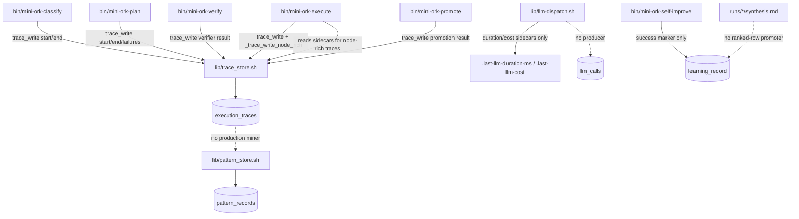

# Architecture Lens — iter 34

## Bottlenecks under analysis

Inputs read:

- `lens-bottleneck.md` for iter-34 ranked rows. The expected `bottleneck-scan.md` file was not present; `lens-bottleneck.md` is the bottleneck scanner output in this run.
- `state.db` tables: `llm_calls`, `pattern_records`, `learning_record`, `self_improve_arxiv_refs`, `execution_traces`.
- Current checkout at HEAD `8f11814`.

Architecture-category rows and architecture-adjacent rows under analysis:

| Rank | Category | Bottleneck | Lens decision |
|---:|---|---|---|
| 2 | arch | `llm_calls` is dead schema: 0 rows globally, no writer | Keep. It is a leaky observability boundary between dispatch and database telemetry. |
| 5 | correctness/arch | `trace_write ... >/dev/null 2>&1 || true` hides trace/schema failures | Keep. It is an architectural fault-isolation smell because every caller owns failure policy locally. |
| 6 | arch | `pattern_records` table has 0 rows despite schema and library | Keep. It shows promotion-pipeline coupling: tests seed patterns, production self-improve does not mine them. |
| 7 | arch | synthesis to `learning_record` promotion gap persists | Keep as related, but treat as second-order behind the pattern/promotion seam to avoid duplicating prior iter-33 patch plans. |

Current state checks:

```text
sqlite> SELECT COUNT(*) FROM llm_calls;
0

sqlite> SELECT COUNT(*) FROM pattern_records;
0

sqlite> SELECT task_class, COUNT(*), AVG(duration_ms)
   ...> FROM execution_traces
   ...> WHERE created_at > '2026-06-09T00:00:00Z'
   ...> GROUP BY task_class;
generic|61|28874.1803278689
recursive_self_improve|87|0.0
```

## Current module map (relevant slice)



```text
dispatch -> sidecars -> execute rich trace -> execution_traces
   |                                      |
   `-- missing per-call ledger ----------`--> llm_calls stays empty

execution_traces -> missing miner -> pattern_store -> pattern_records stays empty
synthesis.md      -> missing promoter -----> learning_record gets success marker only
```

## Refactor candidates

### Candidate 1

- **Smell name:** dead telemetry table / sidecar-only dispatch accounting
- **Where it lives:**
  - `db/migrations/0002_mini_orch_sessions.sql:219-241` defines `llm_calls` with provider, model, tier, tokens, cost, duration, traceparent, and metadata fields.
  - `lib/llm-dispatch.sh:48-51` writes only `.last-llm-duration-ms`.
  - `lib/llm-dispatch.sh:453-467` computes duration and copies `.last-llm-cost`, but does not insert into `llm_calls`.
  - `recipes/recursive-self-improve/workflow.yaml:23-35` dispatches multiple paid model lanes whose provider usage should be attributable.
- **Why it's a problem:** the architecture has two telemetry surfaces with different truth values. `execution_traces` can show node-level success, but `llm_calls` cannot answer provider-policy, model-cost, or per-lane latency questions because it has no producer. Worked example: iter-34 verifier `v8_provider_policy_respected` wants to detect researcher to Anthropic drift, but the only table shaped for provider/model queries is empty. Fixing the table name alone would still return a false-safe count.
- **Refactor sketch:** introduce a single ledger boundary invoked by `llm_dispatch` after every model call:
  - `mo_llm_call_record provider model_id tier feature_name actor run_id iter duration_ms cost_usd status metadata_json`
  - keep sidecars as a compatibility shim for existing execute enrichment.
  - derive provider/tier from the lane config already resolved by dispatch; when unknown, record `provider='unknown'` and `status='failed'` rather than dropping the row.
- **Migration plan:**
  1. Add the ledger helper behind a no-op-safe feature flag, e.g. `MO_LLM_CALL_LEDGER=1`, default on for self-improve.
  2. Keep writing `.last-llm-duration-ms` and `.last-llm-cost` for `_trace_write_node_rich`.
  3. Backfill nothing initially; make dashboards label pre-ledger windows as unavailable rather than zero.
  4. Update provider-policy verifiers to query `llm_calls` only after asserting the table has rows in the target time window.
- **New infra needed:** one new helper, `lib/llm_call_ledger.sh`, not a new database. This is required because ledger insertion needs shared provider/model/status normalization at the dispatch boundary; scattering `sqlite3 INSERT` snippets across `bin/*` would recreate the current trace-write duplication. arXiv grounding from the existing arxiv research lane: `self_improve_arxiv_refs` contains `2602.10133` ("duration_ms capture wrapper", mapped to `lib/llm-dispatch.sh`, confidence `0.85`) and `2602.19065` ("time shim portability", mapped to `lib/llm-dispatch.sh`, confidence `0.78`), both supporting boundary-level instrumentation rather than per-caller timing.

### Candidate 2

- **Smell name:** silent trace-write suppression
- **Where it lives:**
  - `lib/trace_store.sh:44-51` documents a prior outage: schema drift caused every insert to fail while callers suppressed errors.
  - `bin/mini-ork-plan:108`, `bin/mini-ork-plan:302`, `bin/mini-ork-plan:316`, `bin/mini-ork-plan:492`, `bin/mini-ork-plan:500`, `bin/mini-ork-plan:507`, `bin/mini-ork-plan:515`, `bin/mini-ork-plan:522`, `bin/mini-ork-plan:572` each call `trace_write ... >/dev/null 2>&1 || true`.
  - `bin/mini-ork-classify:113` and `bin/mini-ork-classify:304` use the same suppression.
  - `bin/mini-ork-execute:240`, `bin/mini-ork-execute:363`, `bin/mini-ork-execute:960` use the same suppression around both run-level and rich node traces.
  - `bin/mini-ork-verify:119`, `bin/mini-ork-verify:317`, `bin/mini-ork-promote:130`, `bin/mini-ork-promote:201`, `bin/mini-ork-promote:262` repeat the pattern.
- **Why it's a problem:** write-failure policy is duplicated at every caller, so the control plane cannot distinguish "trace store unavailable, continue" from "trace schema drift, self-improve data is corrupt." Worked example: if a migration renames `duration_ms`, `mini-ork-plan` will still exit according to planner status, while the self-improve scanner later treats missing or zero data as a real performance signal.
- **Refactor sketch:** add a central best-effort wrapper such as `mo_trace_write_best_effort "$payload" "$phase"`:
  - writes trace payload through `trace_write`.
  - on failure, appends stderr, phase, run id, and payload hash to `${MINI_ORK_RUN_DIR}/trace-write-errors.log`.
  - returns success by default for non-critical phases, but can be strict under `MO_TRACE_STRICT=1` for tests and self-improve verifiers.
- **Migration plan:**
  1. Add the wrapper in `lib/trace_store.sh` or a small adjacent helper.
  2. Mechanically replace caller-side `trace_write ... || true` with `mo_trace_write_best_effort`.
  3. Keep run behavior best-effort in production to avoid making observability a single point of failure.
  4. Add one regression test that forces a bad `MINI_ORK_DB` path and asserts `trace-write-errors.log` is created.
- **New infra needed:** no additional infrastructure beyond the single helper already proposed in Candidate 1 if it is implemented as a combined telemetry boundary, or no new infra if placed inside `lib/trace_store.sh`.

### Candidate 3

- **Smell name:** promotion pipeline split-brain
- **Where it lives:**
  - `recipes/recursive-self-improve/task_class.yaml:4-11` promises persistence to `pattern_records + learning_record`.
  - `recipes/recursive-self-improve/workflow.yaml:4-11` repeats that cross-iteration learning is persisted through `lib/pattern_store.sh + learning_record`.
  - `recipes/recursive-self-improve/artifact_contract.yaml:9-14` says failed patches preserve reports for `pattern_store` ingestion and then record a `learning_record` row.
  - `lib/pattern_store.sh:52-145` implements a working `pattern_store` upsert.
  - `bin/mini-ork-self-improve:178-217` records only a success marker row in `learning_record`.
  - `bin/mini-ork-self-improve:481-484` calls `_self_improve_record_success` after commit, but no nearby call promotes ranked synthesis rows or pattern records.
- **Why it's a problem:** the recipe contract says the loop learns from repeated patterns, but the runner only records successful commits. Worked example: iter-34 had to manually dedupe against `learning_record` and scrape prior markdown because the structured pattern table has zero rows and previous ranked candidates did not land as queryable pattern records.
- **Refactor sketch:** split promotion into two explicit phases:
  - `synthesis_promoter`: parse `synthesis.md` ranked rows into `learning_record` candidates with stable title/category/rank keys.
  - `pattern_miner`: cluster repeated `execution_traces` failure/verdict patterns into `pattern_records` using `pattern_store`.
  The runner should call both on success and on verifier failure, because failures are often the highest-value learning events.
- **Migration plan:**
  1. Add idempotent insertion keyed by `(run_id, iter, rank, title)` at the synthesis promoter.
  2. Preserve existing `_self_improve_record_success` meta row for back-compat; it remains useful as a commit marker.
  3. Let the bottleneck scanner prefer structured `learning_record`/`pattern_records` rows, with markdown scrape as fallback for older runs.
  4. Start with failed-run ingestion disabled behind `MO_SELF_IMPROVE_PROMOTE_FAILURES=1` until the parser has one full-cycle test.
- **New infra needed:** none. `lib/pattern_store.sh` and `learning_record` already exist; the missing piece is runner wiring and idempotent parsing.

### Candidate 4

- **Smell name:** verifier surface gap through schema-name drift
- **Where it lives:**
  - `db/migrations/0017_self_improve_learning.sql:30-52` defines `learning_record` columns; there is no `fingerprint` or `status` column.
  - Current `learning_record` rows show `outcome`, not `status`, as the lifecycle field.
  - `db/migrations/0002_mini_orch_sessions.sql:220-241` defines `llm_calls`; there is no `llm_dispatch` table.
  - `recipes/recursive-self-improve/verifiers/bottlenecks-found.sh:36-43` explicitly accepts missing `lens-arxiv.md` and relies on the synthesizer to enforce infra citation rules, so verifier surfaces are intentionally narrow.
- **Why it's a problem:** verifier contracts can pass or fail for reasons unrelated to the architectural invariant they claim to check. Worked example: a verifier query against a non-existent provider table might become a syntax error, an empty result, or a shell-pipe false positive depending on the wrapper; none of those outcomes proves provider-policy compliance.
- **Refactor sketch:** add a verifier-contract preflight step before executing shell checks:
  - run each SQL verifier through `sqlite3 ... "EXPLAIN QUERY PLAN ..."` or a schema check when the command is tagged as SQL.
  - fail with `verifier_contract_schema_error` before interpreting row counts.
  - require every schema-sensitive verifier to name the table and columns it depends on in a small JSON envelope.
- **Migration plan:**
  1. Keep existing shell verifier commands as the execution back-compat path.
  2. Add optional metadata fields: `tables_required`, `columns_required`, `empty_window_policy`.
  3. Teach the verifier runner to preflight metadata when present and skip preflight for legacy checks.
  4. Convert self-improve verifiers first because they are the source of dedupe and promotion trust.
- **New infra needed:** none for iter-34. This is verifier-runner validation logic over existing SQLite schema.

## Anti-patterns to keep avoiding

`pattern_records` is empty in this state database, so there are no promoted prior anti-pattern rows to reaffirm directly from that table. The nearest durable substitutes are `learning_record` rows and inline postmortem comments:

- Avoid imaginary schema contracts. Prior resolved work includes `learning_record` row `id=1`, "Verifier verdict JSON adapter", and the current scan found the same class in verifier SQL/table drift.
- Avoid caller-local best-effort persistence. `lib/trace_store.sh:44-51` records that suppressed trace failures caused multi-cycle data loss; the same suppression pattern still appears in plan/classify/execute/verify/promote call sites.
- Avoid recipe promises without runner ownership. The recursive self-improve recipe promises `pattern_records + learning_record`, but the outer runner is the only component positioned to promote synthesis and failure patterns reliably.
- Avoid replacing missing producer problems with dashboard or verifier patches. A query against `llm_calls` is only meaningful after `llm_dispatch` records per-call rows.

## Open questions

- Should the first iter-34 implementation target the shared trace-write wrapper or the `llm_calls` ledger? They are adjacent, but one iteration should ship only one cluster. My recommendation is the trace-write wrapper first if the goal is fault isolation, and the `llm_calls` ledger first if the goal is provider-policy verification.
- Should failed self-improve runs promote patterns immediately, or only after a synthesis/verifier gate marks the pattern as recurring? Immediate promotion improves learning recall but risks noisy rows.
- Should provider-policy checks treat an empty `llm_calls` time window as failure or "not observable"? For self-improve, empty should fail once the ledger exists; before that migration, it should be an explicit `unobservable` state.
