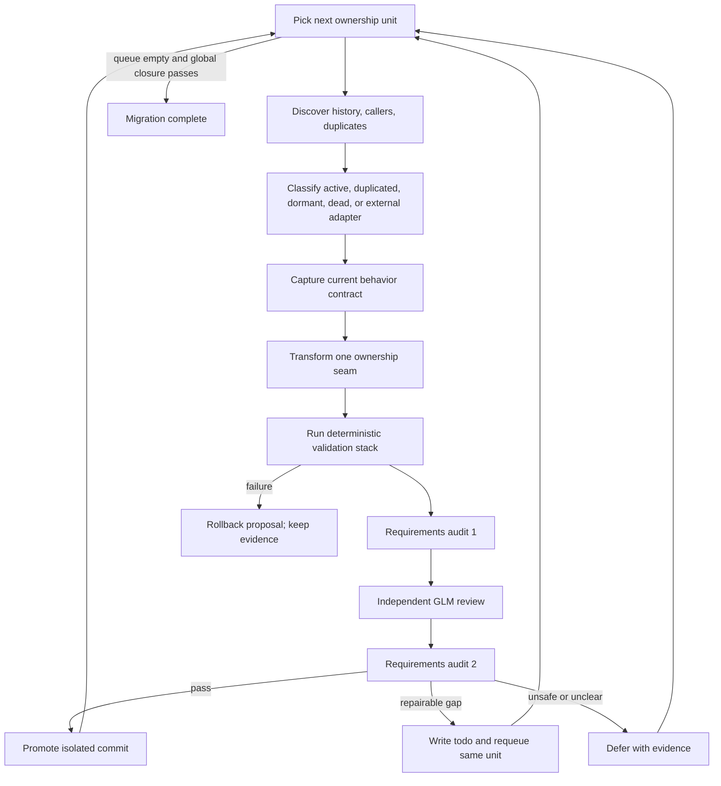

# Ported-module ownership — recursive migration plan

_Status: Phase 0 inventory passed on 2026-07-20 at baseline `c7ccc512` with
126/126 modules, zero deletion authorizations, Kimi history synthesis, GLM 5.2
review, and 38/38 deterministic checks. The similarity seed unit is complete:
pure ranking now lives at `mini_ork/similarity.py`, the context assembler uses
its raw-score API, 30 focused tests and Pyright pass, and the GLM 5.2
implementation review requires no repairs. Refresh Phase 0 after promotion
before selecting the next unit._

## Goal

Give every module under `mini_ork/ported/` one explicit owner and one terminal
decision:

- **integrate** useful behavior into the canonical Python runtime;
- **retain** an intentional boundary or dormant capability with a named owner;
- **delete** code that has no caller, requirement, unique behavior, fixture, or
  supported public contract.

The migration is complete only when runtime behavior has one canonical
implementation, callers and tests use it, obsolete Bash and duplicate Python
implementations are retired, and the affected feature passes focused and
end-to-end validation.

## Why a new recursive plan is required

The existing `self-migrate` recipe closes top-level entrypoint forks. It assumes
an entrypoint-shaped unit: a Bash executable, a Python replacement, and inbound
callers. Lower-level libraries do not always have that shape. A file can be:

- ported but never imported;
- duplicated inside a runtime module;
- kept only as a parity or benchmark fixture;
- an intentional external-process adapter;
- unused today but still required by a documented product contract.

Therefore, do not feed the whole `mini_ork/ported/` directory to
`scripts/recursive-migrate.sh`. That script is a leaf-tail driver and cannot
prove ownership of duplicated or dormant behavior.

## Safety invariants

1. Work from an isolated worktree created from current `main`.
2. One ownership seam per change. Do not combine unrelated modules.
3. Capture the old contract before changing either implementation.
4. Never delete a file merely because a text-reference scan is empty.
5. Preserve intentional subprocess boundaries for providers, Git, executable
   verifiers, and other external tools unless their boundary is the named unit.
6. A Bash file may be retired only after all runtime, test, integration, E2E,
   security, benchmark, and fixture dependencies have moved or been explicitly
   removed with replacement coverage.
7. Use explicit Git pathspecs. Do not stage runtime state, credentials, local
   provider configuration, generated reports, or unrelated cleanup.
8. Before merge, inspect the complete diff for secrets and OSS readiness.
9. Before and after implementation, audit the task requirements and relevant
   `docs/` requirements. Any gap becomes a timestamped file under `docs/todos/`
   and is requeued; it is not waived.
10. A failed gate preserves evidence and leaves `main` unchanged.

## Provider policy

Agentic runs use only these lanes:

| Responsibility | Lane | Purpose |
|---|---|---|
| discovery and history synthesis | Kimi | broad inventory and intent reconstruction |
| implementation and focused repair | Codex | source and test changes |
| ownership judgment and review | GLM 5.2 | independent classification and final verdict |
| gates | deterministic verifier | commands, schemas, tests, and closure scans |

Load Kimi and GLM credentials process-locally from
`/Users/admin/ps/scripts/cl_kimi.sh` and `cl_glm.sh`. Use a temporary
`MINI_ORK_HOME`; never copy credential values into the repository or run
artifacts. MiniMax, DeepSeek, Opus, and implicit provider fallback are outside
this plan.

## The recursive unit

The outer controller owns a queue of modules. Each queue item executes one
acyclic mini-ork workflow and can finish only as `promote`, `defer`, or
`rollback`.



The apparent cycle is controlled outside the recipe. The planned recipe itself
remains a DAG, as required by `schemas/workflow.schema.json`:

1. `history_memory_mapper` — Kimi reconstructs original intent from Git,
   ContextNest session evidence, current docs, and the Bash predecessor.
2. `ownership_mapper` — deterministic scans produce the complete inbound,
   outbound, duplicate, test, fixture, and benchmark map.
3. `classifier` — GLM assigns a classification and proposed terminal decision.
4. `contract_capture` — deterministic probes record behavior before edits.
5. `migrator` — Codex makes one bounded ownership change.
6. `contract_verifier` — parity or golden behavior checks.
7. `feature_verifier` — focused unit/integration/E2E checks for the consumer.
8. `closure_verifier` — checks sole ownership and retirement blockers.
9. `requirements_audit` — checks the task, this plan, and relevant docs.
10. `reviewer` — GLM emits the final evidence-backed verdict.
11. `publisher` or `rollback` — emits a proposal; it never mutates `main`.

The operator promotes a passing proposal. An agentic verdict cannot override a
failed deterministic gate.

## Phase 0 — report-only inventory

Before editing code, create `ported-module-inventory.json` in the run directory
with one row for every `mini_ork/ported/*.py` file. Do not commit the generated
inventory.

Each row must contain:

- module path and Bash predecessor, if any;
- public functions/classes and current runtime importers;
- subprocess or source boundaries called by the module;
- same or substantially equivalent behavior implemented elsewhere;
- unit, integration, E2E, security, parity, benchmark, and fixture references;
- current docs and product requirements;
- relevant Git commits and ContextNest session IDs;
- classification, proposed decision, owner, confidence, and unresolved risks.

The inventory gate fails if any module is missing or any row lacks evidence for
its proposed decision. Only after the report passes may the controller enqueue
implementation units.

## Classification and terminal decisions

| Classification | Meaning | Default action |
|---|---|---|
| active | imported by a supported runtime path | move to a canonical package if needed; keep and test |
| duplicated | useful behavior has two implementations | integrate one canonical implementation, then remove the duplicate |
| dormant | no current caller, but history/docs preserve intent | retain with explicit owner or make a reviewed product decision |
| dead | no caller, requirement, unique behavior, fixture, or public contract | delete code and obsolete tests/docs together |
| external adapter | process boundary is part of the design | retain the boundary and document it |

Deletion requires all of the following evidence:

- no executable runtime caller, including dynamic path construction;
- no distinct behavior absent from the proposed canonical owner;
- no current product, operator, schema, or migration requirement;
- no supported import/API contract;
- no required test, benchmark, corpus, golden, or parity fixture;
- affected tests pass after removal;
- global closure scan finds no dangling reference.

If one condition is unknown, classify the unit as `dormant` or `defer`; do not
guess `dead`.

## Per-module execution contract

### 1. Discover

- Reconstruct why the Bash and Python files were introduced and later changed.
- Search ContextNest for the module, predecessor, consumer, and migration run.
- Map static imports and dynamic subprocess/source invocations.
- Identify duplicate algorithms and policy embedded in callers.
- Record all tests and fixtures before deciding what is obsolete.

### 2. Capture the contract

Create a pre-change evidence artifact that defines inputs, outputs, exceptions,
side effects, ordering, thresholds, rounding, stdout/stderr, exit codes, and
best-effort failure behavior. Prefer deterministic golden cases. Use a live
provider probe only when the contract crosses an LLM boundary.

### 3. Transform one seam

- **Integrate:** move or import the canonical implementation, repoint callers,
  remove the duplicate, and preserve policy at the appropriate layer.
- **Retain:** move it out of `ported/` when it is canonical, name the owner, and
  attach direct tests; otherwise document why `ported/` is intentionally kept.
- **Delete:** delete the implementation plus only the tests/docs/fixtures made
  obsolete by that exact removal.

### 4. Verify

Every unit must pass, in this order:

1. pre-change parity/golden evidence exists;
2. focused unit and contract tests;
3. affected integration/E2E/security test or feature-acceptance probe;
4. focused Pyright with zero errors;
5. runtime ownership scan: intended caller imports the canonical module;
6. duplicate scan: the retired algorithm is not still embedded elsewhere;
7. retirement scan across runtime, tests, scripts, docs, and benchmarks;
8. `git diff --check` and an explicit-path scope review;
9. secret and OSS-readiness review;
10. the two requirements audits.

For a provider-routing or LLM-boundary unit, add a real, non-dry-run provider
probe with redacted evidence. For pure deterministic logic, do not spend a
provider call merely to satisfy ceremony.

### 5. Promote or roll back

A passing unit is committed on its isolated branch using explicit pathspecs,
then merged into a clean `main`, pushed to `origin`, and verified with:

```bash
test "$(git rev-parse main)" = "$(git rev-parse origin/main)"
git merge-base --is-ancestor <unit-commit> origin/main
```

Before merge, a failing proposal is abandoned without touching `main`. After
merge, rollback uses `git revert <unit-commit>` and reruns the same validation;
never rewrite shared history.

## Seed unit — `similarity.py`

The first unit is deliberately preclassified as **duplicated**, pending fresh
inventory confirmation:

- `mini_ork/ported/similarity.py` contains the pure tokenization, term
  frequency, cosine, and ranking logic.
- the supported runtime behavior is duplicated inside
  `mini_ork/context_assembler.py` rather than importing the port;
- the original feature contract retrieves similar lessons from bug, gradient,
  and learning records, applies a `0.15` threshold, keeps the top three per
  source, and preserves citations and suggested fixes.

Expected implementation shape:

1. move the pure module to a canonical path such as `mini_ork/similarity.py`;
2. import it from `context_assembler.py` and remove the duplicate algorithm;
3. keep database access and retrieval policy in the context-assembler layer;
4. sort using unrounded scores, rounding only the reported value;
5. preserve missing-table best-effort behavior;
6. add direct tests for exact lesson shape, threshold boundaries, ties,
   top-three selection, and missing tables;
7. delete the obsolete port test only if replacement coverage is demonstrably
   stronger.

This unit must not delete similarity behavior. Its purpose is to make the
ported implementation the canonical runtime owner.

### Similarity closure — 2026-07-20

- `mini_ork/ported/similarity.py` moved to `mini_ork/similarity.py` without a
  compatibility shim.
- `mini_ork/context_assembler.py` imports `rank_raw`; the duplicated
  tokenization, term-frequency, cosine, and ranking implementation is removed.
- Database access, the three source tables, the 2,000-row cap, inclusive
  `0.15` threshold, top-three-per-source selection, citations, suggested fixes,
  four-decimal output, and missing-table best-effort behavior remain in the
  context-assembler layer.
- Raw scores determine ordering before reported values are rounded.
- Focused verification: 30 pytest cases passed; focused Pyright reported zero
  errors; mini-ork validate and garden completed with zero errors; GLM 5.2
  review passed without required repairs.

## Queue order after similarity

Rebuild the exact queue from Phase 0 rather than copying an old filename list.
Prioritize by dependency and proof value:

1. duplicated deterministic logic already used by runtime callers;
2. active native ports whose remaining callers still use Bash;
3. wrapper ports that must become native before caller rewiring;
4. reflection/gradient and remaining context-assembler surfaces;
5. lower-level gate, steering, lifecycle, role, and artifact libraries;
6. Bash integration/E2E tests and benchmark fixtures blocking retirement;
7. dormant modules requiring an explicit product decision;
8. provably dead leaves;
9. intentional external adapters, normally retained.

The refreshed queue must cover these non-skippable remaining program tracks:

1. finish native `llm-dispatch` adoption by every remaining caller, then retire
   `lib/llm-dispatch.sh` only after real-provider and closure evidence passes;
2. migrate the separate `mini-ork-scheduler` entrypoint together with all of its
   callers and tests as its own integration fork — completed on 2026-07-20 by
   making `mini_ork.scheduler` canonical and retiring the Bash and duplicate
   serial Python owners;
3. close reflection/gradient and the remaining context-assembler surfaces,
   including the similarity seed unit — completed on 2026-07-20: both
   reflection libraries and `lib/context_assembler.sh` are retired, and their
   unique contracts are native;
4. rewire and retire lower-level gate, steering, lifecycle, role, and artifact
   libraries one ownership seam at a time;
5. convert the Bash integration/E2E suites and benchmark fixtures that are
   genuine retirement blockers, preserving the behavior they protect.

These tracks are completion requirements, not a static filename queue. Phase 0
may split them into smaller dependency-ordered units but may not omit them.

The next unit is selected only after the previous unit is merged, pushed, and
the global inventory is refreshed. This prevents a stale call graph from
authorizing later deletions.

## Run artifacts and verdict

Each unit stores these generated artifacts under its run directory:

- `ownership-map.json`
- `history-intent.md`
- `pre-change-contract.json`
- `migration.diff`
- `verification.json`
- `requirements-audit-1.md`
- `requirements-audit-2.md`
- `verdict.json`

`verdict.json` passes only when:

```text
pass = contract_pass
    && feature_pass
    && sole_owner_pass
    && retirement_blockers_clear
    && requirements_audit_1_pass
    && requirements_audit_2_pass
    && oss_scope_pass
```

Run artifacts are evidence, not source deliverables, and are not committed.

## Completion conditions

The recursive migration stops only when all conditions hold:

- every Phase 0 inventory row has a terminal decision and named owner;
- no useful implementation remains orphaned under `mini_ork/ported/`;
- no supported behavior has multiple canonical implementations;
- every retired Bash library has zero executable, test, fixture, and benchmark
  dependency;
- reflection/gradient, context assembly, gates, steering, lifecycle, roles,
  artifacts, integration/E2E tests, and benchmark blockers are closed or
  explicitly retained;
- `mini-ork validate`, `mini-ork garden`, focused type checks, affected tests,
  feature acceptance, and global closure checks pass;
- the final migration commit is an ancestor of `origin/main`, and local `main`
  equals `origin/main`.

Queue exhaustion alone is not completion. The final inventory and closure scan
must independently prove the end state.
