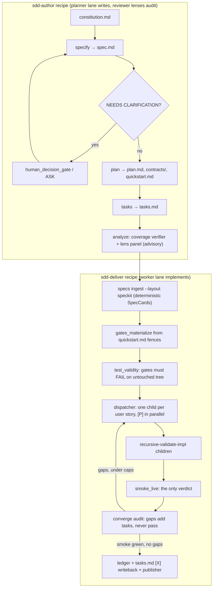

# SDD methodology on mini-ork — what we take from spec-kit

Status: SUPERSEDED in part by `2026-10-07-sdd-mechanisms-for-mini-ork.md`
(evidence-first plan; spec-kit becomes an input format only). Original status:
PROPOSAL (2026-10-06)
Source surveyed: `github/spec-kit` @ `9fb13c1` (v1.1.1.dev0, MIT), cloned at
`/Volumes/docker-ssd/ps/spec-kit`.
Builds on: `docs/plans/2026-10-03-spec-driven-delivery.md`,
`recipes/spec-driven-delivery`, `mini_ork/specdir/`, `mini-ork specs`.

## Goal

Add the full Spec-Driven Development methodology to mini-ork, which today
covers only the delivery half. Every phase runs on mini-ork's existing
machinery: recipes, lanes, verifiers, `recursive-validate-impl`,
epics/scheduler, the verification stack, cost governance, durable resume,
traces/GRPO, and publisher gates.

From spec-kit we take two things:

- **the process**: constitution → specify → clarify → plan → tasks → analyze →
  implement → converge.
- **the artifact format**: `specs/NNN-feature/{spec,plan,tasks,quickstart}.md`,
  with stable ids such as `FR-001`, `SC-001`, `US1`, `T001 [P] [US1]`.

We do not take spec-kit's runtime: no `specify` CLI, no `specify workflow run`,
no `claude -p /speckit-*` dispatch, no Python import of `specify_cli`.

## Selection rule

This document lists a spec-kit feature only if it gives mini-ork something it
lacks today. Each entry names the mini-ork guarantee it preserves:

- executable verdicts only (an LLM judgment is advisory)
- lane authorship separation (whoever writes the contract never implements it)
- test-first gates with the broken-baseline check
- lane routing, the cost ledger, traces and GRPO writeback on every LLM call
- durable resume

## Phase → mini-ork primitive

| SDD phase | Runs on (existing mini-ork feature) | Artifact |
|---|---|---|
| constitution | `specdir` loads it as global `constitutional` clauses on every SpecCard; it is also injected through the `_learned_block` prompt context | `.specify/memory/constitution.md` |
| specify | `researcher` node, `planner` lane | `specs/NNN-x/spec.md` |
| clarify | `[NEEDS CLARIFICATION]` lint in `mini-ork specs lint` → ASK artifacts → `human_decision_gate` edge (the post-mvp-delivery pattern) | `## Clarifications` in spec.md |
| plan | `researcher` node, `planner` lane; constitution check as a `verifier` | plan.md, research.md, data-model.md, contracts/, quickstart.md |
| tasks | `researcher` node, `planner` lane; deterministic task-grammar `verifier` | tasks.md |
| analyze | deterministic coverage `verifier`, plus an advisory `*_lens` reviewer panel | analyze.json |
| implement | `register_implementer_submode` dispatcher → `recursive-validate-impl` children on the `worker` lane, which run tier1-4 and the verification stack | code + verdicts |
| converge | `smoke_live` (verdict), then a converge audit (advisory, can only add work); the loop is driven under `MO_RECURSION_*` caps | ledger.jsonl, appended Convergence tasks |
| many features | `epics` + `scheduler` (retries, priority, concord admission) | one epic per feature dir |
| ship | `publisher` (oracle gates, proven files only) | commit |

## Adoptions, ranked

### Tier 1 — core value

**A1. Deterministic SpecCard compile from the spec-kit format.**
- Gap today: `contract_compiler` is an LLM node that turns free-form markdown
  into a SpecCard. That costs money and risks losing fidelity. The same
  argument already removed the LLM `test_author` (2026-10-04 decision, see
  `verifiers/gates-materialize.py`).
- Take: spec-kit's template has stable ids, so the card can be parsed with no
  LLM:

  | spec-kit source | SpecCard field |
  |---|---|
  | `FR-###` | `functional` |
  | `SC-###` | `quality` |
  | constitution principles | `constitutional` |
  | plan Technical Context and Project Structure | `architectural` |
  | each Given/When/Then line | an acceptance entry with id `US<n>.AS<k>` |
  | user stories | deliverables |

  The `local_id` pattern `^[A-Za-z0-9][A-Za-z0-9_.-]*$`
  (`schemas/spec-card.schema.json:91`) already accepts `FR-001` and `US1.AS2`.
- Keeps: the SpecCard schema, `source_hash` drift void, and `ratification_check`.
- Build: `mini_ork/specdir/speckit.py`, plus `mini-ork specs ingest --layout speckit`,
  auto-detected when `.specify/` is present.

**A2. `quickstart.md` as the gate source.**
- Gap today: `gates_materialize` needs executable bash fences inside the spec.
  Spec-kit specs are deliberately "what and why" prose, so every acceptance
  would land in `unprobeable`.
- Take: spec-kit's plan phase writes `quickstart.md` as "runnable validation
  scenarios … test/run commands, and expected outcomes" (spec-kit
  `templates/commands/plan.md:152-157`). The sdd-author `plan` prompt requires
  one labeled fence per acceptance (`# US1.AS2`, `# SC-003`), using the marker
  grammar `gates_materialize` already parses.
- Keeps: authorship separation (quickstart is written on the planner lane, code
  on the worker lane), test-first, and the broken-baseline check.
- Build: `gates_materialize` reads its probes from `quickstart.md` in the
  speckit layout. In `spec-lint`, an acceptance with no fence is an error.

**A3. `tasks.md` → deliverable graph with safe parallelism.**
- Gap today: SDD dispatch is serial. `MO_SDD_MAX_PARALLEL_SPECS` is
  "Reserved; not read yet" (`recipes/spec-driven-delivery/README.md:67`).
- Take: tasks.md gives a phased structure (Setup → Foundational, which blocks
  everything → one phase per user story in P1, P2… order → Polish). Task lines
  carry `[P]` markers and a file path. A deterministic parser builds:
  - deliverable `D-found` (Setup + Foundational)
  - one deliverable per user story, depending on `D-found`
  - each child kickoff's `## Files in scope`, taken from the task file paths.
  Stories with disjoint file scopes run in parallel. Concord admission already
  defers overlapping `## Files in scope`.
- Keeps: one deliverable per kickoff (the planner-truncation guard), spawn depth
  and child caps, concord claims.
- Build: a `tasks.md` grammar parser in `mini_ork/specdir/speckit.py`, plus the
  dispatcher via `register_implementer_submode` (modelled on
  `doc-to-features-loop/lib/per_feature_dispatcher.py`).

**A4. Project constitution.**
- Gap today: `constitutional` clauses are per-spec only. No project-wide,
  versioned rule set constrains every spec.
- Take: `.specify/memory/constitution.md`, with numbered principles, a semver
  `Version` / `Ratified` / `Last Amended` footer, and a Sync Impact Report on
  amendment.
- How it is used:
  - Its principles merge into every SpecCard as `C-const-<n>` clauses.
  - The plan-phase "Constitution Check" becomes a verifier: every plan
    violation needs a Complexity Tracking justification row.
  - It is injected into LLM nodes through the existing `_learned_block` path.
- Keeps: no LLM verdict, and amendments are explicit, versioned edits.

**A5. An executed converge loop, plus spec-kit's gap taxonomy.**
- Gap today: the `spec-driven-delivery` loop (reflector → replanner →
  contract_compiler, `recursive: true`, max 6 iterations, $100 cap) is
  declarative only.
  - The executor never re-enters `recursive` edges (`workflow/compiler.py:309`).
  - Edge `condition` is never evaluated.
  - Only `recipes/goal-loop/lib/drive.py:718` reads `MO_RECURSION_*`.
  - So the recipe runs one pass.
- Take: converge's rules.
  - "Completion claims are not evidence."
  - Gap types: `missing`, `partial`, `contradicts`, `unrequested`.
  - Gaps are appended as `## Phase N: Convergence` tasks with fresh ids; ids
    are never renumbered.
  - `unrequested` (code nobody specified) is a scope-creep signal that mini-ork
    does not catch today.
- How it runs:
  - The dispatcher submode drives the loop: dispatch → smoke → converge
    audit → new deliverables. It honours `MO_RECURSION_MAX_ITERATIONS`, the
    per-iteration and total budget caps, and the divergence-kill hash.
  - The audit runs on a reviewer lane and can only add work. Pass/fail comes
    from `smoke_live` alone.
- Also fixes the existing `spec-driven-delivery` loop: share the driver.

### Tier 2 — quality gates before spend

**A6. Clarification markers become pre-spend ASKs.**
- Take: `[NEEDS CLARIFICATION: …]` (at most 3 per spec) and the
  `## Clarifications / ### Session <date> / - Q: … → A: …` log.
- How it is used:
  - `mini-ork specs lint` counts the markers. A non-zero count fails the lint
    before any implementation budget is spent.
  - Each marker becomes an ASK artifact.
  - The answer comes through a `human_decision_gate`, or through `mini-ork inject`
    in autonomous runs. It is written back into spec.md, so the spec stays the
    single source of truth.
- Keeps: the "never guess" rule, now applied before dispatch instead of during it.

**A7. analyze: cross-artifact consistency.**
- Gap today: `ratification_check` covers spec → card. Nothing checks
  spec ↔ plan ↔ tasks.
- Deterministic verifier (decides):
  - every FR/SC is covered by a story or task
  - every story has a tasks phase and a quickstart probe
  - no orphan tasks
  - the `[USn]` label is absent in Setup, Foundational and Polish
- Advisory part: spec-kit's semantic passes (duplication, ambiguity,
  underspecification, inconsistency) run as a heterogeneous `*_lens` panel.
  Only a CRITICAL constitution conflict acts, and it acts by raising an ASK,
  never by passing or failing.
- Keeps: verifier-only verdicts. The lens panel follows mini-ork's existing
  doc-to-features-loop pattern.

**A8. Shared plan context across child runs.**
- Gap today: each `recursive-validate-impl` child re-derives the design on its
  own, so two stories can choose different storage or interfaces.
- Take: `plan.md`, `research.md` (Decision / Rationale / Alternatives),
  `data-model.md` and `contracts/`. These are attached by path to every child
  kickoff as fixed context.
- Bonus: each `contracts/` file feeds a `contract`-kind gate.

**A9. Requirement-quality checklists ("unit tests for English").**
- Take: `checklists/<domain>.md` with `- [ ] CHK001 …` items, written on a
  reviewer lane.
- Gate: a deterministic verifier requires every item to be checked or carry a
  WAIVED ledger row. That replaces implement's interactive "proceed anyway?
  (yes/no)" prompt with something that works headless.

**A10. Trustworthy `tasks.md` checkmarks.**
- Take: the `- [X] T012` progress format, so humans see status in the repo.
- Improvement: in spec-kit the implementing agent ticks its own boxes. In
  mini-ork, `ledger_writer` ticks `[X]` only after a proven child verdict, and
  the commit is made by `publisher`.

### Tier 3 — reach

**A11. Authoring front end: from a one-line idea to a spec dir.**
- Gap today: mini-ork SDD starts from hand-written specs.
- Take: the specify, clarify, plan, tasks and checklist phases, as a new
  `recipes/sdd-author/`.
  - Prompts are adapted from spec-kit's MIT command templates.
  - They run as mini-ork nodes on mini-ork lanes, so routing, cost, traces and
    GRPO all apply.
  - Feature numbering (`NNN-slug`, or a timestamp) comes from a new
    `mini-ork specs new`.

**A12. Multi-feature roadmaps.**
- New `mini-ork specs roadmap <repo>` emits an epics doc:
  - one `## <title> (id: 001-photo-albums)` per feature dir
  - a `- recipe: sdd-deliver` line under each
  - `Depends on:` lines
- Then `epics ingest` → `scheduler` takes over, giving parallel workers,
  retries, priority inheritance and post-verdict hooks.

**A13. Distribution: mini-ork as a spec-kit extension.**
- An `extension.yml` adds commands such as `speckit.miniork.deliver` and
  `speckit.miniork.status`, which call `mini-ork run sdd-deliver` and
  `mini-ork board --json`.
- Spec-kit users on its 42 agent integrations then hand delivery to mini-ork.
- This is distribution only. mini-ork itself gains no runtime dependency.

## Mismatches the adapter must handle

1. **Layout.** `scan.py:101` sets `spec_id = _slugify(path.stem)`, so a
   recursive scan of `specs/*/spec.md` collides as `DUP_ID: spec`. The speckit
   layout takes `spec_id` from the feature dir name and treats
   plan/tasks/quickstart as attachments, not as specs.
2. **One workflow per recipe.** `main.py:712` hardcodes `workflow.yaml`, and
   edge conditions are not evaluated. So the deterministic compile path needs
   its own recipe, `sdd-deliver`. The free-form `spec-driven-delivery` keeps
   its LLM `contract_compiler`. Shared verifier logic moves into
   `mini_ork/specdir/`.
3. **Headless.** spec-kit's specify Q1-Q3 tables, clarify's sequential
   questions and implement's checklist yes/no all become ASK artifacts and
   gates. Nothing blocks on a TTY.
4. **Engine caveats.** The design must not rely on these:
   - node `gates`, `max_cost_usd`, `retries` and `timeout_minutes` are not
     enforced
   - `path_globs` routing is ignored
   - `recursion:` is not executed by the executor

   Budget and loop control therefore live in the dispatcher driver, under
   `MO_RECURSION_*` and the global budget gates.
5. **Format drift.** We pin to the spec-kit 1.1.x artifact format, using
   golden fixtures generated from spec-kit's own templates. Nothing imports
   `specify_cli`.

## Kickoff sequence (one deliverable per kickoff)

| K | Deliverable | Adoptions |
|---|---|---|
| K1 | `mini_ork/specdir/speckit.py`: layout detect, spec/plan/tasks/constitution parsers, deterministic SpecCard; `specs ingest --layout speckit`; golden fixture `tests/fixtures/sdd_speckit/` | A1, A4 (parse) |
| K2 | `specs lint` speckit rules (`NEEDS CLARIFICATION`, task grammar, unlabeled quickstart AC); `gates_materialize` quickstart source | A2, A6 (lint) |
| K3 | deterministic analyze + checklist verifiers in `mini_ork/specdir/` | A7, A9 |
| K4 | `recipes/sdd-deliver/`: workflow, per-story dispatcher submode with [P] parallelism and Files in scope, shared plan context | A3, A8 |
| K5 | converge loop driver (`MO_RECURSION_*`, divergence kill) + converge audit node + tasks.md `[X]` writeback; reuse in `spec-driven-delivery` | A5, A10 |
| K6 | `recipes/sdd-author/` + `specs new` + clarify via `human_decision_gate` | A11, A6 (answer path), A4 (constitution check) |
| K7 | `specs roadmap` → epics/scheduler; spec-kit extension package | A12, A13 |

The gate for every kickoff: `python3 -m pytest -q tests/test_specdir_*.py tests/test_sdd_*.py`
must stay green, plus a dry-run e2e on the speckit fixture, in the same style as
`tests/test_sdd_e2e_dryrun.py`.

## Open decisions

1. **Deliverable granularity.** Recommended: one per user story, matching
   spec-kit's "independently testable" phases. The alternatives are one per
   task (many children, high spawn cost) or one per spec (too big for a single
   kickoff).
2. **Quickstart label syntax.** Recommended: `# US1.AS2` / `# SC-003`, matching
   the acceptance ids, so the existing `# AC3` marker regex needs only to be
   widened.
3. **Artifact home.** Recommended: spec-kit's `specs/` + `.specify/memory/`, so
   spec-kit users interoperate with no conversion. The alternative is a
   mini-ork-owned `.mini-ork/specs/`.
