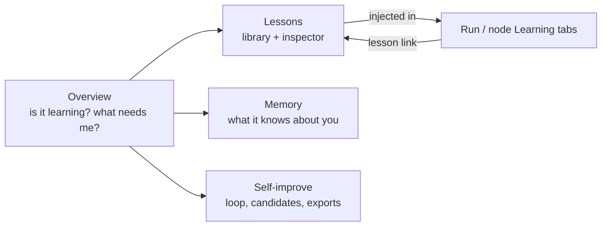
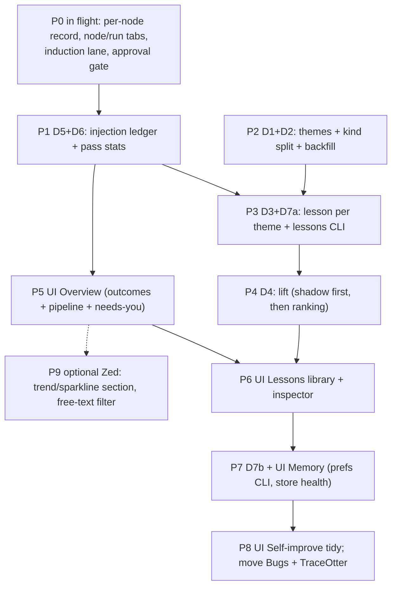

# Learning & memory page — user-first refactor plan

Status: PROPOSAL (2026-10-07)
Scope: the IDE `learn` page (`mini_ork/ide_pages/learn.py`, rendered by `crates/mini_ork_ui` in
`zed-mini-ork`), and the learning-pipeline data it needs to be worth reading.
Builds on the fixes in flight today: `learn-inject`, `learn-node-tab`, `learn-run-tab`,
`induce-lane`, `learn-gate` (see "Phase 0").

## Summary

Today the page dumps rows from tables: the 15 newest gradients, 8 patterns, namespace row
counts. None of it tells you whether mini-ork is getting better, what it has learned in words
you can check, whether a lesson is used, or what needs you. The bigger problem is the data
behind it: most of what the learning loop stores is noise, and its usefulness score rewards
noise. So this plan is two halves:

1. **Make the data worth showing.** Group gradients into themes, separate mini-ork's notes about
   its own logging from lessons about your tasks, write one lesson per theme, record every
   injection, and measure lift instead of raw wins.
2. **Rebuild the page around your questions.** Four tabs: Overview, Lessons, Memory,
   Self-improve. Every row is a conclusion, has evidence links, and has an action.

## Evidence (live `state.db`, 2026-10-07)

| Fact | Number | What it means for the page |
|---|---|---|
| Gradients stored | 10,248 (8,370 at confidence ≥ 0.6, the injection threshold) | Showing the "newest 15" is meaningless at this volume |
| Distinct gradient targets | 1,710 | Rows need grouping before a person can read them |
| Gradients about mini-ork's own trace logging (`verifier_output`, `tool_calls`, `duration_ms`, `prompt_version_hash`, …) | 5,964 of 10,248 (58%) | Most "learning" is the same few notes about mini-ork's own tracing, restated thousands of times. These are bugs in mini-ork, not lessons for your tasks, yet they're eligible for task prompts |
| Most repeated note | "verifier_output for this node is only {node_type: …}" and paraphrases, hundreds of times | Needs similarity grouping, not exact-match dedupe |
| Pattern records with an authored lesson | 0 of 57 (induction was on dead `codex` for weeks; fix in flight) | The "Patterns" section shows frequency counts, not lessons |
| Semantic memories | 671, all embedded | Similarity grouping is cheap with the existing embedder |
| Their utility | 5,572 uses, 4,526 "wins" (81%) | A memory "wins" whenever its run succeeded. The most-used memories are content-free cluster labels. The score rewards noise and can't drive retirement |
| Injection per gradient | not recorded ("injection is not counted per gradient") | No way to say "this lesson was used N times" |
| Outcomes by task class, last 4 weeks | e.g. `framework_edit` 73 runs / 5 published / 62 failed; `code_fix` 191 / 82 / 96; `verified_artifact` 399 / 219 / 28 | The data exists to answer "is it getting better?". The page never shows it |
| Runs stuck in `executing` for over a day | 214 | Must be excluded or reaped, or trends lie |
| User-authored memory: `user_preference_memory`, `operator_steering`, `lessons_bank`, `recovery_memory` | 0 rows each | The "what it knows about me" half has no way in from the UI |
| Bug reports | 1 row | Not a learning view; it belongs with defects |

## Who reads this page and what they need

The reader is the operator running mini-ork on their repos. Jobs, most important first:

| # | Question | Today | Target |
|---|---|---|---|
| J1 | Is mini-ork getting better at my work? | not answered | Pass rate and cost per pass by task class, last 4 weeks vs the 4 before, with learning events marked |
| J2 | What has it learned, in words I can check? | 15 raw gradients | A library of ~100-200 lessons, one per theme, each with scope and evidence |
| J3 | Is a lesson used, and does it help? | not recorded | Injection count + lift per lesson, with sample size |
| J4 | What needs me? | nothing | Review queue: new lessons, conflicts, pipeline alarms, promotions waiting on a decision |
| J5 | What does it know about me and my repos, and can I fix it? | namespace row counts | Editable preferences and constraints, steering history, retire/pin controls |
| J6 | Why did this run get this context? | not linked | Every lesson links to where it was injected (node Learning tab, being built now) and back |

## Design rules

1. **A row is a conclusion, not a record.** A lesson, not a gradient; a task class trend, not a
   run list.
2. **Every number has a denominator and a baseline.** "Injected 31× · pass 74% vs 61% baseline
   (n=31)", never "4,526 wins".
3. **Every row links to its evidence and its effect.** Evidence: runs, traces. Effect: where it
   was injected, what happened next.
4. **Every row has an action, and every action is a CLI verb.** Page buttons call `S.cli(...)`,
   so everything works headless and is testable.
5. **Honest empty states.** Say why something is empty and what would fill it.
6. **Mini-ork's notes about itself go to bugs, not into task prompts.**

## Target page

Four tabs. Bug reports move to **Verify & safety**; TraceOtter becomes a section of Self-improve
(it exports training data; it doesn't show learning).



### Overview: "Is it learning, and what needs me?"

Mockup. Run counts and pass rates are from the live DB; deltas, costs and pipeline figures are illustrative.

```
┌ Needs you ──────────────────────────────────────────────────────────────┐
│ 4 lessons to review · 1 conflict · 1 pipeline alarm · 0 promotions      │
└─────────────────────────────────────────────────────────────────────────┘
┌ Outcomes by task class · last 4 weeks vs previous 4 ────────────────────┐
│ class              runs  pass         cost/pass      trend              │
│ verified_artifact   399  55% (+9)     $1.10 (−0.20)  ▲ better           │
│ code_fix            191  43% (−4)     $3.80 (+0.60)  ▼ worse            │
│ framework_edit       73   7% (−12)    $18.40         ▼ worse  ← look    │
└─────────────────────────────────────────────────────────────────────────┘
┌ Learning pipeline · last 7 days ────────────────────────────────────────┐
│ reflected 412 traces → 208 gradients (58% about mini-ork) → 31 themes   │
│ → 9 lessons written → 4 approved → injected 1,240× → lift +6 pts (n=88) │
│ ! induction: 0 lessons in 6 passes — lane codex failing (400)           │
└─────────────────────────────────────────────────────────────────────────┘
┌ Recent learning events ─────────────────────────────────────────────────┐
│ ✦ lesson approved   "Map a partial verdict to remediation…"  code_fix   │
│ ✗ lesson retired    "…"  lift −4 pts over 40 uses                       │
│ ◆ promotion adopted cand-… utility 0.61 → 0.66                          │
└─────────────────────────────────────────────────────────────────────────┘
```

- Outcomes: `task_runs` grouped by `task_class`, terminal statuses only. Runs in `executing`
  for over 24 h are counted separately as "stuck", with an action to reap them.
- Pipeline strip: one stage per learning step, from the new per-pass stats table (D6). A stage
  turns red after 0 output for 3 passes in a row. This would have caught the dead induction lane
  on its first day.
- Uses existing renderers: `chips` (needs-you counts as links), `table`, `flow`, `list`.

### Lessons: the library

Master/detail: a `table` of lessons plus an `inspector` for the selected one. The `inspector`
renderer already exists for the run DAG. Mockup; uses and lift figures are illustrative.

```
Filters: [active] [candidate] [muted] [retired]   [task lessons] [mini-ork issues]   class ▾
lesson                                              scope           uses  lift        seen
Map a "partial" verdict to remediation, not success  verify · *      31   +13 (n=31)  2d
Require cited files for every audit finding          researcher · *  18   +2 (n=18)   5d
Implementer must emit a per-file action ledger       implementer     —    —           1d  candidate
┌ Inspector ──────────────────────────────────────────────────────────────┐
│ Lesson (editable) · status · scope · authored by lane glm on 10-07      │
│ Why: 14 gradients across 9 runs (open) — 3 representative quotes        │
│ Used: 31 injections → last 5 nodes (links to node Learning tabs)        │
│ Effect: pass 74% when injected vs 61% baseline for verify nodes, n=31   │
│ Conflicts: none                                                         │
│ [Approve] [Edit] [Pin to scope] [Mute theme] [Retire] [Send to bugs]    │
└─────────────────────────────────────────────────────────────────────────┘
```

### Memory: what it knows about you and your repos

- **Preferences & constraints** you set: list + Add / Edit / Remove (`mini-ork memory pref …`).
  Today these tables are empty because there is no way in.
- **Steering history**: what you told runs, which nodes received it, and what happened.
- **Lane fit by task class**: from `agent_performance_memory` (128 rows): which lane passes
  which class, at what cost. Link to Lanes & cost.
- **Store health**: active / decaying / retired, ranked by lift (D4), not raw win rate. A
  "retire candidates" list with one-click retire. Token budget each scope spends on learned
  context per node.

### Self-improve

Keep the loop, candidate and ledger. Add the decisions waiting on you, with Approve / Reject
buttons. Move the idea tree here from Memory, and TraceOtter as an "Exports" section.

## Data work the page depends on

The page can't be better than its data. These come first.

| ID | Change | Where | Why |
|---|---|---|---|
| D1 | **Theme grouping.** Assign each gradient to a theme by embedding similarity within (target family, task class), using the existing embedder. New `lesson_themes(theme_id, kind, scope_task_class, scope_role, representative, first_seen, last_seen, n_gradients, n_runs)` + `gradient_theme(gradient_id, theme_id)`. Incremental at reflect; one-off backfill over the 10,248 rows | `mini_ork/learning/` (new `themes.py`), `reflect.py` | 10k rows → a readable library |
| D2 | **Kind: task lesson vs mini-ork issue.** Classify themes whose evidence is mini-ork's own trace fields as `kind=framework`. Never inject them into task prompts; roll each into one `bug_reports` row with counts | `themes.py`, `context_assembler.failure_modes_md` filter | Removes most prompt noise and turns it into actionable framework bugs |
| D3 | **One lesson per theme.** Extend pattern induction (now on a working lane) to author `lesson_text` per theme; inject the lesson, not N raw gradient lines. Status: `candidate → active → retired`, plus `muted` / `pinned` | `pattern_induction.py`, `context_assembler.py` | Prompts carry 5 clear lessons instead of 5 near-duplicate observations |
| D4 | **Lift, not wins.** Per lesson: pass rate of nodes it was injected into, minus the pass rate of the same role × task class in the same period, with n and a minimum-n gate. Use lift for ranking and retirement candidates; keep raw wins/uses for reference | `mini_ork/memory/semantic.py`, `retirement.py` | 81% "wins" is just the base success rate |
| D5 | **Injection ledger.** Write `lesson_injections(run_id, node_id, source_kind, source_id, ts)` at dispatch, beside the `learned/<node>.json` file from `learn-inject` | `execute_handlers.py` (`_write_learned_record`) | Enables "used N×" and the two-way links |
| D6 | **Per-pass pipeline stats.** `learning_pass_stats(pass_id, ts, stage, inputs, outputs, failures, lane, last_error)` for reflect / extract / induce / gate | `reflect.py`, `reflection_pipeline.py` | Health strip and alarms |
| D7 | **CLI verbs behind every action.** `mini-ork lessons {list, show, approve, edit, retire, mute, pin, to-bug}`, `mini-ork memory pref {add, edit, rm}`, `mini-ork runs reap-stuck` | `mini_ork/cli/` (via `register_subcommand`) | Rule 4; testable; works headless |

## Phases

Each phase is one mini-ork `framework-edit` kickoff with one deliverable, files in scope, a literal
verification command, and a read-only proof against the live DB. These are the same rules the
in-flight runs follow.



| Phase | Deliverable | Depends on | Proof |
|---|---|---|---|
| P0 | Fixes in flight (5 runs) | — | each run's own tests + ruff; merged |
| P1 | D5 + D6 | P0 `learn-inject` | after one real run: `lesson_injections` rows match that run's `learned/*.json`; one `learning_pass_stats` row per stage after `mini-ork reflect` |
| P2 | D1 + D2 + backfill | — (parallel with P1) | backfill reports theme count, % covered, framework share; a sample of 20 themes reviewed by an Opus lens for "same idea?" |
| P3 | D3 + lessons CLI (list/show/approve/edit/retire/mute/pin/to-bug) | P1, P2 | `mini-ork lessons list --json` on the live DB; a real implementer prompt carries lesson lines, not raw gradients |
| P4 | D4 lift, shadow mode (computed + shown, not yet used for ranking), then switch | P3 + 1 week of ledger data | lift table with n per lesson; switch only if top-ranked lessons change in a direction a lens review accepts |
| P5 | Overview tab | P1 | `mini-ork board page learn --tab overview` JSON proof; stuck runs counted separately |
| P6 | Lessons tab (table + inspector + actions) | P3, P4 shadow | JSON proof; every action button maps to a CLI verb with a test |
| P7 | Memory tab + `memory pref` CLI | P3 | add a preference via CLI → it appears in the next node's `learned/*.md` |
| P8 | Self-improve tidy; Bugs → Verify & safety; TraceOtter → Self-improve | — | page JSON proofs; no dead tab keys |
| P9 | Optional Zed work: trend section type, free-text filter | P5 | Zed build + screenshot |

## Success criteria

- **SC1:** ≤ 200 themes cover ≥ 95% of the 10,248 gradients, each with readable text.
- **SC2:** 0 `kind=framework` themes are injected into task prompts, measured from the injection
  ledger over a week.
- **SC3:** Every active lesson shows its injection count and lift with n.
- **SC4:** The health strip goes red within 3 reflect passes when a stage produces nothing. The
  test replays today's dead-induction condition (every call fails with 400).
- **SC5:** Overview shows pass rate and cost per pass per task class for both 4-week windows,
  excluding the stuck `executing` runs and naming them separately.
- **SC6:** Every button on the page is a CLI verb with a unit test.
- **SC7:** The learned-context tokens per LLM node go down, measured from `learned/*.md` sizes
  before and after P3.

## Risks and open decisions

- **Lift is an association, not proof.** Task difficulty and lane changes confound it. Mitigations:
  minimum n, same-period baseline, shown with n. The real causal answer is a **holdout**: withhold
  each active lesson from a random X% of eligible nodes. **Decision for you:** enable holdout
  (recommended 10%, opt-in flag), accepting slightly worse context on those nodes?
- **Theme quality.** A local embedder may merge unlike ideas or split like ones. P2 includes an
  Opus review of a sample before the backfill counts as done; the similarity threshold is a knob.
- **Stuck runs.** 214 `executing` rows over a day old. P5 shows them; reaping them is a separate
  CLI action (`runs reap-stuck`) that you trigger.
- **Moving tabs.** Bug reports → Verify & safety and TraceOtter → Self-improve change where you
  find things. **Decision for you:** OK to move them (recommended), or keep them as tabs?
- **Parallel edits.** Other sessions edit `ide_pages/run.py` and `node.py`. Each phase claims its
  files through `make worktree … OWNS=…`, and edits stay inside named functions.
- **Out of scope:** ContextNest (cross-session memory) gets a link from the Memory tab only.
