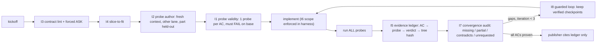

# SDD mechanisms for mini-ork: evidence first

Status: PROPOSAL (2026-10-07). Supersedes the "copy spec-kit" approach in
`2026-10-06-sdd-methodology-speckit.md`. spec-kit stays useful only as an
input format (see "Where spec-kit fits").

## Question

Spec-driven development (SDD) claims to make AI coding agents more reliable.
This plan asks three things:

1. **Which mechanisms inside SDD actually help?** Answered from measured
   evidence (32 papers, mostly 2025-2026).
2. **Which of them fix failures mini-ork really has?** Answered from mini-ork's
   own run history: 1,338 runs, the run directories, and memory incidents.
3. **How do we build each one on features mini-ork already has?** The goal is
   to make SDD a property of every recipe, not a single recipe.

## Short answer

SDD helps agents through a few narrow, mechanical levers:

- tests written from the spec before the code exists, by a different context
- forced clarification
- evidence bound to the exact code state it was computed on
- scope limits enforced by the harness
- bounded repair loops

It does not help through "more documentation". Generic context and
constitution files show null-to-negative effects on correctness.

mini-ork's biggest failures line up with the levers that work. Those failures
are fake-pass gates, false rejects, contract drift, hollow plans, and trusting
completion claims.

## Evidence: what works, what doesn't

The mechanism ids (M-codes) are used again in the improvements table.

| Mechanism | Verdict | Best numbers | Source |
|---|---|---|---|
| Tests from spec, in a fresh context, before code (M6) | **strong** | Tests written from the task description alone find 13-15pp more faults than tests written after seeing the code. A code-then-test workflow finds 11.7% fewer faults. | 2607.05139 |
| | | Self-written post-hoc tests *lower* pass rate; their false-negative rate is 24-46%. | 2501.12793 |
| | | Spec-then-test: bug detection 53.4% → 63.2%, at +38% tokens. | 2608.17177 |
| Held-out tests the implementer never saw (M5) | **strong** | Visible-vs-held-out gap grows 28pp per 10x lines of code. It is still 14.5pp under human supervision. | 2605.21384 |
| Forced clarification before spend (M2) | **strong when forced; agents won't do it unprompted** | Models answer >95% of ambiguous requests without asking. | 2605.25284 |
| | | When asking is forced, 54-89% of the performance gap is recovered. | 2502.13069 |
| | | Pass@3 under underspecification: 0.44 → 0.73. Question targeting is the remaining bottleneck. | 2602.10525 |
| | | 56-68% of underspecified runs violate an action boundary. | 2607.02294 |
| Evidence bound to code state (M3/M11) | **strong** | Stale evidence harms correct solutions +22pp. | 2607.24604 |
| | | A per-constraint ledger cuts under-verified answers by up to 26.5pp. | 2602.07549 |
| | | Inline requirement citations detect 86-88% of hallucinated code; the baseline detects 0%. | 2606.30689 |
| Completion claims are not evidence (M11) | **strong** | 80.4% of incomplete reviews claim to be complete, and those miss 1.8x more defects. | 2609.20812 |
| Scope enforced in the harness, not the prompt (M8) | **strong** | Ask-to-continue harnesses: 0.2-4.5% overeager actions. Permissive harnesses: 5.4-27.7%. Framework choice matters more than model choice. | 2605.18583 |
| Checkable *negative* rules (M4, done right) | **moderate-strong** | The single rule "no unrelated refactor" adds +20pp. Positive directives hurt when applied alone. | 2604.11088 |
| | | Checkable repository policies add +8.7pp compliance at no correctness cost. 50% of violations happen mid-trajectory. | 2610.06193 |
| Generic context / constitution prose (M4, naive) | **contradicted** | Correctness -0.5 to -2pp, cost +20-23%. | 2602.11988 |
| | | Effect is equivalent to zero (bounded at ±10-15pp); it never flips a near-miss to a pass. | 2607.27250 |
| Executable cross-artifact consistency checks (M7) | **moderate-strong** | +8.1pp; +14-15pp over textual plans on tasks longer than 200 turns. | 2607.26777 |
| | | Unanimous rollout consensus is wrong 34% of the time. Evidence-grounded checking adds +6pp. | 2610.00972 |
| Bounded repair loops (M9) | **strong** | Gains flatten after about 3 iterations. | 2607.05197 |
| | | Forced revision drops correctness 0.820 → 0.673. | 2607.24604 |
| | | Iteration 3 is the best stopping point; 3-14% of loops regress security. | 2608.13404 |
| Decomposition into slices (M5) | **moderate, double-edged** | Helps at repo scale (compile 40% vs 31%). Over-engineers trivial tasks. | 2607.04212 |
| Shared design context across workers (M10) | **weak** | Position papers only. | 2604.16323 |

All ids are arXiv ids. They come from the libwit corpus search on
2026-10-07, with 149 candidates and 32 deep-read. Most numbers come from the
full text. 2605.21384, 2609.20812, 2608.13404 and 2607.02294 come from
abstracts.

## mini-ork's real failures (measured)

Source: `.mini-ork/state.db`, 1,338 runs, 2026-05-30 to 2026-10-07. Every row
was re-queried on 2026-10-07.

| Baseline | Value |
|---|---|
| Runs published | 467/1338 (34.9%) |
| Spend on unpublished runs | 66.9% |
| Verify stage `vacuous` (passed without measuring anything) | 343/993 (34.5%) |
| Reviewer-stage failures | 199/549 (36.2%) |
| Past SDD campaign (`sdd-10x-ork`) | 45 runs, **0 published**, $617.87 |

| # | Failure | Evidence | Mechanisms that fix it |
|---|---|---|---|
| F1 | **Fake-pass gates.** Green verdict while the feature is dead. | 34.5% vacuous verifies. sdd-10x: 28/30 specs aliased several ACs to one probe. 20/32 smoke specs were vacuous. 12 "passed" epics were dead on arrival. | M5, M6, M11 + probe validity |
| F2 | **False rejects / miscalibrated reviewer.** | framework-edit published 3.6%, with 97.8% of its spend on unpublished runs. 40% verdict-vs-hidden-test disagreement. The reviewer failed 5/8 correct fixes. | Executable probes replace LLM verdict authority |
| F3 | **Contract drift.** Coherent output that isn't what the kickoff asked for. | Wrong signatures that would "pass their own tests". 75% heading drift in one wave. | M3, M7, M8 |
| F4 | **Hollow plans** from oversized kickoffs. | 87/995 runs failed at planning (79% never delivered). 48 were `missing_verifier_contract`. | M5, M7 |
| F5 | **Underspecified kickoffs.** | 157/878 runs stopped at `needs_answers`; 82 then failed. Headless runs have no answer path. | M2 |
| F6 | **Completion claims trusted.** | Fabricated "same failures on main". "Implemented" with 0 files. A $67.89 run approved on quoted values while tier1 failed. | M11, M3 |
| F7 | **Scope creep / destructive edits.** | Commit d2b142b0c deleted gates and tests (-1811 lines) and ran live for hours. | M8 + harness gating |

mini-ork's own SDD run also failed. Writing tests first without proving that
each probe is valid was just theater (F1). Every improvement below therefore
carries a "probe must fail before the change" check.

## Improvements

Each improvement passes three filters: strong or moderate evidence, a measured
mini-ork failure, and a build path on existing features. Each applies to
**all recipes** (code-fix, framework-edit, epics, goal-loop, SDD), not one.

### I1. Probe validity in core verify (fixes F1)

- **Rule.** Every acceptance criterion (AC) gets exactly one probe; no
  aliasing. Each probe must fail on the base tree and pass after the change. A
  `vacuous` verify is never publishable.
- **Builds on.** `mini_ork/cli/verify.py` (it already labels vacuous runs),
  `recipes/spec-driven-delivery/verifiers/test-validity.py` (the
  broken-baseline check), `gates/hackability.py`, and the metamorphic oracle.
  The work is to move the broken-baseline check out of the SDD recipe into
  core verify.
- **Metric.** Vacuous verify rate goes from 34.5% to under 5%. Probes failing
  on base, per AC, reaches 1.0.

### I2. Probes authored in a fresh context, on a different lane, part held out (fixes F1, F2, F6)

- **Rule.** A `probe_author` step runs before implementation. It sees only the
  kickoff and the base repo, never the patch. It runs on a lane other than the
  implementer's. It writes `acceptance-probes.json`. A held-out share of the
  probes is never shown to the implementer.
- **Gating.** On by default for `risk_class` high and above and for epics. Off
  for trivial code-fix, because it costs +38% tokens.
- **Builds on.**
  - `heterogeneity.authorship_separation` (declared today, enforced nowhere)
  - lanes
  - `gates-materialize.py` (deterministic when the author writes fences)
  - the held-out eval stack (`scripts/run_heldout.py`)
- **Metric.**
  - Gate-vs-hidden-test disagreement drops from 40%.
  - Reviewer false-reject count drops.

### I3. Kickoff contract + forced clarification with an answer path (fixes F5)

- **Rule.** `kickoff_lint` requires five fields:
  - Goal
  - Acceptance (with ids)
  - Files in scope
  - Out of scope (negative)
  - Verification command
- **Questions.** `needs_answers` becomes a structured ASK artifact with these
  fields:
  - `blocking_refs` (which AC each question blocks)
  - options
  - a default

  Tying every question to an AC addresses the targeting bottleneck in LHAW.
- **Answers.** They arrive through `mini-ork inject`, `board`, or the ACP/Zed
  panel. The run then continues via `resume` instead of dying.
- **Builds on.** `gen_profile` (`mini_ork/cli/main.py:327-407`), `kickoff_lint.py`,
  the SDD ASK schema, `human_decision_gate`, durable resume.
- **Metric.** The 82 runs that went from `needs_answers` to failed should drop
  to about 0.

### I4. Slice-to-fit before planning (fixes F4)

- **Rule.** If a kickoff exceeds an AC-count or size budget, route it through
  `epics split` automatically: one slice per independently testable AC group.
  Reject any plan whose `verifier_contract` does not reference every AC id.
- **Builds on.** `plan.py` (`_detect_truncation`, `MO_PLAN_MAX_REPAIRS`),
  `mini-ork epics split`, the scheduler.
- **Metric.** Plan-failure rate from 87/995 to under 2%; zero
  `missing_verifier_contract`.

### I5. Evidence ledger bound to code state (fixes F6, F3)

- **Rule.** A run-level `evidence-ledger.jsonl` records rows of the form AC id →
  probe → verdict → `git write-tree` hash → log path.
- **Who may cite it.** Reviewers and the publisher may cite **only** ledger
  rows. `implementer-summary.json` becomes advisory text.
- **Staleness.** A verdict whose tree hash differs from the current tree is
  void.
- **Builds on.** SDD `ledger-writer.py`, `node_checkpoints`, and the publisher's
  oracle gates.
- **Metric.** Zero "implemented" claims with 0 files. Zero approvals that cite
  values from outside the ledger.

### I6. Scope as harness-enforced negative policies (fixes F7)

- **Rule.** `.mini-ork/policies.yaml` holds machine-checkable "never" rules, for
  example:
  - never delete test or gate files
  - never edit outside Files in scope
  - no new dependencies
  - no unrelated refactor
- **Enforcement, three ways.**
  - (a) Render the rules as negative constraints in prompts. The evidence
    shows negative constraints help and positive directives hurt.
  - (b) Enforce them in the harness, not the prompt.
  - (c) Audit the trajectory, not only the final diff, because 50% of
    violations happen mid-run.
- **Builds on.** `scope_guard_block` (`execute_handlers.py:619`),
  `hooks/scope-enforce.sh`, `vcs/branch_quarantine.py`,
  `MO_GOAL_PROTECTED_PATHS`, concord claims.
- **Metric.** Zero out-of-scope files reaching a commit. Count of
  policy violations per run.

### I7. Evidence-grounded convergence audit (fixes F2, F3)

- **Rule.** Per-AC status comes deterministically from the ledger. An LLM gap
  finder may only *add* findings of the types missing, partial, contradicts or
  unrequested. Each finding needs a file:line pointer, and that pointer is
  checked.
- **Unrequested changes.** A diff hunk that maps to no AC is flagged as
  unrequested.
- **No votes.** No LLM approve/reject vote decides pass, because consensus is
  wrong 34% of the time.
- **Builds on.** The reviewer node, `panel-verdict.json`, the verification
  stack, and `docs/architecture/verification-stack.md` verdict semantics
  (`UNVERIFIED` never counts as pass).
- **Metric.** framework-edit publish rate rises from 3.6% while the
  hidden-test pass rate holds.

### I8. Bounded, guarded repair loop that actually executes (fixes F9, enables I7)

- **Rule.**
  - Default cap is 3 iterations.
  - Checkpoint every verified state.
  - Re-run **all** probes each iteration, not only the failing one.
  - Never revise a passing slice.
  - Regenerate from the contract plus the latest ledger, not from chat history.
- **Why it's needed.** `recursion:` blocks are currently declared but never
  executed. The executor ignores `recursive` edges (`workflow/compiler.py:309`)
  and edge conditions. Only `recipes/goal-loop/lib/drive.py:718` reads
  `MO_RECURSION_*`.
- **Builds on.** The revise loop merged at 2be82523: `retries` edges are now
  real (`CompiledWorkflow.retry_edges`, `MO_REVISE_ROUNDS`, default 2). Also
  goal-loop `drive.py` (extracted as a shared driver), `node_checkpoints`, and
  `recover`.
- **Metric.** Loop iterations reported per run. Zero regressions of an
  earlier-passing AC.

### I9. Experiment: shared contracts across slices (F8, weak evidence)

- **Rule.** An epic group gets one `contracts/` artifact (interfaces and data
  model) attached to every child kickoff. It also gets one end-to-end
  "producer wired" probe.
- **Why it's an experiment.** The evidence is weak, but the incidents are
  real: 6 remote-nodes epics were dead on arrival.
- **Decision rule.** Ship it only if A/B on epics shows fewer integration
  failures.

## Dropped from the 2026-10-06 plan (the evidence says no gain)

- **Prose project constitution.** Replaced by I6, checkable negative policies.
- **LLM "analyze" lens panel as a quality gate.** Consensus is unreliable;
  replaced by I7's evidence-grounded checks.
- **Generic shared context files as a correctness lever.** Null effect. They
  remain fine for efficiency only.

## Where spec-kit fits

spec-kit becomes an optional **input format**. A `specs/NNN/spec.md` +
`quickstart.md` + `tasks.md` tree is one way to supply what I3 requires
(goal, acceptance ids, scope, verification) and what I4 slices on (user
stories). The adapter from the 10-06 plan (A1-A3) shrinks to "parse spec-kit
into the I3 contract". It runs after I1-I5 land.

## K0 result (2026-10-07, `docs/audits/20261007-unpublished-spend-root-cause.md`, corrected by its Erratum)

The root-cause audit ran on the frozen snapshot
`backups/k0-baseline-20261007-104547.db`.

**The meter error does not explain the waste (H1 rejected).** After
correcting for the pre-2026-10-01 cost meter:
- total spend is $1,169, not $3,151
- the unpublished share *rises* from 67.0% to 76.0%

**Top causes, by corrected dollars:**

1. **Silent death / never finalized: $210.**
   - This is not SDD; it is fixed by K0.5a.
   - Most of it is already fixed by the run reaper.
   - `set_status` still drops its terminal write and only warns.
   - 113 execute-only runs passed but were never finalized.
2. **Reviewer/panel rejection after implementation: $169.** This maps to
   I7/I1. Candidate false rejects (verify passed, run failed anyway) are 78
   runs / $87 corrected. *(Corrected by the K0 erratum: the first pass said
   "12 runs failed only on the advisory rubric" — 11 of those had failing
   nodes hidden by a merged verdict.json; K0.5b still made the rubric file
   unable to act as a verdict.)*
3. **Verify failure: $126.**
   - It maps to I1, then I8.
   - It is dominated by harness probes: diff-apply-check-clean, apply-sentinel.
   - 3 runs pass every check but still have `pass:false`.

**Smaller items:**
- The SDD campaign lost 9 of 45 runs ($167) as rollbacks after the panel
  approved them. The publisher's stderr was never logged.
- H3 is rejected: no-publish recipes account for only $2.
- New harness bucket (erratum): verifier nodes that errored in 0 ms and never
  ran — 30 runs ($108.94 raw / $20 corrected, framework-edit) plus $80 in the
  SDD campaign. New epic K0.5c, before I3.

**Change to the sequence below:** K0.5a and K0.5b are inserted before K1,
K0.5c (verifier nodes actually run) after I1, and I3 now runs before I5. The authoritative order is in
`kickoffs/sdd-mechanisms/roadmap.md`.

## Sequence (one deliverable per kickoff)

| K | Deliverable | Why first |
|---|---|---|
| K1 | `mini-ork metrics sdd` baseline report: the six SQL baselines above plus a run-dir scan | Measure before changing |
| K2 | I1: probe validity in core verify | Biggest failure (F1); cheap |
| K3 | I5: evidence ledger + tree-hash binding; publisher cites ledger only | Kills F6; I7 needs it |
| K4 | I3: kickoff contract lint + ASK answer path + resume | 18% of runs blocked today |
| K5 | I2: fresh-context probe author, risk-gated, held-out split | Needs I1 and I5 |
| K6 | I6: `policies.yaml` + harness enforcement + trajectory audit | Independent; F7 |
| K7 | I8: shared guarded loop driver (goal-loop, SDD, epics) | I7 needs a real loop |
| K8 | I7: convergence audit replaces reviewer verdict authority | Needs I5 + I8 |
| K9 | I4: slice-to-fit routing | Needs I3 |
| K10 | I9 experiment; spec-kit input adapter | Last |

Every kickoff must report the K1 metrics before and after. A/B runs go
through the held-out eval stack. n=6 is noise (see memory
`feedback_swebench_n6_is_noise_oracle_is_moat`), so each claim needs n ≥ 30.

## Cost note

I2 and I3 move spend earlier in the run, at about +38% tokens where they are
enabled. Today 66.9% of spend goes to runs that never publish. If publish rate
rises at a constant hidden-test pass rate, $/published falls even with the
added tokens. K1 measures this, and gating by `risk_class` keeps trivial runs
cheap.
