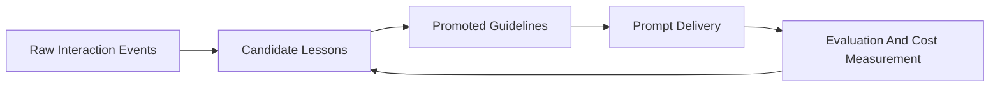
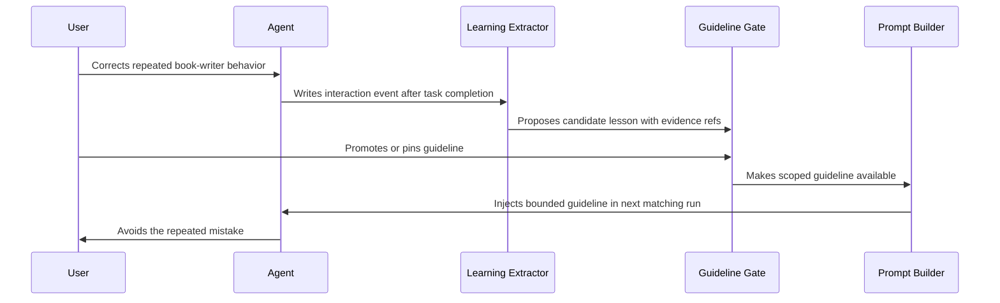

# Options Package: Researcher Adaptive Learning Track A

Run: `run-1781769758-187`  
Recipe: `post-mvp-delivery`  
Status: decision-ready draft, with explicit evidence gaps  
Date: 2026-06-18

## Problem Framing

Researcher needs an Adaptive Interaction Learning system that helps all agents, including the book writer, learn from user behavior without simply dumping raw history into prompts.

The desired product outcome is practical: agents should ask fewer repeated clarification questions, avoid repeated user corrections, preserve user/book/workspace preferences safely, and reduce cost per successful task. The system must also be demoable to investors: a user corrects or accepts behavior, the system turns that signal into a scoped lesson, a human or product gate promotes it, and a later agent run visibly behaves better.

The main architecture challenge is separating five concepts that are often blurred:



Raw history is evidence. It is not learning by itself. Learning starts when repeated evidence becomes a scoped candidate lesson, passes a promotion gate, is delivered to the right future prompt, and is measured.

## Research Summary

The run produced three usable lens artifacts:

| Lens | Useful Evidence | Confidence |
|---|---|---:|
| Architecture | Recommends a five-layer system: interaction ledger, candidate lesson extractor, promotion/demotion gate, scoped guideline store, prompt delivery contract, and evaluation ledger. It also recommends the scoped guideline MVP as the first implementation slice. | 0.78 |
| Integration | Maps the integration surface to existing mini-ork/ContextNest seams: provider dispatch, role packs, SQLite `state.db`, event hooks, OTel export, local observability UI, and Git/GitHub publisher. It adds operational probes and integration risks. | Medium-high |
| Validation | Provides a broad post-MVP validation matrix, but it is degraded because the run profile lacks exact scope and a success command. It correctly says non-evidenced P0 checks must fail closed, not pass as vacuous. | 0.72 |

Important existing anchors identified by the lenses:

- `gradient_records`, `learning_record`, `task_memory`, `workflow_memory`, `llm_calls`, and `execution_traces` already provide useful mini-ork learning and cost substrate.
- ContextNest role packs can deliver bounded context, but should not become the only source of truth for permissions or lifecycle.
- Any product-grade Researcher implementation likely needs app-owned tables for interaction events, candidate lessons, guideline versions, prompt deliveries, and evaluation events.
- Promotion must be gated. One-off behavior and noisy implicit signals should not silently become global prompt instructions.

Evidence gaps:

- The run profile is incomplete: it asks which files/directories are in scope and what command proves success.
- Exact Researcher application tables, routes, UI events, and book-writer implementation paths were not inspected in this run.
- The required seed papers from the kickoff were named in context, but no paper-specific evidence table was produced by these lens artifacts.
- Observability backend, SLO numbers, and deployment target are not confirmed.

## Delivery Options

### Option 1: Ledger-Only Analytics

Build only the interaction event ledger, evaluation counters, and dashboards. Do not change prompt behavior yet.

Scope:

- Capture accepted, corrected, rejected, ignored, edited, re-asked, and clarified interaction signals.
- Store source references, privacy scope, task class, agent role, and timestamps.
- Add dashboards or queries for clarification loops, regeneration count, accepted-without-edit rate, correction frequency, and cost per successful task.
- Use existing mini-ork substrate where possible for the experiment; design Researcher-owned schema for production.

Tradeoffs:

| Pros | Cons |
|---|---|
| Lowest product and privacy risk. | Weak VC demo because agents do not visibly improve yet. |
| Creates the evidence base needed for safe learning. | Delays proof that behavior can adapt. |
| Easier to validate with metrics and logs. | Could be perceived as analytics rather than adaptive learning. |

Risks:

- Teams may over-interpret analytics as learning.
- If event taxonomy is poor, later candidate extraction will inherit noisy signals.
- Without prompt delivery, cost reduction remains only a hypothesis.

Validation plan:

- Verify event capture for book writer and general researcher flows.
- Confirm privacy scope is present on every event.
- Query event counts by `agent_role`, `task_class`, and `signal_type`.
- Compare baseline clarification count and cost per successful task before enabling learning.

Confidence: 0.86  
Reason: This is directly supported by the architecture lens and has low implementation risk, but does not satisfy the full product goal alone.

### Option 2: Scoped Guideline MVP

Build an end-to-end learning slice for one or two roles, recommended as book writer and general researcher: event ledger, candidate lesson extraction, manual promotion, scoped guideline store, prompt delivery, and evaluation.

Scope:

- Capture interaction events after task completion.
- Mine candidate lessons from repeated corrections, accepted outputs, and cost-heavy clarification loops.
- Keep candidates separate from promoted guidelines.
- Require manual promotion for the first release.
- Deliver at most 5-8 promoted guidelines into the next relevant role prompt.
- Record prompt deliveries and measure quality/cost deltas.
- Expose a small user or operator review surface that shows the guideline, scope, evidence refs, confidence, and enable/disable controls.

Demo path:



Tradeoffs:

| Pros | Cons |
|---|---|
| Strongest balance of demo value and architectural discipline. | Requires product UX or admin review surface. |
| Makes learning visible without raw transcript injection. | Needs careful scoping and retrieval permissions. |
| Directly supports book writer and non-book agents. | Manual promotion slows fully automated learning. |
| Enables measurable cost and quality deltas. | Requires prompt-delivery audit records. |

Risks:

- Candidate extraction may overfit to sparse behavior if promotion rules are too loose.
- Guidelines can become stale after product/schema changes.
- Poor scoping can leak book/document/user preferences across boundaries.
- If too many guidelines are injected, prompts become noisy and more expensive.

Validation plan:

- Unit-test candidate-to-guideline state transitions: candidate, promoted, shadow, demoted, superseded, rejected.
- Verify role-aware prompt delivery includes only allowed scope and respects max guideline/token limits.
- Run with `MO_DISABLE_CN=1` to prove ContextNest outage does not break local source-of-truth behavior.
- Measure before/after clarification count, regeneration count, accepted-without-edit rate, correction frequency, and cost per successful task.
- Fail closed if any promoted guideline lacks evidence refs, scope, status, version, and audit trail.

Confidence: 0.82  
Reason: Both the architecture and integration lenses converge on this option as the recommended first slice. Confidence is capped because exact Researcher app paths and UI events were not inspected.

### Option 3: Automated Adaptive Policy Engine

Build a broader system that automatically infers, promotes, demotes, routes, and applies behavioral policy across all roles and task classes.

Scope:

- Automatic candidate mining from all interaction traces.
- Automatic promotion and demotion using quality, cost, and contradiction signals.
- Role/model/prompt routing policy updates.
- Broader use of evaluation harnesses and rollback gates.
- Potential long-term optimization of model choice, prompt shape, workflow routing, and cost.

Tradeoffs:

| Pros | Cons |
|---|---|
| Highest long-term leverage. | Too broad and risky for Track A. |
| Can optimize quality and cost across many roles. | High overfitting and silent behavior drift risk. |
| Could become a strong platform differentiator later. | Needs mature evaluation, rollback, and governance first. |
| Less manual work once proven. | Harder to explain and trust in a VC demo if it misfires. |

Risks:

- Silent global behavior changes from weak evidence.
- Privacy or preference leakage across user/workspace/book scopes.
- Cost spikes from frequent evaluation and policy search.
- Rollback complexity if automatic policy changes affect many agents.

Validation plan:

- Shadow-mode only at first: generate policy recommendations but do not apply them.
- Require benchmark pass and human gate before any production policy update.
- Add rollback pointers for every policy version.
- Compare against held-out tasks and negative examples before promotion.
- Track cost of policy learning separately from cost savings.

Confidence: 0.45  
Reason: The architecture lens identifies this as a future direction, but the current evidence and validation harness are not strong enough for first delivery.

## Recommended Default

Choose Option 2: Scoped Guideline MVP.

This is the best default because it satisfies the kickoff acceptance criteria:

- It does not treat raw history injection as learning.
- It separates ledger, candidate lessons, promoted guidelines, prompt delivery, and evaluation.
- It creates a credible cost reduction path by reducing repeated clarification, regeneration, and correction loops.
- It is actionable for both book writer and non-book Researcher agents.

It also produces the clearest demo:

1. The user corrects a repeated agent behavior.
2. The system proposes a scoped candidate lesson with evidence.
3. The user or operator promotes it.
4. The next matching run receives the guideline.
5. The agent avoids the same mistake.
6. The product shows fewer clarifications or rewrites and lower cost per successful task.

## Explicit User Decision Needed

Please choose one option:

- `Option 1: Ledger-Only Analytics`
- `Option 2: Scoped Guideline MVP` (recommended)
- `Option 3: Automated Adaptive Policy Engine`

Also decide these two run-profile gaps before implementation:

- Explicit scope: which repository files/directories are in scope for the next run?
- Success command: what command or artifact check proves the run succeeded?

Suggested default answers if you want to proceed quickly:

- Scope: produce the planning artifact only; no production code edits.
- Success command: `test -s internal-docs/research/mini-ork-adaptive-learning-system-full-plan.md`

## Selection Recording Instructions

When the user chooses, create:

`${MINI_ORK_RUN_DIR}/selected-option.md`

For this run, that resolves to:

`.mini-ork/runs/run-1781769758-187/selected-option.md`

Recommended file format:

```md
# Selected Option

Run: run-1781769758-187
Selected: Option 2 - Scoped Guideline MVP
Selected by: <user or operator>
Date: <YYYY-MM-DD>

## Scope

<Explicit files/directories or "planning artifact only; no production code edits">

## Success Command

`<command>`

## Notes

<Any constraints, exclusions, or demo priorities>
```

## Next-Step Implementation Plan After Selection

If Option 1 is selected:

1. Define the event taxonomy and privacy scopes.
2. Draft the interaction ledger schema.
3. Map book writer and researcher UI/runtime events to event types.
4. Add baseline metrics for clarification loops, regeneration, accepted-without-edit rate, correction frequency, and cost per successful task.
5. Produce a dashboard/query plan and validation checklist.

If Option 2 is selected:

1. Write the full Researcher plan at `internal-docs/research/mini-ork-adaptive-learning-system-full-plan.md`.
2. Include evidence table, target architecture, learning loop, memory taxonomy, prompt delivery contract, cost reduction plan, VC-ready milestones, product UX requirements, risk table, and recommended first implementation slice.
3. Define app-owned records for `interaction_events`, `candidate_lessons`, `guideline_versions`, `prompt_deliveries`, and `evaluation_events`.
4. Define promotion/demotion rules, including manual promotion for first release.
5. Define role-aware prompt delivery limits: maximum guideline count, maximum token budget, allowed scopes, and audit record.
6. Define the demo workflow for book writer and general researcher roles.
7. Define validation commands and fail-closed checks.

If Option 3 is selected:

1. Start with a shadow-mode architecture only.
2. Define policy recommendation records and rollback pointers.
3. Build a held-out benchmark/evaluation plan before any automatic promotion.
4. Require human approval for global or cross-workspace policy updates.
5. Treat this as a later-stage platform program, not the Track A MVP.

## Final Recommendation

Proceed with Option 2 under a planning-only scope first. Use the next run to produce the full durable report, then separately decide whether to implement the MVP in Researcher code.

Do not proceed with production code edits until the user confirms the explicit scope and success command.
