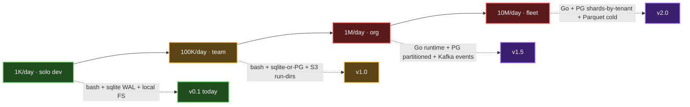
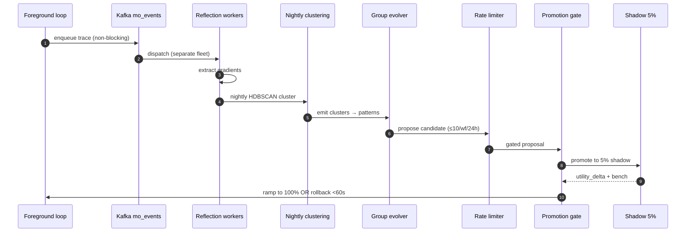

# mini-ork Scalability Audit — Architectural Shape (Opus stance)

> **Frame.** mini-ork v0.1.1 is a developer-local bash CLI on sqlite. The book it implements is explicit: the *primitives* — 6-stage loop, 8 node types, 6 edge types, 6 gates, 8 memory namespaces, 4 extension points, 7-rung autonomy ladder — are the universal shape. Pipeline opinions live in `recipes/`. The book never specifies a substrate, only a contract. **Scaling mini-ork to fleet-grade throughput is a substrate swap underneath an unchanged contract, not a rewrite.** Concrete recommendations numbered R1–R27.

---

## 1. Scale trajectory: 1K → 100K → 10M runs/day



The universal loop is substrate-agnostic. What changes per scale point is which substrate carries each verb.

| Scale | Bottleneck (breaks first) | Stays the same | Structural change | Eng-wks |
|---|---|---|---|---|
| **1K/day** (solo) | Nothing. sqlite WAL ~10 writes/s; local FS handles 1K subdirs; bash fork cost invisible. | Everything ships today. | None. | 0 |
| **100K/day** (~1 run/s) | (a) sqlite single-writer serialises writes ~50 conc cap; (b) bash fork cost (~5ms per `python3 -c`) = 30-50% of run latency; (c) local-FS `runs/` with 100K subdirs makes `find -name plan.json` linear. | Loop verbs, 8 node/6 edge/6 gate types, 8 namespaces, recipe shape, ladder. | **R1.** `MINI_ORK_DB_KIND=sqlite\|postgres15` envvar + dialect-aware migration runner. **R2.** Hoist `runs/` from FS to object store (S3/MinIO/GCS) keyed by `task_run_id`. **R3.** Add `runs_index(task_run_id, plan_key, artifact_key)` so lookups don't scan a 100K subdir. | 6-10 |
| **1M/day** (~12 runs/s, bursts 100/s) | (a) `mini-ork-execute` spawns ~50 nodes/run × 12/s = 600 forks/s, CPU lights up; (b) PG single-writer contention on `task_runs` UPDATE visible; (c) `reflection_pipeline.sh` synchronous after each run sticks the loop. | Loop verbs, node/edge/gate types, namespaces, recipe shape, ladder. | **R4.** Migrate `lib/` + `bin/` runtime to **Go** (recipe surface stays shell — §2). **R5.** Move `reflection_pipeline` off foreground — PG LISTEN/Hatchet worker on separate fleet. **R6.** Partition `task_runs` by `created_at` monthly + index by `task_class`. **R7.** Promote `mo_events` to Kafka; PG retains 30-day materialised view, not source of truth. | 14-20 |
| **10M/day** (~115/s, bursts 1000/s) | (a) PG-single-cluster cannot take 10M writes/day across `task_runs` + `execution_traces` + `mo_events`; (b) reflection must *cluster*, not `GROUP BY`; (c) per-tenant cost becomes billing; (d) `recipes/` cannot ship in-tree. | Loop verbs, node/edge/gate types (edges are intra-DAG so survive sharding), ladder. | **R8.** Shard PG by `tenant_id` (~100 tenants/DB). **R9.** Tier storage: hot (PG ≤30d), warm (PG archive ≤180d), cold (Parquet on S3). **R10.** In-tree recipes → signed marketplace (§4). **R11.** SQL pattern emergence → ML clustering (§5). | 30-40 |

Cumulative ~50-70 eng-wks. The 1M→10M boundary is where mini-ork stops being a CLI and starts being a fleet runtime — most cost is there.

**R12.** Every transition is *substrate swap behind stable contract*. Breaking changes are to substrate (sqlite→PG, bash→Go, FS→S3); none to recipe-author surface (`workflow.yaml`, `prompts/*.md`, `verifiers/*.sh`). That's the dividend v0.1's redesign earned.

---

## 2. Bash → typed-runtime migration path

**Where bash hits its limits** (citing source):

1. **Concurrency broken at scale.** `bin/mini-ork-execute:263-306` uses `( … ) & wait` for parallel/partitioned/speculative. No backpressure (100 nodes = 100 forks fighting state.db); errors are `FAIL_COUNT=$((FAIL_COUNT+1))` losing *which* child failed; no cancellation propagation through `claude --print` children.
2. **Type safety is structural.** Every cross-step value passes through stdout `key=value` (`bin/mini-ork:33-46` — `classify_out | grep ^task_class=`). One typo = silent empty string downstream.
3. **Cross-OS fragments.** `lib/llm-dispatch.sh:54-59` already needs `gtimeout` on macOS. The 6 `cl_*.sh` providers ship as 2 shapes (executable vs sourceable) because shell can't uniform cross-provider behavior.
4. **Process accounting opaque.** `trace_id` is a string column, not active propagator. At 1M/day only the runs that didn't run are debuggable.

| Runtime | Build | Runtime perf | Ship | sqlite + PG | Concurrency | Cross-OS | Verdict |
|---|---|---|---|---|---|---|---|
| **Go** | Fast (~5s) | ~10× bash | One 12 MB binary | go-sqlite3 + pgx | goroutines + ctx cancel | Excellent (cross-compile) | **PICK** |
| Rust | Slow (cargo) | ~Go-equiv | Yes (bigger) | rusqlite + sqlx | tokio | Excellent | Correct but 3× longer to write. Revisit only if Go hits a wall. |
| Python | Interp | ~bash | venv hell | Builtin | asyncio + footguns | Good | The book-end mistake. Same fork cost as bash. Reject. |
| TS/Node | Fast-ish | OK I/O, bad CPU; GC pauses | Needs Node | better-sqlite3 + pg | Promise + worker | Good | Heavy runtime + GC at 1000 fork/s. Reject. |

**R13. Hybrid model.** Keep bash as the **user-touching shim** — recipes stay pure shell. The `mini-ork` CLI stays bash for ≤5 lines arg-parsing + `exec` into **Go binaries for `lib/` primitives + `bin/` runtime**. One `mini-ork-runtime` Go binary replaces all 8 `bin/mini-ork-*` scripts; the 13 `lib/*.sh` primitives become Go packages exposed as `mini-ork-runtime <verb>` subcommands. Recipe verifiers stay shell — Go calls `os/exec`. Preserves: (a) recipe authoring shell-native (book's extension-points promise); (b) verifiers reproducible; (c) user mental model survives the swap.

**R14. Migrations portable across both runtimes.** The 13 `db/migrations/*.sql` are sqlite-flavored today. Annotate with `-- @sqlite:` / `-- @postgres15:` line directives; Go binary `migrate --dialect <kind>` emits the right form. **Schema shape stays identical** — only dialect incantations differ. Append-only/immutable triggers (migration 0012:33-78) work on both: sqlite `RAISE(ABORT,…)` ↔ PG trigger function `RAISE EXCEPTION`.

---

## 3. State.db scaling: sqlite → postgres

```
┌──────────────────────────┐
│ Hot · ≤30d · Postgres15  │  task_runs, execution_traces, mo_events,
│ partitioned monthly      │  textual_gradients, pattern_records,
│ + sharded by tenant_id   │  workflow_candidates  (live writes)
└──────────┬───────────────┘
           │ daily ETL
           ▼
┌──────────────────────────┐
│ Warm · 30-180d · PG      │  *_archive_2026_q1 partitions (read-only)
│ archive partitions       │
└──────────┬───────────────┘
           │ monthly ETL
           ▼
┌──────────────────────────┐
│ Cold · >180d · Parquet   │  s3://mini-ork-archive/tenant_id/yyyy/mm/
│ on S3 (DuckDB SELECT)    │
└──────────────────────────┘
```

sqlite's single-writer is the cliff. WAL serialises bursts; at 100K/day × ~7 writes/run = ~6/s avg + 100/s burst, the loop stalls. **The 8 memory namespaces survive sharding** because every namespace table is keyed by `run_id`, which composes with `tenant_id`. Book Ch 12: namespace boundary is *semantic* not physical — one DB or 8 shards.

**R15. Shard + partition strategy.** Shard key: `tenant_id` (new column on every namespace table; defaults `'local'` so 1K/day shape doesn't notice). 1 logical PG per ~100 tenants. Partition `task_runs` + `execution_traces` by `created_at` monthly; old partitions go read-only → cold (R17). **Don't partition by `task_class`** — heavy-tailed distribution (code_fix dominates), pruning won't help, cross-class queries get expensive. Time + tenant; index by class.

**R16. Migration tool: `mini-ork-runtime migrate --dialect <kind>`.** Reads `db/migrations/*.sql` in order, strips dialect-specific lines, applies via right driver, records in `schema_migrations` (0001:6-10). **Must be idempotent + resumable** — half-applied migration on fleet rollout must re-run. Use `pg_advisory_lock(<hash>)` (PG) or UNIQUE INSERT on `schema_migrations.filename` (sqlite) for single-writer-per-migration.

**R17. TTL + archive ladder:**
- `execution_traces` (hottest, 1 row/node-dispatch). 10M runs × 6 nodes = 60M rows/day. Hot 30d = 1.8B rows partitioned monthly; warm 6mo; cold = Parquet on S3 keyed `tenant_id/year/month/`. Restore via `pg_parquet` or DuckDB.
- `mo_events`: same ladder; at fleet scale = Kafka topic, PG holds 30d materialised view (R7).
- `textual_gradients` + `pattern_records`: ~6M gradients/day. Hot 90d, warm 1y, then cold. **Never delete patterns** — load-bearing self-evolution memory.
- `audit_log`: never archive, never delete. Immutable triggers (0012:66-79) enforce. ~100K rows/day = 36M/year — PG partitioned append-only handles fine.

**R18. Don't add a 9th namespace at scale.** Resist splitting `execution_traces` into "active" + "completed". Use partitions for lifecycle, namespaces for semantics. Book is explicit.

---

## 4. Recipe ecosystem scaling

```
┌──────────┐   ┌────────┐   ┌────────────┐   ┌──────────────┐   ┌────────────┐
│  Author  │──▶│  Sign  │──▶│  Publish   │──▶│ mini-ork     │──▶│ Verify +   │
│ (recipe) │   │ cosign │   │ to GitHub  │   │ add-recipe   │   │ SHA-256    │
└──────────┘   └────────┘   └────────────┘   │ github.com/… │   │ lock       │
                                              └──────────────┘   └─────┬──────┘
                                                                       │
                                                                       ▼
                                                              ┌─────────────────┐
                                                              │ seccomp/cgroups │
                                                              │ sandbox subproc │
                                                              └─────────────────┘
```

Recipes ship in-tree today. At 10M/day with thousands of users, marketplace problem.

**R19. Marketplace = `github.com/<org>/<recipe-name>` + a `mini-ork-runtime add-recipe` verb** that clones, validates, locks. Don't build hosted SaaS (roadmap forbids). Same shape as `nix-shell`, `brew tap`, `crates.io`. The marketplace IS GitHub.

**R20. Signing + checksum** (extends P3-007 in SECURITY-AUDIT). Every recipe ships `recipe.lock`: version, SHA-256 of full tree, cosign signature. `add-recipe` rejects on sig OR checksum failure. **No `curl … | bash` flow ever ships.**

**R21. Sandbox every recipe in a constrained subprocess.** Recipes today drop arbitrary bash in `recipes/<n>/lib/*.sh` and framework sources it (P3-006). At 10M/day with third-party recipes this is P0. Run recipe processes with seccomp (Linux) or sandbox-exec (macOS) denying network except LLM endpoints; cgroups CPU + memory limits; verifiers default `MINI_ORK_VERIFIER_CAP=ro`. The `scope_gate` upgrades from "no two nodes claim same path" to "no node touches paths outside declared scope" — enforced at sandbox-mount, not write.

**R22. Dependency resolution.** Recipe A's `workflow.yaml` declares `depends_on_recipe: [github.com/foo/typecheck@v2]`. `add-recipe` resolves DAG, locks transitives, rejects diamonds (must be reconciled by user). Versioning follows book Ch 23: candidate→shadow→promoted→quarantined→deprecated. Quarantined version cannot install without explicit `--allow-quarantined` (parallel to `version_clear_quarantine`).

---

## 5. The "self-improvement" promise at scale



At 1K/day reflection + group_evolver + promotion_gate compose in one bash process. At 10M/day every assumption breaks.

**R23. Background reflection MUST run off foreground.** Today `bin/mini-ork-execute` invokes `reflection_pipeline.sh:reflection_run` synchronously (or worse, blocks). At 10M/day: enqueue traces, don't process inline. `mo_events` becomes Kafka (R7); stateless reflection workers consume at their own pace; horizontal scale. Clustering runs nightly, not per-trace.

**R24. Pattern emergence needs ML clustering, not SQL.** Today `pattern_query --min-frequency N` reads `lib/pattern_store.sh:137-162` — SQL `GROUP BY` that finds *known* patterns. Cannot discover new ones because `pattern_id` is caller-decided (line 62). At fleet scale: embed every `textual_gradients.suggested_change` via sentence-transformers/all-MiniLM-L6-v2 (80 MB, ~5ms CPU); nightly HDBSCAN (density-based, doesn't need K); backfill `pattern_records.cluster_id` (already in schema, line 36); new clusters appearing ≥3 nights running with rising frequency auto-promote to `pattern_records` with `status='observed'` + workflow-candidate proposal.

**Rate-limit proposals (safety-load-bearing).** Today `lib/group_evolver.sh:group_propose` emits 5 candidates per invocation; nothing rate-limits invocations. **Add hard ceiling: ≤10 promotion candidates per workflow per 24h regardless of evidence pressure.** A malformed proposal at fleet scale is an outage.

**Blast-radius enforcement on promote.** `promotion_gate.sh` validates utility_delta + benchmark + safety. At fleet scale, even passing candidates cannot ship 100% on first promote. Add shadow phase (book Ch 23 + migration 0009:39 — `'candidate'|'shadow'|'promoted'|'quarantined'|'deprecated'` already enum'd; no code implements `shadow` yet): new promotion → `status='shadow'` serves 5% traffic 24h; ramp to `'promoted'` on positive utility_delta; instant rollback + quarantine on regression.

**Rollback propagates fleet-wide in <60s.** `version_registry_pointers` (0011:104) is single-row-per-(kind,name) — flip the row, next-read sees new value. At 10M/day with N fleet readers, "next read" must be ≤60s. Add PG `LISTEN/NOTIFY` or Redis pub/sub — version-pointer flips invalidate caches immediately. Workers cache pointer ≤60s OR until `NOTIFY` fires.

---

## 6. Observability + cost-attribution

```
┌────────────────────────┐   OTel HTTP   ┌──────────────────────┐
│ every node dispatch    │ ─────────────▶│ OTel collector       │
│ (withFeature wrapper)  │               │ 100.74.239.22:14320  │
└────────────────────────┘               └──────────┬───────────┘
                                                    │ fan-out
                          ┌─────────────────────────┼─────────────────────┐
                          ▼                         ▼                     ▼
                   ┌──────────────┐         ┌──────────────┐       ┌─────────────┐
                   │ Tempo traces │         │ Loki logs    │       │ Prometheus  │
                   └──────────────┘         └──────────────┘       └─────────────┘
                                          Grafana + dashboard repo (read-replica)
```

At 1K/day, console + sqlite queries are enough. At 10M/day this is a billing surface — can't bill a tenant for a run you can't trace.

**R25. OTel spans on every node-type dispatch.** `mo_events.trace_id` + `iters.test_trace_id` exist; `lib/llm-dispatch.sh` emits no span around `claude --print`. Bring libwit-side `withFeature({name:'X'})` (Insforge rules #73-79) into mini-ork core. `mini-ork-execute._dispatch_node` opens `mini-ork.node:<type>` span with `tenant_id`, `task_run_id`, `recipe`, `workflow_version`, `model_lane`; children for `llm.generate:<provider>:<model>` + `verifier.run:<script>`. W3C `traceparent` flows through Kafka into reflection + clustering. One trace per `task_run` end-to-end.

**R26. Per-tenant cost attribution.** `llm_calls` has `cost_usd`, `provider`, `model_id`. Add `tenant_id` (R15 shard key); aggregate hourly materialized view `v_tenant_cost_24h(tenant_id, provider, model_id, spend, n_calls)`. Billing reads view, not raw. Per-tenant ceilings via `budget_gate` (book Ch 30) — when `v_tenant_cost_24h.spend > tenant.budget_24h`, gate fires `BLOCK`.

**R27. Dashboard repo reads state.db via PG read-replica.** Roadmap already names this (v0.3+). For fleet: dashboard *never* touches primary; routes to hot-standby. Lag ≤5s for human dashboards, ≤500ms for alerting. state.db schema is the public contract — semver'd, breaking-change-policy'd per ROADMAP v1.0. Dashboard adapts; runtime does not.

---

## 7. The hardest open question

**How does the self-evolution loop avoid converging on a workflow that's locally optimal for the benchmark suite but worse for the long tail of real tasks?**

I genuinely don't know.

The book's promotion-gate demands `utility_delta > 0 AND all benchmarks pass`. The benchmark suite is a fixed human-curated set per task-class. Utility is weighted `success_rate + verifier_pass_rate + quality_score - cost - latency - risk`.

**This is Goodhart's law fuel.** Any optimisation loop, given enough cycles, discovers workflows maximising *benchmark utility* at the cost of long-tail real-task quality. Exact failure mode of every RLHF system that converges before its evaluator becomes adversarial. The book gestures at the risk via Ch 26 (`selection_score = performance * sqrt(novelty)` — implemented in `lib/group_evolver.sh:138-155`). But novelty alone doesn't fix Goodhart — a workflow can be novel AND benchmark-overfit.

Three plausible mitigations, all with serious tradeoffs:

1. **Adversarial benchmark generation.** Generate new benchmarks faster than promotions; candidates must pass static suite AND N adversarial tasks from recent production failures. Cost: 10× benchmark expense per promotion; risk: generator becomes new Goodhart target.
2. **Shadow-traffic verdict trumps benchmark verdict.** Make R23's 5% shadow *the* utility signal — benchmarks become sanity gate. Cost: every promotion takes 24h min; risk: production carries cost of bad candidates.
3. **Conservative drift detection.** Track real-task quality (sampled human review, escalation rate, user regressions) on long sliding window. If quality drops while benchmark utility rises, freeze + alarm. Cost: very slow signal; risk: by detection time you've shipped 100 bad candidates.

None is obviously right. At 1K/day the benchmark suite IS enough because human reviewer catches overfit before ship. At 10M/day no human can catch it, and the framework has no built-in defense. **This is the load-bearing open research question for v2.0** — needs a real literature search (Goodhart in RL/evolutionary search, arxiv 2024-2026) before the team commits.

I would not ship a fleet-scale self-improvement loop without resolving this. I would ship every other R1-R27 and leave self-improvement gated behind human review (rung 6, never auto-promoted to rung 7) until this is solved.

---

## Recommendation index

- **R1-R3** (100K): dialect-aware migrations, object-store run-dirs, runs index
- **R4-R7** (1M): Go runtime, async reflection, partition `task_runs`, Kafka `mo_events`
- **R8-R11** (10M): tenant shard, tier storage, signed marketplace, ML clustering
- **R12** (cross-cutting): substrate swaps preserve recipe-author contract
- **R13-R14** (bash→Go): hybrid model + portable migration runner
- **R15-R18** (state.db): shard + partition + migration tool + TTL ladder
- **R19-R22** (recipes): marketplace + signing + sandbox + dependency resolution
- **R23-R24** (self-improve): async reflection + ML clustering + rate-limited proposals + shadow-phase + <60s rollback
- **R25-R27** (observability): OTel spans + per-tenant cost view + dashboard read-replica

Work composes: R1-R3 unlock R4-R7 unlock R8-R11. Don't skip 1K→10M directly — every transition compounds risk if predecessor isn't stable. Roadmap: R1-R7 = v1.0; R8-R14 = v1.5-v2.0; R15+ = the long arc.

The **single biggest architectural risk** is not in any of R1-R27 — it's the open question in §7. Solve that before autonomy-ladder rung-7 becomes load-bearing.
