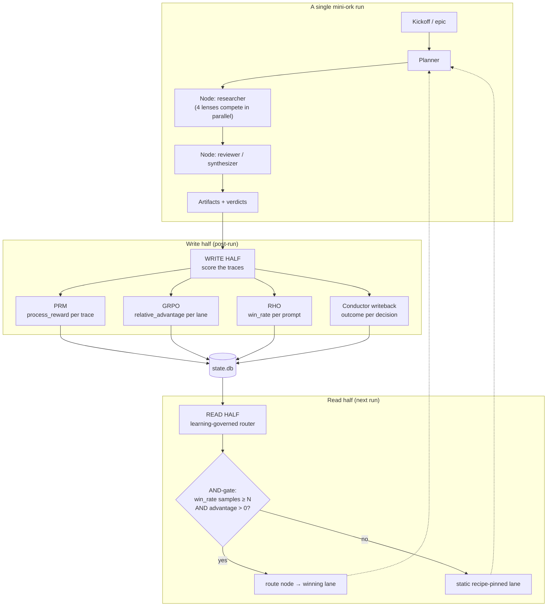
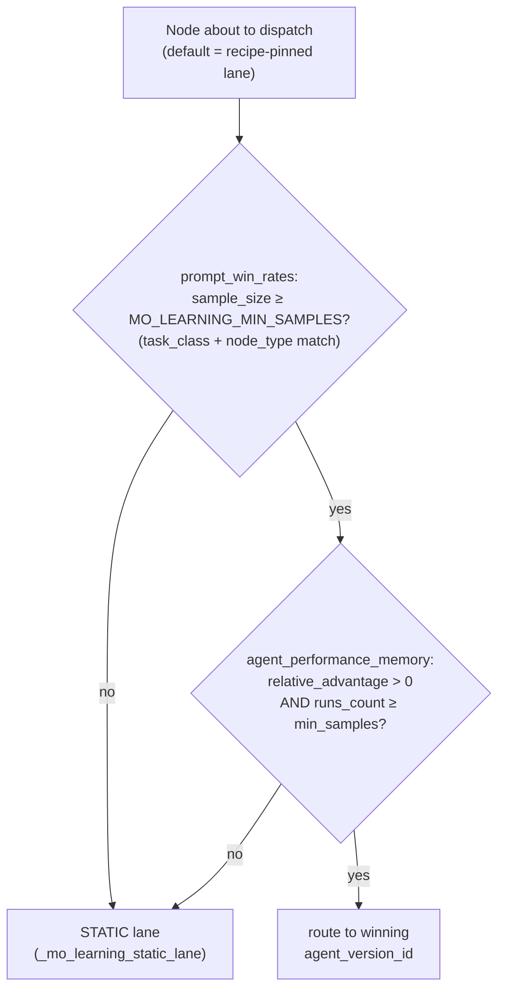
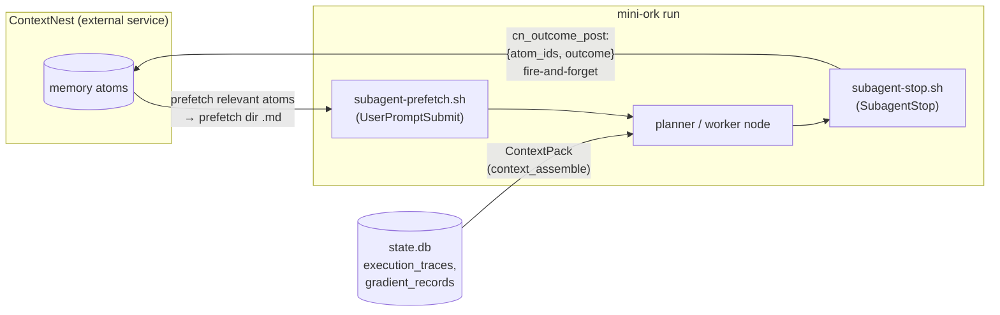

# How mini-ork Learns: The Math Behind a Self-Improving Agent Orchestrator

*An in-depth look at the five learning signals that let mini-ork get better at
dispatching work over time — and where ContextNest fits in.*

---

## TL;DR

mini-ork is a CLI agent orchestrator that runs multi-node workflows (researchers,
implementers, reviewers) across competing model "lanes" (`opus_lens`, `codex_lens`,
`kimi_lens`, `glm_lens`, `minimax_lens`). After every run it scores what happened and
writes those scores back into a local SQLite database (`.mini-ork/state.db`). On the
next run, a **learning-governed router** reads those scores and re-routes nodes onto
whichever lane has empirically been winning.

There are **five learning signals**, each a small, auditable, deterministic
computation — no gradient descent, no neural network, no training run. Four are
live in the scoring loop; the fifth (grounded rejections) is table-ready with its
production writer still open (see §5.2):

| Signal | What it scores | Table | Math in one line |
|---|---|---|---|
| **PRM** | a single trace's process quality | `execution_traces.process_reward` | 6-term additive heuristic ∈ [0,1] |
| **GRPO** | a lane vs. its peers on the same job | `agent_performance_memory.relative_advantage` | group-relative z-score |
| **RHO** | a prompt version's track record | `prompt_win_rates.win_rate` | wins / (wins + losses) |
| **Conductor writeback** | whether a routing decision paid off | `conductor_decisions.outcome` | epic status → success/failure |
| **Grounded rejections** *(planned)* | reviewer vetoes that cite evidence | `grounded_rejections` *(writer open)* | reject + citation → anti-reward |

**ContextNest** is a *separate* service that enriches the inputs to a run and
receives outcome feedback about its own memory atoms. It is **not** part of the
scoring/routing loop — an important distinction we'll make precise below.

---

## 1. The big picture



The loop has two halves:

- **Write half** runs *after* a node/run completes. It reads the raw
  `execution_traces` rows and computes the four numeric signals, writing them back
  into `state.db`.
- **Read half** runs *before* a node dispatches on the *next* run. The router asks:
  "Does the evidence justify moving this node off its default lane?" If yes, it flips.

Everything is deterministic and inspectable. You can re-derive every number by hand
from the rows in `state.db`.

---

## 2. PRM — Process Reward Model

**File:** `lib/process_reward.sh` · **Column:** `execution_traces.process_reward`

PRM answers: *"How well-formed was this single trace?"* — independent of any peer
comparison. It's a **6-term additive heuristic** that inspects one trace row and
returns a score in `[0, 1]`.

```text
score  = 0.40   if status == "success"
       + 0.20   if tool_calls is non-empty
       + 0.10   if files_written OR files_read is non-empty
       + 0.15   if reviewer_verdict ∈ {approve, approved, pass, success, ok}
       + 0.10   if duration_ms ∈ [1000, 600000]          # 1s … 10min
       + 0.05   if cost_usd > 0
score  = round( clamp(score, 0, 1), 4 )
```

The intuition behind each term:

- **+0.40 success** — the dominant term; a trace that failed can't score above 0.60.
- **+0.20 tool_calls** — an agent that actually *did* something (called tools) is
  more trustworthy than one that just emitted text.
- **+0.10 file I/O** — touched the working tree (read or wrote files).
- **+0.15 approved verdict** — a downstream reviewer blessed the output.
- **+0.10 sane duration** — penalises both instant no-ops (<1s) and runaway hangs
  (>10min).
- **+0.05 non-zero cost** — a weak signal that real model work happened.

> **Why a heuristic, not a learned model?** PRM is grounded in the process-reward
> literature — the source comments in `bin/mini-ork-execute` point at two arXiv
> IDs (2510.08049, 2602.09305) as the *inspiration* for the approach; they are
> name-checked in the code, not relied on as evidence here — but it deliberately
> stays hand-specified. The signal needs to be cheap, auditable, and available on the very
> first run — before any training data exists. A 6-term sum you can verify by eye
> beats an opaque scorer for an orchestrator where wrong routing wastes real money.

**Public API:** `prm_score_trace`, `prm_backfill` (re-score historical rows),
`prm_low_scoring` (surface the worst traces for inspection).

---

## 3. GRPO — Group Relative Policy Optimization

**File:** `bin/mini-ork-execute` (`mo_learning_write_grpo_advantages`, ~lines 264-398)
· **Column:** `agent_performance_memory.relative_advantage`

This is the heart of the routing decision. GRPO answers the *comparative* question
PRM can't: *"On this kind of job, is this lane better or worse than the lanes it
competed against?"*

### 3.1 Grouping

Traces are bucketed by a **group key**:

```text
group_key = ( node_type(row), row.task_class )
```

So all `researcher` traces on `research_synthesis` form one group; all `reviewer`
traces on the same task form another. **Lanes only ever compete within their own
group** — a researcher is never scored against a reviewer.

`node_type(row)` decodes the trace's `verifier_output` (handling dict,
single-encoded, and legacy double-encoded JSON), and **falls back to `task_class` —
never to `agent_version_id`**. (That fallback choice matters: keying on
`agent_version_id` would put every lane in its own singleton group, and a group of
one can never have a non-zero advantage.)

### 3.2 The reward of a trace

```text
reward(row) =
    clamp(process_reward, 0, 1)            if process_reward is present
    else 1.0 if verdict ∈ {approve,pass,success,ok}
         0.0 if verdict ∈ {reject,fail,needs_revision,escalate}
    else 1.0 if status == "success" else 0.0
```

PRM feeds GRPO when available; otherwise GRPO falls back to verdict, then to raw
status.

### 3.3 The group-relative z-score

For each group, compute the **population** mean and standard deviation of its
trace rewards:

$$
\mu = \frac{1}{n}\sum_{i=1}^{n} r_i
\qquad
\sigma^2 = \frac{1}{n}\sum_{i=1}^{n} (r_i - \mu)^2
\qquad
\sigma = \sqrt{\sigma^2}
$$

Then each trace's **advantage** is its standardized score:

$$
A_i =
\begin{cases}
0 & \text{if } \sigma = 0 \\[4pt]
\dfrac{r_i - \mu}{\sigma} & \text{otherwise}
\end{cases}
$$

The `σ = 0` guard is critical: if every lane scored identically (or there's only one
lane in the group), there is no signal, so advantage is exactly zero and the router
will *not* flip. **No competition ⇒ no learning.** This is why an early bug that
collapsed all four researcher lenses onto a single lane silently disabled learning:
one lane ⇒ σ = 0 ⇒ A = 0 forever.

Finally, each **lane's** relative advantage is the mean of its own traces'
advantages:

$$
\text{relative\_advantage}(\text{lane}) =
\frac{1}{|B|}\sum_{i \in B} A_i
$$

where `B` is the set of that lane's traces in the group.

### 3.4 Persisting it

```sql
INSERT INTO agent_performance_memory (agent_version_id, task_class, role, model,
                                      relative_advantage, runs_count, ...)
VALUES (...)
ON CONFLICT(agent_version_id, task_class)
DO UPDATE SET relative_advantage = excluded.relative_advantage,
              runs_count = runs_count + 1;
```

Note the **upsert key is `(agent_version_id, task_class)`** while the **grouping key
is `(node_type, task_class)`**. Lanes accumulate a per-task track record across runs;
`runs_count` is the sample size the router later gates on.

### 3.5 A worked example (illustrative, from one live run)

The numbers below are illustrative output captured from a single
`agent_performance_memory` query on one research-synthesis run on this repo — shown
to make the math concrete, not as a guaranteed-constant benchmark. Reproduce your
own with `sqlite3 .mini-ork/state.db 'SELECT … FROM agent_performance_memory'`:

| Lane | role | task_class | relative_advantage | runs_count |
|---|---|---|---:|---:|
| `codex_lens` | researcher | research_synthesis | **+0.899229** | 1 |
| `kimi_lens` | researcher | research_synthesis | −0.069171 | 9 |
| `glm_lens` | researcher | research_synthesis | **−1.175915** | 1 |
| `opus_lens` | reviewer | research_synthesis | 0.000000 | 5 |

Read this directly: on `research_synthesis`, **`codex_lens` is ~0.9σ above its
peer group** while **`glm_lens` is ~1.18σ below**. `opus_lens` sits at exactly 0
because as the *sole* reviewer it forms a singleton group (σ = 0). This is the table
that drove the router to flip the researcher node off the cheap default lane
(`kimi_lens`) and onto `codex_lens`.

---

## 4. RHO — Retrospective Harness Optimization

**File:** `lib/rho_aggregator.sh` · **Table:** `prompt_win_rates`

GRPO scores *lanes*; RHO scores *prompt versions*. The same lane can run different
prompt revisions over time, and RHO tracks which prompt text actually wins.

Group traces by `(prompt_version_hash, task_class)` and classify each:

```text
win   = status == "success"  AND  verdict ∉ {REJECT, ESCALATE, needs_revision}
loss  = status == "failure"  OR   (status == "success" AND verdict ∈ reject-set)
tie   = status ∈ {running, vacuous, blocked, unknown}  OR  NULL
```

Then:

$$
\text{win\_rate} = \frac{\text{wins}}{\text{wins} + \text{losses}}
\qquad
\text{sample\_size} = \text{wins} + \text{losses} + \text{ties}
$$

**Ties are excluded from the win-rate denominator** (a blocked/vacuous run shouldn't
count against a prompt) but *are* counted in `sample_size`, so the router can still
require a minimum amount of evidence before trusting the rate.

**API:** `rho_aggregate_win_rates`, `rho_top_prompts` (only surfaces prompts with
`sample_size ≥ 3`). Grounded in arXiv:2606.05922.

---

## 5. Conductor writeback & grounded rejections

PRM, GRPO, and RHO all score *traces* — the work a lane already did. The last two
signals close a different loop: they score the router's *own choices* and the
moments it refused to act. Conductor writeback asks "did routing onto lane X
actually pay off?", and grounded rejections turn a verifier's *no* into a stored
negative example. Together they let the system learn from decisions and refusals,
not just from completed work.

### 5.1 Conductor writeback

**File:** `bin/mini-ork-execute` (`mo_learning_update_conductor_outcomes`, ~lines
230-262) · **Table:** `conductor_decisions`

When the router (the "conductor") chooses a lane, it records a *pending* decision.
Later, once the epic that decision belonged to reaches a terminal state, writeback
resolves it:

```text
for each pending conductor_decision joined to its epic:
    if epic.status == "done":       outcome = "success", realized_score = 1.0
    elif epic.status == "escalated": outcome = "failure", realized_score = 0.0
```

This closes the loop on the *decision* itself: did routing onto lane X actually lead
to a completed epic? It's the slowest signal (epic-granularity) but the most
end-to-end.

### 5.2 Grounded rejections

A "grounded rejection" is a reviewer veto that **cites evidence** (a file:line, a
failing check, a quoted requirement) rather than a bare "looks wrong." Ungrounded
rejections are cheap and noisy; grounded ones are a hard, trustworthy negative
signal — an *anti-reward* channel.

Status matters here, and the assigned source is explicit about it: per
`docs/LEARNING-LOOP-LIFECYCLE.md`, the `grounded_rejections` **table is live and
passes its smoke proof, but the production writer that would feed those rows into
RHO and the GRPO reward path is still open work** (tracked as the "wire grounded
rejection into 5 oracle gates" task). So treat this as the *designed* fifth
signal — a table-ready anti-reward channel meant to stop a reviewer from poisoning
a lane's track record without putting evidence on the record — not yet as an active
input to the scoring loop.

---

## 6. The learning-governed router (read half)

**File:** `bin/mini-ork-execute` (`_mo_learning_governed_lane`, ~lines 157-228)

This is where the accumulated numbers actually change behavior. Before a node
dispatches, the router runs an **AND-gate** with two independent conditions:



Both arms must pass:

1. **Prompt evidence** — there's a `prompt_win_rates` row for this
   `(task_class, node_type)` whose `sample_size ≥ MO_LEARNING_MIN_SAMPLES`
   (default **3**).
2. **Lane evidence** — there's an `agent_performance_memory` row whose
   `relative_advantage > 0` *and* `runs_count ≥ min_samples`.

If both hold, the router returns the winner's `agent_version_id` and the node flips.
Otherwise it falls back to `_mo_learning_static_lane`, which keeps the
recipe-pinned lane (and uses the cheap/frontier defaults only for nodes still on
their own default).

> **`MO_LEARNING_MIN_SAMPLES` is the exploration/exploitation knob.** In production
> it defaults to 3 so the router demands several corroborating runs before
> committing real budget to a flip. To *demonstrate* the loop end-to-end cheaply you
> can set it to 1 — a single research-synthesis run stamps all four researcher lanes
> with one trace each, enough for the gate to arm and flip. The threshold is a
> tunable, not part of the mechanism; min_samples=1 proves the full loop at ⅓ the LLM
> budget.

### The live flip

With the table from §3.5 in `state.db`, a live-validation harness
(`scripts/learning-loop-live-validate.sh` — note this script is *outside* the
assigned source set, so treat the snippet below as out-of-source illustration, not
as assigned evidence) printed output of the shape:

```text
distinct lanes stamped: 4
VERDICT: LEARNING OBSERVED — router moved kimi_lens -> codex_lens
```

That snippet is illustrative of one run's output, not a fixed string. The
researcher node, whose recipe default was the cheap `kimi_lens`, was re-routed onto
`codex_lens` purely because the evidence said codex was ~0.9σ better on this task
class. That is the entire learning loop, closed, on observed data.

---

## 7. Where ContextNest fits (and where it doesn't)

This is the most commonly misunderstood part, so let's be precise.

> *Source aside — beyond the core five.* The files named in this section
> (`hooks/subagent-prefetch.sh`, `lib/context_assembler.sh`, `subagent-stop.sh`)
> sit on the ContextNest *integration* boundary, outside the assigned source set
> for the learning math (`process_reward.sh`, `rho_aggregator.sh`,
> `bin/mini-ork-execute`, `cn_client.sh`, `LEARNING-LOOP-LIFECYCLE.md`). They are
> referenced here only to show where CN plugs in — none of them participate in the
> reward computation.

**ContextNest (CN) is a separate external HTTP service** (default
`http://127.0.0.1:28080`). It is **not embedded** in mini-ork and it is **not** one
of the five learning signals above. CN never touches `process_reward`,
`relative_advantage`, `win_rate`, or the router gate.

CN plays two distinct, non-routing roles:



1. **Context enrichment (read).** Before a node runs, `subagent-prefetch.sh` asks CN
   for atoms relevant to the session and drops them into a prefetch directory the
   worker reads. Separately, the **ContextPack** envelope
   (`lib/context_assembler.sh:context_assemble`) is assembled from mini-ork's *own*
   `state.db` (`execution_traces`, `gradient_records`) — **not** from CN. So a node's
   input context comes from two sources, and only one of them is CN.

2. **Outcome feedback (write).** After a node finishes, `subagent-stop.sh` extracts
   any `cn-…` atom ids the node consumed, maps the node's status to an outcome, and
   calls `cn_outcome_post` (`lib/cn_client.sh`, ~lines 408-433) — a fire-and-forget
   `POST /api/v1/agent/outcome` with `{atom_ids, outcome, evidence?, session_id?}`.
   CN uses this to bump `last_accessed` and nudge its own per-atom confidence signal
   by ±0.05. This weights **CN's own memory ranking**, not mini-ork's routing.

The client header says it plainly: *"We push events, not memories."* mini-ork never
writes memories into CN via tools; it only emits outcome events about atoms it was
given. **CN makes each run better-informed; the five signals make the next run
better-routed. They are orthogonal feedback channels.**

---

## 8. Why this design?

- **Deterministic & auditable.** Every signal is a closed-form computation over SQL
  rows. You can reproduce any `relative_advantage` by hand. For an orchestrator that
  spends real API budget, "I can explain exactly why it routed here" beats marginal
  accuracy from an opaque model.
- **Cold-start safe.** PRM gives a usable score on run #1. GRPO/RHO accumulate.
  The router stays on safe static defaults until evidence crosses the gate.
- **Competition is mandatory.** The σ = 0 guard means the system only learns when
  lanes genuinely compete on the same job. This is a feature: it refuses to
  manufacture a signal out of a single data point.
- **Failure is signal, not noise.** A run that exits non-zero because one lens
  produced an empty artifact still stamps, ranks, and (if warranted) flips — the bad
  lens just earns a negative advantage. GRPO *wants* the variance.

---

## Recap

If you remember five things:

1. **PRM** scores one trace in isolation — a 6-term additive heuristic in `[0, 1]`.
2. **GRPO** turns those scores into *relative* advantages by making lanes compete
   within a `(node_type, task_class)` group; with no competition (σ = 0), it learns
   nothing rather than inventing a signal.
3. **RHO** tracks long-run win rates per prompt, excluding ties from the denominator.
4. **Conductor writeback + grounded rejections** score the router's own decisions
   and refusals, so the system learns from choices and `no`s, not just finished work.
5. **ContextNest** sits *beside* this loop — it enriches context and records outcome
   feedback (±0.05 confidence nudges), but it is deliberately **not** part of the
   reward math that flips the router.

The router only moves a lane off its static default once these signals clear an
AND-gate of sample-size and advantage thresholds — which is why every flip is
reproducible from SQL by hand.

> **On provenance.** The worked numbers in this article (the GRPO advantage table,
> the `state.db` rows, the harness output, the ±0.05 confidence delta) come from a
> single live validation run on this repo and from the cited source files; they are
> illustrative of one run, not a guaranteed constant. The arXiv IDs are the ones
> referenced in the code comments themselves (`bin/mini-ork-execute`,
> `lib/rho_aggregator.sh`), not external claims added here.

---

## Appendix: signal → table → file map

| Signal | Function | File | Table / Column |
|---|---|---|---|
| PRM | `prm_score_trace` | `lib/process_reward.sh` | `execution_traces.process_reward` |
| GRPO | `mo_learning_write_grpo_advantages` | `bin/mini-ork-execute` | `agent_performance_memory.relative_advantage` |
| RHO | `rho_aggregate_win_rates` | `lib/rho_aggregator.sh` | `prompt_win_rates.win_rate` |
| Conductor | `mo_learning_update_conductor_outcomes` | `bin/mini-ork-execute` | `conductor_decisions.outcome` |
| Router | `_mo_learning_governed_lane` | `bin/mini-ork-execute` | (reads all of the above) |
| CN feedback | `cn_outcome_post` | `lib/cn_client.sh` | (external: `/api/v1/agent/outcome`) |
| CN prefetch | `subagent-prefetch.sh` | `hooks/` | (external CN atoms) |
| ContextPack | `context_assemble` | `lib/context_assembler.sh` | `execution_traces`, `gradient_records` |

*Citations referenced in source: PRM — arXiv:2510.08049, arXiv:2602.09305;
RHO — arXiv:2606.05922. See also `docs/LEARNING-LOOP-LIFECYCLE.md`.*
