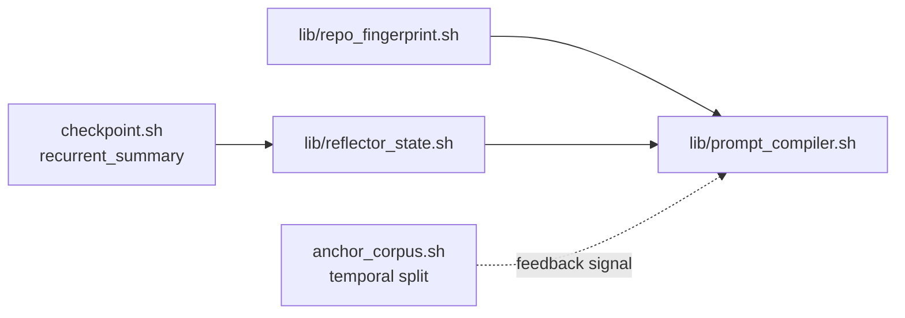

# Code2LoRA → mini-ork: paper explainer + application design

This doc explains the **Code2LoRA** paper in plain English, then maps each
of its techniques to a mini-ork primitive we can build. It does NOT
require any deep-learning background — only that you've used an LLM
coding assistant and felt the pain of "the model doesn't know my repo."

---

## 1. The problem the paper solves

When you ask a code LLM (Claude, Codex, Cursor's models, etc.) to
"complete this assertion" or "fix this bug," the model needs to know:

- **Imports** — what's available in this codebase?
- **Conventions** — how does this project name things, structure
  modules, handle errors?
- **APIs** — what does the function I'm calling actually accept?

There are two existing ways to give the model this knowledge, and both
have problems:

### Approach A: stuff the context window every call

This is what **RAG** (retrieval-augmented generation) and tools like
GitHub Copilot's repo-aware mode do. Every prompt carries chunks of the
repo as text. The model reads it fresh each time.

- ✗ Expensive: you pay for the retrieved tokens **every single query**.
- ✗ Context-window limited: real repos are millions of tokens; you can
  only fit a slice.
- ✗ Retrieval has its own failure modes (wrong files retrieved →
  irrelevant context).

### Approach B: fine-tune a LoRA per repo

LoRA = "Low-Rank Adaptation," a parameter-efficient way to teach a
frozen base model new knowledge by training a small adapter (a few
million extra weights). You can train a LoRA on `my-company/my-repo`
and inject it at inference time.

- ✓ Zero context-window overhead — the knowledge is in weights, not
  text.
- ✗ Training costs money + time per repo.
- ✗ **Stale on every commit.** Your team merges 50 PRs/day; the LoRA
  trained on Monday is wrong by Friday.

## 2. What Code2LoRA does

The authors propose a **hypernetwork** — a neural network whose job is
to generate the parameters of another network. Specifically:

> Given a repository, output a LoRA adapter for that repository, in one
> forward pass, without training a separate LoRA per repo.

Two flavors:

### Code2LoRA-Static — for stable codebases

```
repo snapshot → repository encoder → embedding (e)
                                     ↓
                              hypernetwork
                                     ↓
                          LoRA weights for THIS repo
                                     ↓
                              frozen base LLM
                                     ↓
                              code completions
```

One forward pass over the repo, you get one adapter, you use it for
every query against that repo. Zero retrieval cost at inference time.

### Code2LoRA-Evo — for evolving codebases

This is the interesting part. Real repos change. So instead of one
static embedding, they feed **a sequence of code diffs** through a
**GRU** (a recurrent neural network — think "running summary that
updates as new input arrives"):

```
   diff_1  →  e_1
                ↓
              GRU step 1  →  z_1  →  hypernetwork  →  LoRA at commit 1
                ↓
   diff_2  →  e_2
                ↓
              GRU step 2  →  z_2  →  hypernetwork  →  LoRA at commit 2
                ↓
   diff_3  →  e_3
                ↓
              GRU step 3  →  z_3  →  hypernetwork  →  LoRA at commit 3
```

The GRU hidden state `z_t` carries everything the model has learned
about this repo up to commit `t`. On the next commit, only the **diff**
needs to be embedded (cheap — usually <100 lines of code) rather than
re-encoding millions of tokens.

**Result on their benchmark (RepoPeftBench, 604 Python repos):**

| Setting | Method | Exact-match accuracy |
|---|---|---|
| Static, cross-repo | Code2LoRA-Static | 63.8% |
| Static, in-repo (per-repo LoRA upper bound) | Per-repo LoRA | 66% — Code2LoRA-Static matches without per-repo training |
| Evolution, cross-repo | Code2LoRA-Evo | 60.3% (+5.2pp over a shared LoRA) |

The headline: **Code2LoRA-Static reaches the per-repository LoRA quality
without ever training per-repo,** and **Code2LoRA-Evo handles commit
drift that breaks every other method.**

## 3. How the three building blocks work

### 3.1 Repository encoder (file → embedding)

Two-step, no training needed:

1. **File-level embedding:** chunk each file into 4096-token windows
   with 512-token overlap. Run a frozen embedding model
   (Qwen3-Embedding-0.6B) on each chunk. Mean-pool over chunks for one
   vector per file: `f_i ∈ ℝ^1024`.

2. **Repository-level aggregate:** every file gets an importance weight
   `w_i` based on three signals:
   - **Content distinctiveness** — files unique to this repo matter
     more than boilerplate.
   - **File size** — bigger files contribute more (within reason).
   - **Path importance** — `src/core/*` outranks `tests/fixtures/*`.

   Then concatenate weighted-mean and max-pool:

   ```
   e = [ Σ w_i · f_i ; max_i f_i ] ∈ ℝ^2048
   ```

   The weighted-mean catches "what is this repo on average about"; the
   max-pool catches "what is most distinctive about it." Together they
   form a 2048-dim fingerprint per repo.

### 3.2 Hypernetwork (embedding → LoRA weights)

A 2-layer MLP with GELU activation produces a hidden state `h`. Then
seven dedicated output heads emit the LoRA matrices for the seven
attention/MLP projection types `{q, k, v, o, gate, up, down}`:

```
A_m = tanh(Head_m^A(h)) · exp(s_m^A)
B_m = tanh(Head_m^B(h)) · exp(s_m^B)
```

The learnable log-scales `s_m^{A/B}` control adapter magnitudes; the
tanh keeps individual entries bounded. About 720M trainable parameters
total for the static head.

### 3.3 GRU update rule (for evolving repos)

At each commit `t`, only the **diff** is re-embedded; the running state
absorbs it:

```
z_t = GRU( LayerNorm(Linear(e_t)), z_{t-1} )
```

`z_0` is initialized by a small projector from the initial repo
embedding (e.g., the first commit's snapshot). At step `t` the LoRA is
generated from `z_t` instead of `e`.

Training uses **truncated backprop through time** with `K=16` — the
hidden state is detached every 16 steps so memory stays bounded over
long commit histories.

### 3.4 Why this matters in honest terms

The paper proves three things you actually care about:

1. **One forward pass beats per-repo training** on the static track —
   the hypernetwork has learned to write a LoRA from repo context as a
   general skill, like a model learns to write English in general.
2. **Recurrence beats snapshot on evolving repos** — a frozen adapter
   goes stale; a GRU-updated one keeps up.
3. **It generalizes to repos the hypernetwork never saw** — 92-repo
   temporal OOD holdout, created after the data-collection cutoff,
   still gets the +5.2pp advantage.

---

## 4. Why we can't literally apply this to mini-ork

Mini-ork dispatches to **closed-weight providers** (Anthropic, OpenAI,
Moonshot, Zhipu, MiniMax, DeepSeek). We don't have:

- access to the base model's parameter tensor (it's behind an API),
- the ability to inject LoRA weights into the inference pipeline,
- the training infrastructure to fit a hypernetwork on 200K+ commits.

So the literal architecture is unbuildable for our deployment. **But
every load-bearing idea in the paper has a closed-weights equivalent
that maps cleanly onto mini-ork primitives we already ship.**

The substitution table:

| Paper concept | Closed-weights equivalent |
|---|---|
| Repository encoder → 2048-dim embedding `e` | Repo fingerprint hash + a structured summary block stored in `run_profile.json` |
| Hypernetwork → LoRA adapter | Prompt compiler → tailored planner-prompt prefix, cached |
| Frozen base LLM + injected LoRA | Provider LLM + Anthropic prompt-cache hit (cache_read pricing) |
| Zero inference-time token overhead | Prompt cache hits charge at cache_read rate (~10% of input rate) on every dispatch after the first |
| GRU state `z_t` updated per diff | Recurrent reflector state updated per node-completion |
| RepoPeftBench CR/IR/OOD splits | Anchor corpus temporal splits via commit-timestamps |

The key insight is what the paper *itself* keeps repeating: the win is
**"distill repo knowledge into something that's read at a fixed cost
per dispatch, refresh it as the repo evolves."** Mini-ork can do that
with cached prompts and a recurrent reflector — no model weights
required.

---

## 5. Concrete mini-ork extensions

Five shipping units, each a single new lib or a single-file extension
to a shipped lib. Each one is self-contained — pick any order.

### 5.1 `lib/repo_fingerprint.sh`

**What it does:** Computes a fixed-size repo fingerprint analogous to
Code2LoRA's `e`. Two-step like the paper, but with substitutes that
don't need a GPU:

- **File-level signal:** use `tiktoken`-shaped token counts + a
  bag-of-words hash + path-extension distribution. For deployments
  with a local embedder available, fall back to it; otherwise the
  hash-based signal is enough to detect "did this repo materially
  change since last fingerprint."
- **Repo-level aggregate:** weighted by content distinctiveness (TF-IDF
  on rare identifiers), file size, and path importance heuristics.

**Public API:**

```bash
mo_repo_fingerprint <repo_root>
# → emits { "fingerprint_v": "fp-<12hex>",
#           "file_count": N,
#           "weighted_token_signal": "...",
#           "max_signal": "...",
#           "computed_at": <unix_ts> }
```

**How it composes:** `run_profile.json` gets a new
`repo_fingerprint` field. Cached prompts are keyed by
`fingerprint_v + recipe + node_type`. When the fingerprint changes
by more than a threshold, mini-ork knows to refresh the cache prefix.

**Self-test:** finger this repo, modify a file, finger again, assert
the version hash changed.

### 5.2 Extend `lib/checkpoint.sh` with recurrent summary

**What it does:** Adds a third field to `.checkpoint.json`:
`recurrent_summary` — a constant-size markdown block that absorbs
verifier evidence as nodes complete. This is the closed-weights
analog of Code2LoRA-Evo's `z_t`.

**Public API addition:**

```bash
checkpoint_update_recurrent <node_id> <evidence_json>
# Appends a 3-line summary entry to .checkpoint.json.recurrent_summary
# (drops oldest entry past K=16 — same as the paper's TBPTT window)
```

**How it composes:** Each node-completion writes its evidence; the
running summary is what the replanner reads on iteration N+1 instead
of replaying the full plan from scratch. Direct token-saver — pairs
with the `recursive-validate-impl` recipe's loop.

**Self-test:** write 20 node-completions, assert the summary holds
the last 16 with FIFO eviction.

### 5.3 Extend `lib/anchor_corpus.sh` with temporal split

**What it does:** RepoPeftBench's CR/IR/OOD split, applied to
verifier corpora. Each anchor in the corpus gets an optional
`created_at` timestamp; recall is computed separately on:

- **In-repo (IR):** anchors created BEFORE the recipe-version timestamp
  (training-time-like).
- **Cross-repo (CR):** anchors from corpora the recipe was never
  trained on.
- **Temporal OOD:** anchors created AFTER the recipe-version timestamp.

**Public API addition:**

```bash
anchor_corpus_temporal_split <corpus> <recipe_version_ts> <findings>
# → emits per-split recall numbers + an OOD-degradation delta:
#   { "in_repo_recall": 0.92, "cross_repo_recall": 0.85,
#     "ood_recall": 0.71, "ood_degradation_pp": 14 }
```

**How it composes:** The recipe runner records its own version
timestamp on every dispatch. Verifier rubrics (P3.9, commit 53d6ad0)
read the temporal split + flag a "recipe drift" event when OOD
degradation exceeds a threshold — exactly the signal that a Code2LoRA
training run uses to decide when to refresh.

**Self-test:** 8-anchor corpus with timestamps; split at the median;
assert recall numbers are computed independently per partition.

### 5.4 `lib/reflector_state.sh`

**What it does:** The GRU-equivalent. A truncated recurrent
summarization of the last K verifier verdicts + their reviewer
verdicts + their oracle-gate scores. Output is a constant-size
markdown block consumed by the replanner.

**Public API:**

```bash
reflector_state_update <run_dir> <node_evidence_json>
# Appends to .reflector-state.json + emits a 5-bullet compressed
# summary suitable for direct interpolation into a planner prompt.

reflector_state_summary <run_dir>
# Emits the compressed-summary markdown block.
```

**How it composes:** Sits between `lib/checkpoint.sh`'s
recurrent_summary (raw evidence) and the replanner prompt
(consumes the summary). The compression heuristic is the closest
closed-weights analog to a GRU: keep last K, hash content into 5
clusters, emit one bullet per cluster.

**Self-test:** feed 30 verdicts; assert summary stays ≤ 5 bullets
and reflects the most recent K=16.

### 5.5 `lib/prompt_compiler.sh`

**What it does:** The hypernetwork-equivalent. Given
`(repo_fingerprint, recipe, reflector_state)`, compile a tailored
planner-prompt prefix and stash it under the Anthropic
prompt-cache key. On the next dispatch with the same fingerprint
and recipe, the prefix is a cache hit; the dispatch only pays
`cache_read` rates for the prefix.

**Public API:**

```bash
prompt_compile <repo_fingerprint> <recipe> <reflector_state_path>
# → emits the compiled prompt prefix on stdout AND a cache_key
#   suitable for the Anthropic prompt-cache control block.

prompt_compile_invalidate <cache_key>
# Marks the cache as stale (used when repo_fingerprint diverges).
```

**How it composes:** Lane providers (cl_codex.sh etc.) check for a
cached prefix before sending each dispatch. Hit → use cache_read
pricing (0.30 USD/M for sonnet vs 3.00 USD/M input). Miss → recompile
and write fresh cache. This is **the closed-weights "zero
inference-time token overhead"** — the cached prefix is the closed-
weights LoRA.

**Self-test:** compile twice with same inputs → same cache_key;
modify reflector_state → different cache_key.

---

## 6. Shipping order + dependencies



Independent units (no inter-dependencies): A, B, C.
Composed units: D depends on B; E depends on A, D.

**Recommended order:**

1. **A** — repo_fingerprint (foundation; everything else keys off it)
2. **B** — checkpoint.recurrent_summary (cheap, pairs with shipped recipe)
3. **C** — anchor_corpus temporal split (pure substrate, low risk)
4. **D** — reflector_state (depends on B)
5. **E** — prompt_compiler (depends on A + D; biggest leverage but
   needs the others first)

A through D are pure leaf primitives (~150-250 LOC each, self-tests
on first run). E is the orchestrator that ties them together and is
where the actual token-cost savings show up.

---

## 7. Honest limitations

Three places where the closed-weights analog is **strictly weaker**
than the paper:

1. **The compiled prompt is text, not weights.** A LoRA changes how
   the model thinks; a cached prefix only changes what it reads. If
   the base model is bad at, say, your project's quirky naming
   convention, no amount of prefix caching teaches it to be better.

2. **No real "hypernetwork generalization."** The paper's hypernetwork
   reaches the per-repo LoRA upper bound on unseen repos because the
   hypernetwork itself has been trained on 409 repos. Our
   prompt_compiler is a templating function, not a trained model —
   it does well-defined string composition, not learned cross-repo
   generalization.

3. **No assertion-completion benchmark.** RepoPeftBench is a 604-repo
   benchmark with quantitative tracks. Mini-ork's substrate
   (anchor_corpus) is closer to a recall harness than a generative
   benchmark — we measure "did the verifier find the planted issues"
   not "did the model predict the right assertion right-hand-side."

If/when open-weight providers (Llama 4, Qwen 3, etc.) become a
first-class lane in mini-ork, the literal Code2LoRA architecture
becomes shippable. Until then, the closed-weights equivalents above
are the load-bearing share of the win.

---

## 8. Citations + references

- **Code2LoRA paper** — Hotsko, Li, Deng, Nie. *Code2LoRA:
  Hypernetwork-Generated Adapters for Code Language Models under
  Software Evolution.* arxiv:2606.06492v1, 2026-06.
- **Code mirror** — https://anonymous.4open.science/r/code2lora-6857
- **Benchmark + checkpoints** — https://huggingface.co/code2lora
- **Local extraction** — `.mini-ork/research-notes/arxiv-2606.06492.md`

Related mini-ork primitives this design composes with:

- `lib/checkpoint.sh` (commit `843eca2`) — per-node checkpoint primitive
- `lib/anchor_corpus.sh` (commit `f1a9032`) — recall scorer substrate
- `lib/verifier_rubric.sh` (commit `53d6ad0`) — ground-truth feedback
- `.mini-ork/config/pricing.yaml` (commit `13ea509`) — cache_read column
  is exactly the rate the prompt_compiler exploits
