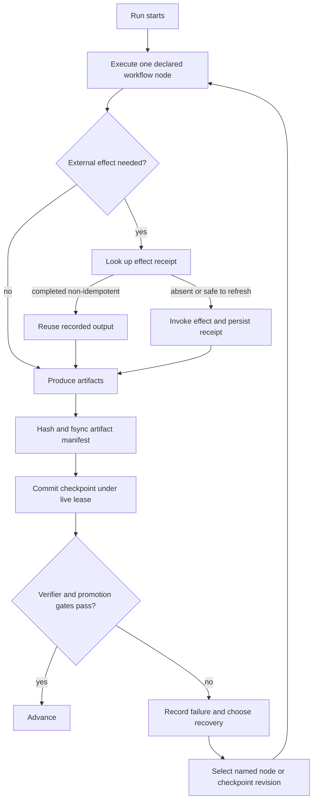
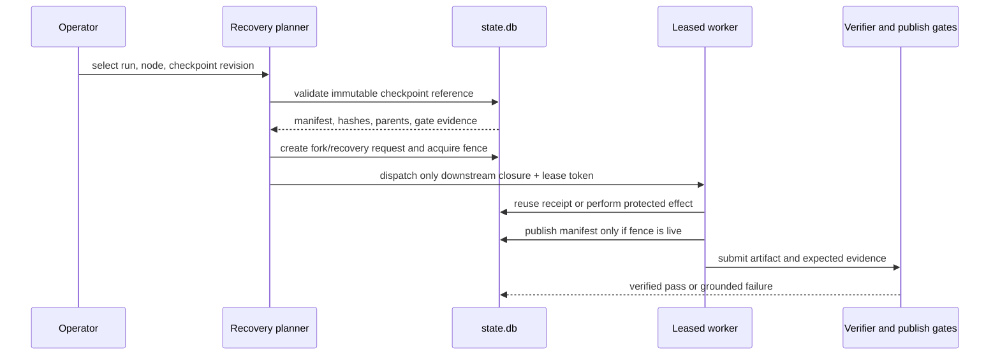

# Durability, resilience, and precise resume: lessons for MiniOrk

**Status:** source-grounded research; no MiniOrk runtime behaviour changes in this document.
**Snapshot date:** 2026-07-27

## The short answer

Durable agent execution is not “save the chat, then retry.” It is the ability
to identify an exact, valid execution boundary; prove which work may be reused;
and safely rerun everything after that boundary without duplicating an external
side effect.

MiniOrk already has the essential foundation:

- artifact-manifest checkpoints tied to the resolved inputs, recipe version,
  and configuration;
- a single-writer lease with fencing, so a stale recovery cannot publish over a
  newer one;
- idempotent recovery requests; and
- receipts for MiniOrk-owned non-idempotent tools.

The clearest next improvement is **immutable checkpoint history**. Today a
recovery can deliberately start from a named workflow node. It cannot yet name
and fork from one particular historical revision of that node's checkpoint.

## Scope and evidence

I cloned these upstream repositories into a temporary directory and read the
implementation, not only the project descriptions. The links below pin the
source snapshots used for this note.

| Project | Role in the ecosystem | Source snapshot |
| --- | --- | --- |
| LangGraph | durable state-machine runtime | [`30c4d58`](https://github.com/langchain-ai/langgraph/tree/30c4d58db86455128e42ddec96b1ba53c553ba22) |
| LangChain | agent composition and policy middleware | [`39701d6`](https://github.com/langchain-ai/langchain/tree/39701d6b8e9dc62b57f63fec1d10d2d1f4293303) |
| DeepAgents | long-horizon agent assembly on LangChain/LangGraph | [`6b1a136`](https://github.com/langchain-ai/deepagents/tree/6b1a136702b4ccfd6fb30a0e53c2ff23f999f847) |

The current LangGraph documentation independently corroborates the checkpoint,
interrupt, replay, and fork semantics described here: [checkpointers](https://docs.langchain.com/oss/python/langgraph/checkpointers)
and [time travel](https://docs.langchain.com/oss/python/langgraph/use-time-travel).

## A safe resume has two boundaries

There are two distinct things a system might mean by “resume.” They should not
be conflated.

1. **State boundary.** Restore a known state and decide which graph node or
   workflow node runs next.
2. **Effect boundary.** Prevent an already completed external action—such as a
   commit, deployment, ticket update, or API POST—from running again while the
   state is replayed.

LangGraph is strong at the first boundary. MiniOrk's tool receipts and publish
fence address the second. A robust software-agent system needs both.



The checkpoint confirms durable work. It does **not** retroactively make a
side effect safe. The receipt is what makes replay safe.

## What the three projects actually provide

### LangGraph: a durable graph kernel

LangGraph represents a checkpoint as more than a serialized state value. Its
checkpoint contains channel values, channel versions, each node's observed
versions, pending writes, parent checkpoint references, source, step, and run
identifier. A checkpoint is addressed by a `thread_id`, a checkpoint namespace,
and optionally a `checkpoint_id`.

That identity enables three useful operations:

| Operation | How LangGraph models it | MiniOrk equivalent or lesson |
| --- | --- | --- |
| Continue normally | Load the newest checkpoint for a thread | Resume from the earliest non-reusable workflow node |
| Inspect a past point | List state history and select a snapshot | Expose checkpoint history and its manifest/validity evidence |
| Fork safely | Update state from an explicit historical snapshot, creating a new lineage | Create a new recovery/fork identity; never overwrite the original evidence |

Its `interrupt()` mechanism makes an important safety rule explicit: resuming
an interrupt re-executes the node from its beginning. Therefore an interrupting
node must not perform an unprotected non-idempotent action before the
interrupt. This is directly relevant to MiniOrk's user gates and recovery
boundaries.

LangGraph also makes a meaningful durability trade-off visible: `sync` persists
before the next step, `async` persists while the next step runs, and `exit`
persists only at the end. For MiniOrk, dispatch, recovery, escalation,
verification, promotion, and human-approval boundaries are worth the stronger
`sync`-like rule. Cheap, reconstructible telemetry can remain asynchronous.

Its SQLite saver uses WAL and separate checkpoint/write tables, but explicitly
positions SQLite as a lightweight synchronous option rather than a
multi-threaded production store. That matches MiniOrk's current local
`state.db` use. It is not evidence that a fleet of independent workers can
safely share one SQLite file.

### LangChain: policy at the agent boundary

LangChain's `create_agent` accepts a LangGraph checkpointer and a cross-thread
store; it delegates durable graph state to LangGraph rather than providing a
second competing persistence model. Its main contribution here is middleware:

- `HumanInTheLoopMiddleware` can pause specific tool calls and accepts explicit
  approve, edit, reject, or respond decisions.
- `ToolRetryMiddleware` retries configured exceptions with bounded exponential
  backoff and jitter.
- model and tool call limit middleware keeps per-thread and per-run counters in
  agent state, preventing a loop from silently exceeding a configured budget.

The lesson is **not** to copy a generic middleware stack. MiniOrk should keep
the durable decision record already implied by its recipe, artifact contract,
verifier, and promotion model. The useful pattern is to turn policy choices
into structured evidence: what was proposed, why it was allowed or blocked,
which limit applied, and what evidence is required next.

One deliberate non-adoption: LangChain's retry middleware retries in-process.
It is useful for transient read-only operations, but it is not a durable work
queue and does not by itself make an arbitrary write action safe to retry after
a process crash.

### DeepAgents: long-horizon task ergonomics, not a new durability layer

DeepAgents composes LangChain middleware and forwards the same `checkpointer`
and `store` into the resulting agent. It contributes useful operational
patterns:

- a task/todo list for decomposing long work;
- isolated, synchronous subagents that receive a detailed task and return one
  report; their task-tool documentation explicitly calls each invocation
  stateless;
- remote asynchronous subagents that persist `task_id`, remote `thread_id`,
  `run_id`, status, and timestamps in agent state, then support check, update,
  cancel, and list operations; and
- conversation compaction that offloads old messages to a per-thread markdown
  history file before summarization.

The remote-task record is an especially useful shape for MiniOrk's parallel
lanes: every dispatched item should carry a durable ID, owner, attempt,
location, status, timestamps, and result reference. But DeepAgents' task state
is a tracker around a remote service; it is not an exactly-once execution
guarantee. MiniOrk still needs its own leases, fences, receipts, artifact
manifests, and verifier gates.

Conversation offload is a context-management technique, not an audit log.
MiniOrk should keep manifests, verifier results, decisions, receipts, and
promotion evidence in canonical structured storage. A model-facing summary may
point to that evidence, but must not replace it.

## What MiniOrk already does well

The current implementation already encodes several lessons that are often
missing when agents add “durability” late:

| Existing MiniOrk mechanism | Why it matters | Primary code evidence |
| --- | --- | --- |
| Artifact-first checkpoint publication | Artifacts are hashed and fsynced before one SQLite transaction publishes the checkpoint and attempt record. Missing or altered artifacts fail closed on reuse. | `mini_ork/stores/checkpoints.py` |
| Semantic checkpoint validity | Reuse checks the current input hash, recipe version, config hash, and manifest instead of treating “completed” as sufficient. | `db/migrations/0050_node_dag_checkpoints.sql` |
| Selective DAG restart | `mini-ork recover <run_id> --from-node <id>` recomputes the rerun closure from that declared node rather than blindly rerunning everything. | `mini_ork/recovery/planner.py` |
| Single-writer lease and fencing | An expired owner can be replaced, and a stale owner is rejected at checkpoint publication. | `mini_ork/stores/lease.py`, `db/migrations/0052_run_leases_recovery_requests.sql` |
| Recovery idempotency and budget | Equivalent recovery requests converge on one record and dispatch is budget bounded. | `mini_ork/stores/lease.py` |
| Effect receipts | A completed non-idempotent MiniOrk-owned tool call returns its recorded output on recovery rather than invoking again. | `mini_ork/stores/tool_receipts.py` |

These are part of MiniOrk's differentiation. LangGraph, LangChain, and
DeepAgents should inform the design, not displace the recipe-bound heterogeneous
lanes, deterministic verifiers, artifact contracts, cost governance, or
promotion gates.

## The one important gap: exact historical checkpoint selection

MiniOrk currently makes a strong **node-level** restart possible:

```bash
# Inspect a recovery plan without dispatching work.
mini-ork recover <run_id> --from-node <node_id> --strategy pause

# Run the recalculated closure after review.
mini-ork recover <run_id> --from-node <node_id> --strategy resume
```

This is the correct operator interface for “start again from the reviewer” or
“rerun implementation and all downstream verification.” It preserves the
workflow topology instead of jumping into arbitrary agent code.

However, `node_checkpoints` currently has one primary row per `(run_id,
node_id)`. It records the latest reusable checkpoint for that node, while
`node_attempts` preserves attempt observability. This makes current recovery
safe, but it does not provide a first-class immutable **checkpoint revision**
that an operator can select, compare, or fork.

The resulting design target is:

```text
CheckpointRef = {
  run_id, node_id, checkpoint_revision, parent_ref,
  workflow_digest, recipe_version, config_hash, input_hash,
  artifact_manifest_digest, verifier_summary, lease_fence
}
```

An exact-resume request should require this reference (or a server-generated
opaque ID), create a **new** recovery/fork run, and rerun that node's downstream
closure. It must never mutate the original checkpoint or skip a verifier,
promotion, scope, or human gate.



## Recommended path, in dependency order

This extends the prior MiniOrk direction of Decision Checkpoints, structured
lane resolution, leased work, recovery behaviours, and offline learning. It is
deliberately additive.

| Order | Change | Acceptance rule |
| --- | --- | --- |
| 1 | Emit a `DecisionCheckpoint@v1` at dispatch, recovery, escalation, verifier, promotion, and human-gate boundaries. Store the verifier state, failure class, allowed lanes/tools, capability health, remaining budget, selected action, reason, and expected evidence. | Every consequential routing action is explainable without reconstructing an LLM transcript. |
| 2 | Preserve the existing node checkpoint as the current head, but add immutable checkpoint revisions and parent links. | An operator can inspect, select, and fork a specific revision; the original history is never overwritten. |
| 3 | Generalise the current run lease into durable leased work items for parallel lanes. Require an artifact manifest and relevant verifier gate before completion can publish. | Expired work is recoverable; a stale worker cannot publish; duplicate completion is rejected. |
| 4 | Make `LaneResolutionPolicy` a pure function that returns a structured decision rather than a lane string. Keep recipe-pinned heterogeneous lenses immutable unless an explicit policy permits a change. | The same checkpoint context yields the same decision; changing a lens is auditable. |
| 5 | Define a small, authored recovery library: reproduce, inspect, narrow scope, safe tool retry, replan, stronger lane, and human gate. | Recovery actions are evaluated and verifier-grounded before any learning signal uses them. |
| 6 | Only after the event and recovery data are reliable, evaluate routing offline. Use actions such as continue, tool, cheap lane, replan, stronger lane, and user interrupt. | The reward is verified information gain minus cost, latency, and interruption burden; learning cannot bypass the gates above. |

## Resilience rules worth keeping explicit

1. **A checkpoint is reusable only if the current inputs and evidence still
   match.** Hash mismatch, recipe/config drift, absent artifact, or failed
   verifier means rerun.
2. **A lease is not a lock.** It expires; every publish must check the current
   fence token. Lease acquisition alone cannot protect a late worker.
3. **Retry by failure class.** Retry provider throttling and transient reads;
   do not automatically retry an unclassified write, a scope violation, or a
   failed verification.
4. **Human decisions are durable artifacts.** Store the reviewed action,
   allowed edits, decision, reviewer identity when available, and the exact
   checkpoint they approved. Resuming should consume that artifact, not ask a
   different question because the prompt changed.
5. **Use summaries for context, not proof.** Summaries can guide a model to
   manifest or verifier evidence; they cannot become the source of truth.
6. **Do not learn from unverifiable success.** A model output, completed
   process, or self-report is not a positive reward until the relevant
   deterministic verifier and publication gates succeed.

## What not to adopt

- Do not replace MiniOrk's recipe, artifact, verification, and promotion model
  with a general-purpose graph library.
- Do not treat SQLite WAL as a multi-host coordination solution. Its local
  single-writer discipline is valuable; distributed workers need a suitable
  durable coordination store.
- Do not automatically retry side effects just because an exception appears
  transient. The safe prerequisite is an idempotency key or a completed receipt.
- Do not let a selected historical checkpoint bypass new scope, verifier,
  publication, promotion, or human gates.
- Do not claim that MiniOrk can replay every provider-internal tool call. The
  current receipt seam correctly covers MiniOrk-owned node-boundary effects;
  opaque provider tool loops need a separate interception contract.

## Existing verification seams

The following focused tests already capture the important current guarantees
and should remain part of the acceptance suite for future extensions:

- `tests/test_recovery_closure.py` — reuse, invalidation, and `--from-node`
  closure calculation;
- `tests/test_lease_fencing.py` and `tests/test_recover_lease_wiring.py` —
  one live recovery and rejection of stale checkpoint publication; and
- `tests/test_tool_receipts.py` — replay does not invoke a completed
  non-idempotent action twice.

For immutable revisions and work-item leases, add equivalent tests for exact
revision selection, parent-lineage preservation, rejected stale completion,
and a recovery fork that cannot promote an unverified result.
