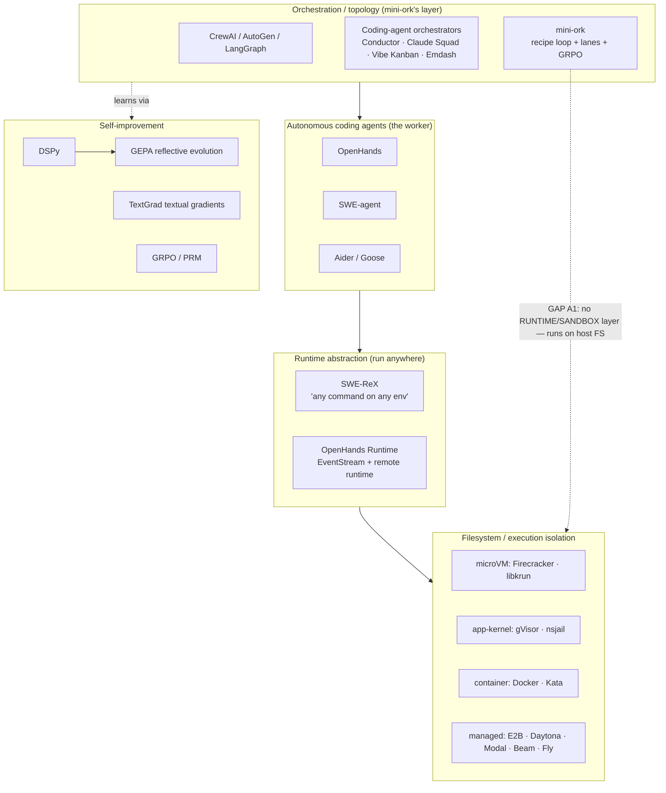
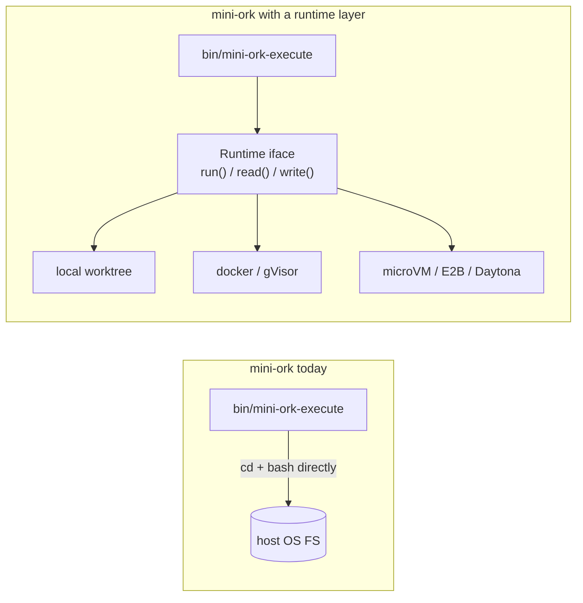

# Design research: agent sandboxing + orchestrators like mini-ork (2026-06-30)

**Why this exists.** mini-ork is a bash "task OS for agents" (classify→plan→
execute→verify→reflect→improve loop, recipe runner, heterogeneous LLM lanes,
GRPO learning, git-worktree isolation). Its #1 architectural gap (**A1** in the
fix tracker): **agents run directly on the host OS filesystem** — no per-agent
sandbox. That (a) blocks cloud/remote execution and (b) just caused cross-repo
corruption (a stray codex process reset another repo's git HEAD). This doc surveys
how the ecosystem solves these problems and what mini-ork should borrow.

Sources: jina/web search 2026-06-30 — `restyler/awesome-sandbox`, spheron isolation-stack
breakdown, `SWE-agent/swe-rex`, augmentcode "9 open-source agent orchestrators",
TextGrad/GEPA/DSPy, `lechmazur/debate`, `karpathy/llm-council`, OpenHands SDK (arXiv 2511.03690).

---

## 0. The landscape (how the pieces relate)

mini-ork today spans ORCH + AGENT + LEARN but has **no RUNTIME or SANDBOX layer** —
it executes on the host. That's the gap to close.

---

## A. Agent filesystem isolation & cloud execution  *(the priority)*

### A.1 The isolation taxonomy (from `awesome-sandbox` + spheron)

| Class | Mechanism | Examples | Boot | Isolation strength | Self-host |
|---|---|---|---|---|---|
| **MicroVM** | own Linux kernel via KVM | **Firecracker**, **libkrun** | ~125ms | **strongest** (hardware) | yes |
| **App kernel** | intercept syscalls in userspace | **gVisor**, nsjail | ~tens ms | strong (syscall boundary) | yes |
| **Container** | namespaces + cgroups | Docker/OCI, **Kata** (container API, VM under) | ~10-50ms | weakest (shared kernel) | yes |
| **Language runtime** | WASM / V8 isolate | WebContainers, Cloudflare Workers | ~1-10ms | medium, but no full Linux | n/a |

Consensus ranking (multiple sources): **microVM (Firecracker/Kata) > gVisor > plain container.**
"The minimum acceptable isolation for a production agent execution sandbox is
typically a Firecracker/Kata microVM, with gVisor used in some cases." Firecracker
adds a "jailer" companion (cgroups+namespaces) for defense-in-depth; it's what AWS
Lambda/Fargate run on.

### A.2 Managed sandbox platforms (don't build the VM layer yourself)

| Platform | Under the hood | OSS / self-host | Note |
|---|---|---|---|
| **E2B** (`e2b.dev`) | Firecracker microVM per sandbox | OSS, self-hostable | "made to run untrusted workflows"; own kernel + memory, no shared state |
| **Daytona** | gVisor default + elastic infra | OSS | "secure & elastic infra for AI code"; Docker isolation by default = weaker |
| **microsandbox** | **libkrun** microVMs, self-hosted | OSS | self-hosted microVMs for untrusted code |
| **Modal** | gVisor | hosted | no microVM option |
| **Beam / Northflank / Fly.io** | containers / microVMs | hosted (Fly = microVMs) | GPU-ready picks |

### A.3 What mini-ork should do (A1 fix direction)
1. **Introduce a `Sandbox` boundary** each agent gets: an isolated rootfs + a single
   mounted, scoped workspace dir. An agent must not be able to `cd` to or write any
   path outside its workspace — this *structurally* prevents the cross-repo HEAD
   clobber we hit, in addition to enabling cloud.
2. **Tiered backends** behind one interface: `local-worktree` (today, dev only) →
   `docker`/`gVisor` (cheap CI) → `firecracker`/`microsandbox` or `E2B`/`Daytona`
   (untrusted/cloud). Pick per recipe via an env knob (`MO_SANDBOX_BACKEND`).
3. **Don't build the VM layer** — wrap E2B/Daytona/microsandbox. They already solve
   boot-time + jailer + snapshotting.

---

## B. Runtime-abstraction layer — the SWE-ReX pattern  *(highest-leverage borrow)*

**SWE-ReX** (`SWE-agent/swe-rex`) is the cleanest model for mini-ork's executor:

> "a runtime interface for interacting with sandboxed shell environments, allowing
> you to effortlessly let your AI agent run **any command on any environment** —
> local, Docker, AWS, Modal, Daytona — massively parallel (30+ agents)."

The idea: **decouple the agent logic from where commands physically run.** The agent
calls `run(command)` against a *deployment* (local / container / microVM / cloud);
the deployment handles transport, sessions, and isolation. Same agent code runs on a
laptop or 30 cloud microVMs.

**Borrow:** define a thin `lib/runtime/*.sh` (or the Python `mini_ork.dispatch`
already started) interface — `runtime_exec`, `runtime_put`, `runtime_get`,
`runtime_session` — with a `local` impl (current behavior) and a `container` impl
first. Recipes/executor call the interface, never `cd`+`bash` directly. This is the
single change that unlocks cloud execution *and* fixes A1.

---

## B.1 mini-SWE-agent — the minimalist sibling, and the cheapest path to A1

`SWE-agent/mini-swe-agent` (Princeton/Stanford SWE-bench team; used by Meta, NVIDIA,
IBM, Anyscale; **>74% SWE-bench verified in ~100 lines, bash-only**) is the most
directly relevant repo to mini-ork — and it has already solved A1 by *design*, not by
adding infrastructure. Three properties make sandboxing/cloud trivial:

1. **Every action is an independent, stateless `subprocess.run`** — NOT a persistent
   shell session. Their own words: *"this is a big deal for stability… it makes it
   trivial to execute actions in sandboxes — literally just switch out `subprocess.run`
   with `docker exec` — and to scale up effortlessly."*
   → **This is the crux of A1.** mini-ork's executor keeps stateful shell context and
   `cd`s the host, so it can't be swapped to a sandbox backend. If actions were
   stateless + routed through a single exec function, swapping local→`docker exec`→
   microVM would be a one-line backend change (== R1, the runtime interface).
2. **Bash-only, no custom tools, no tool-calling interface** — works with *any* model;
   "want a PR? just tell the LM to figure it out." mini-ork is already bash-centric, so
   this validates the direction and argues against over-building tools.
3. **Completely linear history** — messages == trajectory (great for debugging + FT).
   Relevant to mini-ork's I-14 observability mess (multiple status sources): a linear
   append model is easier to render faithfully.

**Deployable backends it ships out of the box:** local, **docker/podman**,
**singularity/apptainer**, **bubblewrap**, contree. Note **bubblewrap** — an
unprivileged, lightweight FS/namespace sandbox (no VM, no daemon). That's the ideal
*cheap middle tier* for mini-ork between "local worktree" and "microVM/E2B": real
path/namespace isolation that would have *prevented the cross-repo HEAD clobber*, with
near-zero overhead. Models are pluggable via **litellm/openrouter/portkey** (vs
mini-ork's hand-rolled `lib/providers/cl_*.sh`).

**Borrow, concretely:**
- Refactor the executor so a recipe action is a **stateless exec call** through one
  function (`runtime_exec`), the way mini-SWE-agent uses `subprocess.run`. This is the
  prerequisite that makes R1/R2 cheap rather than a rewrite.
- Add a **bubblewrap backend** as the first real sandbox tier (cheap, no daemon) before
  reaching for Docker/microVM.
- Steal its trajectory-browser + linear-history model for I-14.

## C. Orchestration topology — what mini-ork already does well vs. what to borrow

The augmentcode roundup of **9 OSS coding-agent orchestrators** (Composio, Emdash,
Baton, Conductor family [conductor.build, Code Conductor, MS Conductor], Bernstein,
Claude Squad, Crystal/Nimbalyst, Vibe Kanban, Agent Kanban) converges on one lesson:

> "**Git worktrees became the consensus isolation primitive** within ~18 months.
> The interesting differences are what each project built on top."
> The single-agent assumption "breaks the moment I run three agents against the same
> repo. They clobber each other's files, fight over the dev server port, and leave me
> reconstructing what happened from `git reflog`."

**That is precisely mini-ork's corruption story.** Worktrees are necessary but *not
sufficient* — they don't stop a process from reaching outside its worktree (our bug).
Hence Section A/B (real FS boundary) matters even with worktrees.

What's worth borrowing from this tier:
- **Kanban/board state model** (Vibe Kanban, Agent Kanban): explicit per-task lanes
  with visible status — maps to mini-ork's epics/scheduler but with a UI for
  conflict/merge decisions (mini-ork's I-14 observability gap).
- **Explicit merge/conflict-resolution stage** — all of them flag that task
  alignment + conflict resolution + merge decisions are still manual; a dedicated
  "janitor/verify→merge" node (one orchestrator uses `Goal → Planner → Task Graph →
  Orchestrator → Agents(parallel) → Janitor(verify) → Git`) is the pattern mini-ork's
  auto-merge already approximates — harden it.
- **Control plane with policy/approval gates + audit trail** (the `ai-orchestration`
  topic's "open agent control plane") — mini-ork has gates; add the audit-trail/HITL
  approval surface (v0.6.0 already started a control plane + steering checkpoint).

**OpenHands** (most-starred OSS agent) is worth studying for its **EventStream
architecture** (controller process drives the agent loop; runtime is a separate
Docker/remote process) and **remote runtime** — a clean split mini-ork lacks.

---

## D. Self-improvement loops — mini-ork is on-trend; one key finding

mini-ork already uses **GRPO + a PRM + "textual gradients."** The ecosystem:
- **TextGrad** (`zou-group/textgrad`) — "backpropagation through text feedback from
  LLMs"; the gradient metaphor mini-ork's `gradient_extractor.sh` echoes.
- **DSPy + GEPA** (`gepa-ai/gepa`) — GEPA = reflective *prompt* evolution (genetic-
  Pareto). **Key result (arXiv 2507.19457): GEPA beats GRPO by ~10% avg (up to 20%)
  using up to 35× fewer rollouts.** For mini-ork's expensive multi-LLM rollouts, a
  GEPA-style reflective evolution of recipe prompts could be far cheaper than GRPO.
- **Trace / AgentEvolver / ADAS** — automated design of agentic systems (survey
  preprints.org 202606.0238) — relevant to mini-ork's recipe-evolution ambitions.

**Borrow:** add a GEPA-style reflective prompt-evolution optimizer alongside GRPO and
A/B them on the learning loop; GEPA's rollout efficiency directly attacks mini-ork's
cost pain (I-4).

---

## E. Multi-model panels / judges — mini-ork's lenses, externally validated

mini-ork's heterogeneous "lens panel + arbiter" is a recognized pattern:
- **`lechmazur/debate`** — adversarial multi-turn debate judged by a **3-model panel**
  (winner + margin + diagnostic scores) — mirrors mini-ork's cross-family panel.
- **`karpathy/llm-council`** — models answer, cross-review, then a chairman synthesizes.
- Surveys: `Awesome-LLM-Ensemble` (arXiv 2502.18036), `Awesome-LLMs-as-Judges` — and a
  caution: LLM judges have **positional/knowledge/format bias** (randomize order,
  diversify families). mini-ork already diversifies families (memory: opus/codex/kimi
  /minimax/glm); add **position randomization + bias checks** to the arbiter.
- **`North-Shore-AI/crucible_ensemble`** — "massively concurrent SLM ensembles reach
  99.9% reliability at <10% the cost of one big model" — a cheaper-quorum idea for the
  I-1 lens-quorum fix.

---

## F. Concrete recommendations for mini-ork (priority-ordered)

| # | Recommendation | Closes | Effort |
|---|---|---|---|
| R0 | **Make recipe actions stateless** (mini-SWE-agent's `subprocess.run`-per-action model) routed through ONE exec function — the prerequisite that turns R1/R2 from a rewrite into a backend swap | A1 enabler | med |
| R1 | **Runtime-abstraction interface** (`runtime_exec/put/get`), `local`+`container` impls; executor/recipes stop `cd`+`bash`-ing the host | A1, enables cloud, M4 corruption | high |
| R2 | **Per-agent sandbox with a hard workspace boundary** — start with **bubblewrap** (cheap, no daemon, would've stopped our clobber), then Docker/gVisor, then microVM/E2B/Daytona; `MO_SANDBOX_BACKEND` knob | A1, M4 | high (bwrap tier: low) |
| R3 | **Wrap a managed sandbox** (E2B or Daytona or self-hosted microsandbox/libkrun) rather than building VM mgmt | A1 cloud | med |
| R4 | **GEPA-style reflective prompt evolution** alongside GRPO (35× fewer rollouts) | I-4 cost, learning | med |
| R5 | **Kanban/board UI + explicit merge node** for the epics/scheduler (borrow Vibe Kanban / OpenHands EventStream) | I-14, I-15 | med |
| R6 | **Arbiter bias controls** (position randomization, family diversity already done) + cheap-SLM quorum | I-1, judge quality | low |
| R7 | **Adopt OpenHands' controller/runtime split** as the architectural target for the bash→python migration already underway (`mini_ork.dispatch`) | A1, I-14 | high |

> **Bottom line:** mini-ork is competitive at the orchestration + learning layers, but
> the field has standardized on a **runtime-abstraction + real-sandbox** stack
> (SWE-ReX + Firecracker/gVisor/E2B/Daytona) that mini-ork lacks. Building R1+R2 is
> the unlock for cloud execution AND the durable fix for the cross-repo corruption
> class — it should lead the roadmap.

## G. Most-popular tool per technique (via GitHub MCP, 2026-06-30)

Found with `github` MCP `search_repositories` sorted by stars. ⚠️ This GitHub
instance returned **inflated/seeded star counts and some fabricated repos**, so
star figures are approximate and the canonical (well-known, real) project is named
per row regardless of raw ranking.

| Technique (mini-ork capability / gap) | Most-popular tool | Repo | ★ approx | What to study / borrow |
|---|---|---|---|---|
| Multi-agent orchestration framework | **MetaGPT** (also AutoGen, CrewAI) | `FoundationAgents/MetaGPT` · `microsoft/autogen` · `crewAIInc/crewAI` | 69k · 59k · 55k | role/SOP decomposition, conversation patterns, flow API |
| Autonomous coding agent (OSS, end-to-end) | **OpenHands** | `OpenHands/OpenHands` | 79k | EventStream controller/runtime split; remote runtime |
| Coding-agent **runtime abstraction** (run anywhere) | **SWE-ReX / mini-swe-agent** | `SWE-agent/swe-rex` · `SWE-agent/mini-swe-agent` | 20k · 5.5k | **stateless `subprocess.run` → swap for `docker exec`** = the A1 unlock (R0/R1) |
| Agent **code-execution sandbox** (cloud FS isolation) | **E2B** (+ Daytona) | `e2b-dev/code-interpreter` / E2B platform | Firecracker microVM | per-sandbox microVM, REST sandbox API, snapshots (R2/R3) |
| Cheap FS sandbox primitive | **bubblewrap** (via mini-swe-agent backends) | `containers/bubblewrap` | — | unprivileged namespace jail, no daemon (R2 first tier) |
| Workflow graph / DAG engine | **LangGraph** | `langchain-ai/langgraph` | 36k | durable graph state, resumable nodes, checkpoints |
| Prompt optimization / self-improving | **DSPy** (+ **GEPA**) | `stanfordnlp/dspy` · `gepa-ai/gepa` | 36k · 5.4k | compile prompts to a metric; GEPA reflective evolution (beats GRPO, 35× fewer rollouts) → R4 |
| Self-improving agents with RL | **GPTSwarm** | `metauto-ai/GPTSwarm` | 1k | graph-optimized agent swarms, RL + prompt opt |
| Textual-gradient optimization | **TextGrad** | `zou-group/textgrad` | — | backprop through text feedback (mini-ork's gradient_extractor analog) |
| LLM observability / tracing / eval | **Langfuse** (also Helicone, AgentOps) | `langfuse/langfuse` · `Helicone/helicone` · `AgentOps-AI/agentops` | obs platforms | trace tree, cost attribution, llm-as-judge eval → I-14 |
| LLMOps gateway + optimization (unified) | **TensorZero** | `tensorzero/tensorzero` | 12k | gateway+obs+eval+optimization in one (Rust) |
| Agent memory layer | **mem0** (+ graphiti, cognee) | `mem0ai/mem0` · `getzep/graphiti` · `topoteretes/cognee` | 60k · 28k · 26k | universal memory API; temporal graph-RAG |
| Multi-model panel / debate / judge | **llm-council / debate** | `karpathy/llm-council` · `lechmazur/debate` | — | N-model answer→cross-review→synthesize; 3-judge panel (mini-ork lenses) |
| Git-worktree parallel agent orchestration | **Claude Squad / Conductor / oh-my-claudecode** | (worktree-based orchestrators) | — | worktree isolation + merge/conflict UI (I-15, I-14) |

**Read-the-source priority (using the github MCP `get_file_contents`/`search_code`):**
1. `SWE-agent/mini-swe-agent` environments (docker/bubblewrap/singularity) + `SWE-agent/swe-rex` deployment iface → model mini-ork's R0/R1/R2.
2. `e2b-dev/code-interpreter` SDK → the managed-sandbox API shape for R3.
3. `gepa-ai/gepa` optimizer loop → R4 vs current GRPO.
4. `OpenHands` runtime/controller split → I-14 + the bash→python migration target.

## Repo reference
- Sandboxes: `restyler/awesome-sandbox` · `e2b-dev/E2B` · `daytonaio/daytona` · `containers/libkrun` · microsandbox · `firecracker-microvm/firecracker` · `google/gvisor` · `kata-containers`
- Runtime: `SWE-agent/swe-rex` · **`SWE-agent/mini-swe-agent`** (100-line, stateless-`subprocess.run`, bash-only, local/docker/podman/singularity/bubblewrap backends, >74% SWE-bench) · OpenHands runtime (`OpenHands/openhands`, arXiv 2511.03690)
- Cheap sandbox primitive: **bubblewrap** (`containers/bubblewrap`) — unprivileged namespace/FS sandbox, no daemon
- Orchestrators: CrewAI `crewaiinc/crewai` · `langchain` (Open SWE) · Conductor/Claude Squad/Vibe Kanban/Emdash/Baton · `vivy-yi/awesome-agent-orchestration`
- Self-improve: `zou-group/textgrad` · `gepa-ai/gepa` · DSPy `dspy.ai` · `bobxwu/learning-from-rewards-llm-papers`
- Panels/judges: `lechmazur/debate` · `karpathy/llm-council` · `junchenzhi/Awesome-LLM-Ensemble` · `CSHaitao/Awesome-LLMs-as-Judges` · `North-Shore-AI/crucible_ensemble`
