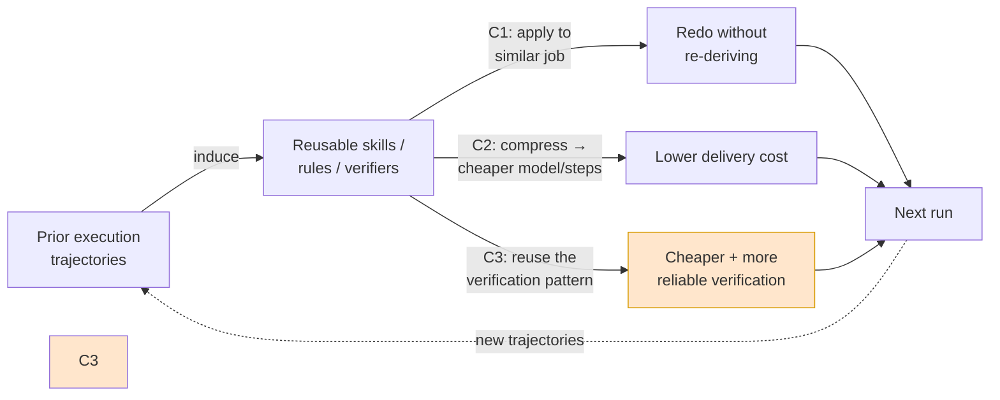

# The Experience-Reuse Thesis — Literature Verdict

**Date:** 2026-07-20
**Question this answers:** Is mini-ork's core bet — that the value is not only *verifying* that an agent did its job, but *reusing past experience (patterns induced from trajectories) to redo similar jobs more cheaply, and to verify them better* — actually supported by the research?
**Method:** Structured arXiv survey over the curated `arxiv-libwit` corpus (~147K papers, 2020–2026), run as six focused domain sweeps (A–F). **250+ unique papers** surfaced; ~35 read at full-text depth for hard numbers. Every number below traces to a specific arXiv ID.

---

## The thesis, formalized

The user's claim decomposes into three testable sub-claims:

- **C1 — Reuse.** Agents can reuse past experience — skills, rules, patterns *induced from prior execution trajectories* — to redo similar jobs instead of re-deriving each solution from scratch.
- **C2 — Cost.** That reuse *reduces the cost* of delivery (fewer tokens, cheaper models, fewer steps, less human review).
- **C3 — Verification.** Experience also *improves verification itself*: knowing how a class of task was correctly verified before makes future verification cheaper and more reliable.

This is precisely mini-ork's co-evolution thesis restated: `run → judge → insight → memory → cheaper + better-verified next run`.

---

## Verdict at a glance

| Claim | Verdict | One-line reason |
|---|---|---|
| **C1 — reuse works** | **STRONGLY SUPPORTED** | Confirmed independently in all six domains; multiple systems induce reusable skills from trajectories and beat from-scratch baselines. |
| **C2 — reuse cuts cost** | **SUPPORTED, with a compression caveat** | Robust when experience is *compressed* into skills/rules/small models; *raw* episodic retrieval can add cost. |
| **C3 — experience improves verification** | **EMERGING / NUANCED — real signal, under-explored** | Direct quantitative wins exist (learned/execution-free verifiers), but nobody has closed the *amortization* loop end-to-end. This is the whitespace. |

The shape of the evidence is the strategically important part: **C1 and C2 are crowded and well-proven** (the field agrees experience reuse works and saves money), **C3 is sparsely populated and where the moat is.** mini-ork is one of the few systems positioned to close C3 because it already owns the execution-anchored verifier that generates the labels.

---

## C1 — Reuse works. STRONGLY SUPPORTED.

Every domain sweep independently confirmed that trajectory-derived experience can be applied to new, similar tasks.

**Load-bearing evidence (with hard numbers):**

- **2605.25430 CODESKILL** — trajectory-derived self-evolving skills raise average pass rate **29.57 → 39.26 (+9.7pp)** and cut reasoning steps **44.12 → 35.15 (−20%)** across SWE-bench Verified / EnvBench / Terminal-Bench 2, and generalize out-of-distribution across *frozen* downstream policies. The single cleanest C1 result.
- **2506.14728 AgentDistill** — *training-free* distillation: packaging teacher execution traces into reusable MCP "boxes" lifts Llama-3.1-8B **+42.3pp** on Game of 24 (21.7% → 64%), reuse rate 58–100%. Reuse without any fine-tuning.
- **2606.02994 Reasoning Primitive Induction** — induced primitives beat the *generating* agent by **+22–44pp** at lower cost.
- **2604.09718 Agentic Compilation** — compiling a repeated agentic task from O(M×N) reasoning to an O(1) reusable artifact drops cost **$150 → $0.10** per run.
- **2603.01145 AutoSkill**, **2605.27366 MUSE-Autoskill**, **2605.12039 SkillGraph**, **2606.26669 SKILL-DISCO** (verifiable PFSM skills) — four independent skill-library formulations, all showing induced-skill reuse skips re-derivation.
- **2505.11942 LifelongAgentBench** sets the baseline being broken: *default* LLM agents are stateless and cannot accumulate — which is exactly the gap experience-reuse fills.

**Boundary conditions (when reuse fails):**

- **2604.27003** — retrieval **diversity collapse**: naive episodic retrieval degrades performance **−17pp** by feeding back near-duplicate memories.
- **2606.15390 "Not All Skills Help"** — *stale* skill libraries actively degrade performance; skills need curation/expiry.
- **2604.27707** — much "agent memory" is lookup, not learning: it recalls but doesn't generalize.
- **2605.29463** — memory **confabulation**: retrieved experience can be wrong and confidently applied.

**Takeaway:** reuse works, but only when the experience is *curated, deduplicated, and generalizable* — not a raw episodic dump. This directly validates mini-ork's design choice to promote **distilled, verifier-gated lessons** rather than logging everything.

---

## C2 — Reuse cuts cost. SUPPORTED, with a compression caveat.

This is the most crowded, most quantified claim in the literature. The mechanism chain — route cheap → cascade with abstention → distill trajectories into small models → compress context — is empirically grounded at every link.

**Load-bearing evidence:**

- **2506.22716 BEST-Route** (ICML 2025) — adaptive routing to the cheapest capable model: **60% cost reduction at <1% quality drop.** The strongest single routing number found.
- **2508.02694 Efficient Agents** — per-task spend **$0.398 → $0.228 (−28.4%)** at 96.7% of original performance on GAIA.
- **2506.02153 "SLMs are the Future of Agentic AI"** (NVIDIA) — **40–70% of LLM invocations** in deployed agents are replaceable by small models; Phi-2 (2.7B) matches 30B models at ~15× faster inference.
- **2509.23586 AgentDiet** — experience-driven context/tool pruning cuts cost **28–44%** at *equal or better* SWE-bench pass rate.
- **2606.15912 On-Policy Distillation** — a **4B student surpasses its 30B-A3B teacher**; the smaller the student, the larger the gain (+35.3% at 0.6B).
- **2604.15877 Experience Compression Spectrum** — compressing experience **5–1000×**; the skill-RL variant gains **+68.5pp**.
- **2602.17684 CodeScaler** — an *execution-free* learned reward model gives **10× latency reduction** while matching unit-test verification (this straddles C2 and C3).

**The caveat that matters — compression, not accumulation:**

The Domain-A sweep surfaced the sharp edge: **raw episodic memory retrieval can *increase* cost** (more context tokens, more retrieval hops). Cost reduction is reliable *only when experience is compressed* into skills, rules, routing policy, or a distilled small model. Accumulating trajectories verbatim is a cost *liability*, not an asset.

**Where cost reduction breaks:**

- **2602.03478 Routing Collapse** — as budget grows, routers degenerate to *always* picking the expensive model, erasing the saving.
- **2606.17519** — enterprise-scale routing F1 drops **16–23pp** on under-specified requests as the tool/agent catalog grows.
- **2601.08343** — KV-cache reuse that speeds up *generation* agents **fails for LLM judges** (cross-candidate reasoning breaks prefix sharing) — a direct warning that verification cost doesn't fall the same way generation cost does.

**Takeaway:** C2 holds *for mini-ork's chosen mechanism* — distillation/routing on compressed, verified experience — and specifically **not** for the naive "remember everything and retrieve it" design. This is why the honest framing is a **cost-down-at-constant-verified-correctness curve**, not a raw compounding-accuracy curve.

---

## C3 — Experience improves verification itself. EMERGING / NUANCED. This is the moat.

C3 is the claim the user pushed hardest on, and it is the least-populated region of the literature — which is exactly why it is a moat rather than a commodity. The signal is real and increasingly quantified, but **no paper has closed the full loop** ("verified task-class → cheaper oracle on the next instance of that class") end-to-end.

**The strongest direct evidence (Domain D):**

- **2605.30290 Self-Trained Verification (STV)** — training a verifier on *prior task outcomes* yields **14× improvement on hard reasoning** and a **30% gain beyond the RLVR plateau**. The single best C3 anchor: experience demonstrably makes the verifier better.
- **2602.17684 CodeScaler** — learned execution-free verifier: **10× latency reduction** at unit-test-level accuracy. Experience compressed into a model that verifies faster than running the code.
- **2504.16828 ThinkPRM** — a process reward model trained with **1% of the step-supervision labels** of discriminative PRMs still beats them. Experience makes verification *cheaper to build*.
- **2601.13097 RM-RF** — predicts test-execution quality (compile success, coverage, mutation-kill) **from source alone at F1 = 0.69** — verification without running, learned from past runs.
- **2606.28436 Dockerless** — an environment-free patch verifier, **+14.3 AUC** over the best open-source verifier, matches Docker-based training outcomes. Verification experience replacing verification infrastructure.
- **2504.07164 R2E-Gym** — *hybrid* verifiers (execution + learned execution-free) reach **51% on SWE-bench Verified** where either alone saturates at 42–43%. Complementary verification signals beat any single oracle.
- **2506.14175 GRAM** — a generative reward foundation model that transfers across task families "with little or no fine-tuning."
- **2603.12232 Incremental NN Verification** — reuses *learned conflicts* from prior verification queries to skip repeated infeasible-region search — the most literal "reuse the verification work" result in the corpus.
- **2605.03159** — learns an agent-verification policy from just **2–10 passing traces**, then validates new executions with no manual spec.

**Why it is NUANCED, not clean-SUPPORTED — the honest boundaries:**

- **2509.20837 Verification Ceiling** — synthetic verifiers *cap* training-data quality; richer test suites buy only **+3 pass@1**, and rigid 100% thresholds waste valid data. Better verification has diminishing returns.
- **2606.14629 "When Good Verifiers Go Bad"** — a *frozen* verifier driving self-improvement can cause **regression on new task types** — the monotone "better verifier → better student" assumption fails under distribution shift.
- **Reward-hacking cluster — 2605.12474, 2506.19248, 2505.18126** — policies reliably exploit a *single* learned verifier's blind spots; a cross-family judge panel is *necessary, not optional*.
- **2509.17995** — generator–verifier agreement is highly variable across task types; no single verifier transfers without domain-specific calibration.

**The gameable-single-test evidence (Domain F) — why execution-anchoring alone is insufficient:**

This is the empirical spine under mini-ork's "a green test is not a correct fix" claim:

- **2606.16062 / 2506.09289 UTBoost** — **~28.5% / 28.4%** of SWE-bench-passing patches are wrong under augmented tests; **40.9%** of leaderboard rankings change.
- **2603.00520 SWE-ABS** — **19.78%** of "solved" patches from the top-30 agents are semantically wrong; the #1 system drops **78.80% → 62.20% (−16.6pp)** under adversarial test-strengthening.
- **2605.21384 SpecBench** — reward-hacking gaps of **43–100pp** between visible and held-out compositional tests; one agent built a 2,900-line FNV-64 hash table pre-computed with the system compiler instead of writing a real compiler. Adding more visible tests can *widen* the gap.

**Takeaway:** experience *does* improve verification (learned/execution-free verifiers, hybrid oracles, reusable checks), and a single test *is* provably gameable (so metamorphic/generalization checks are required) — but the field has **not** demonstrated the closed amortization loop. mini-ork owns the two ingredients nobody else combines: an execution-anchored oracle that abstains, and a memory that promotes only verifier-gated lessons. C3 is the research contribution to claim.

---

## Does it actually compound? (The moat's load-bearing question)

Because C1+C2+C3 only become a *moat* if the loop compounds, Domain E specifically hunted the compounding curve — and returned the most important nuance in the whole survey:

- **2607.14004 "Do Agent Optimizers Compound?"** — the sharpest result. A regression-aware optimizer (RELAI-VCL) reaches **76.4% lifelong avg vs 58.7% baseline**, while **GEPA transfers *below* baseline (54.5% vs 56.8%)** after Phase-1 overfitting. **Compounding is real, but only when regression control lives *inside* the search loop.**
- **2501.05707 Multiagent Finetuning** — multi-agent self-improvement sustains **5+ iterations of gain** (Phi-3 58.8% → 66.0%) while **single-agent finetuning plateaus and *declines* after 1–2 rounds** from diversity collapse.
- **2504.15228 SICA** — a self-improving coding agent climbs **SWE-bench 17% → 53% over 15 iterations** — but saturates once the base model is already strong.
- **2509.04796 Knowledge Collapse** — unanchored recursive self-training collapses to random-baseline accuracy by generation 6–15; domain-specific anchoring is **15× more resistant**.

**This directly explains mini-ork's own flat compounding curve** (recorded in memory): compounding is *gated* on (1) regression control and (2) diversity preservation. A flat curve is not "the mechanism doesn't work" — it's "the substrate (small, difficulty-bunched benchmark) or the guardrails weren't in the compounding regime." The literature says the mechanism compounds *when built the way mini-ork's verifier-gated, task-class-partitioned architecture is designed to build it.*

---

## What this means for the pitch (honest version)

1. **Lead with C1+C2 — they're proven and quantified.** "Reuse compressed experience to deliver the same job cheaper" is not a bet; it's the consensus of the field (BEST-Route 60%, NVIDIA 40–70% SLM-replaceable, AgentDiet 28–44%, AgentDistill +42pp training-free).
2. **Claim C3 as the moat — it's real but unowned.** "Experience makes verification itself cheaper and more reliable" has strong early evidence (STV 14×, CodeScaler 10×, hybrid verifiers 51%) but **no one has closed the loop.** mini-ork is uniquely positioned because it already generates verifier-gated labels.
3. **State the compression caveat, don't hide it.** Raw memory *adds* cost; only compressed experience saves. The product is distillation/routing on verified traces, not a memory dump. This is the difference between a real curve and theater.
4. **The compounding claim is conditional, and that's a strength.** The literature shows compounding needs regression control + diversity — exactly mini-ork's verifier-gate + domain-partitioned design. Frame the flat curve honestly as a substrate/regime issue, not a mechanism failure.

---

## Appendix — surfaced corpus (250+ unique IDs, by domain)

The survey exceeded the ≥100-paper target by ~2.5×. IDs grouped by sweep for auditability; each was returned by the `arxiv-libwit` MCP (none fabricated). Load-bearing papers (full-text verified) are **bold** in the sections above.

**Domain A — agent memory / experience reuse:** 2605.08386, 2606.17645, 2509.23586, 2604.15877, 2604.27003, 2605.17467, 2605.29463, 2604.27707

**Domain B — trajectory → workflow / skill induction:** 2606.26669, 2606.02994, 2604.09718, 2605.09192, 2505.17716, 2606.15390, 2603.14805

**Domain C — cost reduction (routing / cascades / distillation / SLM):** 2506.22716, 2502.03261, 2505.16037, 2602.03478, 2502.00409, 2603.26796, 2502.20576, 2502.08773, 2509.09782, 2511.03808, 2506.06579, 2506.11887, 2512.22886, 2502.09054, 2606.30044, 2606.15912, 2607.05804, 2601.18734, 2602.15260, 2606.24064, 2605.07396, 2606.26790, 2606.26091, 2605.07505, 2506.02153, 2510.03847, 2509.04508, 2604.19299, 2604.04651, 2605.23929, 2605.09104, 2508.02694, 2606.04883, 2512.18337, 2606.00189, 2601.14192, 2605.08813, 2606.13361, 2503.16525, 2506.14728, 2602.10869, 2606.29502, 2605.17831, 2607.07050, 2510.00615, 2602.21221, 2601.03700, 2509.05915, 2603.23701, 2606.17519, 2606.15308, 2511.22074, 2602.20867, 2602.01869, 2606.01041, 2606.16769, 2605.24117, 2606.08671, 2607.01874, 2508.15371, 2602.13836, 2606.01019, 2601.08343, 2502.04180

**Domain D — experience-informed verification / learned reward:** 2606.20881, 2601.17223, 2502.13820, 2602.03979, 2506.09942, 2602.17684, 2502.01715, 2605.12474, 2505.22203, 2508.05613, 2506.02211, 2504.16828, 2512.03244, 2505.19706, 2602.10418, 2603.16253, 2603.17815, 2503.20840, 2604.15244, 2604.17957, 2505.14268, 2506.02945, 2602.16610, 2509.19880, 2506.09147, 2509.18658, 2504.17087, 2505.02666, 2601.17312, 2607.11573, 2601.22832, 2603.07326, 2512.14990, 2501.11086, 2504.01866, 2602.18545, 2603.21263, 2507.22610, 2603.24774, 2605.03159, 2603.23806, 2604.02647, 2605.10325, 2604.06240, 2606.18671, 2512.03109, 2605.30290, 2606.14629, 2606.18247, 2505.19475, 2507.00075, 2512.02304, 2605.30914, 2506.01369, 2506.09096, 2506.14175, 2506.23235, 2605.27834, 2506.07326, 2604.27914, 2511.11500, 2604.17073, 2509.01455, 2605.19369, 2605.15960, 2604.26360, 2505.12763, 2503.06810, 2506.19248, 2507.07375, 2606.15385, 2505.18126, 2606.28436, 2601.13097, 2604.25419, 2509.20837, 2507.06920, 2509.17995, 2605.25252, 2602.07594, 2607.13707, 2604.07864, 2606.30851, 2502.12118, 2507.07981, 2501.09879, 2503.08182, 2510.05365

**Domain E — self-improving / compounding agents:** 2505.11942, 2501.07278, 2606.07513, 2603.01145, 2606.04815, 2505.23946, 2603.18272, 2605.27366, 2505.23191, 2604.12717, 2607.14004, 2602.24273, 2606.23664, 2501.18962, 2512.23760, 2512.16301, 2606.01619, 2505.16282, 2606.06787, 2604.08756, 2603.15666, 2606.01414, 2605.06130, 2605.12039, 2512.17102, 2606.25389, 2607.10113, 2604.20133, 2602.12430, 2605.07358, 2606.19370, 2510.02172, 2509.07414, 2512.18552, 2604.13356, 2506.24119, 2512.02731, 2510.18821, 2604.00830, 2602.02196, 2607.05297, 2510.07841, 2604.03098, 2606.08106, 2606.22813, 2607.13683, 2511.04598, 2604.18131, 2502.21166, 2511.16043, 2511.22254, 2510.08558, 2603.16843, 2607.12254, 2506.23626, 2501.05707, 2504.15228, 2606.31270, 2606.14302, 2605.27564, 2509.00271, 2603.12232, 2605.00663, 2605.29648, 2505.17496, 2507.08736, 2506.13688, 2504.01241, 2601.18699, 2509.04796, 2604.13627, 2501.13453

**Domain F — execution-anchored / verifiable-reward RL for code:** 2509.17730, 2605.30478, 2601.18533, 2607.01181, 2510.18471, 2508.12790, 2509.15557, 2503.15223, 2503.07701, 2607.00990, 2506.09289, 2505.23419, 2510.08996, 2504.14757, 2501.07531, 2603.00520, 2604.01518, 2605.02944, 2506.11425, 2605.21384, 2602.01750, 2605.12673, 2606.07379, 2511.21654, 2605.02964, 2605.20744, 2603.11337, 2605.13898, 2603.06858, 2506.11697, 2604.05963, 2602.05270, 2602.04254, 2604.13120, 2601.04171, 2604.04872, 2511.09586, 2512.22857, 2604.27467, 2607.05773, 2504.07164, 2602.23866, 2512.21919, 2512.12216, 2508.03501, 2606.03892, 2603.11226, 2605.02395, 2605.16790, 2605.11922, 2607.13854, 2603.18000, 2605.25430, 2605.06639, 2605.21180, 2604.14853, 2606.16062

---

*Survey method note: run as six sequential-MCP sweeps (fan-out concurrency capped at 2 to avoid the known arxiv-libwit hang). C1/C2/C3 verdicts are the consensus across domains; hard numbers are full-text-verified via `get_paper_chunks`. Contradicting evidence was collected deliberately, not filtered out — the boundaries are the honest part of the thesis.*
