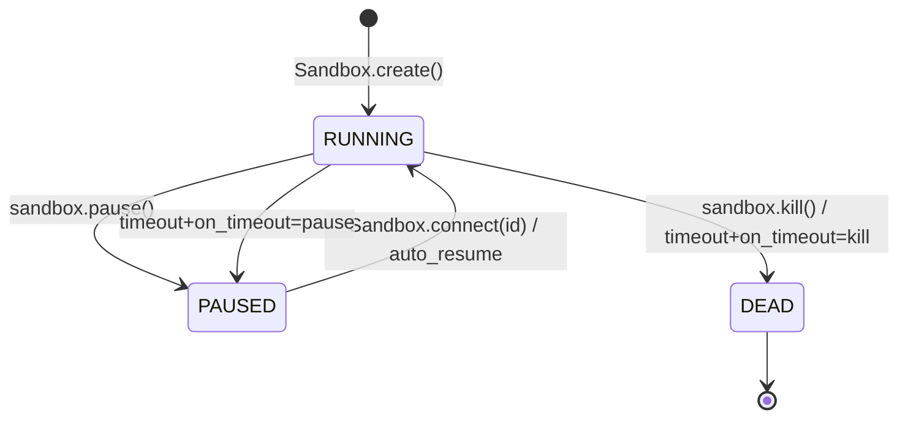
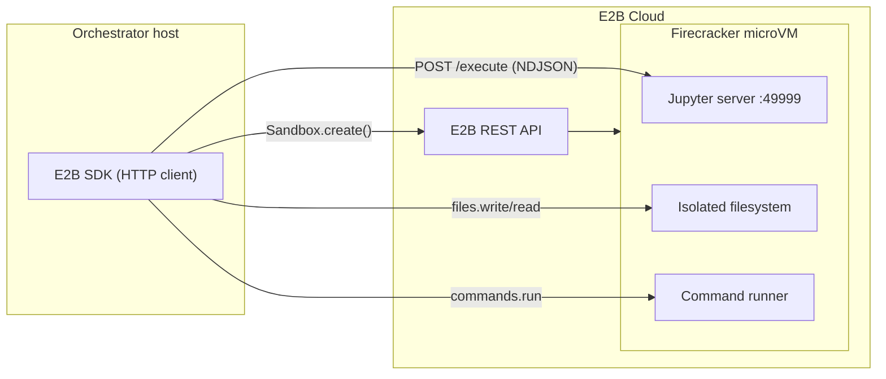
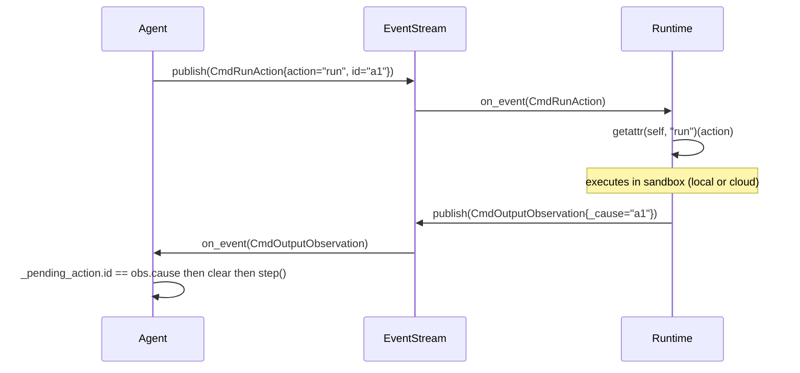

# Impl analysis 02 — Managed cloud sandbox + controller/runtime split
## Source-code analysis of E2B SDK and OpenHands runtime/controller

**Gap targeted:** mini-ork has no managed/remote execution and no controller↔runtime split.
The orchestrator and every worker share one host filesystem.
To run agents safely in the cloud you need (a) a sandbox the orchestrator does NOT share
a disk with, and (b) a transport layer so the same recipe drives local or remote execution
without changing node logic.

Doc 01 (swe-rex / mini-swe-agent) covered the *interface contract* between controller and
runtime. This document covers the *managed/cloud realization* — how E2B builds an HTTP-API
microVM sandbox, and how OpenHands wires controller and runtime together through an
EventStream so they never import each other.

**Sources read:**
- `/private/tmp/miniork-ref-analysis/code-interpreter/` — E2B `e2b-dev/code-interpreter` SDK
- `/private/tmp/miniork-ref-analysis/OpenHands/` — current main (restructured);
  runtime/controller detail fetched from GitHub tag `0.21.0` (SHA `a4ee454`)
- `/Users/admin/.local/share/uv/tools/omnigent/lib/python3.12/site-packages/agents/extensions/sandbox/e2b/sandbox.py`
  — full E2B base SDK surface including files, commands, PTY, lifecycle, snapshot
- mini-ork: `bin/mini-ork-execute` (partial), `lib/sandbox/*.sh`, `lib/llm-dispatch.sh`

---

## 1. E2B SDK shape — Firecracker microVM as an HTTP API

### 1.1 What E2B actually is

Each E2B sandbox is a **Firecracker microVM** (own kernel, own memory, no shared FS with
the host). The SDK is a thin HTTPS client. Nothing runs locally except curl / Python HTTP.

Key constants (`e2b_code_interpreter/constants.py`):

```python
DEFAULT_TEMPLATE = "code-interpreter-v1"
JUPYTER_PORT     = 49999
DEFAULT_TIMEOUT  = 300          # seconds
```

### 1.2 `class Sandbox(BaseSandbox)` — the code-interpreter overlay

**File:** `python/e2b_code_interpreter/code_interpreter_sync.py:34`

```python
class Sandbox(BaseSandbox):                       # BaseSandbox = e2b.Sandbox
    default_template = DEFAULT_TEMPLATE

    @property
    def _jupyter_url(self) -> str:
        return f"https://{self.get_host(JUPYTER_PORT)}"

    @property
    def _client(self) -> Client:
        # Forces HTTP/1.1 — HTTP/2 multiplexing hides TCP disconnect from the Jupyter server
        return Client(transport=get_transport(self.connection_config, http2=False))
```

**Critical detail on HTTP/1.1:** The comment in the source is explicit — with HTTP/2
a client disconnect only cancels the HTTP/2 stream; the underlying TCP connection stays
open, so the Jupyter server never learns that the caller disconnected and keeps running
the code. Forcing HTTP/1.1 restores the 1:1 TCP-request mapping so a disconnect
propagates to the server as a TCP close. This is a subtle correctness constraint any
mini-ork E2B adapter must replicate when streaming output.

### 1.3 `run_code` — streaming NDJSON execution

```python
def run_code(
    self,
    code: str,
    language: Optional[str] = None,
    context: Optional[Context] = None,
    on_stdout: Optional[OutputHandler[OutputMessage]] = None,
    on_stderr: Optional[OutputHandler[OutputMessage]] = None,
    on_result: Optional[OutputHandler[Result]] = None,
    on_error: Optional[OutputHandler[ExecutionError]] = None,
    envs: Optional[Dict[str, str]] = None,
    timeout: Optional[float] = None,
    request_timeout: Optional[float] = None,
) -> Execution:
    with self._client.stream(
        "POST",
        f"{self._jupyter_url}/execute",
        json={"code": code, "context_id": context_id,
              "language": language, "env_vars": envs},
        headers=headers,
        timeout=(request_timeout, timeout, request_timeout, request_timeout),
    ) as response:
        for line in response.iter_lines():
            parse_output(execution, line, on_stdout=..., on_stderr=...,
                         on_result=..., on_error=...)
        return execution
```

**NDJSON protocol** (`models.py:_parse_output`):

| `type` field           | Model class      | Purpose                              |
|------------------------|------------------|--------------------------------------|
| `stdout`               | `OutputMessage`  | line + timestamp + error=False       |
| `stderr`               | `OutputMessage`  | line + timestamp + error=True        |
| `result`               | `Result`         | MIME-typed: text/html/png/svg/json/chart |
| `error`                | `ExecutionError` | name + value + traceback             |
| `number_of_executions` | `int`            | kernel execution counter             |

### 1.4 Context (persistent kernel) API

Analogous to a stateful Jupyter kernel — variables from one `run_code` call survive
into the next if they share the same context.

```python
sandbox.create_code_context(cwd="/home/user", language="python") -> Context
sandbox.list_code_contexts()  -> List[Context]
sandbox.remove_code_context(context)
sandbox.restart_code_context(context)
```

`Context` dataclass: `id: str`, `language: str`, `cwd: str`

### 1.5 Base SDK — files, commands, PTY, lifecycle

Sourced from omnigent's bundled E2B integration (covers the full base SDK surface, not
just the code-interpreter overlay):

#### Files API
```python
sandbox.files.read(path, format="bytes")   -> bytes | str
sandbox.files.write(path, data: bytes)     -> None
sandbox.files.make_dir(path)               -> None
sandbox.files.remove(path)                 -> None
```

#### Commands API
```python
sandbox.commands.run(
    cmd_str,
    timeout=None,       # seconds
    cwd="/",
    envs={},
    user="user",
    on_stdout=None,
    on_stderr=None,
    background=False,
) -> ExecResult(stdout, stderr, exit_code)
```

#### Lifecycle API
```python
Sandbox.create(
    template="code-interpreter-v1",
    timeout=3600,                    # seconds until auto-kill
    metadata={},
    envs={},
    on_timeout="kill"|"pause",       # what happens at timeout
    auto_resume=True,                # reconnect to existing sandbox on create
) -> Sandbox

Sandbox.connect(sandbox_id, timeout=...) -> Sandbox   # re-attach to running sandbox

sandbox.pause()                          # persist state, release compute
sandbox.kill()                           # hard delete
sandbox.is_running()    -> bool
sandbox.get_host(port)  -> str           # exposed hostname for port
sandbox.create_snapshot() -> str         # snapshot ID for fast boot
```

#### Lifecycle model (Mermaid)



#### Full API surface table

| Category  | Method                             | Notes                              |
|-----------|------------------------------------|------------------------------------|
| Boot      | `Sandbox.create(...)`              | Creates new microVM                |
| Boot      | `Sandbox.connect(id)`              | Re-attach; falls back to create    |
| Exec      | `commands.run(cmd)`                | Arbitrary shell, streaming output  |
| Code      | `run_code(code, language/context)` | Jupyter kernel, NDJSON stream      |
| Context   | `create_code_context(cwd, lang)`   | Persistent kernel                  |
| Files     | `files.write(path, bytes)`         | PUT file into sandbox              |
| Files     | `files.read(path)`                 | GET file from sandbox              |
| Files     | `files.make_dir(path)`             | mkdir                              |
| Files     | `files.remove(path)`               | unlink                             |
| Lifecycle | `pause()`                          | Freeze + free compute              |
| Lifecycle | `kill()`                           | Hard delete                        |
| Lifecycle | `create_snapshot()`                | Immutable image for fast boot      |
| Query     | `is_running()`                     | Health check                       |
| Query     | `get_host(port)`                   | Exposed hostname:port              |

### 1.6 E2B cloud architecture (Mermaid)



Key insight: **the orchestrator never touches the sandbox filesystem directly**. All
interaction is over HTTPS. This is the property mini-ork needs for cloud execution.

---

## 2. OpenHands — Runtime abstraction and controller/runtime split

### 2.1 The base `Runtime` class

**File:** `openhands/runtime/base.py` (tag 0.21.0)

```python
class Runtime(FileEditRuntimeMixin):
    def __init__(
        self,
        config: AppConfig,
        event_stream: EventStream,
        sid: str,
        plugins: list[PluginRequirement],
        env_vars: dict[str, str],
        status_callback: Callable,
        attach_to_existing: bool,
        headless_mode: bool,
    ):
        # Only coupling to controller: a shared EventStream
        event_stream.subscribe(
            EventStreamSubscriber.RUNTIME,
            self.on_event,
            self.sid,
        )
```

**`on_event` → `_handle_action` → `run_action`:**

```python
def on_event(self, event: Event) -> None:
    if isinstance(event, Action):
        asyncio.get_event_loop().run_until_complete(self._handle_action(event))

async def _handle_action(self, event: Action) -> None:
    observation = await self.run_action(event)
    observation._cause = event.id          # causal link back to the action
    self.event_stream.add_event(observation, EventSource.ENVIRONMENT)

async def run_action(self, action: Action) -> Observation:
    action_type = action.action            # e.g. "run", "read", "write"
    observation = await getattr(self, action_type)(action)  # method name dispatch
    return observation
```

**`action.action` IS the method name.** This is the key dispatch mechanism — no switch
statement, no routing table. The action type string maps directly to a Runtime method.

### 2.2 Abstract methods — the full Runtime interface

```python
@abstractmethod async def connect(self) -> None
@abstractmethod async def run(self, action: CmdRunAction) -> CmdOutputObservation
@abstractmethod async def run_ipython(self, action: IPythonRunCellAction) -> IPythonRunCellObservation
@abstractmethod async def read(self, action: FileReadAction) -> FileReadObservation
@abstractmethod async def write(self, action: FileWriteAction) -> FileWriteObservation
@abstractmethod async def browse(self, action: BrowseURLAction) -> BrowserOutputObservation
@abstractmethod async def browse_interactive(self, action: BrowseInteractiveAction) -> BrowserOutputObservation
@abstractmethod async def copy_to(self, host_src: str, sandbox_dest: str, recursive: bool) -> None
@abstractmethod async def list_files(self, path: str) -> list[str]
@abstractmethod async def copy_from(self, path: str) -> Path
```

### 2.3 Six interchangeable runtime implementations

**Directory:** `openhands/runtime/impl/`

| Implementation   | Where execution happens          | How it connects                    |
|------------------|----------------------------------|------------------------------------|
| `DockerRuntime`  | Docker container on local host   | docker exec                        |
| `E2BRuntime`     | E2B Firecracker microVM cloud    | E2B SDK (HTTP)                     |
| `ModalRuntime`   | Modal cloud functions            | Modal SDK                          |
| `RemoteRuntime`  | Remote machine / Runloop cloud   | HTTP to agent server inside box    |
| `ProcessRuntime` | Subprocess on local host         | subprocess + tmpdir                |
| `action_execution/` | In-process action server      | Used inside the sandbox itself     |

**Zero changes to AgentController when swapping runtimes** — the controller only knows
about `EventStream`. The runtime implementation is completely transparent to the agent.

### 2.4 `E2BBox` — the E2B runtime adapter

**File:** `openhands/runtime/impl/e2b/sandbox.py`

```python
class E2BBox:
    def __init__(self, e2b_api_key: str, template: str):
        self.sandbox = E2BSandbox(
            api_key=e2b_api_key,
            template=template,
            on_stderr=lambda msg: ...,
            on_stdout=lambda msg: ...,
            cwd=self._cwd,
        )

    def execute(self, cmd: str, timeout: int) -> tuple[int, str]:
        process = self.sandbox.process.start(cmd, env_vars=self._env)
        process.wait(timeout=timeout)
        return process.exit_code, "\n".join(messages)

    def copy_to(self, host_src: str, sandbox_dest: str, recursive: bool):
        # tar on host -> upload -> untar inside sandbox
        self.sandbox.upload_file(tar_file)
        self.sandbox.process.start_and_wait(
            f"sudo tar -xf {uploaded_path} -C {sandbox_dest} ..."
        )

    @property
    def filesystem(self):
        return self.sandbox.filesystem

    def close(self):
        self.sandbox.close()
```

The pattern: wrap the E2B SDK in a thin class that implements the Runtime's `execute` /
`copy_to` / `filesystem` contract. The Runtime's abstract methods delegate to this box.

---

## 3. Action → Observation model and why it enables remote execution

### 3.1 `CmdRunAction` — the action side

```python
@dataclass
class CmdRunAction(Action):
    command: str
    timeout: Optional[float] = None
    thought: str = ""
    action: str = "run"          # THIS IS THE DISPATCH KEY
    id: str = field(default_factory=lambda: str(uuid4()))
```

### 3.2 `CmdOutputObservation` — the observation side

```python
@dataclass
class CmdOutputObservation(Observation):
    command: str
    exit_code: int
    content: str                 # stdout + stderr
    _cause: str = ""             # set to action.id by Runtime._handle_action
```

### 3.3 Causal linking

```python
# In Runtime._handle_action:
observation._cause = event.id    # ties observation back to its trigger action
```

AgentController checks `obs.cause == self._pending_action.id` to know which action
the observation answers. This is how asynchronous, out-of-order observations are
matched back to the controller's state machine.

### 3.4 Sequence diagram — decoupled execution



### 3.5 Why this enables remote execution

The EventStream is the **only coupling** between AgentController and Runtime.
Neither imports the other. The only shared artifact is the event schema.

This means:
- `DockerRuntime` can run on the local machine, `E2BRuntime` on E2B cloud,
  `RemoteRuntime` on a different machine — the Agent never knows.
- The transport (subprocess pipe, docker exec, HTTPS to E2B) is encapsulated inside
  the Runtime implementation behind the same abstract interface.
- Mini-ork can adopt this pattern entirely in bash — a JSON file or named pipe IS
  the EventStream.

### 3.6 AgentController pending-action pattern

**File:** `openhands/controller/agent_controller.py` (tag 0.21.0, ~43K)

```python
class AgentController:
    def __init__(self, agent, event_stream, ...):
        event_stream.subscribe(
            EventStreamSubscriber.AGENT_CONTROLLER,
            self.on_event,
            self.id,
        )
        self._pending_action: Optional[Action] = None

    async def _step(self):
        action = await self.agent.step(self.state)
        self._pending_action = action
        self.event_stream.add_event(action, EventSource.AGENT)

    def _handle_observation(self, obs: Observation):
        if (self._pending_action
                and obs.cause == self._pending_action.id):
            self._pending_action = None      # clear -> ready for next step
            # trigger state transitions / next step()
```

**Delegate pattern:** `start_delegate(AgentDelegateAction)` spawns a nested
`AgentController(is_delegate=True)` sharing the same EventStream. Observations
from the delegate bubble up to the parent. This is OpenHands' sub-agent mechanism.

---

## 4. Adoption plan for mini-ork

mini-ork today has the right skeleton but hollow implementations:

| What mini-ork has                | Gap                                          |
|----------------------------------|----------------------------------------------|
| `lib/sandbox/daytona.sh`         | Falls back to local; no real API calls       |
| `lib/sandbox/local.sh`           | Works but shares host FS                     |
| `lib/sandbox/modal.sh`           | Falls back to local                          |
| `lib/sandbox/omnigent-bridge.sh` | Partial bridge, not a full runtime           |
| No `lib/sandbox/e2b.sh`          | Missing                                      |
| No runtime-dispatch router       | Missing                                      |
| No NodeAction/NodeObservation    | Missing (nodes push text, not typed events)  |
| No workspace archive/restore     | Missing                                      |

### 4.1 New file: `lib/sandbox/e2b.sh`

Thin bash shim — each function calls a one-liner Python that uses the E2B SDK.
The Python shim avoids re-implementing the E2B REST protocol in bash.

```bash
#!/usr/bin/env bash
# lib/sandbox/e2b.sh -- E2B Firecracker microVM backend for mini-ork
# Requires: pip install e2b  E2B_API_KEY in env

mo_sandbox_e2b_provision() {
    # Boots a new microVM and prints sandbox_id to stdout.
    local template="${MO_SANDBOX_E2B_TEMPLATE:-code-interpreter-v1}"
    local timeout="${MO_SANDBOX_E2B_TIMEOUT:-3600}"
    python3 - <<PYEOF
import e2b, sys
s = e2b.Sandbox.create(template="$template", timeout=$timeout,
                        on_timeout="${MO_SANDBOX_E2B_ON_TIMEOUT:-pause}")
print(s.sandbox_id)
PYEOF
}

mo_sandbox_e2b_exec() {
    # Run a shell command inside the sandbox; streams stdout/stderr; returns exit code.
    # Args: <sandbox_id> <command> [timeout_s]
    local sid="$1" cmd="$2" timeout="${3:-1500}"
    python3 - <<PYEOF
import e2b, sys
s = e2b.Sandbox.connect("$sid")
r = s.commands.run("""$cmd""", timeout=$timeout,
                   on_stdout=lambda m: print(m.line, flush=True),
                   on_stderr=lambda m: print(m.line, file=sys.stderr, flush=True))
sys.exit(r.exit_code)
PYEOF
}

mo_sandbox_e2b_put() {
    # Upload a local file into the sandbox.
    # Args: <sandbox_id> <local_path> <sandbox_dest_path>
    local sid="$1" local_path="$2" dest="$3"
    python3 - <<PYEOF
import e2b
s = e2b.Sandbox.connect("$sid")
with open("$local_path", "rb") as f:
    s.files.write("$dest", f.read())
PYEOF
}

mo_sandbox_e2b_get() {
    # Download a file from the sandbox to a local path.
    # Args: <sandbox_id> <sandbox_path> <local_dest_path>
    local sid="$1" remote="$2" dest="$3"
    python3 - <<PYEOF
import e2b
s = e2b.Sandbox.connect("$sid")
data = s.files.read("$remote", format="bytes")
with open("$dest", "wb") as f:
    f.write(data)
PYEOF
}

mo_sandbox_e2b_cleanup() {
    # Kill or pause the sandbox.
    # Args: <sandbox_id> [kill|pause]  (default: pause for cost control)
    local sid="$1" action="${2:-pause}"
    python3 - <<PYEOF
import e2b
s = e2b.Sandbox.connect("$sid")
getattr(s, "$action")()
PYEOF
}
```

### 4.2 New file: `lib/sandbox/runtime-dispatch.sh`

The `SandboxService`-equivalent router. Selects backend by `MO_SANDBOX_BACKEND`.

```bash
#!/usr/bin/env bash
# lib/sandbox/runtime-dispatch.sh -- backend selector, analogous to OpenHands SandboxService ABC

_MO_SANDBOX_DIR="$(cd "$(dirname "${BASH_SOURCE[0]}")" && pwd)"
source "$_MO_SANDBOX_DIR/local.sh"
source "$_MO_SANDBOX_DIR/e2b.sh"
source "$_MO_SANDBOX_DIR/daytona.sh"
source "$_MO_SANDBOX_DIR/modal.sh"

_mo_sandbox_backend() { echo "${MO_SANDBOX_BACKEND:-local}"; }

mo_sandbox_provision()  { "mo_sandbox_$(_mo_sandbox_backend)_provision" "$@"; }
mo_sandbox_exec()       { "mo_sandbox_$(_mo_sandbox_backend)_exec" "$@"; }
mo_sandbox_put()        { "mo_sandbox_$(_mo_sandbox_backend)_put" "$@"; }
mo_sandbox_get()        { "mo_sandbox_$(_mo_sandbox_backend)_get" "$@"; }
mo_sandbox_cleanup()    { "mo_sandbox_$(_mo_sandbox_backend)_cleanup" "$@"; }
```

### 4.3 NodeAction / NodeObservation JSON (the EventStream equivalent)

mini-ork's equivalent of OpenHands' EventStream is a JSON protocol written to/from
files (or piped between processes). This is the controller-to-runtime seam.

**NodeAction schema** (written by `bin/mini-ork-execute` before dispatching a node):

```json
{
  "action":       "run_node",
  "action_id":    "act-implementer_1-001",
  "node_id":      "implementer_1",
  "node_type":    "implementer",
  "model_lane":   "codex",
  "prompt_ref":   "path/to/node.md",
  "kickoff_path": "path/to/kickoff.md",
  "timeout_s":    1500,
  "sandbox_ref":  "sbx-abc123",
  "env":          {}
}
```

**NodeObservation schema** (written by the runtime / node-executor back to controller):

```json
{
  "cause":         "act-implementer_1-001",
  "node_id":       "implementer_1",
  "node_type":     "implementer",
  "status":        "success",
  "exit_code":     0,
  "verdict":       "approve",
  "files_written": ["src/foo.py"],
  "cost_usd":      0.14,
  "duration_ms":   42000,
  "artifact_path": "runs/run-001/implementer_1/output.md"
}
```

The `cause` field mirrors OpenHands' `observation._cause = action.id`.
`bin/mini-ork-execute` reads the observation, matches `cause` to the dispatched action,
and decides whether to continue, retry, or halt — exactly as
`AgentController._handle_observation`.

### 4.4 New file: `lib/node-executor.sh` — the Runtime inside the sandbox

Wraps a node's LLM dispatch behind the NodeObservation protocol. Runs inside the sandbox
(when using E2B/Daytona) or on the host (when using local).

```bash
#!/usr/bin/env bash
# lib/node-executor.sh -- runs one node, emits NodeObservation JSON
# Equivalent to OpenHands Runtime.run_action() for a single node type

_MO_LIB_DIR="$(cd "$(dirname "${BASH_SOURCE[0]}")" && pwd)"
source "$_MO_LIB_DIR/llm-dispatch.sh"

mo_node_execute() {
    local action_json="$1"       # path to NodeAction JSON file
    local obs_path="$2"          # where to write NodeObservation JSON

    local node_id node_type model_lane prompt_ref timeout_s cause
    node_id=$(jq -r '.node_id'     "$action_json")
    node_type=$(jq -r '.node_type' "$action_json")
    model_lane=$(jq -r '.model_lane' "$action_json")
    prompt_ref=$(jq -r '.prompt_ref' "$action_json")
    timeout_s=$(jq -r '.timeout_s // 1500' "$action_json")
    cause=$(jq -r '.action_id // "unknown"' "$action_json")

    local start_ms output_file exit_code
    start_ms=$(date +%s%3N)
    output_file="$(mktemp)"

    mo_llm_dispatch "$model_lane" "$(cat "$prompt_ref")" "$output_file" "$timeout_s" \
        && exit_code=0 || exit_code=$?

    local end_ms duration_ms verdict
    end_ms=$(date +%s%3N)
    duration_ms=$(( end_ms - start_ms ))
    verdict="$([ $exit_code -eq 0 ] && echo approve || echo reject)"

    jq -n \
        --arg cause        "$cause" \
        --arg node_id      "$node_id" \
        --arg node_type    "$node_type" \
        --arg status       "$([ $exit_code -eq 0 ] && echo success || echo error)" \
        --argjson exit_code "$exit_code" \
        --arg verdict      "$verdict" \
        --argjson duration_ms "$duration_ms" \
        --arg artifact_path "$output_file" \
    '{cause:$cause, node_id:$node_id, node_type:$node_type,
      status:$status, exit_code:$exit_code, verdict:$verdict,
      duration_ms:$duration_ms, artifact_path:$artifact_path}' \
        > "$obs_path"
}
```

### 4.5 `bin/mini-ork-execute` changes — the Controller side

The controller changes are minimal — add sandbox lifecycle calls around the existing
node dispatch loop, and read NodeObservation JSON instead of relying on implicit exit codes.

```bash
# run start
sandbox_id=$(mo_sandbox_provision)
mo_sandbox_put "$sandbox_id" "$WORKTREE_PATH" "/workspace"

# per node dispatch (replaces current direct node invocation)
write_node_action_json "$node_id" "$node_type" "$model_lane" "$prompt_ref" \
    "$sandbox_id" > "$action_path"
mo_sandbox_exec "$sandbox_id" \
    "source lib/node-executor.sh && mo_node_execute $action_path $obs_path"
obs=$(cat "$obs_path")
verdict=$(echo "$obs" | jq -r '.verdict')
# existing retry / stop-control logic uses verdict

# run end
mo_sandbox_get "$sandbox_id" "/workspace" "$LOCAL_ARTIFACT_PATH"
mo_sandbox_cleanup "$sandbox_id"   # default: pause for cost control
```

### 4.6 File map

```
lib/sandbox/
  e2b.sh                    NEW  -- E2B backend (5 functions)
  runtime-dispatch.sh       NEW  -- backend selector
  daytona.sh                EXISTING -- needs real Daytona API calls
  local.sh                  EXISTING -- works as-is for dev
  modal.sh                  EXISTING -- needs real Modal API calls
lib/
  node-executor.sh          NEW  -- node-level Runtime equivalent
bin/
  mini-ork-execute          MODIFY -- add sandbox lifecycle + NodeObservation reads
```

### 4.7 New environment variables

| Variable                    | Default               | Purpose                              |
|-----------------------------|-----------------------|--------------------------------------|
| `MO_SANDBOX_BACKEND`        | `local`               | `local\|e2b\|daytona\|modal`         |
| `E2B_API_KEY`               | (required for e2b)    | E2B cloud API key                    |
| `MO_SANDBOX_E2B_TEMPLATE`   | `code-interpreter-v1` | E2B template to boot                 |
| `MO_SANDBOX_E2B_TIMEOUT`    | `3600`                | Sandbox lifetime in seconds          |
| `MO_SANDBOX_E2B_ON_TIMEOUT` | `pause`               | `kill` or `pause` at timeout         |
| `MO_SANDBOX_NODE_TYPES`     | `implementer,verifier`| Node types that run in sandbox       |

### 4.8 Phased rollout

```
Phase 0 (now):
  lib/sandbox/runtime-dispatch.sh + wire local.sh through it.
  No behavior change; adds the routing layer with zero risk.

Phase 1:
  lib/sandbox/e2b.sh (5 functions).
  lib/node-executor.sh (NodeObservation emitter).
  Smoke test: MO_SANDBOX_BACKEND=e2b on one implementer node.

Phase 2:
  bin/mini-ork-execute sandbox lifecycle (provision / put / get / cleanup).
  NodeAction JSON written before dispatch, NodeObservation read after.

Phase 3:
  Workspace archiving: tar worktree in, tar diff/artifacts out.
  Cost control: mo_sandbox_cleanup with pause-not-kill.
  Daytona backend: real API calls replacing local fallback.
```

---

## 5. Key lessons from the reference implementations

### L1 — Agent server inside the sandbox, not outside

Both E2B and OpenHands (current main: `openhands/app_server/sandbox/`) converge on
putting the execution server *inside* the isolated environment, exposed over HTTP. The
orchestrator is just an HTTP client. Mini-ork's equivalent: `node-executor.sh` running
inside the microVM.

### L2 — One abstract interface, multiple transports

OpenHands' `Runtime` ABC has 10 abstract methods. `E2BRuntime`, `DockerRuntime`, and
`ProcessRuntime` all implement the same interface. The controller imports neither.
Mini-ork's equivalent: `mo_sandbox_exec / put / get / cleanup` — same 5 names regardless
of backend.

### L3 — HTTP/1.1 for streaming

E2B forces HTTP/1.1 for Jupyter execution streams because HTTP/2 multiplexing hides
TCP disconnects from the server (`code_interpreter_sync.py:64-79`). Any mini-ork adapter
that streams output from a remote process should use `curl --http1.1` (or an explicit
flag) to ensure disconnects propagate.

### L4 — Causal linking (`_cause`) makes async observable

`observation._cause = action.id` is what lets the controller match async responses to
their triggering actions without polling. Mini-ork's `NodeObservation.cause` field is
the bash equivalent. Without it, a verifier observation is ambiguous if multiple nodes
run concurrently.

### L5 — Pause > Kill for cost

E2B `on_timeout="pause"` + `auto_resume=True` means sandboxes survive restart and
can be pooled. Paying for cold-boot time on every run wastes budget. Mini-ork should
default `MO_SANDBOX_E2B_ON_TIMEOUT=pause` and reuse sandbox IDs within a run.

### L6 — Workspace transfer, not shared mount

The current mini-ork worktree is on the host FS, so all agents share it implicitly.
E2B/OpenHands both require explicit workspace transfer (`files.write` / `copy_to` /
`archive_conversation_workspace`). This is the biggest structural change needed in
mini-ork and the step that makes runs truly isolated.

---

## 6. Summary reference

| Concept          | E2B SDK                          | OpenHands                    | mini-ork target                   |
|------------------|----------------------------------|------------------------------|-----------------------------------|
| Sandbox unit     | Firecracker microVM              | Docker / E2B / Modal         | microVM or container              |
| Create           | `Sandbox.create(template, ...)`  | `SandboxService.start_sandbox()` | `mo_sandbox_provision`        |
| Shell exec       | `commands.run(cmd)`              | `CmdRunAction -> Runtime.run()` | `mo_sandbox_exec`              |
| File in          | `files.write(path, bytes)`       | `Runtime.copy_to()`          | `mo_sandbox_put`                  |
| File out         | `files.read(path)`               | `Runtime.copy_from()`        | `mo_sandbox_get`                  |
| Teardown         | `sandbox.pause()` / `.kill()`    | `SandboxService.delete_sandbox()` | `mo_sandbox_cleanup`         |
| Event bus        | n/a (sync SDK)                   | `EventStream`                | NodeAction/NodeObservation JSON   |
| Causal link      | n/a                              | `obs._cause = action.id`     | `NodeObservation.cause`           |
| Action dispatch  | n/a                              | `getattr(runtime, action.action)(action)` | node_type -> executor |
| Backend swap     | template param                   | `DockerRuntime` / `E2BRuntime` | `MO_SANDBOX_BACKEND` env var   |
