# bdd-first-delivery

Multi-stage BDD-first delivery pipeline ported from production use. Decomposes a kickoff into parallel sub-epics, generates Playwright BDD specs per sub-epic, implements and verifies against the specs, iterates on REQUEST_CHANGES feedback, and auto-merges on APPROVE.

## When to use

- **Large kickoffs** (3+ files, multiple logical concerns)
- **Parallelizable sub-epics** — decomposable into independently-workable slices with a clear leaf/integration layering
- **UI work needing e2e verification** — Playwright runs after each implementation iter
- **Teams already using Playwright** — assumes `npx playwright test` is available and configured in the repo

Do NOT use for a single-file change, a pure refactor, or a migration-only epic — the overhead of decompose + spec authoring isn't justified. Use the `code-fix` recipe instead.

## Workflow

```mermaid
sequenceDiagram
  autonumber
  participant K  as Kickoff
  participant D  as decomposer
  participant SA as spec_author (per sub-epic)
  participant SR as spec_reviewer (per sub-epic)
  participant IM as implementer (per sub-epic)
  participant BR as bdd_runner (per sub-epic)
  participant RV as reviewer (aggregate)
  participant SC as self_correction
  participant PB as publisher

  K->>D: kickoff.md
  D-->>SA: sub_epics[] JSON
  D-->>IM: sub_epics[] JSON

  rect rgb(31, 77, 31)
    note over SA,SR: Parallel per sub-epic (spec synthesis loop)
    SA->>SR: e2e/<sub_epic_id>.spec.ts
    SR-->>SA: APPROVE_SPEC or REQUEST_CHANGES_SPEC
    SA->>SR: revised spec (if needed, max 2 sub-iters)
  end

  rect rgb(31, 77, 31)
    note over IM,BR: Parallel per sub-epic (implement + verify)
    IM->>BR: implementation commits
    BR-->>RV: bdd-verdict.json
  end

  RV-->>SC: REQUEST_CHANGES (max 3 iters)
  SC->>BR: patch commits
  BR-->>RV: re-verify
  RV-->>PB: APPROVE
  PB-->>K: merged
```

## Expected cost

~$5–15 per kickoff, depending on sub-epic count and complexity:
- Decomposer: ~$0.20–0.50
- Spec author + reviewer per sub-epic: ~$0.30–0.80 each
- Implementer per sub-epic: ~$1–3 each
- BDD runner: compute only (no LLM cost)
- Reviewer + self-correction: ~$0.50–1.50 per review cycle

## Expected runtime

~15–60 minutes depending on sub-epic count:
- Decomposer: ~1–3 min
- Spec synthesis loop (parallel): ~3–8 min
- Implementer workers (parallel): ~5–20 min each
- BDD runner per sub-epic: ~1–3 min
- Reviewer + self-correction: ~2–5 min per iter

## Migration note

For users migrating from an internal mini-orch / agentflow setup — this recipe preserves the `deliver.sh` pipeline shape. See `MIGRATION.md` in this directory for the component-by-component mapping, and `docs/REDESIGN.md` in the framework root for the full framework-vs-recipe architecture split.
