# code-fix recipe

The `code-fix` recipe executes the universal task loop — **Classify → Plan → Execute → Verify → Reflect** — for the simplest task class: a single code patch that must pass typecheck, tests, and an adversarial reviewer before it is published. It is intentionally minimal: one implementer, two verifier scripts, one reviewer, one publisher. Use it as the reference implementation when building a new recipe; every other recipe is a variation on this shape.

## When to use it

| Fits | Does not fit |
|---|---|
| Single-file bug fix | Feature spanning 5+ files needing parallel workers |
| Small function refactor | Database migrations (use `db-migration` recipe) |
| Doc update in a code file | Multi-epic breakdown needed (`mini-ork deliver`) |
| Adding / adjusting a test | New module requiring scaffold (use `scaffold-module` recipe) |
| Dependency version bump | Cross-service contract change |

## How to use

```bash
# Run against your own kickoff file:
mini-ork run code-fix path/to/kickoff.md

# Or use the bundled example:
mini-ork run code-fix examples/01-hello-world/kickoff.md
```

`mini-ork run code-fix` exits 0 on APPROVE + publish, 1 on unresolved gate failure.

All intermediate state lands in `${MINI_ORK_HOME}/runs/<run_id>/`.

## Workflow

```mermaid
sequenceDiagram
    autonumber
    participant KB as kickoff.md
    participant CL as classifier
    participant PL as planner
    participant IM as implementer
    participant TC as verifier/typecheck
    participant TS as verifier/tests
    participant RV as reviewer
    participant PB as publisher
    participant RB as rollback

    rect rgb(31, 77, 77)
        KB->>CL: raw task brief
        CL-->>PL: task_class=code_fix confirmed
    end

    rect rgb(31, 58, 110)
        PL->>IM: plan.json (objective, decomposition, success_check)
        IM-->>TC: files changed
        IM-->>TS: files changed
    end

    rect rgb(31, 77, 31)
        TC-->>RV: verifier_typecheck.log (pass/fail)
        TS-->>RV: verifier_test.log (pass/fail)
    end

    alt all verifiers pass
        rect rgb(31, 77, 31)
            RV-->>PB: verdict=APPROVE
            PB-->>KB: commit hash + summary
        end
    else any verifier fails OR reviewer rejects
        rect rgb(90, 26, 26)
            RV-->>RB: verdict=REQUEST_CHANGES or ESCALATE
            RB-->>KB: branch reverted, human_gate opened
        end
    end
```



## Customization points

| What to change | Where |
|---|---|
| Models per role | `workflow.yaml` → `model_lane` field on each node; map lanes in `config/agents.yaml` |
| Planner prompt | `prompts/planner.md` — override the JSON output schema or add domain context |
| Implementer prompt | `prompts/implementer.md` — tighten scope or add project conventions |
| Reviewer prompt | `prompts/reviewer.md` — tune APPROVE thresholds or add security checks |
| Typecheck command | `MINI_ORK_TYPECHECK_CMD` env var, or edit `verifiers/typecheck.sh` fallback chain |
| Test command | `MINI_ORK_TEST_CMD` env var, or edit `verifiers/test.sh` fallback chain |
| Gates | `task_class.yaml` → `default_gates`; `workflow.yaml` → per-node `gates` list |
| Rollback strategy | `artifact_contract.yaml` → `rollback_policy` |

## Expected cost and runtime

| Metric | Typical range |
|---|---|
| Cost per run | ~$0.20 – $0.80 (single loop, planner + implementer + reviewer) |
| Wall-clock time | ~3 – 8 minutes |
| Tokens | ~4 K – 18 K across all nodes |

Cost scales with diff size. The reviewer is the largest single consumer (~40 % of tokens). Add `MO_REVIEWER_LANE=sonnet` to `config/agents.yaml` to cut cost at the expense of review depth.

## Files in this recipe

```
recipes/code-fix/
├── README.md                ← this file
├── CHANGELOG.md
├── workflow.yaml            ← node graph + edge types
├── task_class.yaml          ← classification matcher + risk class
├── artifact_contract.yaml   ← expected artifact + failure/rollback policy
├── example-kickoff.md       ← copy-paste starting point
├── example-output.md        ← annotated expected stdout
├── prompts/
│   ├── planner.md
│   ├── implementer.md
│   └── reviewer.md
└── verifiers/
    ├── typecheck.sh
    └── test.sh
```
