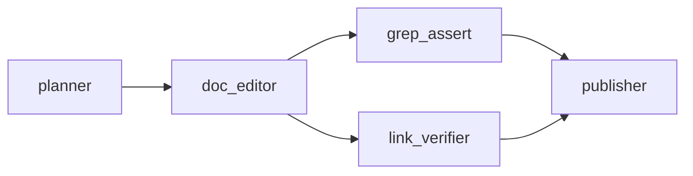

# recipes/docs

Documentation-only recipe for focused Markdown edits.

Use this recipe when the expected artifact is a doc patch, not a code change:
README updates, roadmap corrections, positioning patches, taxonomy changes,
or single-document repairs.

## Shape



## Nodes

| Node | Type | Purpose |
|---|---|---|
| `planner` | `planner` | Extracts requested doc scope, target files, acceptance assertions, and risk. |
| `doc_editor` | `implementer` | Applies the Markdown edit. |
| `grep_assert` | `verifier` | Checks required text patterns from the kickoff. |
| `link_verifier` | `verifier` | Checks local Markdown links remain resolvable. |
| `publisher` | `publisher` | Finalizes the verified doc artifact. |

## When To Use

- The task only touches `.md`, `.mdx`, or `.rst` files.
- The desired output can be verified with explicit grep assertions and link
  integrity.
- No code tests, typechecks, migrations, deploys, or screenshots are required.

Use `code-fix`, `ui-audit`, or `post-mvp-delivery` when a doc change depends on
runtime behavior, UI evidence, or implementation work.

## Kickoff Format

Start from `example-kickoff.md`. Include:

- target docs or glob scope
- what is stale or missing
- concrete acceptance assertions
- any links that must remain valid

Run in dry-run mode first:

```bash
MINI_ORK_DRY_RUN=1 bin/mini-ork run docs recipes/docs/example-kickoff.md
```

Then run live if provider credentials and lane policy are configured:

```bash
bin/mini-ork run docs path/to/kickoff.md
```
