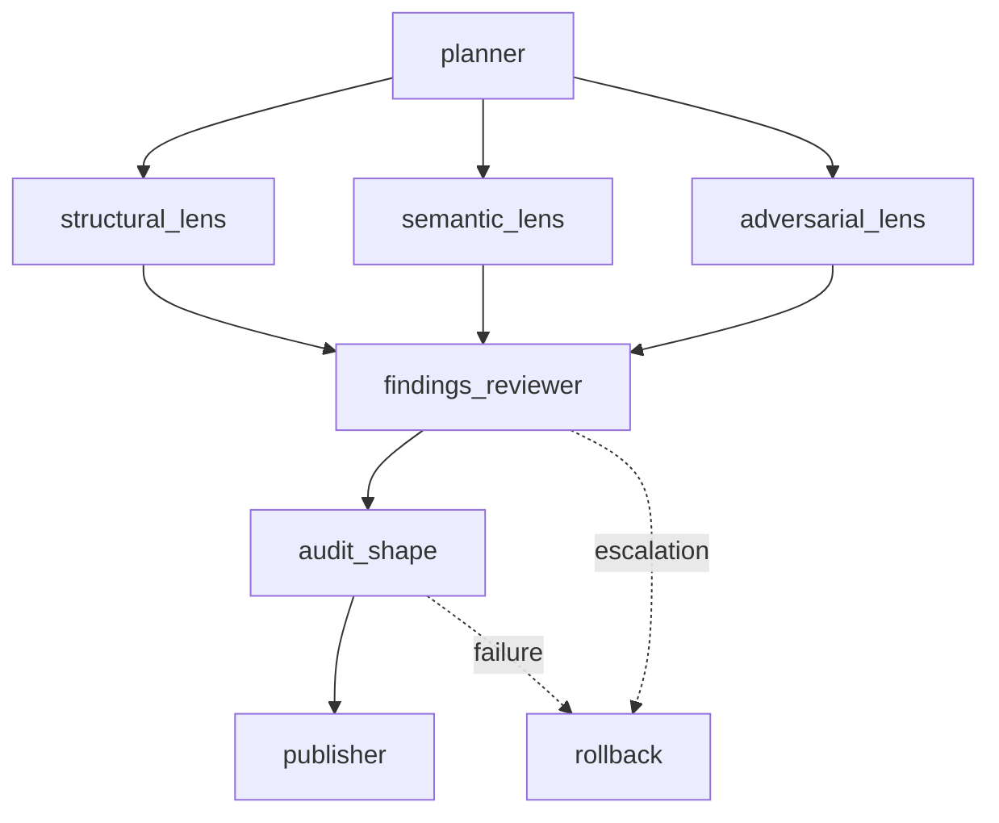

# Silent Catch Audit Recipe Draft

This is the Codex drafter candidate for `silent-catch-audit`.

## Purpose

Audit a TypeScript/JavaScript codebase for silent catch anti-patterns where an operation failure is swallowed with no signal.

The recipe is read-only. It produces:

- `silent-catch-audit.md`
- `silent-catch-audit.findings.json`
- a pass/fail verdict

It does not edit target source files and does not generate lint configuration.

## DAG

## Model Families

The draft uses three distinct lens families:

- `codex_lens` for structural candidate discovery
- `glm_lens` for semantic risk classification
- `kimi_lens` for adversarial false-positive review

The reviewer is a single node. Heterogeneity comes from the researcher lenses, not reviewer multiplicity.

## Artifact Contract

`artifact_contract.yaml` distinguishes smoke-shape from real-publish semantics:

- Smoke-shape: `outputs: []`, meaning the publisher intentionally skips canonical repo writes while verifiers inspect run-local artifacts.
- Real-publish: `outputs: [path]`, meaning the publisher copies the declared `source_artifact` and related outputs to canonical repository paths.

This draft is configured for real publish:

- source artifact: `silent-catch-audit.md`
- outputs:
  - `docs/audits/silent-catch-audit.md`
  - `docs/audits/silent-catch-audit.findings.json`

## Verifier

`verifiers/audit-shape.sh` is intentionally a stub as required by the drafter prompt. The downstream verifier smith should replace it with deterministic checks for markdown verdict shape, JSON parseability, severity counts, verdict policy, and read-only output boundaries.

## Diverges From

This DAG is intentionally the same minimum viable shape as `recipes/refactor-audit/`: planner, parallel heterogeneous lenses, one reviewer, one verifier, publisher, rollback.

It diverges in the stance split and artifact semantics:

- structural lens finds exact catch shapes
- semantic lens classifies operational risk
- adversarial lens challenges allowlist and false-positive boundaries
- reviewer emits both markdown and JSON, with a Critical-finding fail threshold

## Input Notes

The recipe prompt listed these optional run inputs:

- `${MINI_ORK_RUN_DIR}/lens-arxiv.md`
- `${MINI_ORK_RUN_DIR}/lens-prior-art.md`
- `${MINI_ORK_RUN_DIR}/plan.json`

In the inspected run directory, `plan.json` was present and the two lens briefs were not present. The prompts are written to consume those briefs when available but do not require them for the recipe shape.

## Rollback Strategy

On verifier failure or reviewer escalation, keep the three lens reports for diagnosis and discard the reviewed publish artifacts. This matches the contract's read-only audit intent: preserve evidence, avoid publishing an invalid report.
